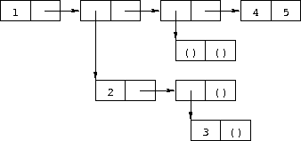

Answers to Selected Exercises
=============================

**Exercise [2.2.1](start.html#g7). **(page [20](start.html#./start:s34))\

*  a*.

`(+ (* 1.2 (- 2 1/3)) -8.7)`

*  b*.

`(/ (+ 2/3 4/9) (- 5/11 4/3))`

*  c*.

`(+ 1 (/ 1 (+ 2 (/ 1 (+ 1 1/2)))))`

*  d*.

`(* (* (* (* (* (* 1 -2) 3) -4) 5) -6) 7)` or `(* 1 -2 3 -4 5 -6 7)`

**Exercise [2.2.2](start.html#g8). **(page [20](start.html#./start:s35))\
 See Section [6.4](objects.html#g110).

**Exercise [2.2.3](start.html#g9). **(page [20](start.html#./start:s36))\

*  a*.

`(car . cdr)`

*  b*.

`(this (is silly))`

*  c*.

`(is this silly?)`

*  d*.

`(+ 2 3)`

*  e*.

`(+ 2 3)`

*  f*.

`+`

*  g*.

`(2 3)`

*  h*.

`#<procedure>`

*  i*.

`cons`

*  j*.

`'cons`

*  k*.

`quote`

*  l*.

`5`

*  m*.

`5`

*  n*.

`5`

*  o*.

`5`

**Exercise [2.2.4](start.html#g10). **(page [21](start.html#./start:s37))\

` (car (cdr (car '((a b) (c d)))))  b  (car (car (cdr '((a b) (c d)))))  c  (car (cdr (car (cdr '((a b) (c d))))))  d`

**Exercise [2.2.5](start.html#g11). **(page [21](start.html#./start:s38))\

` '((a . b) ((c) d) ())`

**Exercise [2.2.6](start.html#g12). **(page [21](start.html#./start:s39))\
 

**Exercise [2.2.7](start.html#g13). **(page [21](start.html#./start:s40))\

` (car '((a b) (c d)))  (a b)  (car (car '((a b) (c d))))  a  (cdr (car '((a b) (c d))))  (b)  (car (cdr (car '((a b) (c d)))))  b  (cdr (cdr (car '((a b) (c d)))))  ()  (cdr '((a b) (c d)))  ((c d))  (car (cdr '((a b) (c d))))  (c d)  (car (car (cdr '((a b) (c d)))))  c  (cdr (car (cdr '((a b) (c d)))))  (d)  (car (cdr (car (cdr '((a b) (c d))))))  d  (cdr (cdr (car (cdr '((a b) (c d))))))  ()  (cdr (cdr '((a b) (c d))))  ()`

**Exercise [2.2.8](start.html#g14). **(page [21](start.html#./start:s41))\
 See Section [2.3](start.html#g15).

**Exercise [2.3.1](start.html#g16). **(page [23](start.html#./start:s49))\

1.  Evaluate the variables `list`, `+`, `-`, `*`, and `/`, yielding the
    list, addition, subtraction, multiplication, and division
    procedures.
2.  Apply the list procedure to the addition, subtraction,
    multiplication, and division procedures, yielding a list containing
    these procedures in order.
3.  Evaluate the variable `cdr`, yielding the cdr procedure.
4.  Apply the cdr procedure to the list produced in
    step [2](answers.html#g252), yielding a list containing the
    subtraction, multiplication, and division procedures.
5.  Evaluate the variable `car`, yielding the car procedure.
6.  Apply the car procedure to the list produced in
    step [4](answers.html#g254), yielding the subtraction procedure.
7.  Evaluate the constants `17` and `5`, yielding `17` and `5`.
8.  Apply the subtraction procedure to `17` and `5`, yielding `12`.

Other orders are possible. For example, the variable `car` could have
been evaluated before its argument.

**Exercise [2.4.1](start.html#g18). **(page [25](start.html#./start:s57))\

*  a*.

`(let ([x (* 3 a)]) (+ (- x b) (+ x b)))`

*  b*.

`(let ([x (list a b c)]) (cons (car x) (cdr x)))`

**Exercise [2.4.2](start.html#g19). **(page [25](start.html#./start:s58))\
 The value is 54. The outer `let` binds `x` to 9, while the inner `let`
binds `x` to 3 (9/3). The inner `let` evaluates to 6 (3 + 3), and the
outer `let` evaluates to 54 (9 × 6).

**Exercise [2.4.3](start.html#g20). **(page [26](start.html#./start:s59))\

*  a*.

`(let ([x0 'a] [y0 'b])    (list (let ([x1 'c]) (cons x1 y0))          (let ([y1 'd]) (cons x0 y1))))`

*  b*.

`(let ([x0 '((a b) c)])    (cons (let ([x1 (cdr x0)])            (car x1))          (let ([x2 (car x0)])            (cons (let ([x3 (cdr x2)])                    (car x3))                  (cons (let ([x4 (car x2)])                          x4)                        (cdr x2))))))`

**Exercise [2.5.1](start.html#g22). **(page [30](start.html#./start:s72))\

*  a*.

`a`

*  b*.

`(a)`

*  c*.

`a`

*  d*.

`()`

**Exercise [2.5.2](start.html#g23). **(page [30](start.html#./start:s73))\
 See page [31](start.html#defn:list).

**Exercise [2.5.3](start.html#g24). **(page [30](start.html#./start:s74))\

*  a*.

no free variables

*  b*.

`+`

*  c*.

`f`

*  d*.

`cons`, `f`, and `y`

*  e*.

`cons` and `y`

*  f*.

`cons`, `y`, and `z` (`y` also appears as a bound variable)

**Exercise [2.6.1](start.html#g26). **(page [34](start.html#./start:s91))\
 The program would loop indefinitely.

**Exercise [2.6.2](start.html#g27). **(page [34](start.html#./start:s92))\

` (define compose    (lambda (p1 p2)      (lambda (x)        (p1 (p2 x)))))   (define cadr (compose car cdr))  (define cddr (compose cdr cdr))`

**Exercise [2.6.3](start.html#g28). **(page [34](start.html#./start:s96))\

` (define caar (compose car car))  (define cadr (compose car cdr))   (define cdar (compose cdr car))  (define cddr (compose cdr cdr))   (define caaar (compose car caar))  (define caadr (compose car cadr))  (define cadar (compose car cdar))  (define caddr (compose car cddr))   (define cdaar (compose cdr caar))  (define cdadr (compose cdr cadr))  (define cddar (compose cdr cdar))  (define cdddr (compose cdr cddr))   (define caaaar (compose caar caar))  (define caaadr (compose caar cadr))  (define caadar (compose caar cdar))  (define caaddr (compose caar cddr))  (define cadaar (compose cadr caar))  (define cadadr (compose cadr cadr))  (define caddar (compose cadr cdar))  (define cadddr (compose cadr cddr))   (define cdaaar (compose cdar caar))  (define cdaadr (compose cdar cadr))  (define cdadar (compose cdar cdar))  (define cdaddr (compose cdar cddr))  (define cddaar (compose cddr caar))  (define cddadr (compose cddr cadr))  (define cdddar (compose cddr cdar))  (define cddddr (compose cddr cddr))`

**Exercise [2.7.1](start.html#g30). **(page [41](start.html#./start:s126))\

` (define atom?    (lambda (x)      (not (pair? x))))`

**Exercise [2.7.2](start.html#g31). **(page [41](start.html#./start:s128))\

` (define shorter    (lambda (ls1 ls2)      (if (< (length ls2) (length ls1))          ls2          ls1)))`

**Exercise [2.8.1](start.html#g33). **(page [46](start.html#./start:s149))\
 The structure of the output would be the mirror image of the structure
of the input. For example, `(a . b)` would become `(b . a)` and
`((a . b) . (c . d))` would become `((d . c) . (b . a))`.

**Exercise [2.8.2](start.html#g34). **(page [46](start.html#./start:s150))\

` (define append    (lambda (ls1 ls2)      (if (null? ls1)          ls2          (cons (car ls1) (append (cdr ls1) ls2)))))`

**Exercise [2.8.3](start.html#g35). **(page [46](start.html#./start:s152))\

` (define make-list    (lambda (n x)      (if (= n 0)          '()          (cons x (make-list (- n 1) x)))))`

**Exercise [2.8.4](start.html#g36). **(page [47](start.html#./start:s154))\
 See the description of `list-ref` on
page [160](objects.html#defn:list-ref) and the description of
`list-tail` on page [160](objects.html#defn:list-tail).

**Exercise [2.8.5](start.html#g37). **(page [47](start.html#./start:s155))\

` (define shorter?    (lambda (ls1 ls2)      (and (not (null? ls2))           (or (null? ls1)               (shorter? (cdr ls1) (cdr ls2))))))   (define shorter    (lambda (ls1 ls2)      (if (shorter? ls2 ls1)          ls2          ls1)))`

**Exercise [2.8.6](start.html#g38). **(page [47](start.html#./start:s158))\

` (define even?    (lambda (x)      (or (= x 0)          (odd? (- x 1)))))  (define odd?    (lambda (x)      (and (not (= x 0))           (even? (- x 1)))))`

**Exercise [2.8.7](start.html#g39). **(page [47](start.html#./start:s161))\

` (define transpose    (lambda (ls)      (cons (map car ls) (map cdr ls))))`

**Exercise [2.9.1](start.html#g41). **(page [54](start.html#./start:s186))\

` (define make-counter    (lambda (init incr)      (let ([next init])        (lambda ()          (let ([v next])            (set! next (+ next incr))            v)))))`

**Exercise [2.9.2](start.html#g42). **(page [55](start.html#./start:s188))\

` (define make-stack    (lambda ()      (let ([ls '()])        (lambda (msg . args)          (case msg            [(empty? mt?) (null? ls)]            [(push!) (set! ls (cons (car args) ls))]            [(top) (car ls)]            [(pop!) (set! ls (cdr ls))]            [else "oops"])))))`

**Exercise [2.9.3](start.html#g43). **(page [55](start.html#./start:s191))\

` (define make-stack    (lambda ()      (let ([ls '()])        (lambda (msg . args)          (case msg            [(empty? mt?) (null? ls)]            [(push!) (set! ls (cons (car args) ls))]            [(top) (car ls)]            [(pop!) (set! ls (cdr ls))]            [(ref) (list-ref ls (car args))]            [(set!) (set-car! (list-tail ls (car args)) (cadr args))]            [else "oops"])))))`

**Exercise [2.9.4](start.html#g44). **(page [55](start.html#./start:s192))\

` (define make-stack    (lambda (n)      (let ([v (make-vector n)] [i -1])        (lambda (msg . args)          (case msg            [(empty? mt?) (= i -1)]            [(push!)             (set! i (+ i 1))             (vector-set! v i (car args))]            [(top) (vector-ref v i)]            [(pop!) (set! i (- i 1))]            [(ref) (vector-ref v (- i (car args)))]            [(set!) (vector-set! v (- i (car args)) (cadr args))]            [else "oops"])))))`

**Exercise [2.9.5](start.html#g45). **(page [56](start.html#./start:s194))\

` (define emptyq?    (lambda (q)      (eq? (car q) (cdr q))))   (define getq    (lambda (q)      (if (emptyq? q)          (assertion-violation 'getq "the queue is empty")          (car (car q)))))   (define delq!    (lambda (q)      (if (emptyq? q)          (assertion-violation 'delq! "the queue is empty")          (set-car! q (cdr (car q))))))`

**Exercise [2.9.6](start.html#g46). **(page [56](start.html#./start:s195))\

` (define make-queue    (lambda ()      (cons '() '())))   (define putq!    (lambda (q v)      (let ([p (cons v '())])        (if (null? (car q))            (begin              (set-car! q p)              (set-cdr! q p))            (begin              (set-cdr! (cdr q) p)              (set-cdr! q p))))))   (define getq    (lambda (q)      (car (car q))))   (define delq!    (lambda (q)      (if (eq? (car q) (cdr q))          (begin            (set-car! q '())            (set-cdr! q '()))          (set-car! q (cdr (car q))))))`

**Exercise [2.9.7](start.html#g47). **(page [56](start.html#./start:s196))\
 When asked to print a cyclic structure, some implementations print a
representation of the output that reflects its cyclic structure. Other
implementations do not detect the cycle and produce either no output or
an infinite stream of output. When `length` is passed a cyclic list, an
exception is raised, likely with a message indicating that the list is
not proper. The definition of `length` on
page [42](start.html#defn:simplelength) will, however, simply loop
indefinitely.

**Exercise [2.9.8](start.html#g48). **(page [56](start.html#./start:s199))\

` (define race    (lambda (hare tortoise)      (if (pair? hare)          (let ([hare (cdr hare)])            (if (pair? hare)                (and (not (eq? hare tortoise))                     (race (cdr hare) (cdr tortoise)))                (null? hare)))          (null? hare))))   (define list?    (lambda (x)      (race x x)))`

**Exercise [3.1.1](further.html#g51). **(page [64](further.html#./further:s25))\

` (let ([x (memv 'a ls)]) (and x (memv 'b x)))     ((lambda (x) (and x (memv 'b x))) (memv 'a ls))     ((lambda (x) (if x (and (memv 'b x)) #f)) (memv 'a ls))     ((lambda (x) (if x (memv 'b x) #f)) (memv 'a ls))`

**Exercise [3.1.2](further.html#g52). **(page [64](further.html#./further:s26))\

` (or (memv x '(a b c)) (list x))     (let ((t (memv x '(a b c)))) (if t t (or (list x))))     ((lambda (t) (if t t (or (list x)))) (memv x '(a b c)))     ((lambda (t) (if t t (list x))) (memv x '(a b c)))`

**Exercise [3.1.3](further.html#g53). **(page [64](further.html#./further:s27))\
 See page [97](binding.html#defn:let*).

**Exercise [3.1.4](further.html#g54). **(page [64](further.html#./further:s29))\

` (define-syntax when    (syntax-rules ()      [(_ e0 e1 e2 ...)       (if e0 (begin e1 e2 ...))]))   (define-syntax unless    (syntax-rules ()      [(_ e0 e1 e2 ...)       (when (not e0) e1 e2 ...)]))`

**Exercise [3.2.1](further.html#g56). **(page [72](further.html#./further:s52))\
 Tail-recursive: `even?` and `odd?`, `race`, `fact` in second definition
of `factorial`, `fib` in second version of `fibonacci`.
Nontail-recursive: `sum`, `factorial`, `fib` in first version of
`fibonacci`. Both: `factor`.

**Exercise [3.2.2](further.html#g57). **(page [72](further.html#./further:s53))\

` (define factor    (lambda (n)      (letrec ([f (lambda (n i)                    (cond                      [(>= i n) (list n)]                      [(integer? (/ n i))                       (cons i (f (/ n i) i))]                      [else (f n (+ i 1))]))])        (f n 2))))`

**Exercise [3.2.3](further.html#g58). **(page [72](further.html#./further:s55))\
 Yes, but we need two named `let` expressions, one for `even?` and one
for `odd?`.

`(let even? ([x 20])    (or (= x 0)        (let odd? ([x (- x 1)])          (and (not (= x 0))               (even? (- x 1))))))`

**Exercise [3.2.4](further.html#g59). **(page [72](further.html#./further:s56))\

` (define fibcount1 0)  (define fibonacci1    (lambda (n)      (let fib ([i n])        (set! fibcount1 (+ fibcount1 1))        (cond          [(= i 0) 0]          [(= i 1) 1]          [else (+ (fib (- i 1)) (fib (- i 2)))]))))   (define fibcount2 0)  (define fibonacci2    (lambda (n)      (if (= n 0)          0          (let fib ([i n] [a1 1] [a2 0])            (set! fibcount2 (+ fibcount2 1))            (if (= i 1)                a1                (fib (- i 1) (+ a1 a2) a1))))))`

The counts for `(fibonacci 10)` are 177 and 10, for `(fibonacci 20)` are
21891 and 20, and for `(fibonacci 30)` are 2692537 and 30. While the
number of calls made by the second is directly proportional to the
input, the number of calls made by the first grows rapidly
(exponentially, in fact) as the input value increases.

**Exercise [3.2.5](further.html#g60). **(page [73](further.html#./further:s57))\
 See page [312](syntax.html#defn:let).

**Exercise [3.2.6](further.html#g61). **(page [73](further.html#./further:s58))\
 A call in the last subexpression of an `or` expression in tail position
would not be a tail call with the modified definition of `or`. For the
`even?`/`odd?` example, the resulting definition of `even?` would no
longer be tail-recursive and for very large inputs might exhaust
available space.

The expansion performed by this definition is incorrect in another way,
which has to do with multiple return values
(Section [5.8](control.html#g104)): if the last subexpression returns
multiple values, the `or` expression should return multiple values, but
with the incorrect definition, each subexpression appears on the
right-hand side of a `let`, which expects a single return value. The
simpler and incorrect definition of `and` has the same problem.

**Exercise [3.2.7](further.html#g62). **(page [73](further.html#./further:s59))\
 The first of the three versions of `factor` below directly addresses
the identified problems by stopping at ,
avoiding the redundant division, and skipping the even factors after 2.
Stopping at  probably yields the biggest
savings, followed by skipping even factors greater than 2. Avoiding the
redundant division is less important, since it occurs only when a factor
is found.

`(define factor    (lambda (n)      (let f ([n n] [i 2] [step 1])        (if (> i (sqrt n))            (list n)            (let ([n/i (/ n i)])              (if (integer? n/i)                  (cons i (f n/i i step))                  (f n (+ i step) 2)))))))`

The second version replaces `(> i (sqrt n))` with `(> (* i i) n)`, since
`*` is typically much faster than `sqrt`.

`(define factor    (lambda (n)      (let f ([n n] [i 2] [step 1])        (if (> (* i i) n)            (list n)            (let ([n/i (/ n i)])              (if (integer? n/i)                  (cons i (f n/i i step))                  (f n (+ i step) 2)))))))`

The third version uses `gcd` (see page [179](objects.html#page:gcd)) to
avoid most of the divisions, since `gcd` should be faster than `/`.

`(define factor    (lambda (n)      (let f ([n n] [i 2] [step 1])        (if (> (* i i) n)            (list n)            (if (= (gcd n i) 1)                (f n (+ i step) 2)                (cons i (f (/ n i) i step)))))))`

To see the difference these changes make, time each version of `factor`,
including the original, in your Scheme system to see which performs
better. Try a variety of inputs, including larger ones like
`(+ (expt 2 100) 1)`.

**Exercise [3.3.1](further.html#g70). **(page [77](further.html#./further:s66))\

` (let ([k.n (call/cc (lambda (k) (cons k 0)))])    (let ([k (car k.n)] [n (cdr k.n)])      (write n)      (newline)      (k (cons k (+ n 1)))))`

Or with multiple values (see Section [5.8](control.html#g104)):

`(call-with-values    (lambda () (call/cc (lambda (k) (values k 0))))    (lambda (k n)      (write n)      (newline)      (k k (+ n 1))))`

**Exercise [3.3.2](further.html#g71). **(page [77](further.html#./further:s67))\

` (define product    (lambda (ls)      (if (null? ls)          1          (if (= (car ls) 0)              0              (let ([n (product (cdr ls))])                (if (= n 0) 0 (* n (car ls))))))))`

**Exercise [3.3.3](further.html#g72). **(page [77](further.html#./further:s68))\
 If one of the processes returns without calling `pause`, it returns to
the call to `pause` that first caused it to run, or to the original call
to `start` if it was the first process in the list. Here is a
reimplementation of the system that allows a process to `quit`
explicitly. If other processes are active, the `lwp` system continues to
run. Otherwise, control returns to the continuation of the original call
to `start`.

`(define lwp-list '())  (define lwp    (lambda (thunk)      (set! lwp-list (append lwp-list (list thunk)))))  (define start    (lambda ()      (call/cc        (lambda (k)          (set! quit-k k)          (next)))))  (define next    (lambda ()      (let ([p (car lwp-list)])        (set! lwp-list (cdr lwp-list))        (p))))  (define pause    (lambda ()      (call/cc        (lambda (k)          (lwp (lambda () (k #f)))          (next)))))  (define quit    (lambda (v)      (if (null? lwp-list)          (quit-k v)          (next))))`

**Exercise [3.3.4](further.html#g73). **(page [77](further.html#./further:s69))\

` (define lwp-queue (make-queue))  (define lwp    (lambda (thunk)      (putq! lwp-queue thunk)))  (define start    (lambda ()      (let ([p (getq lwp-queue)])        (delq! lwp-queue)        (p))))  (define pause    (lambda ()      (call/cc        (lambda (k)          (lwp (lambda () (k #f)))          (start)))))`

**Exercise [3.4.1](further.html#g76). **(page [80](further.html#./further:s75))\

` (define reciprocal    (lambda (n success failure)      (if (= n 0)          (failure)          (success (/ 1 n)))))`

**Exercise [3.4.2](further.html#g77). **(page [80](further.html#./further:s77))\

` (define retry #f)   (define factorial    (lambda (x)      (let f ([x x] [k (lambda (x) x)])        (if (= x 0)            (begin (set! retry k) (k 1))            (f (- x 1) (lambda (y) (k (* x y))))))))`

**Exercise [3.4.3](further.html#g78). **(page [80](further.html#./further:s79))\

` (define map/k    (lambda (p ls k)      (if (null? ls)          (k '())          (p (car ls)             (lambda (x)               (map/k p (cdr ls)                 (lambda (ls)                   (k (cons x ls)))))))))   (define reciprocals    (lambda (ls)      (map/k (lambda (x k) (if (= x 0) "zero found" (k (/ 1 x))))             ls             (lambda (x) x))))`

**Exercise [3.5.1](further.html#g80). **(page [85](further.html#./further:s86))\

` (define-syntax complain    (syntax-rules ()      [(_ ek msg expr) (ek (list msg expr))]))`

**Exercise [3.5.2](further.html#g81). **(page [85](further.html#./further:s87))\

` (define calc    (lambda (expr)      (call/cc        (lambda (ek)          (define do-calc            (lambda (expr)              (cond                [(number? expr) expr]                [(and (list? expr) (= (length expr) 3))                 (let ([op (car expr)] [args (cdr expr)])                   (case op                     [(add) (apply-op + args)]                     [(sub) (apply-op - args)]                     [(mul) (apply-op * args)]                     [(div) (apply-op / args)]                     [else (complain "invalid operator" op)]))]                [else (complain "invalid expression" expr)])))          (define apply-op            (lambda (op args)              (op (do-calc (car args)) (do-calc (cadr args)))))          (define complain            (lambda (msg expr)              (ek (list msg expr))))          (do-calc expr)))))`

**Exercise [3.5.3](further.html#g82). **(page [85](further.html#./further:s88))\

` (define calc #f)  (let ()    (define do-calc      (lambda (expr)        (cond          [(number? expr) expr]          [(and (list? expr) (= (length expr) 3))           (let ([op (car expr)] [args (cdr expr)])             (case op               [(add) (apply-op + args)]               [(sub) (apply-op - args)]               [(mul) (apply-op * args)]               [(div) (apply-op / args)]               [else (complain "invalid operator" op)]))]          [else (complain "invalid expression" expr)])))    (define apply-op      (lambda (op args)        (op (do-calc (car args)) (do-calc (cadr args)))))    (define complain      (lambda (msg expr)        (assertion-violation 'calc msg expr)))    (set! calc      (lambda (expr)        (do-calc expr))))`

**Exercise [3.5.4](further.html#g83). **(page [85](further.html#./further:s89))\
 This adds `sqrt`, `times` (an alias for `mul`), and `expt` along with
`minus`.

`(let ()    (define do-calc      (lambda (ek expr)        (cond          [(number? expr) expr]          [(and (list? expr) (= (length expr) 2))           (let ([op (car expr)] [args (cdr expr)])             (case op               [(minus) (apply-op1 ek - args)]               [(sqrt) (apply-op1 ek sqrt args)]               [else (complain ek "invalid unary operator" op)]))]          [(and (list? expr) (= (length expr) 3))           (let ([op (car expr)] [args (cdr expr)])             (case op               [(add) (apply-op2 ek + args)]               [(sub) (apply-op2 ek - args)]               [(mul times) (apply-op2 ek * args)]               [(div) (apply-op2 ek / args)]               [(expt) (apply-op2 ek expt args)]               [else (complain ek "invalid binary operator" op)]))]          [else (complain ek "invalid expression" expr)])))    (define apply-op1      (lambda (ek op args)        (op (do-calc ek (car args)))))    (define apply-op2      (lambda (ek op args)        (op (do-calc ek (car args)) (do-calc ek (cadr args)))))    (define complain      (lambda (ek msg expr)        (ek (list msg expr))))    (set! calc      (lambda (expr)        (call/cc          (lambda (ek)            (do-calc ek expr))))))`

**Exercise [3.6.1](further.html#g85). **(page [87](further.html#./further:s90))\
 This version of `gpa` returns `x` when all of the input letter grades
are `x`.

`(define-syntax gpa    (syntax-rules ()      [(_ g1 g2 ...)       (let ([ls (map letter->number (remq 'x '(g1 g2 ...)))])         (if (null? ls)             'x             (/ (apply + ls) (length ls))))]))`

**Exercise [3.6.2](further.html#g86). **(page [87](further.html#./further:s91))\
 After defining `$distribution` and `distribution` within the library as
follows:

`(define $distribution    (lambda (ls)      (let loop ([ls ls] [a 0] [b 0] [c 0] [d 0] [f 0])        (if (null? ls)            (list (list a 'a) (list b 'b) (list c 'c)              (list d 'd) (list f 'f))            (case (car ls)              [(a) (loop (cdr ls) (+ a 1) b c d f)]              [(b) (loop (cdr ls) a (+ b 1) c d f)]              [(c) (loop (cdr ls) a b (+ c 1) d f)]              [(d) (loop (cdr ls) a b c (+ d 1) f)]              [(f) (loop (cdr ls) a b c d (+ f 1))]             ; ignore x grades, per preceding exercise              [(x) (loop (cdr ls) a b c d f)]              [else (assertion-violation 'distribution                      "unrecognized grade letter"                      (car ls))])))))  (define-syntax distribution    (syntax-rules ()      [(_ g1 g2 ...)       ($distribution '(g1 g2 ...))]))`

modify the `export` line to add `distribution` (but not
`$distribution`).

**Exercise [3.6.3](further.html#g87). **(page [87](further.html#./further:s92))\
 After defining `histogram` as follows:

`(define histogram    (lambda (port distr)      (for-each        (lambda (n g)          (put-datum port g)          (put-string port ": ")          (let loop ([n n])            (unless (= n 0)              (put-char port #\*)              (loop (- n 1))))          (put-string port "\n"))        (map car distr)        (map cadr distr))))`

modify the `export` line to add `histogram`. The solution uses
`for-each`, which is described on page [118](control.html#desc:for-each)

* * * * *

R. Kent Dybvig / The Scheme Programming Language, Fourth Edition\
 Copyright © 2009 [The MIT
Press](http://mitpress.mit.edu/catalog/item/default.asp?ttype=2&tid=11984).
Electronically reproduced by permission.\
 Illustrations © 2009 [Jean-Pierre
Hébert](http://hebert.kitp.ucsb.edu/)\
 ISBN 978-0-262-51298-5 / LOC QA76.73.S34D93\
 [to order this
book](http://mitpress.mit.edu/catalog/item/default.asp?ttype=2&tid=11984)
/ [about this book](canned/about.html)

[http://www.scheme.com](http://www.scheme.com)
