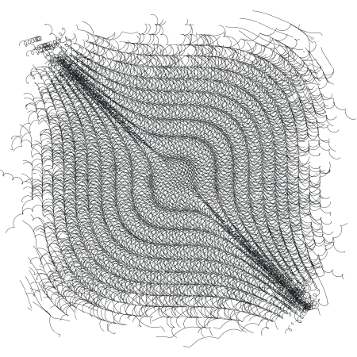

Chapter 11. Exceptions and Conditions
=====================================

*Exceptions* and *conditions* provide the means for system and user code
to signal, detect, and recover from errors that occur when a program is
run.

Exceptions are raised by the standard syntactic forms and procedures
under a variety of circumstances, e.g., when the wrong number of
arguments is passed to a procedure, when the syntax of an expression
passed to `eval` is incorrect, or when a file cannot be opened by one of
the file open procedures. In these situations, the exception is raised
with a standard condition type.

Exceptions may also be raised by user code via the `raise` or
`raise-continuable` procedures. In this case, the exception may be
raised with one of the standard condition types, a user-defined subtype
of one of the standard condition types (possibly defined using
`define-condition-type`), or an arbitrary Scheme value that is not a
condition type.

At any point during a program's execution, a single exception handler,
called the *current exception handler*, is charged with handling all
exceptions that are raised. By default, the current exception handler is
one provided by the implementation. The default exception handler
typically prints a message that describes the condition or other value
with which the exception was raised and, for any serious condition,
terminates the running program. In interactive systems, this typically
means a reset to the read-eval-print loop.

User code may establish a new current exception handler via the `guard`
syntax or the `with-exception-handler` procedure. In either case, the
user code may handle all exceptions or, based on the condition or other
value with which the exception was raised, just some of the exceptions
while reraising the others for the old current exception handler to
handle. When `guard` forms and `with-exception-handler` calls are nested
dynamically, a chain of exception handlers is established, and each may
defer to the next in the chain.

### Section 11.1. Raising and Handling Exceptions

**procedure**: `(raise obj)` \
 **procedure**: `(raise-continuable obj)` \
 **returns:**see below \
 **libraries:**`(rnrs exceptions)`, `(rnrs)`

Both of these procedures raise an exception, effectively invoking the
current exception handler, passing `obj` as the only argument. For
`raise`, the exception is *non-continuable*, while for
`raise-continuable`, the exception is *continuable*. An exception
handler may return (with zero or more values) to the continuation of a
continuable exception. If an exception handler attempts to return to the
continuation of a non-continuable exception, however, a new exception
with condition type `&non-continuable` is raised. Thus, `raise` never
returns, while `raise-continuable` may return zero or more values,
depending upon the exception handler.

If the current exception handler, `p`, was established via a `guard`
form or call to `with-exception-handler`, the current exception handler
is reset to the handler that was current when `p` was established before
`raise` or `raise-continuable` invokes `p`. This allows `p` to defer to
the preexisting exception handler simply by reraising the exception, and
it helps prevent infinite regression when an exception handler
inadvertently causes a different exception to be raised. If `p` returns
and the exception is continuable, `p` is reinstated as the current
exception handler.

`(raise    (condition      (make-error)      (make-message-condition "no go")))  error: no go  (raise-continuable    (condition      (make-violation)      (make-message-condition "oops")))  violation: oops  (list    (call/cc      (lambda (k)        (vector          (with-exception-handler            (lambda (x) (k (+ x 5)))            (lambda () (+ (raise 17) 8)))))))  (22)  (list    (vector      (with-exception-handler        (lambda (x) (+ x 5))        (lambda () (+ (raise-continuable 17) 8)))))  (#(30))  (list    (vector      (with-exception-handler        (lambda (x) (+ x 5))        (lambda () (+ (raise 17) 8)))))  violation: non-continuable`

**procedure**: `(error who msg irritant ...)` \
 **procedure**: `(assertion-violation who msg irritant ...)` \
 **libraries:**`(rnrs base)`, `(rnrs)`

`error` raises a non-continuable exception with condition type `&error`
and should be used to describe situations for which the `&error`
condition type is appropriate, typically a situation involving the
program's interaction with something outside of the program.
`assertion-violation` raises a non-continuable exception with condition
type `&assertion` and should be used to describe situations for which
the `&assertion` condition type is appropriate, typically an invalid
argument to a procedure or invalid value of a subexpression of a
syntactic form.

The continuation object with which the exception is raised also includes
a `&who` condition whose who field is `who` if `who` is not `#f`, a
`&message` condition whose message field is `msg`, and an `&irritants`
condition whose irritants field is `(irritant ...)`.

`who` must be a string, a symbol, or `#f` identifying the procedure or
syntactic form reporting the error upon whose behalf the error is being
reported. It is usually best to identify a procedure the programmer has
called rather than some other procedure the programmer may not be aware
is involved in carrying out the operation. `msg` must be a string and
should describe the exceptional situation. The irritants may be any
Scheme objects and should include values that may have caused or been
materially involved in the exceptional situation.

**syntax**: `(assert expression)` \
 **returns:**see below \
 **libraries:**`(rnrs base)`, `(rnrs)`

`assert` evaluates `expression` and returns the value of `expression` if
the value is not `#f`. If the value of `expression` is `#f`, `assert`
raises a non-continuable exception with condition types `&assertion` and
`&message`, with an implementation-dependent value in its message field.
Implementations are encouraged to provide information about the location
of the `assert` call within the condition whenever possible.

**procedure**: `(syntax-violation who msg form)` \
 **procedure**: `(syntax-violation who msg form subform)` \
 **returns:**does not return \
 **libraries:**`(rnrs syntax-case)`, `(rnrs)`

This procedure raises a non-continuable exception with a condition of
type `&syntax`. It should be used to report a syntax error detected by
the transformer of a syntactic extension. The value of the condition's
form field is `form`, and the value of its subform field is `subform`,
or `#f` if `subform` is not provided.

The continuation object with which the exception is raised also includes
a `&who` condition whose who field is `who`, if `who` is not `#f` or is
inferred from `form`, and a `&message` condition whose message field is
`msg`.

`who` must be a string, a symbol, or `#f`. If `who` is `#f`, it is
inferred to be the symbolic name of `form` if `form` is an identifier or
the symbolic name of the first subform of `form` if `form` is a
list-structured form whose first subform is an identifier. `message`
must be a string. `form` should be the syntax object or datum
representation of the syntactic form within which the syntax violation
occurred, and `subform`, if not `#f`, should be a syntax object or datum
representation of a subform more specifically involved in the violation.
For example, if a duplicate formal parameter is found in a `lambda`
expression, `form` might be the `lambda` expression and `subform` might
be the duplicated parameter.

Some implementations attach source information to syntax objects, e.g.,
line, character, and filename for forms originating in a file, in which
case this information might also be present as some
implementation-dependent condition type within the condition object.

**procedure**: `(with-exception-handler procedure thunk)` \
 **returns:**see below \
 **libraries:**`(rnrs exceptions)`, `(rnrs)`

This procedure establishes `procedure`, which should accept one
argument, as the current exception handler in place of the old current
exception handler, `old-proc`, and invokes `thunk` without arguments. If
the call to `thunk` returns, `old-proc` is reestablished as the current
exception handler and the values returned by `thunk` are returned. If
control leaves or subsequently reenters the call to `thunk` via the
invocation of a continuation obtained via `call/cc`, the procedure that
was the current exception handler when the continuation was captured is
reinstated.

`(define (try thunk)    (call/cc      (lambda (k)        (with-exception-handler          (lambda (x) (if (error? x) (k #f) (raise x)))          thunk))))  (try (lambda () 17))  17  (try (lambda () (raise (make-error))))  #f  (try (lambda () (raise (make-violation))))  violation  (with-exception-handler    (lambda (x)      (raise        (apply condition          (make-message-condition "oops")          (simple-conditions x))))    (lambda ()      (try (lambda () (raise (make-violation))))))  violation: oops`

**syntax**: `(guard (var clause1 clause2 ...) b1 b2 ...)` \
 **returns:**see below \
 **libraries:**`(rnrs exceptions)`, `(rnrs)`

A `guard` expression establishes a new current exception handler,
`procedure` (described below), in place of the old current exception
handler, `old-proc`, and evaluates the body `b1 b2 ...`. If the body
returns, `guard` reestablishes `old-proc` as the current exception
handler. If control leaves or subsequently reenters the body via the
invocation of a continuation obtained via `call/cc`, the procedure that
was the current exception handler when the continuation was captured is
reinstated.

The procedure `procedure` established by `guard` binds `var` to the
value it receives and, within the scope of that binding, processes the
clauses `clause1 clause2 ...` in turn, as if contained within an
implicit `cond` expression. This implicit `cond` expression is evaluated
in the continuation of the `guard` expression, with `old-proc` as the
current exception handler.

If no `else` clause is provided, `guard` supplies one that reraises the
exception with the same value, as if with `raise-continuable`, in the
continuation of the call to `procedure`, with `old-proc` as the current
exception handler.

`(guard (x [else x]) (raise "oops"))  "oops"  (guard (x [#f #f]) (raise (make-error)))   error  (define-syntax try    (syntax-rules ()      [(_ e1 e2 ...)       (guard (x [(error? x) #f]) e1 e2 ...)]))  (define open-one    (lambda fn*      (let loop ([ls fn*])        (if (null? ls)            (error 'open-one "all open attempts failed" fn*)            (or (try (open-input-file (car ls)))                (loop (cdr ls)))))))  ; say bar.ss exists but not foo.ss:  (open-one "foo.ss" "bar.ss")  #<input port bar.ss>`

### Section 11.2. Defining Condition Types

While a program may pass `raise` or `raise-continuable` any Scheme
value, the best way to describe an exceptional situation is usually to
create and pass a *condition object*. Where the Revised^6^ Report
requires the implementation to raise exceptions, the value passed to the
current exception handler is always a condition object of one or more of
the standard *condition types* described in
Section [11.3](exceptions.html#g150). User code may create a condition
object that is an instance of one or more standard condition types or it
may create an extended condition type and create a condition object of
that type.

Condition types are similar to record types but are more flexible in
that a condition object may be an instance of two or more condition
types, even if neither is a subtype of the other. When a condition is an
instance of multiple types, it is referred to as a *compound condition*.
Compound conditions are useful for communicating multiple pieces of
information about an exception to the exception handler. A condition
that is not a compound condition is referred to as a *simple condition*.
In most cases, the distinction between the two is unimportant, and a
simple condition is treated as if it were a compound condition with
itself as its only simple condition.

**syntax**: `&condition` \
 **libraries:**`(rnrs conditions)`, `(rnrs)`

`&condition` is a record-type name (Chapter [9](records.html#g138)) and
the root of the condition-type hierarchy. All simple condition types are
extensions of this type, and all conditions, whether simple or compound,
are considered instances of this type.

**procedure**: `(condition? obj)` \
 **returns:**`#t` if `obj` is a condition object, otherwise `#f` \
 **libraries:**`(rnrs conditions)`, `(rnrs)`

A condition object is an instance of a subtype of `&condition` or a
compound condition, possibly created by user code with `condition`.

`(condition? 'stable)  #f  (condition? (make-error))  #t  (condition? (make-message-condition "oops"))  #t  (condition?    (condition      (make-error)      (make-message-condition "no such element")))  #t`

**procedure**: `(condition condition ...)` \
 **returns:**a condition, possibly compound \
 **libraries:**`(rnrs conditions)`, `(rnrs)`

`condition` is used to create condition objects that may consist of
multiple simple conditions. Each argument `condition` may be simple or
complex; if simple, it is treated as a compound condition with itself as
its only simple condition. The simple conditions of the result condition
are the simple conditions of the `condition` arguments, flattened into a
single list and appearing in order, with the simple conditions of the
first `condition` followed by the simple conditions of the second, and
so on.

If the list has exactly one element, the result condition may be simple
or compound; otherwise it is compound. The distinction between simple
and compound conditions is not usually important but can be detected, if
`define-record-type` rather than `define-condition-type` is used to
extend an existing condition type, via the predicate defined by
`define-record-type`.

`(condition)  #<condition>  (condition    (make-error)    (make-message-condition "oops"))  #<condition>   (define-record-type (&xcond make-xcond xcond?) (parent &condition))  (xcond? (make-xcond))  #t  (xcond? (condition (make-xcond)))  #t or #f  (xcond? (condition))  #f  (xcond? (condition (make-error) (make-xcond)))  #f`

**procedure**: `(simple-conditions condition)` \
 **returns:**a list of the simple conditions of `condition` \
 **libraries:**`(rnrs conditions)`, `(rnrs)`

` (simple-conditions (condition))  '()  (simple-conditions (make-error))  (#<condition &error>)  (simple-conditions (condition (make-error)))  (#<condition &error>)  (simple-conditions    (condition      (make-error)      (make-message-condition        "oops")))  (#<condition &error> #<condition &message>)   (let ([c1 (make-error)]        [c2 (make-who-condition "f")]        [c3 (make-message-condition "invalid argument")]        [c4 (make-message-condition              "error occurred while reading from file")]        [c5 (make-irritants-condition '("a.ss"))])    (equal?      (simple-conditions        (condition          (condition (condition c1 c2) c3)          (condition c4 (condition c5))))      (list c1 c2 c3 c4 c5)))  #t`

**syntax**:
`(define-condition-type name parent constructor pred field ...)` \
 **libraries:**`(rnrs conditions)`, `(rnrs)`

A `define-condition-type` form is a definition and may appear anywhere
other definitions may appear. It is used to define new simple condition
types.

The subforms `name`, `parent`, `constructor`, and `pred` must be
identifiers. Each `field` must be of the form
`(field-name accessor-name)`, where `field-name` and `accessor-name` are
identifiers.

`define-condition-type` defines `name` as a new record type whose parent
record type is `parent`, whose constructor name is `constructor`, whose
predicate name is `pred`, whose fields are `field-name ...`, and whose
field accessors are named by `accessor-name ...`.

With the exception of the predicate and field accessors,
`define-condition-type` is essentially an ordinary record definition
equivalent to

`(define-record-type (name constructor pred)    (parent parent)    (fields ((immutable field-name accessor-name) ...)))`

The predicate differs from one that would be generated by a
`define-record-type` form in that it returns `#t` not only for an
instance of the new type but also for compound conditions whose simple
conditions include an instance of the new type. Similarly, field
accessors accept instances of the new type as well as compound
conditions whose simple conditions include at least one instance of the
new record type. If an accessor receives a compound condition whose
simple conditions list includes one or more instances of the new type,
the accessor operates on the first instance in the list.

`(define-condition-type &mistake &condition make-mistake mistake?    (type mistake-type))   (mistake? 'booboo)  #f   (define c1 (make-mistake 'spelling))  (mistake? c1)  #t  (mistake-type c1)  spelling   (define c2 (condition c1 (make-irritants-condition '(eggregius))))  (mistake? c2)  #t  (mistake-type c2)  spelling  (irritants-condition? c2)  #t  (condition-irritants c2)  (eggregius)`

**procedure**: `(condition-predicate rtd)` \
 **returns:**a condition predicate \
 **procedure**: `(condition-accessor rtd procedure)` \
 **returns:**a condition accessor \
 **libraries:**`(rnrs conditions)`, `(rnrs)`

These procedures may be used to create the same kind of special
predicates and accessors that are created by `define-record-type` from a
record-type descriptor, `rtd`, of a simple condition type or other type
derived from a simple condition type.

For both procedures, `rtd` must be a record-type descriptor of a subtype
of `&condition`, and for `condition-accessor`, `procedure` should accept
one argument.

The predicate returned by `condition-predicate` accepts one argument,
which may be any Scheme value. The predicate returns `#t` if the value
is a condition of the type described by `rtd`, i.e., an instance of the
type described by `rtd` (or one of its subtypes) or a compound condition
whose simple conditions include an instance of the type described by
`rtd`. Otherwise, the predicate returns `#f`.

The accessor returned by `condition-accessor` accepts one argument, `c`,
which must be a condition of the type described by `rtd`. The accessor
applies `procedure` to a single argument, the first element of `c`'s
simple condition list that is an instance of the type described by `rtd`
(this is `c` itself if `c` is a simple condition), and returns the
result of this application. In most situations, `procedure` is a record
accessor for a field of the type described by `rtd`.

`(define-record-type (&mistake make-mistake $mistake?)    (parent &condition)    (fields (immutable type $mistake-type)))   ; define predicate and accessor as if we'd used define-condition-type  (define rtd (record-type-descriptor &mistake))  (define mistake? (condition-predicate rtd))  (define mistake-type (condition-accessor rtd $mistake-type))   (define c1 (make-mistake 'spelling))  (define c2 (condition c1 (make-irritants-condition '(eggregius))))  (list (mistake? c1) (mistake? c2))  (#t #t)  (list ($mistake? c1) ($mistake? c2))  (#t #f)  (mistake-type c1)  spelling  ($mistake-type c1)  spelling  (mistake-type c2)  spelling  ($mistake-type c2)  violation`

### Section 11.3. Standard Condition Types

**syntax**: `&serious` \
 **procedure**: `(make-serious-condition)` \
 **returns:**a condition of type `&serious` \
 **procedure**: `(serious-condition? obj)` \
 **returns:**`#t` if `obj` is a condition of type `&serious`, `#f`
otherwise \
 **libraries:**`(rnrs conditions)`, `(rnrs)`

Conditions of this type indicate situations of a serious nature that, if
uncaught, generally result in termination of the program's execution.
Conditions of this type typically occur as one of the more specific
subtypes `&error` or `&violation`. This condition type might be defined
as follows.

`(define-condition-type &serious &condition    make-serious-condition serious-condition?)`

**syntax**: `&violation` \
 **procedure**: `(make-violation)` \
 **returns:**a condition of type `&violation` \
 **procedure**: `(violation? obj)` \
 **returns:**`#t` if `obj` is a condition of type `&violation`, `#f`
otherwise \
 **libraries:**`(rnrs conditions)`, `(rnrs)`

Conditions of this type indicate that the program has violated some
requirement, usually due to a bug in the program. This condition type
might be defined as follows.

`(define-condition-type &violation &serious    make-violation violation?)`

**syntax**: `&assertion` \
 **procedure**: `(make-assertion-violation)` \
 **returns:**a condition of type `&assertion` \
 **procedure**: `(assertion-violation? obj)` \
 **returns:**`#t` if `obj` is a condition of type `&assertion`, `#f`
otherwise \
 **libraries:**`(rnrs conditions)`, `(rnrs)`

This condition type indicates a specific violation in which the program
has passed the wrong number or types of arguments to a procedure. This
condition type might be defined as follows.

`(define-condition-type &assertion &violation    make-assertion-violation assertion-violation?)`

**syntax**: `&error` \
 **procedure**: `(make-error)` \
 **returns:**a condition of type `&error` \
 **procedure**: `(error? obj)` \
 **returns:**`#t` if `obj` is a condition of type `&error`, `#f`
otherwise \
 **libraries:**`(rnrs conditions)`, `(rnrs)`

Conditions of this type indicate that an error has occurred with the
program's interaction with its operating environment, such as the
failure of an attempt to open a file. It is not used to describe
situations in which an error in the program has been detected. This
condition type might be defined as follows.

`(define-condition-type &error &serious    make-error error?)`

**syntax**: `&warning` \
 **procedure**: `(make-warning)` \
 **returns:**a condition of type `&warning` \
 **procedure**: `(warning? obj)` \
 **returns:**`#t` if `obj` is a condition of type `&warning`, `#f`
otherwise \
 **libraries:**`(rnrs conditions)`, `(rnrs)`

Warning conditions indicate situations that do not prevent the program
from continuing its execution but, in some cases, might result in a more
serious problem at some later point. For example, a compiler might use a
condition of this type to indicate that it has processed a call to a
standard procedure with the wrong number of arguments; this will not
become a serious problem unless the call is actually evaluated at some
later point. This condition type might be defined as follows.

`(define-condition-type &warning &condition    make-warning warning?)`

**syntax**: `&message` \
 **procedure**: `(make-message-condition message)` \
 **returns:**a condition of type `&message` \
 **procedure**: `(message-condition? obj)` \
 **returns:**`#t` if `obj` is a condition of type `&message`, `#f`
otherwise \
 **procedure**: `(condition-message condition)` \
 **returns:**the contents of `condition`'s `message` field \
 **libraries:**`(rnrs conditions)`, `(rnrs)`

Conditions of this type are usually included with a `&warning` condition
or one of the `&serious` condition subtypes to provide a more specific
description of the exceptional situation. The `message` argument to the
constructor may be any Scheme value but is typically a string. This
condition type might be defined as follows.

`(define-condition-type &message &condition    make-message-condition message-condition?    (message condition-message))`

**syntax**: `&irritants` \
 **procedure**: `(make-irritants-condition irritants)` \
 **returns:**a condition of type `&irritants` \
 **procedure**: `(irritants-condition? obj)` \
 **returns:**`#t` if `obj` is a condition of type `&irritants`, `#f`
otherwise \
 **procedure**: `(condition-irritants condition)` \
 **returns:**the contents of `condition`'s `irritants` field \
 **libraries:**`(rnrs conditions)`, `(rnrs)`

Conditions of this type are usually included with a `&message` condition
to provide information about Scheme values that may have caused or been
materially involved in the exceptional situation. For example, if a
procedure receives the wrong type of argument, it may raise an exception
with a compound condition consisting of an assertion condition, a who
condition naming the procedure, a message condition stating that the
wrong type of argument was received, and an irritants condition listing
the argument. The `irritants` argument to the constructor should be a
list. This condition type might be defined as follows.

`(define-condition-type &irritants &condition    make-irritants-condition irritants-condition?    (irritants condition-irritants))`

**syntax**: `&who` \
 **procedure**: `(make-who-condition who)` \
 **returns:**a condition of type `&who` \
 **procedure**: `(who-condition? obj)` \
 **returns:**`#t` if `obj` is a condition of type `&who`, `#f` otherwise
\
 **procedure**: `(condition-who condition)` \
 **returns:**the contents of `condition`'s `who` field \
 **libraries:**`(rnrs conditions)`, `(rnrs)`

Conditions of this type are often included with a `&message` condition
to identify the syntactic form or procedure that detected the error. The
`who` argument to the constructor should be a symbol or string. This
condition type might be defined as follows.

`(define-condition-type &who &condition    make-who-condition who-condition?    (who condition-who))`

**syntax**: `&non-continuable` \
 **procedure**: `(make-non-continuable-violation)` \
 **returns:**a condition of type `&non-continuable` \
 **procedure**: `(non-continuable-violation? obj)` \
 **returns:**`#t` if `obj` is a condition of type `&non-continuable`,
`#f` otherwise \
 **libraries:**`(rnrs conditions)`, `(rnrs)`

Conditions of this type indicate that a non-continuable violation has
occurred. `raise` raises an exception with this type if the current
exception handler returns. This condition type might be defined as
follows.

`(define-condition-type &non-continuable &violation    make-non-continuable-violation    non-continuable-violation?)`

**syntax**: `&implementation-restriction` \
 **procedure**: `(make-implementation-restriction-violation)` \
 **returns:**a condition of type `&implementation-restriction` \
 **procedure**: `(implementation-restriction-violation? obj)` \
 **returns:**`#t` if `obj` is a condition of type
`&implementation-restriction`, `#f` otherwise \
 **libraries:**`(rnrs conditions)`, `(rnrs)`

An implementation-restriction condition indicates that the program has
attempted to exceed some limitation in the implementation, such as when
the value of a fixnum addition operation would result in a number that
exceeds the implementation's fixnum range. It does not normally indicate
a deficiency in the implementation but rather a mismatch between what
the program is attempting to do and what the implementation can support.
In many cases, implementation restrictions are dictated by the
underlying hardware. This condition type might be defined as follows.

`(define-condition-type &implementation-restriction &violation    make-implementation-restriction-violation    implementation-restriction-violation?)`

**syntax**: `&lexical` \
 **procedure**: `(make-lexical-violation)` \
 **returns:**a condition of type `&lexical` \
 **procedure**: `(lexical-violation? obj)` \
 **returns:**`#t` if `obj` is a condition of type `&lexical`, `#f`
otherwise \
 **libraries:**`(rnrs conditions)`, `(rnrs)`

Conditions of this type indicate that a lexical error has occurred in
the parsing of a Scheme program or datum, such as mismatched parentheses
or an invalid character appearing within a numeric constant. This
condition type might be defined as follows.

`(define-condition-type &lexical &violation    make-lexical-violation lexical-violation?)`

**syntax**: `&syntax` \
 **procedure**: `(make-syntax-violation form subform)` \
 **returns:**a condition of type `&syntax` \
 **procedure**: `(syntax-violation? obj)` \
 **returns:**`#t` if `obj` is a condition of type `&syntax`, `#f`
otherwise \
 **procedure**: `(syntax-violation-form condition)` \
 **returns:**the contents of `condition`'s `form` field \
 **procedure**: `(syntax-violation-subform condition)` \
 **returns:**the contents of `condition`'s `subform` field \
 **libraries:**`(rnrs conditions)`, `(rnrs)`

Conditions of this type indicate that a syntax error has occurred in the
parsing of a Scheme program. In most implementations, syntax errors are
detected by the macro expander. Each of the `form` and `subform`
arguments to `make-syntax-violation` should be a syntax object
(Section [8.3](syntax.html#g136)) or datum, the former indicating the
containing form and the latter indicating the specific subform. For
example, if a duplicate formal parameter is found in a `lambda`
expression, `form` might be the `lambda` expression and `subform` might
be the duplicated parameter. If there is no need to identify a subform,
`subform` should be `#f`. This condition type might be defined as
follows.

`(define-condition-type &syntax &violation    make-syntax-violation syntax-violation?    (form syntax-violation-form)    (subform syntax-violation-subform))`

**syntax**: `&undefined` \
 **procedure**: `(make-undefined-violation)` \
 **returns:**a condition of type `&undefined` \
 **procedure**: `(undefined-violation? obj)` \
 **returns:**`#t` if `obj` is a condition of type `&undefined`, `#f`
otherwise \
 **libraries:**`(rnrs conditions)`, `(rnrs)`

An undefined condition indicates an attempt to reference an unbound
variable. This condition type might be defined as follows.

`(define-condition-type &undefined &violation    make-undefined-violation undefined-violation?)`

The next several condition types describe conditions that occur when
input or output operations fail in some manner.

**syntax**: `&i/o` \
 **procedure**: `(make-i/o-error)` \
 **returns:**a condition of type `&i/o` \
 **procedure**: `(i/o-error? obj)` \
 **returns:**`#t` if `obj` is a condition of type `&i/o`, `#f` otherwise
\
 **libraries:**`(rnrs io ports)`, `(rnrs io simple)`, `(rnrs files)`,
`(rnrs)`

A condition of type `&i/o` indicates that an input/output error of some
sort has occurred. Conditions of this type typically occur as one of the
more specific subtypes described below. This condition type might be
defined as follows.

`(define-condition-type &i/o &error    make-i/o-error i/o-error?)`

**syntax**: `&i/o-read` \
 **procedure**: `(make-i/o-read-error)` \
 **returns:**a condition of type `&i/o-read` \
 **procedure**: `(i/o-read-error? obj)` \
 **returns:**`#t` if `obj` is a condition of type `&i/o-read`, `#f`
otherwise \
 **libraries:**`(rnrs io ports)`, `(rnrs io simple)`, `(rnrs files)`,
`(rnrs)`

This condition type indicates that an error has occurred while reading
from a port. This condition type might be defined as follows.

`(define-condition-type &i/o-read &i/o    make-i/o-read-error i/o-read-error?)`

**syntax**: `&i/o-write` \
 **procedure**: `(make-i/o-write-error)` \
 **returns:**a condition of type `&i/o-write` \
 **procedure**: `(i/o-write-error? obj)` \
 **returns:**`#t` if `obj` is a condition of type `&i/o-write`, `#f`
otherwise \
 **libraries:**`(rnrs io ports)`, `(rnrs io simple)`, `(rnrs files)`,
`(rnrs)`

This condition type indicates that an error has occurred while writing
to a port. This condition type might be defined as follows.

`(define-condition-type &i/o-write &i/o    make-i/o-write-error i/o-write-error?)`

**syntax**: `&i/o-invalid-position` \
 **procedure**: `(make-i/o-invalid-position-error position)` \
 **returns:**a condition of type `&i/o-invalid-position` \
 **procedure**: `(i/o-invalid-position-error? obj)` \
 **returns:**`#t` if `obj` is a condition of type
`&i/o-invalid-position`, `#f` otherwise \
 **procedure**: `(i/o-error-position condition)` \
 **returns:**the contents of `condition`'s `position` field \
 **libraries:**`(rnrs io ports)`, `(rnrs io simple)`, `(rnrs files)`,
`(rnrs)`

This condition type indicates an attempt to set a port's position to a
position that is out of range for the underlying file or other object.
The `position` argument to the constructor should be the invalid
position. This condition type might be defined as follows.

`(define-condition-type &i/o-invalid-position &i/o    make-i/o-invalid-position-error    i/o-invalid-position-error?    (position i/o-error-position))`

**syntax**: `&i/o-filename` \
 **procedure**: `(make-i/o-filename-error filename)` \
 **returns:**a condition of type `&i/o-filename` \
 **procedure**: `(i/o-filename-error? obj)` \
 **returns:**`#t` if `obj` is a condition of type `&i/o-filename`, `#f`
otherwise \
 **procedure**: `(i/o-error-filename condition)` \
 **returns:**the contents of `condition`'s `filename` field \
 **libraries:**`(rnrs io ports)`, `(rnrs io simple)`, `(rnrs files)`,
`(rnrs)`

This condition type indicates an input/output error that occurred while
operating on a file. The `filename` argument to the constructor should
be the name of the file. This condition type might be defined as
follows.

`(define-condition-type &i/o-filename &i/o    make-i/o-filename-error i/o-filename-error?    (filename i/o-error-filename))`

**syntax**: `&i/o-file-protection` \
 **procedure**: `(make-i/o-file-protection-error filename)` \
 **returns:**a condition of type `&i/o-file-protection` \
 **procedure**: `(i/o-file-protection-error? obj)` \
 **returns:**`#t` if `obj` is a condition of type
`&i/o-file-protection`, `#f` otherwise \
 **libraries:**`(rnrs io ports)`, `(rnrs io simple)`, `(rnrs files)`,
`(rnrs)`

A condition of this type indicates that an attempt has been made to
perform some input/output operation on a file for which the program does
not have the proper permission. This condition type might be defined as
follows.

`(define-condition-type &i/o-file-protection &i/o-filename    make-i/o-file-protection-error    i/o-file-protection-error?)`

**syntax**: `&i/o-file-is-read-only` \
 **procedure**: `(make-i/o-file-is-read-only-error filename)` \
 **returns:**a condition of type `&i/o-file-is-read-only` \
 **procedure**: `(i/o-file-is-read-only-error? obj)` \
 **returns:**`#t` if `obj` is a condition of type
`&i/o-file-is-read-only`, `#f` otherwise \
 **libraries:**`(rnrs io ports)`, `(rnrs io simple)`, `(rnrs files)`,
`(rnrs)`

A condition of this type indicates an attempt to treat as writeable a
read-only file. This condition type might be defined as follows.

`(define-condition-type &i/o-file-is-read-only &i/o-file-protection    make-i/o-file-is-read-only-error    i/o-file-is-read-only-error?)`

**syntax**: `&i/o-file-already-exists` \
 **procedure**: `(make-i/o-file-already-exists-error filename)` \
 **returns:**a condition of type `&i/o-file-already-exists` \
 **procedure**: `(i/o-file-already-exists-error? obj)` \
 **returns:**`#t` if `obj` is a condition of type
`&i/o-file-already-exists`, `#f` otherwise \
 **libraries:**`(rnrs io ports)`, `(rnrs io simple)`, `(rnrs files)`,
`(rnrs)`

A condition of this type indicates a situation in which an operation on
a file failed because the file already exists, e.g., an attempt is made
to open an existing file for output without the `no-fail` file option.
This condition type might be defined as follows.

`(define-condition-type &i/o-file-already-exists &i/o-filename    make-i/o-file-already-exists-error    i/o-file-already-exists-error?)`

**syntax**: `&i/o-file-does-not-exist` \
 **procedure**: `(make-i/o-file-does-not-exist-error filename)` \
 **returns:**a condition of type `&i/o-file-does-not-exist` \
 **procedure**: `(i/o-file-does-not-exist-error? obj)` \
 **returns:**`#t` if `obj` is a condition of type
`&i/o-file-does-not-exist`, `#f` otherwise \
 **libraries:**`(rnrs io ports)`, `(rnrs io simple)`, `(rnrs files)`,
`(rnrs)`

A condition of this type indicates a situation in which an operation on
a file failed because the file does not exist, e.g., an attempt is made
to open a nonexistent file for input only. This condition type might be
defined as follows.

`(define-condition-type &i/o-file-does-not-exist &i/o-filename    make-i/o-file-does-not-exist-error    i/o-file-does-not-exist-error?)`

**syntax**: `&i/o-port` \
 **procedure**: `(make-i/o-port-error pobj)` \
 **returns:**a condition of type `&i/o-port` \
 **procedure**: `(i/o-port-error? obj)` \
 **returns:**`#t` if `obj` is a condition of type `&i/o-port`, `#f`
otherwise \
 **procedure**: `(i/o-error-port condition)` \
 **returns:**the contents of `condition`'s `pobj` field \
 **libraries:**`(rnrs io ports)`, `(rnrs io simple)`, `(rnrs files)`,
`(rnrs)`

A condition of this type is usually included with a condition of one of
the other `&i/o` subtypes to indicate the port involved in the
exceptional situation, if a port is involved. The `pobj` argument to the
constructor should be the port. This condition type might be defined as
follows.

`(define-condition-type &i/o-port &i/o    make-i/o-port-error i/o-port-error?    (pobj i/o-error-port))`

**syntax**: `&i/o-decoding` \
 **procedure**: `(make-i/o-decoding-error pobj)` \
 **returns:**a condition of type `&i/o-decoding` \
 **procedure**: `(i/o-decoding-error? obj)` \
 **returns:**`#t` if `obj` is a condition of type `&i/o-decoding`, `#f`
otherwise \
 **libraries:**`(rnrs io ports)`, `(rnrs)`

A condition of this type indicates that a decoding error has occurred
during the transcoding of bytes to characters. The `pobj` argument to
the constructor should be the port involved, if any. The port should be
positioned past the invalid encoding. This condition type might be
defined as follows.

`(define-condition-type &i/o-decoding &i/o-port    make-i/o-decoding-error i/o-decoding-error?)`

**syntax**: `&i/o-encoding` \
 **procedure**: `(make-i/o-encoding-error pobj cobj)` \
 **returns:**a condition of type `&i/o-encoding` \
 **procedure**: `(i/o-encoding-error? obj)` \
 **returns:**`#t` if `obj` is a condition of type `&i/o-encoding`, `#f`
otherwise \
 **procedure**: `(i/o-encoding-error-char condition)` \
 **returns:**the contents of `condition`'s `cobj` field \
 **libraries:**`(rnrs io ports)`, `(rnrs)`

A condition of this type indicates that an encoding error has occurred
during the transcoding of characters to bytes. The `pobj` argument to
the constructor should be the port involved, if any, and the `cobj`
argument should be the character for which the encoding failed. This
condition type might be defined as follows.

`(define-condition-type &i/o-encoding &i/o-port    make-i/o-encoding-error i/o-encoding-error?    (cobj i/o-encoding-error-char))`

The final two condition types describe conditions that occur when
implementations are required to produce a NaN or infinity but have no
representations for these values.

**syntax**: `&no-infinities` \
 **procedure**: `(make-no-infinities-violation)` \
 **returns:**a condition of type `&no-infinities` \
 **procedure**: `(no-infinities-violation? obj)` \
 **returns:**`#t` if `obj` is a condition of type `&no-infinities`, `#f`
otherwise \
 **libraries:**`(rnrs arithmetic flonums)`, `(rnrs)`

This condition indicates that the implementation has no representation
for infinity. This condition type might be defined as follows.

`(define-condition-type &no-infinities &implementation-restriction    make-no-infinities-violation    no-infinities-violation?)`

**syntax**: `&no-nans` \
 **procedure**: `(make-no-nans-violation)` \
 **returns:**a condition of type `&no-nans` \
 **procedure**: `(no-nans-violation? obj)` \
 **returns:**`#t` if `obj` is a condition of type `&no-nans`, `#f`
otherwise \
 **libraries:**`(rnrs arithmetic flonums)`, `(rnrs)`

This condition indicates that the implementation has no representation
for NaN. This condition type might be defined as follows.

`(define-condition-type &no-nans &implementation-restriction    make-no-nans-violation no-nans-violation?)`

* * * * *

R. Kent Dybvig / The Scheme Programming Language, Fourth Edition\
 Copyright © 2009 [The MIT
Press](http://mitpress.mit.edu/catalog/item/default.asp?ttype=2&tid=11984).
Electronically reproduced by permission.\
 Illustrations © 2009 [Jean-Pierre
Hébert](http://hebert.kitp.ucsb.edu/)\
 ISBN 978-0-262-51298-5 / LOC QA76.73.S34D93\
 [to order this
book](http://mitpress.mit.edu/catalog/item/default.asp?ttype=2&tid=11984)
/ [about this book](canned/about.html)

[http://www.scheme.com](http://www.scheme.com)
