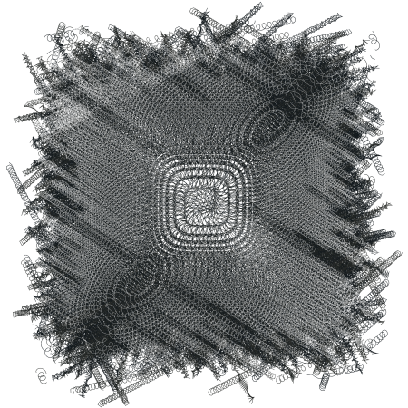

Chapter 12. Extended Examples
=============================

This chapter presents a series of programs that perform more complicated
tasks than most of the examples found throughout the earlier chapters of
the book. They illustrate a variety of programming techniques and
demonstrate a particular programming style.

Each section of this chapter describes one program in detail and gives
examples of its use. This is followed by a listing of the code. At the
end of each section are exercises intended to stimulate thought about
the program and to suggest possible extensions. These exercises are
generally more difficult than those found in
Chapters [2](#chapter-2.-getting-started)
and [3](#chapter-3.-going-further), and a few are major projects.

[Section 12.1] presents a simple matrix
multiplication package. It demonstrates a set of procedures that could
be written in almost any language. Its most interesting features are
that all multiplication operations are performed by calling a single
*generic* procedure, `mul`, which calls the appropriate help procedure
depending upon the dimensions of its arguments, and that it dynamically
allocates results of the proper size. [Section 12.2]
presents a merge sorting algorithm for ordering lists according to
arbitrary predicates. [Section 12.3] describes a
syntactic form that is used to construct sets. It demonstrates a simple
but efficient syntactic transformation from set notation to Scheme code.
[Section 12.4] presents a word-counting program
borrowed from *The C Programming
Language* [[19](#references)], translated from C into Scheme.
It shows character and string manipulation, data structure creation and
manipulation, and basic file input and output. [Section 12.5]
presents a Scheme printer that implements
basic versions of `put-datum`, `write`, and `display`. [Section 12.6]
presents a simple formatted output facility
similar to those found in many Scheme systems and in other languages.
[Section 12.7] presents a simple interpreter for
Scheme that illustrates Scheme as a language implementation vehicle
while giving an informal operational semantics for Scheme as well as a
useful basis for investigating extensions to Scheme. [Section 12.8]
presents a small, extensible abstract object
facility that could serve as the basis for an entire object-oriented
subsystem. [Section 12.9] presents a recursive
algorithm for computing the Fourier transform of a sequence of input
values. It highlights the use of Scheme's complex arithmetic. [Section 12.10]
presents a concise unification algorithm
that shows how procedures can be used as continuations and as
substitutions (unifiers) in Scheme. [Section 12.11]
describes a multitasking facility and its implementation in terms of
continuations.

### Section 12.1. Matrix and Vector Multiplication

This example program involves mostly basic programming techniques. It
demonstrates simple arithmetic and vector operations, looping with the
`do` syntactic form, dispatching based on object type, and raising
exceptions.

Multiplication of scalar to scalar, scalar to matrix, or matrix to
matrix is performed by a single *generic* procedure, called `mul`. `mul`
is called with two arguments, and it decides based on the types of its
arguments what operation to perform. Because scalar operations use
Scheme's multiplication procedure, `*`, `mul` scalars can be any
built-in numeric type (exact or inexact complex, real, rational, or
integer).

The product of an *m* × *n* matrix *A* and an *n* × *p* matrix *B* is
the *m* × *p* matrix *C* whose entries are defined by

The product of a scalar *x* and an *m* × *n* matrix *A* is the *m* × *n*
matrix *C* whose entries are defined by the equation

*C*~*ij*~ = *xA*~*ij*~.

That is, each element of *C* is the product of *x* and the corresponding
element of *A*. Vector-vector, vector-matrix, and matrix-vector
multiplication may be considered special cases of matrix-matrix
multiplication, where a vector is represented as a 1 × *n* or *n* × 1
matrix.

Here are a few examples, each preceded by the equivalent operation in
standard mathematical notation.

-   Scalar times scalar:

    3 × 4 = 12

    `(mul 3 4) `$\Rightarrow$` 12`

-   Scalar times vector (1 × 3 matrix):

    

    `(mul 1/2 '#(#(1 2 3))) `$\Rightarrow$` #(#(1/2 1 3/2))`

-   Scalar times matrix:

    

    `(mul -2` 
    `     '#(#(3 -2 -1)` 
    `        #(-3 0 -5)` 
    `        #(7 -1 -1))) `$\Rightarrow$` #(#(-6 4 2)` 
    `                        #(6 0 10)` 
    `                        #(-14 2 2))`

-   Vector times matrix:

    

    `(mul '#(#(1 2 3))` 
    `     '#(#(2 3)` 
    `        #(3 4)` 
    `        #(4 5))) `$\Rightarrow$` #(#(20 26))`

-   Matrix times vector:

    

    `(mul '#(#(2 3 4)` 
    `        #(3 4 5))` 
    `     '#(#(1) #(2) #(3))) `$\Rightarrow$` #(#(20) #(26))`

-   Matrix times matrix:

    

    `(mul '#(#(1 2 3)` 
    `        #(4 5 6))` 
    `     '#(#(1 2 3 4)` 
    `        #(2 3 4 5)` 
    `        #(3 4 5 6))) `$\Rightarrow$` #(#(14 20 26 32)` 
    `                        #(32 47 62 77))`

The code for `mul` and its helpers, which is structured as a library,
appears below. The first few definitions establish a set of procedures
that support the matrix data type. A matrix is a vector of vectors.
Included are a procedure to create matrices, procedures to access and
assign matrix elements, and a matrix predicate. Following these
definitions is the definition of `mul` itself. Inside the `lambda`
expression for `mul` are a set of definitions for help procedures that
support `mul`.

`mul` checks the types of its arguments and chooses the appropriate help
procedure to do the work. Each helper operates on arguments of specific
types. For example, `mat-sca-mul` multiplies a matrix by a scalar. If
the type of either argument is invalid or the arguments are
incompatible, e.g., rows or columns do not match up, `mul` or one of its
helpers raises an exception.

`(library (tspl matrix)` 
`  (export make-matrix matrix? matrix-rows matrix-columns` 
`          matrix-ref matrix-set! mul)` 
`  (import (rnrs)) ` 
` ; make-matrix creates a matrix (a vector of vectors).` 
`  (define make-matrix` 
`    (lambda (rows columns)` 
`      (do ([m (make-vector rows)]` 
`           [i 0 (+ i 1)])` 
`          ((= i rows) m)` 
`        (vector-set! m i (make-vector columns))))) ` 
` ; matrix? checks to see if its argument is a matrix.` 
` ; It isn't foolproof, but it's generally good enough.` 
`  (define matrix?` 
`    (lambda (x)` 
`      (and (vector? x)` 
`           (> (vector-length x) 0)` 
`           (vector? (vector-ref x 0))))) ` 
` ; matrix-rows returns the number of rows in a matrix.` 
`  (define matrix-rows` 
`    (lambda (x)` 
`      (vector-length x))) ` 
` ; matrix-columns returns the number of columns in a matrix.` 
`  (define matrix-columns` 
`    (lambda (x)` 
`      (vector-length (vector-ref x 0)))) ` 
` ; matrix-ref returns the jth element of the ith row.` 
`  (define matrix-ref` 
`    (lambda (m i j)` 
`      (vector-ref (vector-ref m i) j))) ` 
` ; matrix-set! changes the jth element of the ith row.` 
`  (define matrix-set!` 
`    (lambda (m i j x)` 
`      (vector-set! (vector-ref m i) j x))) ` 
` ; mat-sca-mul multiplies a matrix by a scalar.` 
`  (define mat-sca-mul` 
`    (lambda (m x)` 
`      (let* ([nr (matrix-rows m)]` 
`             [nc (matrix-columns m)]` 
`             [r (make-matrix nr nc)])` 
`        (do ([i 0 (+ i 1)])` 
`            ((= i nr) r)` 
`          (do ([j 0 (+ j 1)])` 
`              ((= j nc))` 
`            (matrix-set! r i j (* x (matrix-ref m i j)))))))) ` 
` ; mat-mat-mul multiplies one matrix by another, after verifying` 
` ; that the first matrix has as many columns as the second` 
` ; matrix has rows.` 
`  (define mat-mat-mul` 
`    (lambda (m1 m2)` 
`      (let* ([nr1 (matrix-rows m1)]` 
`             [nr2 (matrix-rows m2)]` 
`             [nc2 (matrix-columns m2)]` 
`             [r (make-matrix nr1 nc2)])` 
`        (unless (= (matrix-columns m1) nr2) (match-error m1 m2))` 
`        (do ([i 0 (+ i 1)])` 
`            ((= i nr1) r)` 
`          (do ([j 0 (+ j 1)])` 
`              ((= j nc2))` 
`            (do ([k 0 (+ k 1)]` 
`                 [a 0 (+ a` 
`                         (* (matrix-ref m1 i k)` 
`                            (matrix-ref m2 k j)))])` 
`                ((= k nr2)` 
`                 (matrix-set! r i j a)))))))) ` 
` ; type-error is called to complain when mul receives an invalid` 
` ; type of argument.` 
`  (define type-error` 
`    (lambda (what)` 
`      (assertion-violation 'mul` 
`        "not a number or matrix"` 
`         what))) ` 
` ; match-error is called to complain when mul receives a pair of` 
` ; incompatible arguments.` 
`  (define match-error` 
`    (lambda (what1 what2)` 
`      (assertion-violation 'mul` 
`        "incompatible operands" what1` 
`        what2))) ` 
` ; mul is the generic matrix/scalar multiplication procedure` 
`  (define mul` 
`    (lambda (x y)` 
`      (cond` 
`        [(number? x)` 
`         (cond` 
`           [(number? y) (* x y)]` 
`           [(matrix? y) (mat-sca-mul y x)]` 
`           [else (type-error y)])]` 
`        [(matrix? x)` 
`         (cond` 
`           [(number? y) (mat-sca-mul x y)]` 
`           [(matrix? y) (mat-mat-mul x y)]` 
`           [else (type-error y)])]` 
`        [else (type-error x)]))))`

#### Exercise 12.1.1

Make the necessary changes to rename `mul` to `*`.

#### Exercise 12.1.2

The predicate `matrix?` is usually sufficient but not completely
reliable, since it may return `#t` for objects that are not matrices. In
particular, it does not verify that all of the matrix rows are vectors,
that each row has the same number of elements, or that the elements
themselves are numbers. Modify `matrix?` to perform each of these
additional checks.

#### Exercise 12.1.3

Another solution to [Exercise 12.1.2] is to define a
matrix record type encapsulating the vectors of the matrix. If the
matrix creation routine never allows a malformed matrix record to be
created, a matrix record check is the only check needed to ensure that
the input is well formed. Define a matrix record type and recode the
library to use it.

#### Exercise 12.1.4

Write similar generic procedures for addition and subtraction. Devise a
generic `dispatch` procedure or syntactic form so that the type
dispatching code need not be rewritten for each new operation.

#### Exercise 12.1.5

This version of `mul` uses vectors of vectors to represent matrices.
Rewrite the system, using nested lists to represent matrices. What
efficiency is gained or lost by this change?

### Section 12.2. Sorting

This section illustrates a list sorting algorithm based on a simple
technique known as merge sorting. The procedure `sort` defined here
accepts two arguments: a predicate and a list, just like the built-in
`list-sort`. It returns a list containing the elements of the old list
sorted according to the predicate. As with `list-sort`, the predicate
should be a procedure that expects two arguments and returns `#t` if its
first argument must precede its second in the sorted list and false
otherwise. That is, if the predicate is applied to two elements `x` and
`y`, where `x` appears after `y` in the input list, it should return
true only if `x` should appear before `y` in the output list. If this
constraint is met, `sort` will perform a *stable sort*; with a stable
sort, two elements that are already sorted with respect to each other
will appear in the output in the same order in which they appeared in
the input. Thus, sorting a list that is already sorted will result in no
reordering, even if there are equivalent elements.

`(sort < '(3 4 2 1 2 5)) `$\Rightarrow$` (1 2 2 3 4 5)` 
`(sort > '(0.5 1/2)) `$\Rightarrow$` (0.5 1/2)` 
`(sort > '(1/2 0.5)) `$\Rightarrow$` (1/2 0.5)` 
`(list->string` 
`  (sort char>?` 
`        (string->list "coins"))) `$\Rightarrow$` "sonic"`

A companion procedure, `merge`, is also defined by the code. `merge`
accepts a predicate and two sorted lists and returns a merged list in
sorted order of the elements of the two lists. With a properly defined
predicate, `merge` is also stable in the sense that an item from the
first list will appear before an item from the second list unless it is
necessary that the item from the second list appear first.

`(merge char<?` 
`       '(#\a #\c)` 
`       '(#\b #\c #\d)) `$\Rightarrow$` (#\a #\b #\c #\c #\d)` 
`(merge <` 
`       '(1/2 2/3 3/4)` 
`       '(0.5 0.6 0.7)) `$\Rightarrow$` (1/2 0.5 0.6 2/3 0.7 3/4)` 
`(list->string` 
`  (merge char>?` 
`    (string->list "old")` 
`    (string->list "toe"))) `$\Rightarrow$` "tooled"`

The merge sorting algorithm is simple and elegant. The input list is
split into two approximately equal sublists. These sublists are sorted
recursively, yielding two sorted lists. The sorted lists are then merged
to form a single sorted list. The base case for the recursion is a list
of one element, which is already sorted.

To reduce overhead, the implementation computes the length of the input
list once, in `sort`, rather than at each step of the recursion, in
`dosort`. This also allows `dosort` to isolate the first half of the
list merely by halving the length, saving the cost of allocating a new
list containing half of the elements. As a result, `ls` may contain more
than `n` elements, but only the first `n` elements are considered part
of the list.

`(library (tspl sort)` 
`  (export sort merge)` 
`  (import (rnrs)) ` 
`  (define dosort` 
`    (lambda (pred? ls n)` 
`      (if (= n 1)` 
`          (list (car ls))` 
`          (let ([i (div n 2)])` 
`            (domerge pred?` 
`              (dosort pred? ls i)` 
`              (dosort pred? (list-tail ls i) (- n i))))))) ` 
`  (define domerge` 
`    (lambda (pred? l1 l2)` 
`      (cond` 
`        [(null? l1) l2]` 
`        [(null? l2) l1]` 
`        [(pred? (car l2) (car l1))` 
`         (cons (car l2) (domerge pred? l1 (cdr l2)))]` 
`        [else (cons (car l1) (domerge pred? (cdr l1) l2))]))) ` 
`  (define sort` 
`    (lambda (pred? l)` 
`      (if (null? l) l (dosort pred? l (length l))))) ` 
`  (define merge` 
`    (lambda (pred? l1 l2)` 
`      (domerge pred? l1 l2))))`

#### Exercise 12.2.1

In `dosort`, when `n` is 1, why is `(list (car ls))` returned instead of
just `ls`? How much allocation would be saved overall by replacing
`(list (car ls))` with `(if (null? (cdr ls)) ls (list (car ls)))`?

#### Exercise 12.2.2

How much work is actually saved by not copying the first part of the
input list when splitting it in `dosort`?

#### Exercise 12.2.3

All or nearly all allocation could be saved if the algorithm were to
work destructively, using `set-cdr!` to separate and join lists. Write
destructive versions `sort!` and `merge!` of the `sort` and `merge`.
Determine the difference between the two sets of procedures in terms of
allocation and run time for various inputs.

### Section 12.3. A Set Constructor

This example describes a syntactic extension, `set-of`, that allows the
construction of sets represented as lists with no repeated
elements [[22](#references)]. It uses `define-syntax` and
`syntax-rules` to compile set expressions into recursion expressions.
The expanded code is often as efficient as that which can be produced by
hand.

A `set-of` expression takes the following form.

`(set-of expr clause ...)`

`expr` describes the elements of the set in terms of the bindings
established by the `set-of` clauses `clause ...`. Each `clause` can take
one of three forms:

1.  A clause of the form `(x in s)` establishes a binding for `x` to
    each element of the set `s` in turn. This binding is visible within
    the remaining clauses and the expression `expr`.
2.  A clause of the form `(x is e)` establishes a binding for `x` to
    `e`. This binding is visible within the remaining clauses and the
    expression `expr`. This form is essentially an abbreviation for
    `(x in (list e))`.
3.  A clause taking any other form is treated as a predicate; this is
    used to force refusal of certain elements as in the second of the
    examples below.

`(set-of x` 
`  (x in '(a b c)))  (a b c) ` 
`(set-of x` 
`  (x in '(1 2 3 4))` 
`  (even? x))  (2 4) ` 
`(set-of (cons x y)` 
`  (x in '(1 2 3))` 
`  (y is (* x x)))  ((1 . 1) (2 . 4) (3 . 9))`

`(set-of (cons x y)` 
`  (x in '(a b))` 
`  (y in '(1 2)))  ((a . 1) (a . 2) (b . 1) (b . 2))`

A `set-of` expression is transformed into nested `let`, named `let`, and
`if` expressions, corresponding to each `is`, `in`, or predicate
subexpression. For example, the simple expression

`(set-of x (x in '(a b c)))`

is transformed into

`(let loop ([set '(a b c)])` 
`  (if (null? set)` 
`      '()` 
`      (let ([x (car set)])` 
`        (set-cons x (loop (cdr set))))))`

The expression

`(set-of x (x in '(1 2 3 4)) (even? x))`

is transformed into

`(let loop ([set '(1 2 3 4)])` 
`  (if (null? set)` 
`      '()` 
`      (let ([x (car set)])` 
`        (if (even? x)` 
`            (set-cons x (loop (cdr set)))` 
`            (loop (cdr set))))))`

The more complicated expression

`(set-of (cons x y) (x in '(1 2 3)) (y is (* x x)))`

is transformed into

`(let loop ([set '(1 2 3)])` 
`  (if (null? set)` 
`      '()` 
`      (let ([x (car set)])` 
`        (let ([y (* x x)])` 
`          (set-cons (cons x y)` 
`                    (loop (cdr set)))))))`

Finally, the expression

`(set-of (cons x y) (x in '(a b)) (y in '(1 2)))`

is transformed into nested named `let` expressions:

`(let loop1 ([set1 '(a b)])` 
`  (if (null? set1)` 
`      '()` 
`      (let ([x (car set1)])` 
`        (let loop2 ([set2 '(1 2)])` 
`          (if (null? set2)` 
`              (loop1 (cdr set1))` 
`              (let ([y (car set2)])` 
`                (set-cons (cons x y)` 
`                          (loop2 (cdr set2)))))))))`

These are fairly straightforward transformations, except that the base
case for the recursion on nested named `let` expressions varies
depending upon the level. The base case for the outermost named `let` is
always the empty list `()`, while the base case for an internal named
`let` is the recursion step for the next outer named `let`. In order to
handle this, the definition of `set-of` employs a help syntactic
extension `set-of-help`. `set-of-help` takes an additional expression,
`base`, which is the base case for recursion at the current level.

`(library (tspl sets)` 
`  (export set-of set-cons in is)` 
`  (import (rnrs)) ` 
` ; set-of uses helper syntactic extension set-of-help, passing it` 
` ; an initial base expression of '()` 
`  (define-syntax set-of` 
`    (syntax-rules ()` 
`      [(_ e m ...)` 
`       (set-of-help e '() m ...)])) ` 
` ; set-of-help recognizes in, is, and predicate expressions and` 
` ; changes them into nested named let, let, and if expressions.` 
`  (define-syntax set-of-help` 
`    (syntax-rules (in is)` 
`      [(_ e base) (set-cons e base)]` 
`      [(_ e base (x in s) m ...)` 
`       (let loop ([set s])` 
`         (if (null? set)` 
`             base` 
`             (let ([x (car set)])` 
`               (set-of-help e (loop (cdr set)) m ...))))]` 
`      [(_ e base (x is y) m ...)` 
`       (let ([x y]) (set-of-help e base m ...))]` 
`      [(_ e base p m ...)` 
`       (if p (set-of-help e base m ...) base)])) ` 
` ; since in and is are used as auxiliary keywords by set-of, the` 
` ; library must export definitions for them as well` 
`  (define-syntax in` 
`    (lambda (x)` 
`      (syntax-violation 'in "misplaced auxiliary keyword" x))) ` 
`  (define-syntax is` 
`    (lambda (x)` 
`      (syntax-violation 'is "misplaced auxiliary keyword" x))) ` 
` ; set-cons returns the original set y if x is already in y.` 
`  (define set-cons` 
`    (lambda (x y)` 
`      (if (memv x y)` 
`          y` 
`          (cons x y)))))`

#### Exercise 12.3.1

Write a procedure, `union`, that takes an arbitrary number of sets
(lists) as arguments and returns the union of the sets, using only the
`set-of` syntactic form. For example:

`(union)  ()` 
`(union '(a b c))  (a b c)` 
`(union '(2 5 4) '(9 4 3))  (2 5 9 4 3)` 
`(union '(1 2) '(2 4) '(4 8))  (1 2 4 8)`

#### Exercise 12.3.2

A single-list version of `map` can (almost) be defined as follows.

`(define map1` 
`  (lambda (f ls)` 
`    (set-of (f x) (x in ls)))) ` 
`(map1 - '(1 2 3 2))  (-1 -3 -2)`

Why does this not work? What could be changed to make it work?

#### Exercise 12.3.3

Devise a different definition of `set-cons` that maintains sets in some
sorted order, making the test for set membership, and hence `set-cons`
itself, potentially more efficient.

### Section 12.4. Word Frequency Counting

This program demonstrates several basic programming techniques,
including string and character manipulation, file input/output, data
structure manipulation, and recursion. The program is adapted from
Chapter 6 of *The C Programming
Language* [[19](#references)]. One reason for using this
particular example is to show how a C program might look when converted
almost literally into Scheme.

A few differences between the Scheme program and the original C program
are worth noting. First, the Scheme version employs a different protocol
for file input and output. Rather than implicitly using the standard
input and output ports, it requires that filenames be passed in, thus
demonstrating the opening and closing of files. Second, the procedure
`get-word` returns one of three values: a string (the word), a
nonalphabetic character, or an eof value. The original C version
returned a flag for letter (to say that a word was read) or a
nonalphabetic character. Furthermore, the C version passed in a string
to fill and a limit on the number of characters in the string; the
Scheme version builds a new string of whatever length is required (the
characters in the word are held in a list until the end of the word has
been found, then converted into a string with `list->string`). Finally,
`char-type` uses the primitive Scheme character predicates
`char-alphabetic?` and `char-numeric?` to determine whether a character
is a letter or digit.

The main program, `frequency`, takes an input filename and an output
filename as arguments, e.g., `(frequency "pickle" "freq.out")` prints
the frequency count for each word in the file "pickle" to the file
"freq.out." As `frequency` reads words from the input file, it inserts
them into a binary tree structure (using a binary sorting algorithm).
Duplicate entries are recorded by incrementing the count associated with
each word. Once end of file is reached, the program traverses the tree,
printing each word with its count.

Assume that the file "pickle" contains the following text.

`Peter Piper picked a peck of pickled peppers;` 
`A peck of pickled peppers Peter Piper picked.` 
`If Peter Piper picked a peck of pickled peppers,` 
`Where's the peck of pickled peppers Peter Piper picked?`

Then, after typing `(frequency "pickle" "freq.out")`, the file
"freq.out" should contain the following.

`1 A` 
`1 If` 
`4 Peter` 
`4 Piper` 
`1 Where` 
`2 a` 
`4 of` 
`4 peck` 
`4 peppers` 
`4 picked` 
`4 pickled` 
`1 s` 
`1 the`

The code for the word-counting program is structured as a top-level
program, with the script header recommended in the scripts chapter of
the nonnormative appendices to the Revised^6^
Report [[25](#references)]. It takes the names of input and
output files from the command line.

`#! /usr/bin/env scheme-script` 
`(import (rnrs)) ` 
`;;; If the next character on p is a letter, get-word reads a word` 
`;;; from p and returns it in a string.  If the character is not a` 
`;;; letter, get-word returns the character (on eof, the eof-object).` 
`(define get-word` 
`  (lambda (p)` 
`    (let ([c (get-char p)])` 
`      (if (eq? (char-type c) 'letter)` 
`          (list->string` 
`            (let loop ([c c])` 
`              (cons` 
`                c` 
`                (if (memq (char-type (lookahead-char p))` 
`                          '(letter digit))` 
`                    (loop (get-char p))` 
`                    '()))))` 
`          c)))) ` 
`;;; char-type tests for the eof-object first, since the eof-object` 
`;;; may not be a valid argument to char-alphabetic? or char-numeric?` 
`;;; It returns the eof-object, the symbol letter, the symbol digit,` 
`;;; or the argument itself if it is not a letter or digit.` 
`(define char-type` 
`  (lambda (c)` 
`    (cond` 
`      [(eof-object? c) c]` 
`      [(char-alphabetic? c) 'letter]` 
`      [(char-numeric? c) 'digit]` 
`      [else c]))) ` 
`;;; Tree nodes are represented as a record type with four fields: word,` 
`;;; left, right, and count.  Only one field, word, is initialized by an` 
`;;; argument to the constructor procedure make-tnode.  The remaining` 
`;;; fields are initialized by the constructor and changed by subsequent` 
`;;; operations.` 
`(define-record-type tnode` 
`  (fields (immutable word)` 
`          (mutable left)` 
`          (mutable right)` 
`          (mutable count))` 
`  (protocol` 
`    (lambda (new)` 
`      (lambda (word)` 
`        (new word '() '() 1))))) ` 
`;;; If the word already exists in the tree, tree increments its` 
`;;; count.  Otherwise, a new tree node is created and put into the` 
`;;; tree.  In any case, the new or modified tree is returned.` 
`(define tree` 
`  (lambda (node word)` 
`    (cond` 
`      [(null? node) (make-tnode word)]` 
`      [(string=? word (tnode-word node))` 
`       (tnode-count-set! node (+ (tnode-count node) 1))` 
`       node]` 
`      [(string<? word (tnode-word node))` 
`       (tnode-left-set! node (tree (tnode-left node) word))` 
`       node]` 
`      [else` 
`       (tnode-right-set! node (tree (tnode-right node) word))` 
`       node]))) ` 
`;;; tree-print prints the tree in "in-order," i.e., left subtree,` 
`;;; then node, then right subtree.  For each word, the count and the` 
`;;; word are printed on a single line.` 
`(define tree-print` 
`  (lambda (node p)` 
`    (unless (null? node)` 
`      (tree-print (tnode-left node) p)` 
`      (put-datum p (tnode-count node))` 
`      (put-char p #\space)` 
`      (put-string p (tnode-word node))` 
`      (newline p)` 
`      (tree-print (tnode-right node) p)))) ` 
`;;; frequency is the driver routine.  It opens the files, reads the` 
`;;; words, and enters them into the tree.  When the input port` 
`;;; reaches end-of-file, it prints the tree and closes the ports.` 
`(define frequency` 
`  (lambda (infn outfn)` 
`    (let ([ip (open-file-input-port infn (file-options)` 
`                (buffer-mode block) (native-transcoder))]` 
`          [op (open-file-output-port outfn (file-options)` 
`                (buffer-mode block) (native-transcoder))])` 
`      (let loop ([root '()])` 
`        (let ([w (get-word ip)])` 
`          (cond` 
`            [(eof-object? w) (tree-print root op)]` 
`            [(string? w) (loop (tree root w))]` 
`            [else (loop root)])))` 
`      (close-port ip)` 
`      (close-port op)))) ` 
`(unless (= (length (command-line)) 3)` 
`  (put-string (current-error-port) "usage: ")` 
`  (put-string (current-error-port) (car (command-line)))` 
`  (put-string (current-error-port) " input-filename output-filename\n")` 
`  (exit #f)) ` 
`(frequency (cadr (command-line)) (caddr (command-line)))`

#### Exercise 12.4.1

In the output file shown earlier, the capitalized words appeared before
the others in the output file, and the capital `A` was not recognized as
the same word as the lower-case `a`. Modify `tree` to use the
case-insensitive versions of the string comparisons so that this does
not happen.

#### Exercise 12.4.2

The "word" `s` appears in the file "freq.out," although it is really
just a part of the contraction `Where's`. Adjust `get-word` to allow
embedded single quote marks.

#### Exercise 12.4.3

Modify this program to "weed out" certain common words such as `a`,
`an`, `the`, `is`, `of`, etc., in order to reduce the amount of output
for long input files. Try to devise other ways to cut down on useless
output.

#### Exercise 12.4.4

`get-word` buffers characters in a list, allocating a new pair (with
`cons`) for each character. Make it more efficient by using a string to
buffer the characters. Devise a way to allow the string to grow if
necessary. [*Hint*: Use `string-append` or a string output port.]

#### Exercise 12.4.5

The `tree` implementation works by creating trees and later filling in
their `left` and `right` fields. This requires many unnecessary
assignments. Rewrite the `tree` procedure to avoid `tree-left-set!` and
`tree-right-set!` entirely.

#### Exercise 12.4.6

Recode the program to use a hashtable
([Section 6.13]) in place of a binary tree, and
compare the running times of the new and old programs on large input
files. Are hashtables always faster or always slower? Is there a
break-even point? Does the break-even point depend on the size of the
file or on some other characteristic of the file?

### Section 12.5. Scheme Printer

Printing Scheme objects may seem like a complicated process, but in fact
a rudimentary printer is straightforward, as this example demonstrates.
`put-datum`, `write`, and `display` are all implemented by the same
code. Sophisticated printers often support various printer controls and
handle printing of cyclic objects, but the one given here is completely
basic.

The main driver for the program is a procedure `wr`, which takes an
object to print `x`, a flag `d?`, and a port `p`. The flag `d?` (for
display) is `#t` if the code is to *display* the object, `#f` otherwise.
The `d?` flag is important only for characters and strings. Recall from
[Section 7.8] that `display` prints strings without the
enclosing quote marks and characters without the `#\` syntax.

The entry points for `write` and `display` handle the optionality of the
second (port) argument, passing the value of `current-output-port` when
no port argument is provided.

Procedures, ports, and the end-of-file object are printed as
`#<procedure>`, `#<port>`, and `#<eof>`. Unrecognized types of values
are printed as `#<unknown>`. So, for example, a hashtable, enumeration
set, and object of some implementation-specific type will all print as
`#<unknown>`.

`(library (tspl printer)` 
`  (export put-datum write display)` 
`  (import (except (rnrs) put-datum write display)) ` 
` ; define these here to avoid confusing paren-balancers` 
`  (define lparen #\()` 
`  (define rparen #\)) ` 
` ; wr is the driver, dispatching on the type of x` 
`  (define wr` 
`    (lambda (x d? p)` 
`      (cond` 
`        [(symbol? x) (put-string p (symbol->string x))]` 
`        [(pair? x) (wrpair x d? p)]` 
`        [(number? x) (put-string p (number->string x))]` 
`        [(null? x) (put-string p "()")]` 
`        [(boolean? x) (put-string p (if x "#t" "#f"))]` 
`        [(char? x) (if d? (put-char p x) (wrchar x p))]` 
`        [(string? x) (if d? (put-string p x) (wrstring x p))]` 
`        [(vector? x) (wrvector x d? p)]` 
`        [(bytevector? x) (wrbytevector x d? p)]` 
`        [(eof-object? x) (put-string p "#<eof>")]` 
`        [(port? x) (put-string p "#<port>")]` 
`        [(procedure? x) (put-string p "#<procedure>")]` 
`        [else (put-string p "#<unknown>")]))) ` 
` ; wrpair handles pairs and nonempty lists` 
`  (define wrpair` 
`    (lambda (x d? p)` 
`      (put-char p lparen)` 
`      (let loop ([x x])` 
`        (wr (car x) d? p)` 
`        (cond` 
`          [(pair? (cdr x)) (put-char p #\space) (loop (cdr x))]` 
`          [(null? (cdr x))]` 
`          [else (put-string p " . ") (wr (cdr x) d? p)]))` 
`      (put-char p rparen))) ` 
` ; wrchar handles characters.  Used only when d? is #f.` 
`  (define wrchar` 
`    (lambda (x p)` 
`      (put-string p "#\\")` 
`      (cond` 
`        [(assq x '((#\alarm . "alarm") (#\backspace . "backspace")` 
`                   (#\delete . "delete") (#\esc . "esc")` 
`                   (#\newline . "newline") (#\nul . "nul")` 
`                   (#\page . "page") (#\return . "return")` 
`                   (#\space . "space") (#\tab . "tab")` 
`                   (#\vtab . "vtab"))) =>` 
`         (lambda (a) (put-string p (cdr a)))]` 
`        [else (put-char p x)]))) ` 
` ; wrstring handles strings.  Used only when d? is #f.` 
`  (define wrstring` 
`    (lambda (x p)` 
`      (put-char p #\")` 
`      (let ([n (string-length x)])` 
`        (do ([i 0 (+ i 1)])` 
`            ((= i n))` 
`          (let ([c (string-ref x i)])` 
`            (case c` 
`              [(#\alarm) (put-string p "\\a")]` 
`              [(#\backspace) (put-string p "\\b")]` 
`              [(#\newline) (put-string p "\\n")]` 
`              [(#\page) (put-string p "\\f")]` 
`              [(#\return) (put-string p "\\r")]` 
`              [(#\tab) (put-string p "\\t")]` 
`              [(#\vtab) (put-string p "\\v")]` 
`              [(#\") (put-string p "\\\"")]` 
`              [(#\\) (put-string p "\\\\")]` 
`              [else (put-char p c)]))))` 
`      (put-char p #\"))) ` 
`  (define wrvector` 
`    (lambda (x d? p)` 
`      (put-char p #\#)` 
`      (let ([n (vector-length x)])` 
`        (do ([i 0 (+ i 1)] [sep lparen #\space])` 
`            ((= i n))` 
`          (put-char p sep)` 
`          (wr (vector-ref x i) d? p)))` 
`      (put-char p rparen))) ` 
`  (define wrbytevector` 
`    (lambda (x d? p)` 
`      (put-string p "#vu8")` 
`      (let ([n (bytevector-length x)])` 
`        (do ([i 0 (+ i 1)] [sep lparen #\space])` 
`            ((= i n))` 
`          (put-char p sep)` 
`          (wr (bytevector-u8-ref x i) d? p)))` 
`      (put-char p rparen))) ` 
` ; check-and-wr is called when the port is supplied` 
`  (define check-and-wr` 
`    (lambda (who x d? p)` 
`      (unless (and (output-port? p) (textual-port? p))` 
`        (assertion-violation who "invalid argument" p))` 
`      (wr x d? p))) ` 
` ; put-datum calls wr with d? set to #f` 
`  (define put-datum` 
`    (lambda (p x)` 
`      (check-and-wr 'put-datum x #f p))) ` 
` ; write calls wr with d? set to #f` 
`  (define write` 
`    (case-lambda` 
`      [(x) (wr x #f (current-output-port))]` 
`      [(x p) (check-and-wr 'write x #f p)])) ` 
` ; display calls wr with d? set to #t` 
`  (define display` 
`    (case-lambda` 
`      [(x) (wr x #t (current-output-port))]` 
`      [(x p) (check-and-wr 'display x #t p)])))`

#### Exercise 12.5.1

Numbers are printed with the help of `number->string`. Correct printing
of all Scheme numeric types, especially inexact numbers, is a
complicated task. Handling exact integers and ratios is fairly
straightforward, however. Modify the code to print exact integers and
ratios numbers directly (without `number->string`), but continue to use
`number->string` for inexact and complex numbers.

#### Exercise 12.5.2

Modify `wr` and its helpers to direct their output to an internal buffer
rather than to a port. Use the modified versions to implement a
procedure `object->string` that, like `number->string`, returns a string
containing a printed representation of its input. For example:

`(object->string '(a b c)) `$\Rightarrow$` "(a b c)"` 
`(object->string "hello") `$\Rightarrow$` "\"hello\""`

You may be surprised just how easy this change is to make.

#### Exercise 12.5.3

Some symbols are not printed properly by `wr`, including those that
start with digits or contain whitespace. Modify `wr` to call a
`wrsymbol` helper that uses hex scalar escapes as necessary to handle
such symbols. A hex scalar escape takes the form `#\xn;`, where `n` is
the Unicode scalar value of a character expressed in hexadecimal
notation. Consult the grammar for symbols on
[page 458] to determine when hex scalar
escapes are necessary.

### Section 12.6. Formatted Output

It is often necessary to print strings containing the printed
representations of Scheme objects, especially numbers. Doing so with
Scheme's standard output routines can be tedious. For example, the
`tree-print` procedure of [Section 12.4] requires a
sequence of four calls to output routines to print a simple one-line
message:

`(put-datum p (tnode-count node))` 
`(put-char p #\space)` 
`(put-string p (tnode-word node))` 
`(newline p)`

The formatted output facility defined in this section allows these four
calls to be replaced by the single call to `fprintf` below.

`(fprintf p "~s ~a~%" (tnode-count node) (tnode-word node))`

`fprintf` expects a port argument, a *control string*, and an indefinite
number of additional arguments that are inserted into the output as
specified by the control string. In the example, the value of
`(tnode-count node)` is written first, in place of `~s`. This is
followed by a space and the displayed value of `(tnode-word node)`, in
place of `~a`. The `~%` is replaced in the output with a newline.

The procedure `printf`, also defined in this section, is like `fprintf`
except that no port argument is expected and output is sent to the
current output port.

`~s`, `~a`, and `~%` are *format directives*; `~s` causes the first
unused argument after the control string to be printed to the output via
`write`, `~a` causes the first unused argument to be printed via
`display`, and `~%` simply causes a newline character to be printed. The
simple implementation of `fprintf` below recognizes only one other
format directive, `~~`, which inserts a tilde into the output. For
example,

`(printf "The string ~s displays as ~~.~%" "~")`

prints

`The string "~" displays as ~.`

`(library (tspl formatted-output)` 
`  (export printf fprintf)` 
`  (import (rnrs)) ` 
` ; dofmt does all of the work.  It loops through the control string` 
` ; recognizing format directives and printing all other characters` 
` ; without interpretation.  A tilde at the end of a control string is` 
` ; treated as an ordinary character.  No checks are made for proper` 
` ; inputs.  Directives may be given in either lower or upper case.` 
`  (define dofmt` 
`    (lambda (p cntl args)` 
`      (let ([nmax (- (string-length cntl) 1)])` 
`        (let loop ([n 0] [a args])` 
`          (if (<= n nmax)` 
`              (let ([c (string-ref cntl n)])` 
`                (if (and (char=? c #\~) (< n nmax))` 
`                    (case (string-ref cntl (+ n 1))` 
`                      [(#\a #\A)` 
`                       (display (car a) p)` 
`                       (loop (+ n 2) (cdr a))]` 
`                      [(#\s #\S)` 
`                       (write (car a) p)` 
`                       (loop (+ n 2) (cdr a))]` 
`                      [(#\%)` 
`                       (newline p)` 
`                       (loop (+ n 2) a)]` 
`                      [(#\~)` 
`                       (put-char p #\~) (loop (+ n 2) a)]` 
`                      [else` 
`                       (put-char p c) (loop (+ n 1) a)])` 
`                    (begin` 
`                      (put-char p c)` 
`                      (loop (+ n 1) a))))))))) ` 
` ; printf and fprintf differ only in that fprintf passes its` 
` ; port argument to dofmt while printf passes the current output` 
` ; port.` 
`  (define printf` 
`    (lambda (control . args)` 
`      (dofmt (current-output-port) control args))) ` 
`  (define fprintf` 
`    (lambda (p control . args)` 
`      (dofmt p control args))))`

#### Exercise 12.6.1

Add error checking to the code for invalid port arguments (`fprintf`),
invalid tilde escapes, and extra or missing arguments.

#### Exercise 12.6.2

Using the optional radix argument to `number->string`, augment `printf`
and `fprintf` with support for the following new format directives:

*  a*.

`~b` or `~B`: print the next unused argument, which must be a number, in
binary;

*  b*.

`~o` or `~O`: print the next unused argument, which must be a number, in
octal; and

*  c*.

`~x` or `~X`: print the next unused argument, which must be a number, in
hexadecimal.

For example:

`(printf "#x~x #o~o #b~b~%" 16 8 2)`

would print

`#x10 #o10 #b10`

#### Exercise 12.6.3

Add an "indirect" format directive, `~@`, that treats the next unused
argument, which must be a string, as if it were spliced into the current
format string. For example:

`(printf "--- ~@ ---" "> ~s <" '(a b c))`

would print

`---> (a b c) <---`

#### Exercise 12.6.4

Implement `format`, a version of `fprintf` that places its output into a
string instead of writing to a port. Make use of `object->string` from
[Exercise 12.5.2] to support the `~s` and `~a`
directives.

`(let ([x 3] [y 4])` 
`  (format "~s + ~s = ~s" x y (+ x y))) `$\Rightarrow$` "3 + 4 = 7"`

#### Exercise 12.6.5

Instead of using `object->string`, define `format` using a string output
port.

#### Exercise 12.6.6

Modify `format`, `fprintf`, and `printf` to allow a field size to be
specified after the tilde in the `~a` and `~s` format directives. For
example, the directive `~10s` would cause the next unused argument to be
inserted into the output left-justified in a field of size 10. If the
object requires more spaces than the amount specified, allow it to
extend beyond the field.

`(let ([x 'abc] [y '(def)])` 
`  (format "(cons '~5s '~5s) = ~5s"` 
`    x y (cons x y)))  "(cons 'abc   '(def)) = (abc def)"`

[*Hint*: Use `format` recursively.]

### Section 12.7. A Meta-Circular Interpreter for Scheme

The program described in this section is a *meta-circular* interpreter
for Scheme, i.e., it is an interpreter *for* Scheme written *in* Scheme.
The interpreter shows how small Scheme is when the core structure is
considered independently from its syntactic extensions and primitives.
It also illustrates interpretation techniques that can be applied
equally well to languages other than Scheme.

The relative simplicity of the interpreter is somewhat misleading. An
interpreter for Scheme written in Scheme can be quite a bit simpler than
one written in most other languages. Here are a few reasons why this one
is simpler.

-   Tail calls are handled properly only because tail calls in the
    interpreter are handled properly by the host implementation. All
    that is required is that the interpreter itself be tail-recursive.
-   First-class procedures in interpreted code are implemented by
    first-class procedures in the interpreter, which in turn are
    supported by the host implementation.
-   First-class continuations created with `call/cc` are provided by the
    host implementation's `call/cc`.
-   Primitive procedures such as `cons` and `assq` and services such as
    storage management are provided by the host implementation.

Converting the interpreter to run in a language other than Scheme may
require explicit support for some or all of these items.

The interpreter stores lexical bindings in an *environment*, which is
simply an *association list* (see [page 165]).
Evaluation of a `lambda` expression results in the creation of a
procedure within the scope of variables holding the environment and the
`lambda` body. Subsequent application of the procedure combines the new
bindings (the actual parameters) with the saved environment.

The interpreter handles only the core syntactic forms described in
[Section 3.1], and it recognizes bindings for only a
handful of primitive procedures. It performs no error checking.

`(interpret 3) `$\Rightarrow$` 3 ` 
`(interpret '(cons 3 4)) `$\Rightarrow$` (3 . 4) ` 
`(interpret` 
`  '((lambda (x . y)` 
`      (list x y))` 
`    'a 'b 'c 'd)) `$\Rightarrow$` (a (b c d)) ` 
`(interpret` 
`  '(((call/cc (lambda (k) k))` 
`     (lambda (x) x))` 
`    "HEY!")) `$\Rightarrow$` "HEY!" ` 
`(interpret` 
`  '((lambda (memq)` 
`      (memq memq 'a '(b c a d e)))` 
`    (lambda (memq x ls)` 
`      (if (null? ls) #f` 
`          (if (eq? (car ls) x)` 
`              ls` 
`              (memq memq x (cdr ls))))))) `$\Rightarrow$` (a d e) ` 
`(interpret` 
`  '((lambda (reverse)` 
`      (set! reverse` 
`        (lambda (ls new)` 
`          (if (null? ls)` 
`              new` 
`              (reverse (cdr ls) (cons (car ls) new)))))` 
`      (reverse '(a b c d e) '()))` 
` #f)) `$\Rightarrow$` (e d c b a)`

`` (library (tspl interpreter)`` 
``   (export interpret)`` 
``   (import (rnrs) (rnrs mutable-pairs)) `` 
``  ; primitive-environment contains a small number of primitive`` 
``  ; procedures; it can be extended easily with additional primitives.`` 
``   (define primitive-environment`` 
``     `((apply . ,apply) (assq . ,assq) (call/cc . ,call/cc)`` 
``       (car . ,car) (cadr . ,cadr) (caddr . ,caddr)`` 
``       (cadddr . ,cadddr) (cddr . ,cddr) (cdr . ,cdr)`` 
``       (cons . ,cons) (eq? . ,eq?) (list . ,list) (map . ,map)`` 
``       (memv . ,memv) (null? . ,null?) (pair? . ,pair?)`` 
``       (read . ,read) (set-car! . ,set-car!)`` 
``       (set-cdr! . ,set-cdr!) (symbol? . ,symbol?))) `` 
``  ; new-env returns a new environment from a formal parameter`` 
``  ; specification, a list of actual parameters, and an outer`` 
``  ; environment.  The symbol? test identifies "improper"`` 
``  ; argument lists.  Environments are association lists,`` 
``  ; associating variables with values.`` 
``   (define new-env`` 
``     (lambda (formals actuals env)`` 
``       (cond`` 
``         [(null? formals) env]`` 
``         [(symbol? formals) (cons (cons formals actuals) env)]`` 
``         [else`` 
``          (cons`` 
``            (cons (car formals) (car actuals))`` 
``            (new-env (cdr formals) (cdr actuals) env))]))) `` 
``  ; lookup finds the value of the variable var in the environment`` 
``  ; env, using assq.  Assumes var is bound in env.`` 
``   (define lookup`` 
``     (lambda (var env)`` 
``       (cdr (assq var env)))) `` 
``  ; assign is similar to lookup but alters the binding of the`` 
``  ; variable var by changing the cdr of the association pair`` 
``   (define assign`` 
``     (lambda (var val env)`` 
``       (set-cdr! (assq var env) val))) `` 
``  ; exec evaluates the expression, recognizing a small set of core forms.`` 
``   (define exec`` 
``     (lambda (expr env)`` 
``       (cond`` 
``         [(symbol? expr) (lookup expr env)]`` 
``         [(pair? expr)`` 
``          (case (car expr)`` 
``            [(quote) (cadr expr)]`` 
``            [(lambda)`` 
``             (lambda vals`` 
``               (let ([env (new-env (cadr expr) vals env)])`` 
``                 (let loop ([exprs (cddr expr)])`` 
``                   (if (null? (cdr exprs))`` 
``                       (exec (car exprs) env)`` 
``                       (begin`` 
``                         (exec (car exprs) env)`` 
``                         (loop (cdr exprs)))))))]`` 
``            [(if)`` 
``             (if (exec (cadr expr) env)`` 
``                 (exec (caddr expr) env)`` 
``                 (exec (cadddr expr) env))]`` 
``            [(set!) (assign (cadr expr) (exec (caddr expr) env) env)]`` 
``            [else`` 
``             (apply`` 
``               (exec (car expr) env)`` 
``               (map (lambda (x) (exec x env)) (cdr expr)))])]`` 
``         [else expr]))) `` 
``  ; interpret starts execution with the primitive environment.`` 
``   (define interpret`` 
``     (lambda (expr)`` 
``       (exec expr  primitive-environment)))) ``

#### Exercise 12.7.1

As written, the interpreter cannot interpret itself because it does not
support several of the syntactic forms used in its implementation: `let`
(named and unnamed), internal `define`, `case`, `cond`, and `begin`.
Rewrite the code for the interpreter, using only the syntactic forms it
supports.

#### Exercise 12.7.2

After completing the preceding exercise, use the interpreter to run a
copy of the interpreter, and use the copy to run another copy of the
interpreter. Repeat this process to see how many levels deep it will go
before the system grinds to a halt.

#### Exercise 12.7.3

At first glance, it might seem that the `lambda` case could be written
more simply as follows.

`[(lambda)` 
` (lambda vals` 
`   (let ([env (new-env (cadr expr) vals env)])` 
`     (let loop ([exprs (cddr expr)])` 
`       (let ([val (exec (car exprs) env)])` 
`         (if (null? (cdr exprs))` 
`             val` 
`             (loop (cdr exprs)))))))]`

Why would this be incorrect? [*Hint*: What property of Scheme would be
violated?]

#### Exercise 12.7.4

Try to make the interpreter more efficient by looking for ways to ask
fewer questions or to allocate less storage space. [*Hint*: Before
evaluation, convert lexical variable references into `(access n)`, where
`n` represents the number of values in the environment association list
in front of the value in question.]

#### Exercise 12.7.5

Scheme evaluates arguments to a procedure before applying the procedure
and applies the procedure to the values of these arguments
(*call-by-value*). Modify the interpreter to pass arguments unevaluated
and arrange to evaluate them upon reference (*call-by-name*). [*Hint*:
Use `lambda` to delay evaluation.] You will need to create versions of
the primitive procedures (`car`, `null?`, etc.) that take their
arguments unevaluated.

### Section 12.8. Defining Abstract Objects

This example demonstrates a syntactic extension that facilitates the
definition of simple abstract objects (see
[Section 2.9]). This facility has unlimited potential as
the basis for a complete object-oriented subsystem in Scheme.

Abstract objects are similar to basic data structures such as pairs and
vectors. Rather than being manipulated via access and assignment
operators, however, abstract objects respond to *messages*. The valid
messages and the actions to be taken for each message are defined by
code within the object itself rather than by code outside the object,
resulting in more modular and potentially more secure programming
systems. The data local to an abstract object is accessible only through
the actions performed by the object in response to the messages.

A particular type of abstract object is defined with `define-object`,
which has the general form

`(define-object (name var1 ...)` 
`  ((var2 expr) ...)` 
`  ((msg action) ...))`

The first set of bindings `((var2 expr) ...)` may be omitted.
`define-object` defines a procedure that is called to create new
abstract objects of the given type. This procedure is called `name`, and
the arguments to this procedure become the values of the local variables
`var1 ...`. After the procedure is invoked, the variables `var2 ...` are
bound to the values `expr ...` in sequence (as with `let*`) and the
messages `msg ...` are bound to the procedure values `action ...` in a
mutually recursive fashion (as with `letrec`). Within these bindings,
the new abstract object is created; this object is the value of the
creation procedure.

The syntactic form `send-message` is used to send messages to abstract
objects. `(send-message object msg arg ...)` sends `object` the message
`msg` with arguments `arg ...`. When an object receives a message, the
`arg ...` become the parameters to the action procedure associated with
the message, and the value returned by this procedure is returned by
`send-message`.

The following examples should help to clarify how abstract objects are
defined and used. The first example is a simple `kons` object that is
similar to Scheme's built-in pair object type, except that to access or
assign its fields requires sending it messages.

`(define-object (kons kar kdr)` 
`  ((get-car (lambda () kar))` 
`   (get-cdr (lambda () kdr))` 
`   (set-car! (lambda (x) (set! kar x)))` 
`   (set-cdr! (lambda (x) (set! kdr x))))) ` 
`(define p (kons 'a 'b))` 
`(send-message p get-car) `$\Rightarrow$` a` 
`(send-message p get-cdr) `$\Rightarrow$` b` 
`(send-message p set-cdr! 'c)` 
`(send-message p get-cdr) `$\Rightarrow$` c`

The simple `kons` object does nothing but return or assign one of the
fields as requested. What makes abstract objects interesting is that
they can be used to restrict access or perform additional services. The
following version of `kons` requires that a password be given with any
request to assign one of the fields. This password is a parameter to the
`kons` procedure.

`(define-object (kons kar kdr pwd)` 
`  ((get-car (lambda () kar))` 
`   (get-cdr (lambda () kar))` 
`   (set-car!` 
`     (lambda (x p)` 
`       (if (string=? p pwd)` 
`           (set! kar x))))` 
`   (set-cdr!` 
`     (lambda (x p)` 
`       (if (string=? p pwd)` 
`           (set! kar x)))))) ` 
`(define p1 (kons 'a 'b "magnificent"))` 
`(send-message p1 set-car! 'c "magnificent")` 
`(send-message p1 get-car) `$\Rightarrow$` c` 
`(send-message p1 set-car! 'd "please")` 
`(send-message p1 get-car) `$\Rightarrow$` c ` 
`(define p2 (kons 'x 'y "please"))` 
`(send-message p2 set-car! 'z "please")` 
`(send-message p2 get-car) `$\Rightarrow$` z`

One important ability of an abstract object is that it can keep
statistics on messages sent to it. The following version of `kons`
counts accesses to the two fields. This version also demonstrates the
use of explicitly initialized local bindings.

`(define-object (kons kar kdr)` 
`  ((count 0))` 
`  ((get-car` 
`    (lambda ()` 
`      (set! count (+ count 1))` 
`      kar))` 
`   (get-cdr` 
`    (lambda ()` 
`      (set! count (+ count 1))` 
`      kdr))` 
`    (accesses` 
`     (lambda () count)))) ` 
`(define p (kons 'a 'b))` 
`(send-message p get-car) `$\Rightarrow$` a` 
`(send-message p get-cdr) `$\Rightarrow$` b` 
`(send-message p accesses) `$\Rightarrow$` 2` 
`(send-message p get-cdr) `$\Rightarrow$` b` 
`(send-message p accesses) `$\Rightarrow$` 3`

The implementation of `define-object` is straightforward. The object
definition is transformed into a definition of the object creation
procedure. This procedure is the value of a `lambda` expression whose
arguments are those specified in the definition. The body of the
`lambda` consists of a `let*` expression to bind the local variables and
a `letrec` expression to bind the message names to the action
procedures. The body of the `letrec` is another `lambda` expression
whose value represents the new object. The body of this `lambda`
expression compares the messages passed in with the expected messages
using a `case` expression and applies the corresponding action procedure
to the remaining arguments.

For example, the definition

`(define-object (kons kar kdr)` 
`  ((count 0))` 
`  ((get-car` 
`    (lambda ()` 
`      (set! count (+ count 1))` 
`      kar))` 
`   (get-cdr` 
`    (lambda ()` 
`      (set! count (+ count 1))` 
`      kdr))` 
`   (accesses` 
`    (lambda () count))))`

is transformed into

`(define kons` 
`  (lambda (kar kdr)` 
`    (let* ([count 0])` 
`      (letrec ([get-car` 
`                (lambda ()` 
`                  (set! count (+ count 1)) kar)]` 
`               [get-cdr` 
`                (lambda ()` 
`                  (set! count (+ count 1)) kdr)]` 
`               [accesses (lambda () count)])` 
`        (lambda (msg . args)` 
`          (case msg` 
`            [(get-car) (apply get-car args)]` 
`            [(get-cdr) (apply get-cdr args)]` 
`            [(accesses) (apply accesses args)]` 
`            [else (assertion-violation 'kons` 
`                    "invalid message"` 
`                    (cons msg args))]))))))`

`(library (tspl oop)` 
`  (export define-object send-message)` 
`  (import (rnrs)) ` 
` ; define-object creates an object constructor that uses let* to bind` 
` ; local fields and letrec to define the exported procedures.  An` 
` ; object is itself a procedure that accepts messages corresponding` 
` ; to the names of the exported procedures.  The second pattern is` 
` ; used to allow the set of local fields to be omitted.` 
`  (define-syntax define-object` 
`    (syntax-rules ()` 
`      [(_ (name . varlist)` 
`          ((var1 val1) ...)` 
`          ((var2 val2) ...))` 
`       (define name` 
`         (lambda varlist` 
`           (let* ([var1 val1] ...)` 
`             (letrec ([var2 val2] ...)` 
`               (lambda (msg . args)` 
`                 (case msg` 
`                   [(var2) (apply var2 args)]` 
`                   ...` 
`                   [else` 
`                    (assertion-violation 'name` 
`                      "invalid message"` 
`                      (cons msg args))]))))))]` 
`      [(_ (name . varlist) ((var2 val2) ...))` 
`       (define-object (name . varlist)` 
`                      ()` 
`                      ((var2 val2) ...))])) ` 
` ; send-message abstracts the act of sending a message from the act` 
` ; of applying a procedure and allows the message to be unquoted.` 
`  (define-syntax send-message` 
`    (syntax-rules ()` 
`      [(_ obj msg arg ...)` 
`       (obj 'msg arg ...)])))`

#### Exercise 12.8.1

Use `define-object` to define the `stack` object type from
[Section 2.9].

#### Exercise 12.8.2

Use `define-object` to define a `queue` object type with operations
similar to those described in [Section 2.9].

#### Exercise 12.8.3

It is often useful to describe one object in terms of another. For
example, the second `kons` object type could be described as the same as
the first but with a password argument and different actions associated
with the `set-car!` and `set-cdr!` messages. This is called
*inheritance*; the new type of object is said to *inherit* attributes
from the first. Modify `define-object` to support inheritance by
allowing the optional declaration `(inherit object-name)` to appear
after the message/action pairs. This will require saving some
information about each object definition for possible use in subsequent
object definitions. Conflicting argument names should be disallowed, but
other conflicts should be resolved by using the initialization or action
specified in the new object definition.

#### Exercise 12.8.4

Based on the definition of `method` on
[page 317], define a complete object system,
but use records rather than vectors to represent object instances. If
done well, the resulting object system should be more efficient and
easier to use than the system given above.

### Section 12.9. Fast Fourier Transform

The procedure described in this section uses Scheme's complex arithmetic
to compute the discrete *Fourier transform* (DFT) of a sequence of
values [[4](#references)]. Discrete Fourier transforms are
used to analyze and process sampled signal sequences in a wide variety
of digital electronics applications such as pattern recognition,
bandwidth compression, radar target detection, and weather surveillance.

The DFT of a sequence of *N* input values,

{*x*(*n*)}~*n*=0~^*N*-1^,

is the sequence of *N* output values,

{*X*(*m*)}~*m*=0~^*N*-1^,

each defined by the equation

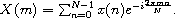

It is convenient to abstract away the constant amount (for given *N*)

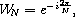

in order to obtain the more concise but equivalent equation

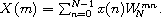

A straightforward computation of the *N* output values, each as a sum of
*N* intermediate values, requires on the order of *N*^2^ operations. A
*fast* Fourier transform (FFT), applicable when *N* is a power of 2,
requires only on the order of *N*log~2~*N* operations. Although usually
presented as a rather complicated iterative algorithm, the fast Fourier
transform is most concisely and elegantly expressed as a recursive
algorithm.

The recursive algorithm, which is due to
Sam Daniel [[7](#references)], can be derived by manipulating
the preceding summation as follows. We first split the summation into
two summations and recombine them into one summation from 0 to *N*/2 -
1.

We then pull out the common factor .

We can reduce 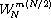 to 1 when *m* is even and
-1 when *m* is odd, since

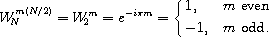

This allows us to specialize the summation for the even and odd cases of
*m* = 2*k* and *m* = 2*k* + 1, 0 ≤ *k* ≤ *N*/2 - 1.

The resulting summations are DFTs of the *N*/2-element sequences

{*x*(*n*) + *x*(*n* + *N*/2)}~*n*=0~^*N*/2-1^

and

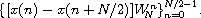

Thus, the DFT of an N-element sequence can be computed recursively by
interlacing the DFTs of two *N*/2-element sequences. If we select a base
case of two elements, we can describe a recursive fast Fourier
transformation (RFFT) algorithm as follows. For *N* = 2,

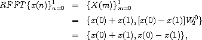

since . For *N* \> 2,

with the attendant interlacing of even and odd components.

The diagram above is adapted from one by
Sam Daniel [[7](#references)] and shows the computational
structure of the RFFT algorithm. The first stage computes pairwise sums
and differences of the first and second halves of the input; this stage
is labeled the *butterfly* stage. The second stage recurs on the
resulting subsequences. The third stage interlaces the output of the two
recursive calls to RFFT, thus yielding the properly ordered sequence
{*X*(*m*)}~*m*=0~^*N*-1^.

The procedure `dft` accepts a sequence (list) of values, `x`, the length
of which is assumed to be a power of 2. `dft` precomputes a sequence of
powers of 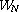,
, and calls `rfft` to initiate the
recursion. `rfft` follows the algorithm outlined above.

`(define (dft x)` 
`  (define (w-powers n)` 
`    (let ([pi (* (acos 0.0) 2)])` 
`      (let ([delta (/ (* -2.0i pi) n)])` 
`        (let f ([n n] [x 0.0])` 
`          (if (= n 0)` 
`              '()` 
`              (cons (exp x) (f (- n 2) (+ x delta))))))))` 
`  (define (evens w)` 
`    (if (null? w)` 
`        '()` 
`        (cons (car w) (evens (cddr w)))))` 
`  (define (interlace x y)` 
`    (if (null? x)` 
`        '()` 
`        (cons (car x) (cons (car y) (interlace (cdr x) (cdr y))))))` 
`  (define (split ls)` 
`    (let split ([fast ls] [slow ls])` 
`      (if (null? fast)` 
`          (values '() slow)` 
`          (let-values ([(front back) (split (cddr fast) (cdr slow))])` 
`            (values (cons (car slow) front) back)))))` 
`  (define (butterfly x w)` 
`    (let-values ([(front back) (split x)])` 
`      (values` 
`        (map + front back)` 
`        (map * (map - front back) w))))` 
`  (define (rfft x w)` 
`    (if (null? (cddr x))` 
`        (let ([x0 (car x)] [x1 (cadr x)])` 
`          (list (+ x0 x1) (- x0 x1)))` 
`        (let-values ([(front back) (butterfly x w)])` 
`          (let ([w (evens w)])` 
`            (interlace (rfft front w) (rfft back w))))))` 
`  (rfft x (w-powers (length x))))`

#### Exercise 12.9.1

Alter the algorithm to employ a base case of four points. What
simplifications can be made to avoid multiplying any of the base case
outputs by elements of `w`?

#### Exercise 12.9.2

Recode `dft` to accept a vector rather than a list as input, and have it
produce a vector as output. Use lists internally if necessary, but do
not simply convert the input to a list on entry and the output to a
vector on exit.

#### Exercise 12.9.3

Rather than recomputing the powers of `w` on each step for a new number
of points, the code simply uses the even-numbered elements of the
preceding list of powers. Show that doing so yields the proper list of
powers. That is, show that `(evens (w-powers n))` is equal to
`(w-powers (/ n 2))`.

#### Exercise 12.9.4

The recursion step creates several intermediate lists that are
immediately discarded. Recode the recursion step to avoid any
unnecessary allocation.

#### Exercise 12.9.5

Each element of a sequence of input values may be regenerated from the
discrete Fourier transform of the sequence via the equation

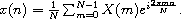

Noting the similarity between this equation and the original equation
defining *X*(*m*), create a modified version of `dft`, `inverse-dft`,
that performs the inverse transformation. Verify that
`(inverse-dft (dft seq))` returns `seq` for several input sequences
`seq`.

### Section 12.10. A Unification Algorithm

*Unification* [[23](#references)] is a pattern-matching
technique used in automated theorem proving, type-inference systems,
computer algebra, and logic programming, e.g.,
Prolog [[6](#references)].

A unification algorithm attempts to make two symbolic expressions equal
by computing a unifying substitution for the expressions. A
*substitution* is a function that replaces variables with other
expressions. A substitution must treat all occurrences of a variable the
same way, e.g., if it replaces one occurrence of the variable *x* by
*a*, it must replace all occurrences of *x* by *a*. A unifying
substitution, or *unifier*, for two expressions *e*~1~ and *e*~2~ is a
substitution, , such that
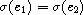.

For example, the two expressions *f*(*x*) and *f*(*y*) can be unified by
substituting *x* for *y* (or *y* for *x*). In this case, the unifier
 could be described as the function that
replaces *y* with *x* and leaves other variables unchanged. On the other
hand, the two expressions *x* + 1 and *y* + 2 cannot be unified. It
might appear that substituting 3 for *x* and 2 for *y* would make both
expressions equal to 4 and hence equal to each other. The symbolic
expressions, 3 + 1 and 2 + 2, however, still differ.

Two expressions may have more than one unifier. For example, the
expressions *f*(*x*,*y*) and *f*(1,*y*) can be unified to *f*(1,*y*)
with the substitution of 1 for *x*. They may also be unified to *f*(1,5)
with the substitution of 1 for *x* and 5 for *y*. The first substitution
is preferable, since it does not commit to the unnecessary replacement
of *y*. Unification algorithms typically produce the *most general
unifier*, or *mgu*, for two expressions. The mgu for two expressions
makes no unnecessary substitutions; all other unifiers for the
expressions are special cases of the mgu. In the example above, the
first substitution is the mgu and the second is a special case.

For the purposes of this program, a symbolic expression can be a
variable, a constant, or a function application. Variables are
represented by Scheme symbols, e.g., `x`; a function application is
represented by a list with the function name in the first position and
its arguments in the remaining positions, e.g., `(f x)`; and constants
are represented by zero-argument functions, e.g., `(a)`.

The algorithm presented here finds the mgu for two terms, if it exists,
using a continuation-passing style, or CPS (see
[Section 3.4]), approach to recursion on subterms. The
procedure `unify` takes two terms and passes them to a help procedure,
`uni`, along with an initial (identity) substitution, a success
continuation, and a failure continuation. The success continuation
returns the result of applying its argument, a substitution, to one of
the terms, i.e., the unified result. The failure continuation simply
returns its argument, a message. Because control passes by explicit
continuation within `unify` (always with tail calls), a return from the
success or failure continuation is a return from `unify` itself.

Substitutions are procedures. Whenever a variable is to be replaced by
another term, a new substitution is formed from the variable, the term,
and the existing substitution. Given a term as an argument, the new
substitution replaces occurrences of its saved variable with its saved
term in the result of invoking the saved substitution on the argument
expression. Intuitively, a substitution is a chain of procedures, one
for each variable in the substitution. The chain is terminated by the
initial, identity substitution.

`(unify 'x 'y) `$\Rightarrow$` y` 
`(unify '(f x y) '(g x y)) `$\Rightarrow$` "clash"` 
`(unify '(f x (h)) '(f (h) y)) `$\Rightarrow$` (f (h) (h))` 
`(unify '(f (g x) y) '(f y x)) `$\Rightarrow$` "cycle"` 
`(unify '(f (g x) y) '(f y (g x))) `$\Rightarrow$` (f (g x) (g x))` 
`(unify '(f (g x) y) '(f y z)) `$\Rightarrow$` (f (g x) (g x))`

`(library (tspl unification)` 
`  (export unify)` 
`  (import (rnrs)) ` 
` ; occurs? returns true if and only if u occurs in v` 
`  (define occurs?` 
`    (lambda (u v)` 
`      (and (pair? v)` 
`           (let f ([l (cdr v)])` 
`             (and (pair? l)` 
`                  (or (eq? u (car l))` 
`                      (occurs? u (car l))` 
`                      (f (cdr l)))))))) ` 
` ; sigma returns a new substitution procedure extending s by` 
` ; the substitution of u with v` 
`  (define sigma` 
`    (lambda (u v s)` 
`      (lambda (x)` 
`        (let f ([x (s x)])` 
`          (if (symbol? x)` 
`              (if (eq? x u) v x)` 
`              (cons (car x) (map f (cdr x)))))))) ` 
` ; try-subst tries to substitute u for v but may require a` 
` ; full unification if (s u) is not a variable, and it may` 
` ; fail if it sees that u occurs in v.` 
`  (define try-subst` 
`    (lambda (u v s ks kf)` 
`      (let ([u (s u)])` 
`        (if (not (symbol? u))` 
`            (uni u v s ks kf)` 
`            (let ([v (s v)])` 
`              (cond` 
`                [(eq? u v) (ks s)]` 
`                [(occurs? u v) (kf "cycle")]` 
`                [else (ks (sigma u v s))])))))) ` 
` ; uni attempts to unify u and v with a continuation-passing` 
` ; style that returns a substitution to the success argument` 
` ; ks or an error message to the failure argument kf.  The` 
` ; substitution itself is represented by a procedure from` 
` ; variables to terms.` 
`  (define uni` 
`    (lambda (u v s ks kf)  ` 
`      (cond` 
`        [(symbol? u) (try-subst u v s ks kf)]` 
`        [(symbol? v) (try-subst v u s ks kf)]` 
`        [(and (eq? (car u) (car v))` 
`              (= (length u) (length v)))` 
`         (let f ([u (cdr u)] [v (cdr v)] [s s])` 
`           (if (null? u)` 
`               (ks s)` 
`               (uni (car u)` 
`                    (car v)` 
`                    s` 
`                    (lambda (s) (f (cdr u) (cdr v) s))` 
`                    kf)))]` 
`        [else (kf "clash")]))) ` 
` ; unify shows one possible interface to uni, where the initial` 
` ; substitution is the identity procedure, the initial success` 
` ; continuation returns the unified term, and the initial failure` 
` ; continuation returns the error message.` 
`  (define unify` 
`    (lambda (u v)` 
`      (uni u` 
`           v` 
`           (lambda (x) x)` 
`           (lambda (s) (s u))` 
`           (lambda (msg) msg)))))`

#### Exercise 12.10.1

Modify `unify` so that it returns its substitution rather than the
unified term. Apply this substitution to both input terms to verify that
it returns the same result for each.

#### Exercise 12.10.2

As mentioned above, substitutions on a term are performed sequentially,
requiring one entire pass through the input expression for each
substituted variable. Represent the substitution differently so that
only one pass through the expression need be made. Make sure that
substitutions are performed not only on the input expression but also on
any expressions you insert during substitution.

#### Exercise 12.10.3

Extend the continuation-passing style unification algorithm into an
entire continuation-passing style logic programming system.

### Section 12.11. Multitasking with Engines

Engines are a high-level process abstraction supporting *timed
preemption* [[10](#references),[15](#references)].
Engines may be used to simulate multiprocessing, implement light-weight
threads, implement operating system kernels, and perform
nondeterministic computations. The engine implementation is one of the
more interesting applications of continuations in Scheme.

An engine is created by passing a thunk (procedure of no arguments) to
the procedure `make-engine`. The body of the thunk is the computation to
be performed by the engine. An engine itself is a procedure of three
arguments:

1.  `ticks`, a positive integer that specifies the amount of *fuel* to
    be given to the engine. An engine executes until this fuel runs out
    or until its computation finishes.
2.  `complete`, a procedure of two arguments that specifies what to do
    if the computation finishes. Its arguments will be the amount of
    fuel left over and the result of the computation.
3.  `expire`, a procedure of one argument that specifies what to do if
    the fuel runs out before the computation finishes. Its argument will
    be a new engine capable of continuing the computation from the point
    of interruption.

When an engine is applied to its arguments, it sets up a timer to fire
in `ticks` time units. If the engine computation completes before the
timer goes off, the system invokes `complete`, passing it the number of
`ticks` left over and the value of the computation. If, on the other
hand, the timer goes off before the engine computation completes, the
system creates a new engine from the continuation of the interrupted
computation and passes this engine to `expire`. `complete` and `expire`
are invoked in the continuation of the engine invocation.

The following example creates an engine from a trivial computation, 3,
and gives the engine 10 ticks.

`(define eng` 
`  (make-engine` 
`    (lambda () 3))) ` 
`(eng 10` 
`  (lambda (ticks value) value)` 
`  (lambda (x) x)) `$\Rightarrow$` 3`

It is often useful to pass `list` as the `complete` procedure to an
engine, causing the engine to return a list of the ticks remaining and
the value if the computation completes.

`(eng 10` 
`  list` 
`  (lambda (x) x)) `$\Rightarrow$` (9 3)`

In the example above, the value was 3 and there were 9 ticks left over,
i.e., it took only one unit of fuel to evaluate 3. (The fuel amounts
given here are for illustration only. The actual amount may differ.)

Typically, the engine computation does not finish in one try. The
following example displays the use of an engine to compute the 10th
Fibonacci number (see [Section 3.2]) in steps.

`(define fibonacci` 
`  (lambda (n)` 
`    (if (< n 2)` 
`        n` 
`        (+ (fibonacci (- n 1))` 
`           (fibonacci (- n 2)))))) ` 
`(define eng` 
`  (make-engine` 
`    (lambda ()` 
`      (fibonacci 10)))) ` 
`(eng 50` 
`  list` 
`  (lambda (new-eng)` 
`    (set! eng new-eng)` 
`    "expired")) `$\Rightarrow$` "expired" ` 
`(eng 50` 
`  list` 
`  (lambda (new-eng)` 
`    (set! eng new-eng)` 
`    "expired")) `$\Rightarrow$` "expired" ` 
`(eng 50` 
`  list` 
`  (lambda (new-eng)` 
`    (set! eng new-eng)` 
`    "expired")) `$\Rightarrow$` "expired" ` 
`(eng 50` 
`  list` 
`  (lambda (new-eng)` 
`    (set! eng new-eng)` 
`    "expired")) `$\Rightarrow$` (22 55)`

Each time the engine's fuel ran out, the `expire` procedure assigned
`eng` to the new engine. The entire computation required four allotments
of 50 ticks to complete; of the last 50 it used all but 23. Thus, the
total amount of fuel used was 177 ticks. This leads us to the following
procedure, `mileage`, which uses engines to "time" a computation.

`(define mileage` 
`  (lambda (thunk)` 
`    (let loop ([eng (make-engine thunk)] [total-ticks 0])` 
`      (eng 50` 
`        (lambda (ticks value)` 
`          (+ total-ticks (- 50 ticks)))` 
`        (lambda (new-eng)` 
`          (loop new-eng (+ total-ticks 50))))))) ` 
`(mileage (lambda () (fibonacci 10))) `$\Rightarrow$` 178`

The choice of 50 for the number of ticks to use each time is arbitrary,
of course. It might make more sense to pass a much larger number, say
10000, in order to reduce the number of times the computation is
interrupted.

The next procedure, `round-robin`, could be the basis for a simple
time-sharing operating system. `round-robin` maintains a queue of
processes (a list of engines) and cycles through the queue in a
*round-robin* fashion, allowing each process to run for a set amount of
time. `round-robin` returns a list of the values returned by the engine
computations in the order that the computations complete.

`(define round-robin` 
`  (lambda (engs)` 
`    (if (null? engs)` 
`        '()` 
`        ((car engs) 1` 
`          (lambda (ticks value)` 
`            (cons value (round-robin (cdr engs))))` 
`          (lambda (eng)` 
`            (round-robin` 
`              (append (cdr engs) (list eng))))))))`

Assuming the amount of computation corresponding to one tick is
constant, the effect of `round-robin` is to return a list of the values
sorted from the quickest to complete to the slowest to complete. Thus,
when we call `round-robin` on a list of engines, each computing one of
the Fibonacci numbers, the output list is sorted with the earlier
Fibonacci numbers first, regardless of the order of the input list.

`(round-robin` 
`  (map (lambda (x)` 
`         (make-engine` 
`           (lambda ()` 
`              (fibonacci x))))` 
`       '(4 5 2 8 3 7 6 2))) `$\Rightarrow$` (1 1 2 3 5 8 13 21)`

More interesting things could happen if the amount of fuel varied each
time through the loop. In this case, the computation would be
nondeterministic, i.e., the results would vary from call to call.

The following syntactic form, `por` (parallel-or), returns the first of
its expressions to complete with a true value. `por` is implemented with
the procedure `first-true`, which is similar to `round-robin` but quits
when any of the engines completes with a true value. If all of the
engines complete, but none with a true value, `first-true` (and hence
`por`) returns `#f`.

`(define-syntax por` 
`  (syntax-rules ()` 
`    [(_ x ...)` 
`     (first-true` 
`       (list (make-engine (lambda () x)) ...))])) ` 
`(define first-true` 
`  (lambda (engs)` 
`    (if (null? engs)` 
`        #f` 
`        ((car engs) 1` 
`          (lambda (ticks value)` 
`            (or value (first-true (cdr engs))))` 
`          (lambda (eng)` 
`            (first-true` 
`              (append (cdr engs) (list eng))))))))`

Even if one of the expressions is an infinite loop, `por` can still
finish (as long as one of the other expressions completes and returns a
true value).

`(por 1 2) `$\Rightarrow$` 1` 
`(por ((lambda (x) (x x)) (lambda (x) (x x)))` 
`     (fibonacci 10)) `$\Rightarrow$` 55`

The first subexpression of the second `por` expression is
nonterminating, so the answer is the value of the second subexpression.

Let's turn to the implementation of engines. Any preemptive multitasking
primitive must have the ability to interrupt a running process after a
given amount of computation. This ability is provided by a primitive
timer interrupt mechanism in some Scheme implementations. We will
construct a suitable one here.

Our timer system defines three procedures: `start-timer`, `stop-timer`,
and `decrement-timer`, which can be described operationally as follows.

-   `(start-timer ticks handler)` sets the timer to `ticks` and installs
    `handler` as the procedure to be invoked (without arguments) when
    the timer expires, i.e., reaches zero.
-   `(stop-timer)` resets the timer and returns the number of ticks
    remaining.
-   `(decrement-timer)` decrements the timer by one tick if the timer is
    on, i.e., if it is not zero. When the timer reaches zero,
    `decrement-timer` invokes the saved handler. If the timer has
    already reached zero, `decrement-timer` returns without changing the
    timer.

Code to implement these procedures is given along with the engine
implementation below.

Using the timer system requires inserting calls to `decrement-timer` in
appropriate places. Consuming a timer tick on entry to a procedure
usually provides a sufficient level of granularity. This can be
accomplished by using `timed-lambda` as defined below in place of
`lambda`. `timed-lambda` simply invokes `decrement-timer` before
executing the expressions in its body.

`(define-syntax timed-lambda` 
`  (syntax-rules ()` 
`    [(_ formals exp1 exp2 ...)` 
`     (lambda formals (decrement-timer) exp1 exp2 ...)]))`

It may be useful to redefine named `let` and `do` to use `timed-lambda`
as well, so that recursions expressed with these constructs are timed.
If you use this mechanism, do not forget to use the timed versions of
`lambda` and other forms in code run within an engine, or no ticks will
be consumed.

Now that we have a suitable timer, we can implement engines in terms of
the timer and continuations. We use `call/cc` in two places in the
engine implementation: (1) to obtain the continuation of the computation
that invokes the engine so that we can return to that continuation when
the engine computation completes or the timer expires, and (2) to obtain
the continuation of the engine computation when the timer expires so
that we can return to this computation if the newly created engine is
subsequently run.

The state of the engine system is contained in two variables local to
the engine system: `do-complete` and `do-expire`. When an engine is
started, the engine assigns to `do-complete` and `do-expire` procedures
that, when invoked, return to the continuation of the engine's caller to
invoke `complete` or `expire`. The engine starts (or restarts) the
computation by invoking the procedure passed as an argument to
`make-engine` with the specified number of ticks. The ticks and the
local procedure `timer-handler` are then used to start the timer.

Suppose that the timer expires before the engine computation completes.
The procedure `timer-handler` is then invoked. It initiates a call to
`start-timer` but obtains the ticks by calling `call/cc` with
`do-expire`. Consequently, `do-expire` is called with a continuation
that, if invoked, will restart the timer and continue the interrupted
computation. `do-expire` creates a new engine from this continuation and
arranges for the engine's `expire` procedure to be invoked with the new
engine in the correct continuation.

If, on the other hand, the engine computation completes before the timer
expires, the timer is stopped and the number of ticks remaining is
passed along with the value to `do-complete`; `do-complete` arranges for
the engine's `complete` procedure to be invoked with the ticks and value
in the correct continuation.

Let's discuss a couple of subtle aspects to this code. The first
concerns the method used to start the timer when an engine is invoked.
The code would apparently be simplified by letting `new-engine` start
the timer before it initiates or resumes the engine computation, instead
of passing the ticks to the computation and letting it start the timer.
Starting the timer within the computation, however, prevents ticks from
being consumed prematurely. If the engine system itself consumes fuel,
then an engine provided with a small amount of fuel may not progress
toward completion. (It may, in fact, make negative progress.) If the
software timer described above is used, this problem is actually avoided
by compiling the engine-making code with the untimed version of
`lambda`.

The second subtlety concerns the procedures created by `do-complete` and
`do-expire` and subsequently applied by the continuation of the
`call/cc` application. It may appear that `do-complete` could first
invoke the engine's `complete` procedure, then pass the result to the
continuation (and similarly for `do-expire`) as follows.

`(escape (complete value ticks))`

This would result in improper treatment of tail recursion, however. The
problem is that the current continuation would not be replaced with the
continuation stored in `escape` until the call to the `complete`
procedure returns. Consequently, both the continuation of the running
engine and the continuation of the engine invocation could be retained
for an indefinite period of time, when in fact the actual engine
invocation may appear to be tail-recursive. This is especially
inappropriate because the engine interface encourages use of
continuation-passing style and hence tail recursion. The round-robin
scheduler and `first-true` provide good examples of this, since the
`expire` procedure in each invokes engines tail-recursively.

We maintain proper treatment of tail recursion by arranging for
`do-complete` and `do-expire` to escape from the continuation of the
running engine before invoking the `complete` or `expire` procedures.
Since the continuation of the engine invocation is a procedure
application, passing it a procedure of no arguments results in
application of the procedure in the continuation of the engine
invocation.

`(library (tspl timer)` 
`  (export start-timer stop-timer decrement-timer)` 
`  (import (rnrs)) ` 
`  (define clock 0)` 
`  (define handler #f) ` 
`  (define start-timer` 
`    (lambda (ticks new-handler)` 
`      (set! handler new-handler)` 
`      (set! clock ticks))) ` 
`  (define stop-timer` 
`    (lambda ()` 
`      (let ([time-left clock])` 
`        (set! clock 0)` 
`        time-left))) ` 
`  (define decrement-timer` 
`    (lambda ()` 
`      (when (> clock 0)` 
`        (set! clock (- clock 1))` 
`        (when (= clock 0) (handler))))) ` 
`  (define-syntax timed-lambda` 
`    (syntax-rules ()` 
`      [(_ formals exp1 exp2 ...)` 
`       (lambda formals (decrement-timer) exp1 exp2 ...)]))) ` 
`(library (tspl engines)` 
`  (export make-engine timed-lambda)` 
`  (import (rnrs) (tspl timer)) ` 
`  (define make-engine` 
`    (let ([do-complete #f] [do-expire #f])` 
`      (define timer-handler` 
`        (lambda ()` 
`          (start-timer (call/cc do-expire) timer-handler)))` 
`      (define new-engine` 
`        (lambda (resume)` 
`          (lambda (ticks complete expire)` 
`            ((call/cc` 
`               (lambda (escape)` 
`                 (set! do-complete` 
`                   (lambda (ticks value)` 
`                     (escape (lambda () (complete ticks value)))))` 
`                 (set! do-expire` 
`                   (lambda (resume)` 
`                     (escape (lambda ()` 
`                               (expire (new-engine resume))))))` 
`                 (resume ticks)))))))` 
`      (lambda (proc)` 
`        (new-engine` 
`          (lambda (ticks)` 
`            (start-timer ticks timer-handler)` 
`            (let ([value (proc)])` 
`              (let ([ticks (stop-timer)])` 
`                (do-complete ticks value)))))))) ` 
`  (define-syntax timed-lambda` 
`    (syntax-rules ()` 
`      [(_ formals exp1 exp2 ...)` 
`       (lambda formals (decrement-timer) exp1 exp2 ...)])))`

#### Exercise 12.11.1

If your Scheme implementation allows definition and import of libraries
in the interactive top level, try defining the libraries above, then
type

`(import (rename (tspl engines) (timed-lambda lambda)))`

to define `make-engine` and redefine `lambda`. Then try out the examples
given earlier in this section.

#### Exercise 12.11.2

It may appear that the nested `let` expressions in the body of
`make-engine`:

`(let ([value (proc)])` 
`  (let ([ticks (stop-timer)])` 
`    (do-complete ticks value)))`

could be replaced with the following.

`(let ([value (proc)] [ticks (stop-timer)])` 
`  (do-complete value ticks))`

Why is this not correct?

#### Exercise 12.11.3

It would also be incorrect to replace the nested `let` expressions
discussed in the preceding exercise with the following.

`(let ([value (proc)])` 
`  (do-complete value (stop-timer)))`

Why?

#### Exercise 12.11.4

Modify the engine implementation to provide a procedure,
`engine-return`, that returns immediately from an engine.

#### Exercise 12.11.5

Implement the kernel of a small operating system using engines for
processes. Processes should request services (such as reading input from
the user) by evaluating an expression of the form `(trap 'request)`. Use
`call/cc` and `engine-return` from the preceding exercise to implement
`trap`.

#### Exercise 12.11.6

Write the same operating-system kernel without using engines, building
instead from continuations and timer interrupts.

#### Exercise 12.11.7

This implementation of engines does not allow one engine to call
another, i.e., nested engines [[10](#references)]. Modify the
implementation to allow nested engines.
