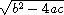
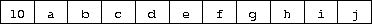

Chapter 2. Getting Started
==========================

This chapter is an introduction to Scheme for programmers who are new to
the language. You will get more from this chapter if you are sitting in
front of an interactive Scheme system, trying out the examples as you
go.

After reading this chapter and working the exercises, you should be able
to start using Scheme. You will have learned the syntax of Scheme
programs and how they are executed, along with how to use simple data
structures and control mechanisms.

### Section 2.1. Interacting with Scheme

Most Scheme systems provide an interactive programming environment that
simplifies program development and experimentation. The simplest
interaction with Scheme follows a "read-evaluate-print" cycle. A program
(often called a *read-evaluate-print loop*, or REPL) reads each
expression you type at the keyboard, evaluates it, and prints its value.

With an interactive Scheme system, you can type an expression at the
keyboard and see its value immediately. You can define a procedure and
apply it to arguments to see how it works. You can even type in an
entire program consisting of a set of procedure definitions and test it
without leaving the system. When your program starts getting longer, it
will be more convenient to type it into a file (using a text editor),
load the file and test it interactively. In most Scheme systems, a file
may be loaded with the nonstandard procedure `load`, which takes a
string argument naming the file. Preparing your program in a file has
several advantages: you have a chance to compose your program more
carefully, you can correct errors without retyping the program, and you
can retain a copy for later use. Most Scheme implementations treat
expressions loaded from a file the same as expressions typed at the
keyboard.

While Scheme provides various input and output procedures, the REPL
takes care of reading expressions and printing their values. This frees
you to concentrate on writing your program without worrying about how
its results will be displayed.

The examples in this chapter and in the rest of the book follow a
regular format. An expression you might type from your keyboard is given
first, possibly spanning several lines. The value of the expression is
given after the $\Rightarrow$, to be read as
"evaluates to." The $\Rightarrow$ is omitted for
definitions and when the value of an expression is unspecified.

The example programs are formatted in a style that "looks nice" and
conveys the structure of the program. The code is easy to read because
the relationship between each expression and its subexpressions is
clearly shown. Scheme ignores indentation and line breaks, however, so
there is no need to follow a particular style. The important thing is to
establish one style and keep to it. Scheme sees each program as if it
were on a single line, with its subexpressions ordered from left to
right.

If you have access to an interactive Scheme system, it might be a good
idea to start it up now and type in the examples as you read. One of the
simplest Scheme expressions is a string constant. Try typing `"Hi Mom!"`
(including the double quotes) in response to the prompt. The system
should respond with `"Hi Mom!"`; the value of any constant is the
constant itself.

`"Hi Mom!" `$\Rightarrow$` "Hi Mom!"`

Here is a set of expressions, each with Scheme's response. They are
explained in later sections of this chapter, but for now use them to
practice interacting with Scheme.

`"hello" `$\Rightarrow$` "hello"` 
`42 `$\Rightarrow$` 42` 
`22/7 `$\Rightarrow$` 22/7` 
`3.141592653 `$\Rightarrow$` 3.141592653` 
`+ `$\Rightarrow$` #<procedure>` 
`(+ 76 31) `$\Rightarrow$` 107` 
`(* -12 10) `$\Rightarrow$` -120` 
`'(a b c d) `$\Rightarrow$` (a b c d)`

Be careful not to miss any single quotes ( `'` ), double quotes, or
parentheses. If you left off a single quote in the last expression, you
probably received a message indicating that an exception has occurred.
Just try again. If you left off a closing parenthesis or double quote,
the system might still be waiting for it.

Here are a few more expressions to try. You can try to figure out on
your own what they mean or wait to find out later in the chapter.

`(car '(a b c)) `$\Rightarrow$` a` 
`(cdr '(a b c)) `$\Rightarrow$` (b c)` 
`(cons 'a '(b c)) `$\Rightarrow$` (a b c)` 
`(cons (car '(a b c))` 
`       (cdr '(d e f))) `$\Rightarrow$` (a e f)`

As you can see, Scheme expressions may span more than one line. The
Scheme system knows when it has an entire expression by matching double
quotes and parentheses.

Next, let's try defining a procedure.

`(define square` 
`  (lambda (n)` 
`    (* n n)))`

The procedure `square` computes the square *n*^2^ of any number *n*. We
say more about the expressions that make up this definition later in
this chapter. For now it suffices to say that `define` establishes
variable bindings, `lambda` creates procedures, and `*` names the
multiplication procedure. Note the form of these expressions. All
structured forms are enclosed in parentheses and written in *prefix
notation*, i.e., the operator precedes the arguments. As you can see,
this is true even for simple arithmetic operations such as `*`.

Try using `square`.

`(square 5) `$\Rightarrow$` 25` 
`(square -200) `$\Rightarrow$` 40000` 
`(square 0.5) `$\Rightarrow$` 0.25` 
`(square -1/2) `$\Rightarrow$` 1/4`

Even though the next definition is short, you might enter it into a
file. Let's assume you call the file "reciprocal.ss."

`(define reciprocal` 
`  (lambda (n)` 
`    (if (= n 0)` 
`        "oops!"` 
`        (/ 1 n))))`

This procedure, `reciprocal`, computes the quantity 1/*n* for any number
*n* ≠ 0. For *n* = 0, `reciprocal` returns the string `"oops!"`. Return
to Scheme and try loading your file with the procedure `load`.

`(load "reciprocal.ss")`

Finally, try using the procedure we have just defined.

`(reciprocal 10) `$\Rightarrow$` 1/10` 
`(reciprocal 1/10) `$\Rightarrow$` 10` 
`(reciprocal 0) `$\Rightarrow$` "oops!"` 
`(reciprocal (reciprocal 1/10)) `$\Rightarrow$` 1/10`

In the next section we will discuss Scheme expressions in more detail.
Throughout this chapter, keep in mind that your Scheme system is one of
the most useful tools for learning Scheme. Whenever you try one of the
examples in the text, follow it up with your own examples. In an
interactive Scheme system, the cost of trying something out is
relatively small---usually just the time to type it in.

### Section 2.2. Simple Expressions

The simplest Scheme expressions are constant data objects, such as
strings, numbers, symbols, and lists. Scheme supports other object
types, but these four are enough for many programs. We saw some examples
of strings and numbers in the preceding section.

Let's discuss numbers in a little more detail. Numbers are constants. If
you enter a number, Scheme echoes it back to you. The following examples
show that Scheme supports several types of numbers.

`123456789987654321 `$\Rightarrow$` 123456789987654321` 
`3/4 `$\Rightarrow$` 3/4` 
`2.718281828 `$\Rightarrow$` 2.718281828` 
`2.2+1.1i `$\Rightarrow$` 2.2+1.1i`

Scheme numbers include exact and inexact integer, rational, real, and
complex numbers. Exact integers and rational numbers have arbitrary
precision, i.e., they can be of arbitrary size. Inexact numbers are
usually represented internally using IEEE standard floating-point
representations.

Scheme provides the names `+`, `-`, `*`, and `/` for the corresponding
arithmetic procedures. Each procedure accepts two numeric arguments. The
expressions below are called *procedure applications*, because they
specify the application of a procedure to a set of arguments.

`(+ 1/2 1/2) `$\Rightarrow$` 1` 
`(- 1.5 1/2) `$\Rightarrow$` 1.0 ` 
`(* 3 1/2) `$\Rightarrow$` 3/2` 
`(/ 1.5 3/4) `$\Rightarrow$` 2.0`

Scheme employs prefix notation even for common arithmetic operations.
Any procedure application, whether the procedure takes zero, one, two,
or more arguments, is written as `(procedure arg ...)`. This regularity
simplifies the syntax of expressions; one notation is employed
regardless of the operation, and there are no complicated rules
regarding the precedence or associativity of operators.

Procedure applications may be nested, in which case the innermost values
are computed first. We can thus nest applications of the arithmetic
procedures given above to evaluate more complicated formulas.

`(+ (+ 2 2) (+ 2 2)) `$\Rightarrow$` 8` 
`(- 2 (* 4 1/3)) `$\Rightarrow$` 2/3` 
`(* 2 (* 2 (* 2 (* 2 2)))) `$\Rightarrow$` 32` 
`(/ (* 6/7 7/2) (- 4.5 1.5)) `$\Rightarrow$` 1.0`

These examples demonstrate everything you need to use Scheme as a
four-function desk calculator. While we will not discuss them in this
chapter, Scheme supports many other arithmetic procedures. Now might be
a good time to turn to [Section 6.4] and experiment
with some of them.

Simple numeric objects are sufficient for many tasks, but sometimes
aggregate data structures containing two or more values are needed. In
many languages, the basic aggregate data structure is the array. In
Scheme, it is the *list*. Lists are written as sequences of objects
surrounded by parentheses. For instance, `(1 2 3 4 5)` is a list of
numbers, and `("this" "is" "a" "list")` is a list of strings. Lists need
not contain only one type of object, so `(4.2 "hi")` is a valid list
containing a number and a string. Lists may be nested (may contain other
lists), so `((1 2) (3 4))` is a valid list with two elements, each of
which is a list of two elements.

You might notice that lists look just like procedure applications and
wonder how Scheme tells them apart. That is, how does Scheme distinguish
between a list of objects, `(obj1 obj2 ...)`, and a procedure
application, `(procedure arg ...)`?

In some cases, the distinction might seem obvious. The list of numbers
`(1 2 3 4 5)` could hardly be confused with a procedure application,
since 1 is a number, not a procedure. So, the answer might be that
Scheme looks at the first element of the list or procedure application
and makes its decision based on whether that first element is a
procedure or not. This answer is not good enough, since we might even
want to treat a valid procedure application such as `(+ 3 4)` as a list.
The answer is that we must tell Scheme explicitly to treat a list as
data rather than as a procedure application. We do this with `quote`.

`(quote (1 2 3 4 5)) `$\Rightarrow$` (1 2 3 4 5)` 
`(quote ("this" "is" "a" "list")) `$\Rightarrow$` ("this" "is" "a" "list")` 
`(quote (+ 3 4)) `$\Rightarrow$` (+ 3 4)`

The `quote` forces the list to be treated as data. Try entering the
above expressions without the quote; you will likely receive a message
indicating that an exception has occurred for the first two and an
incorrect answer (`7`) for the third.

Because `quote` is required fairly frequently in Scheme code, Scheme
recognizes a single quotation mark ( `'` ) preceding an expression as an
abbreviation for `quote`.

`'(1 2 3 4) `$\Rightarrow$` (1 2 3 4)` 
`'((1 2) (3 4)) `$\Rightarrow$` ((1 2) (3 4))` 
`'(/ (* 2 -1) 3) `$\Rightarrow$` (/ (* 2 -1) 3)`

Both forms are referred to as `quote` expressions. We often say an
object is *quoted* when it is enclosed in a `quote` expression.

A `quote` expression is *not* a procedure application, since it inhibits
the evaluation of its subexpression. It is an entirely different
syntactic form. Scheme supports several other syntactic forms in
addition to procedure applications and `quote` expressions. Each
syntactic form is evaluated differently. Fortunately, the number of
different syntactic forms is small. We will see more of them later in
this chapter.

Not all `quote` expressions involve lists. Try the following expression
with and without the `quote` wrapper.

`(quote hello) `$\Rightarrow$` hello`

The symbol `hello` must be quoted in order to prevent Scheme from
treating `hello` as a *variable*. Symbols and variables in Scheme are
similar to symbols and variables in mathematical expressions and
equations. When we evaluate the mathematical expression 1 - *x* for some
value of *x*, we think of *x* as a variable. On the other hand, when we
consider the algebraic equation *x*^2^ - 1 = (*x* - 1)(*x* + 1), we
think of *x* as a symbol (in fact, we think of the whole equation
symbolically). Just as quoting a list tells Scheme to treat a
parenthesized form as a list rather than as a procedure application,
quoting an identifier tells Scheme to treat the identifier as a symbol
rather than as a variable. While symbols are commonly used to represent
variables in symbolic representations of equations or programs, symbols
may also be used, for example, as words in the representation of natural
language sentences.

You might wonder why applications and variables share notations with
lists and symbols. The shared notation allows Scheme programs to be
represented as Scheme data, simplifying the writing of interpreters,
compilers, editors, and other tools in Scheme. This is demonstrated by
the Scheme interpreter given in [Section 12.7],
which is itself written in Scheme. Many people believe this to be one of
the most important features of Scheme.

Numbers and strings may be quoted, too.

`'2 `$\Rightarrow$` 2` 
`'2/3 `$\Rightarrow$` 2/3` 
`(quote "Hi Mom!") `$\Rightarrow$` "Hi Mom!"`

Numbers and strings are treated as constants in any case, however, so
quoting them is unnecessary.

Now let's discuss some Scheme procedures for manipulating lists. There
are two basic procedures for taking lists apart: `car` and `cdr`
(pronounced *could-er*). `car` returns the first element of a list, and
`cdr` returns the remainder of the list. (The names "car" and "cdr" are
derived from operations supported by the first computer on which a Lisp
language was implemented, the IBM 704.) Each requires a nonempty list as
its argument.

`(car '(a b c)) `$\Rightarrow$` a` 
`(cdr '(a b c)) `$\Rightarrow$` (b c)` 
`(cdr '(a)) `$\Rightarrow$` () ` 
`(car (cdr '(a b c))) `$\Rightarrow$` b` 
`(cdr (cdr '(a b c))) `$\Rightarrow$` (c) ` 
`(car '((a b) (c d))) `$\Rightarrow$` (a b)` 
`(cdr '((a b) (c d))) `$\Rightarrow$` ((c d))`

The first element of a list is often called the "car" of the list, and
the rest of the list is often called the "cdr" of the list. The cdr of a
list with one element is `()`, the *empty list*.

The procedure `cons` constructs lists. It takes two arguments. The
second argument is usually a list, and in that case `cons` returns a
list.

`(cons 'a '()) `$\Rightarrow$` (a)` 
`(cons 'a '(b c)) `$\Rightarrow$` (a b c)` 
`(cons 'a (cons 'b (cons 'c '()))) `$\Rightarrow$` (a b c)` 
`(cons '(a b) '(c d)) `$\Rightarrow$` ((a b) c d) ` 
`(car (cons 'a '(b c))) `$\Rightarrow$` a` 
`(cdr (cons 'a '(b c))) `$\Rightarrow$` (b c)` 
`(cons (car '(a b c))` 
`      (cdr '(d e f))) `$\Rightarrow$` (a e f)` 
`(cons (car '(a b c))` 
`      (cdr '(a b c))) `$\Rightarrow$` (a b c)`

Just as "car" and "cdr" are often used as nouns, "cons" is often used as
a verb. Creating a new list by adding an element to the beginning of a
list is referred to as *consing* the element onto the list.

Notice the word "usually" in the description of `cons`'s second
argument. The procedure `cons` actually builds *pairs*, and there is no
reason that the cdr of a pair must be a list. A list is a sequence of
pairs; each pair's cdr is the next pair in the sequence.

The cdr of the last pair in a *proper list* is the empty list.
Otherwise, the sequence of pairs forms an *improper list*. More
formally, the empty list is a proper list, and any pair whose cdr is a
proper list is a proper list.

An improper list is printed in *dotted-pair notation*, with a period, or
*dot*, preceding the final element of the list.

`(cons 'a 'b) `$\Rightarrow$` (a . b)` 
`(cdr '(a . b)) `$\Rightarrow$` b` 
`(cons 'a '(b . c)) `$\Rightarrow$` (a b . c)`

Because of its printed notation, a pair whose cdr is not a list is often
called a *dotted pair*. Even pairs whose cdrs are lists can be written
in dotted-pair notation, however, although the printer always chooses to
write proper lists without dots.

`'(a . (b . (c . ()))) `$\Rightarrow$` (a b c)`

The procedure `list` is similar to `cons`, except that it takes an
arbitrary number of arguments and always builds a proper list.

`(list 'a 'b 'c) `$\Rightarrow$` (a b c)` 
`(list 'a) `$\Rightarrow$` (a)` 
`(list) `$\Rightarrow$` ()`

[Section 6.3] provides more information on lists and
the Scheme procedures for manipulating them. This might be a good time
to turn to that section and familiarize yourself with the other
procedures given there.

#### Exercise 2.2.1

Convert the following arithmetic expressions into Scheme expressions and
evaluate them.

*  a*.

1.2 × (2 - 1/3) + -8.7

*  b*.

(2/3 + 4/9) ÷ (5/11 - 4/3)

*  c*.

1 + 1 ÷ (2 + 1 ÷ (1 + 1/2))

*  d*.

1 × -2 × 3 × -4 × 5 × -6 × 7

#### Exercise 2.2.2

Experiment with the procedures `+`, `-`, `*`, and `/` to determine
Scheme's rules for the type of value returned by each when given
different types of numeric arguments.

#### Exercise 2.2.3

Determine the values of the following expressions. Use your Scheme
system to verify your answers.

*  a*.

`(cons 'car 'cdr)`

*  b*.

`(list 'this '(is silly))`

*  c*.

`(cons 'is '(this silly?))`

*  d*.

`(quote (+ 2 3))`

*  e*.

`(cons '+ '(2 3))`

*  f*.

`(car '(+ 2 3))`

*  g*.

`(cdr '(+ 2 3))`

*  h*.

`cons`

*  i*.

`(quote cons)`

*  j*.

`(quote (quote cons))`

*  k*.

`(car (quote (quote cons)))`

*  l*.

`(+ 2 3)`

*  m*.

`(+ '2 '3)`

*  n*.

`(+ (car '(2 3)) (car (cdr '(2 3))))`

*  o*.

`((car (list + - * /)) 2 3)`

#### Exercise 2.2.4

`(car (car '((a b) (c d))))` yields `a`. Determine which compositions of
`car` and `cdr` applied to `((a b) (c d))` yield `b`, `c`, and `d`.

#### Exercise 2.2.5

Write a Scheme expression that evaluates to the following internal list
structure.

#### Exercise 2.2.6

Draw the internal list structure produced by the expression below.

`(cons 1 (cons '(2 . ((3) . ())) (cons '(()) (cons 4 5))))`

#### Exercise 2.2.7

The behavior of `(car (car (car '((a b) (c d)))))` is undefined because
`(car '((a b) (c d)))` is `(a b)`, `(car '(a b))` is `a`, and `(car 'a)`
is undefined. Determine all legal compositions of `car` and `cdr`
applied to `((a b) (c d))`.

#### Exercise 2.2.8

Try to explain how Scheme expressions are evaluated. Does your
explanation cover the last example in [Exercise 2.2.3]?

### Section 2.3. Evaluating Scheme Expressions

Let's turn to a discussion of how Scheme evaluates the expressions you
type. We have already established the rules for constant objects such as
strings and numbers: the object itself is the value. You have probably
also worked out in your mind a rule for evaluating procedure
applications of the form `(procedure arg1 ... argn)`. Here, `procedure`
is an expression representing a Scheme procedure, and `arg1 ... argn`
are expressions representing its arguments. One possibility is the
following.

-   Find the value of `procedure`.
-   Find the value of `arg1`.

    $\vdots$

-   Find the value of `argn`.
-   Apply the value of `procedure` to the values of `arg1 ... argn`.

For example, consider the simple procedure application `(+ 3 4)`. The
value of `+` is the addition procedure, the value of 3 is the number 3,
and the value of 4 is the number 4. Applying the addition procedure to 3
and 4 yields 7, so our value is the object 7.

By applying this process at each level, we can find the value of the
nested expression `(* (+ 3 4) 2)`. The value of `*` is the
multiplication procedure, the value of `(+ 3 4)` we can determine to be
the number 7, and the value of 2 is the number 2. Multiplying 7 by 2 we
get 14, so our answer is 14.

This rule works for procedure applications but not for `quote`
expressions because the subexpressions of a procedure application are
evaluated, whereas the subexpression of a `quote` expression is not. The
evaluation of a `quote` expression is more similar to the evaluation of
constant objects. The value of a `quote` expression of the form
`(quote object)` is simply `object`.

Constant objects, procedure applications, and `quote` expressions are
only three of the many syntactic forms provided by Scheme. Fortunately,
only a few of the other syntactic forms need to be understood directly
by a Scheme programmer; these are referred to as *core* syntactic forms.
The remaining syntactic forms are *syntactic extensions* defined,
ultimately, in terms of the core syntactic forms. We will discuss the
remaining core syntactic forms and a few syntactic extensions in the
remaining sections of this chapter. [Section 3.1]
summarizes the core syntactic forms and introduces the syntactic
extension mechanism.

Before we go on to more syntactic forms and procedures, two points
related to the evaluation of procedure applications are worthy of note.
First, the process given above is overspecified, in that it requires the
subexpressions to be evaluated from left to right. That is, `procedure`
is evaluated before `arg1`, `arg1` is evaluated before `arg2`, and so
on. This need not be the case. A Scheme evaluator is free to evaluate
the expressions in any order---left to right, right to left, or any
other sequential order. In fact, the subexpressions may be evaluated in
different orders for different applications, even in the same
implementation.

The second point is that `procedure` is evaluated in the same way as
`arg1 ... argn`. While `procedure` is often a variable that names a
particular procedure, this need not be the case.
[Exercise 2.2.3] had you determine the value of the
expression `((car (list + - * /)) 2 3)`. Here, `procedure` is
`(car (list + - * /))`. The value of `(car (list + - * /))` is the
addition procedure, just as if `procedure` were simply the variable `+`.

#### Exercise 2.3.1

Write down the steps necessary to evaluate the expression below.

`((car (cdr (list + - * /))) 17 5)`

### Section 2.4. Variables and Let Expressions

Suppose `expr` is a Scheme expression that contains a variable `var`.
Suppose, additionally, that we would like `var` to have the value `val`
when we evaluate `expr`. For example, we might like `x` to have the
value 2 when we evaluate `(+ x 3)`. Or, we might want `y` to have the
value 3 when we evaluate `(+ 2 y)`. The following examples demonstrate
how to do this using Scheme's `let` syntactic form.

`(let ((x 2))` 
`  (+ x 3)) `$\Rightarrow$` 5 ` 
`(let ((y 3))` 
`  (+ 2 y)) `$\Rightarrow$` 5 ` 
`(let ((x 2) (y 3))` 
`  (+ x y)) `$\Rightarrow$` 5`

The `let` syntactic form includes a list of variable-expression pairs,
along with a sequence of expressions referred to as the *body* of the
`let`. The general form of a `let` expression is

`(let ((var expr) ...) body1 body2 ...)`

We say the variables are *bound* to the values by the `let`. We refer to
variables bound by `let` as `let`-*bound* variables.

A `let` expression is often used to simplify an expression that would
contain two identical subexpressions. Doing so also ensures that the
value of the common subexpression is computed only once.

`(+ (* 4 4) (* 4 4)) `$\Rightarrow$` 32 ` 
`(let ((a (* 4 4))) (+ a a)) `$\Rightarrow$` 32`

Brackets are often used in place of parentheses to delimit the bindings
of a `let` expression.

`(let ([list1 '(a b c)] [list2 '(d e f)])` 
`  (cons (cons (car list1)` 
`              (car list2))` 
`        (cons (car (cdr list1))` 
`              (car (cdr list2))))) `$\Rightarrow$` ((a . d) b . e)`

Scheme treats forms enclosed in brackets just like forms enclosed in
parentheses. An open bracket must be matched by a close bracket, and an
open parenthesis must be matched by a close parenthesis. We use brackets
for `let` (and, as we'll see, several other standard syntactic forms) to
improve readability, especially when we might otherwise have two or more
consecutive open parentheses.

Since expressions in the first position of a procedure application are
evaluated no differently from other expressions, a `let`-bound variable
may be used there as well.

`(let ([f +])` 
`  (f 2 3)) `$\Rightarrow$` 5 ` 
`(let ([f +] [x 2])` 
`  (f x 3)) `$\Rightarrow$` 5 ` 
`(let ([f +] [x 2] [y 3])` 
`  (f x y)) `$\Rightarrow$` 5`

The variables bound by `let` are visible only within the body of the
`let`.

`(let ([+ *])` 
`  (+ 2 3)) `$\Rightarrow$` 6 ` 
`(+ 2 3) `$\Rightarrow$` 5`

This is fortunate, because we would not want the value of `+` to be the
multiplication procedure everywhere.

It is possible to nest `let` expressions.

`(let ([a 4] [b -3])` 
`  (let ([a-squared (* a a)]` 
`        [b-squared (* b b)])` 
`    (+ a-squared b-squared))) `$\Rightarrow$` 25`

When nested `let` expressions bind the same variable, only the binding
created by the inner `let` is visible within its body.

`(let ([x 1])` 
`  (let ([x (+ x 1)])` 
`    (+ x x))) `$\Rightarrow$` 4`

The outer `let` expression binds `x` to 1 within its body, which is the
second `let` expression. The inner `let` expression binds `x` to
`(+ x 1)` within its body, which is the expression `(+ x x)`. What is
the value of `(+ x 1)`? Since `(+ x 1)` appears within the body of the
outer `let` but not within the body of the inner `let`, the value of `x`
must be 1 and hence the value of `(+ x 1)` is 2. What about `(+ x x)`?
It appears within the body of both `let` expressions. Only the inner
binding for `x` is visible, so `x` is 2 and `(+ x x)` is 4.

The inner binding for `x` is said to *shadow* the outer binding. A
`let`-bound variable is visible everywhere within the body of its `let`
expression except where it is shadowed. The region where a variable
binding is visible is called its *scope*. The scope of the first `x` in
the example above is the body of the outer `let` expression minus the
body of the inner `let` expression, where it is shadowed by the second
`x`. This form of scoping is referred to as *lexical scoping*, since the
scope of each binding can be determined by a straightforward textual
analysis of the program.

Shadowing may be avoided by choosing different names for variables. The
expression above could be rewritten so that the variable bound by the
inner `let` is `new-x`.

`(let ([x 1])` 
`  (let ([new-x (+ x 1)])` 
`    (+ new-x new-x))) `$\Rightarrow$` 4`

Although choosing different names can sometimes prevent confusion,
shadowing can help prevent the accidental use of an "old" value. For
example, with the original version of the preceding example, it would be
impossible for us to mistakenly refer to the outer `x` within the body
of the inner `let`.

#### Exercise 2.4.1

Rewrite the following expressions, using `let` to remove common
subexpressions and to improve the structure of the code. Do not perform
any algebraic simplifications.

*  a*.

`(+ (- (* 3 a) b) (+ (* 3 a) b))`

*  b*.

`(cons (car (list a b c)) (cdr (list a b c)))`

#### Exercise 2.4.2

Determine the value of the following expression. Explain how you derived
this value.

`(let ([x 9])` 
`  (* x` 
`     (let ([x (/ x 3)])` 
`       (+ x x))))`

#### Exercise 2.4.3

Rewrite the following expressions to give unique names to each different
`let`-bound variable so that none of the variables is shadowed. Verify
that the value of your expression is the same as that of the original
expression.

*  a*.

`(let ([x 'a] [y 'b])` 
`  (list (let ([x 'c]) (cons x y))` 
`        (let ([y 'd]) (cons x y))))`

*  b*.

`(let ([x '((a b) c)])` 
`  (cons (let ([x (cdr x)])` 
`          (car x))` 
`        (let ([x (car x)])` 
`          (cons (let ([x (cdr x)])` 
`                  (car x))` 
`                (cons (let ([x (car x)])` 
`                        x)` 
`                      (cdr x))))))`

### Section 2.5. Lambda Expressions

In the expression `(let ([x (* 3 4)]) (+ x x))`, the variable `x` is
bound to the value of `(* 3 4)`. What if we would like the value of
`(+ x x)` where `x` is bound to the value of `(/ 99 11)`? Where `x` is
bound to the value of `(- 2 7)`? In each case we need a different `let`
expression. When the body of the `let` is complicated, however, having
to repeat it can be inconvenient.

Instead, we can use the syntactic form `lambda` to create a new
procedure that has `x` as a parameter and has the same body as the `let`
expression.

`(lambda (x) (+ x x)) `$\Rightarrow$` #<procedure>`

The general form of a `lambda` expression is

`(lambda (var ...) body1 body2 ...)`

The variables `var ...` are the *formal parameters* of the procedure,
and the sequence of expressions `body1 body2 ...` is its body.
(Actually, the true general form is somewhat more general than this, as
you will see later.)

A procedure is just as much an object as a number, string, symbol, or
pair. It does not have any meaningful printed representation as far as
Scheme is concerned, however, so this book uses the notation
`#<procedure>` to show that the value of an expression is a procedure.

The most common operation to perform on a procedure is to apply it to
one or more values.

`((lambda (x) (+ x x)) (* 3 4)) `$\Rightarrow$` 24`

This is no different from any other procedure application. The procedure
is the value of `(lambda (x) (+ x x))`, and the only argument is the
value of `(* 3 4)`, or 12. The argument values, or *actual parameters*,
are bound to the formal parameters within the body of the `lambda`
expression in the same way as `let`-bound variables are bound to their
values. In this case, `x` is bound to 12, and the value of `(+ x x)` is
24. Thus, the result of applying the procedure to the value 12 is 24.

Because procedures are objects, we can establish a procedure as the
value of a variable and use the procedure more than once.

`(let ([double (lambda (x) (+ x x))])` 
`  (list (double (* 3 4))` 
`        (double (/ 99 11))` 
`        (double (- 2 7)))) `$\Rightarrow$` (24 18 -10)`

Here, we establish a binding for `double` to a procedure, then use this
procedure to double three different values.

The procedure expects its actual parameter to be a number, since it
passes the actual parameter on to `+`. In general, the actual parameter
may be any sort of object. Consider, for example, a similar procedure
that uses `cons` instead of `+`.

`(let ([double-cons (lambda (x) (cons x x))])` 
`  (double-cons 'a)) `$\Rightarrow$` (a . a)`

Noting the similarity between `double` and `double-cons`, you should not
be surprised to learn that they may be collapsed into a single procedure
by adding an additional argument.

`(let ([double-any (lambda (f x) (f x x))])` 
`  (list (double-any + 13)` 
`        (double-any cons 'a))) `$\Rightarrow$` (26 (a . a))`

This demonstrates that procedures may accept more than one argument and
that arguments passed to a procedure may themselves be procedures.

As with `let` expressions, `lambda` expressions become somewhat more
interesting when they are nested within other `lambda` or `let`
expressions.

`(let ([x 'a])` 
`  (let ([f (lambda (y) (list x y))])` 
`    (f 'b))) `$\Rightarrow$` (a b)`

The occurrence of `x` within the `lambda` expression refers to the `x`
outside the `lambda` that is bound by the outer `let` expression. The
variable `x` is said to *occur free* in the `lambda` expression or to be
a *free variable* of the `lambda` expression. The variable `y` does not
occur free in the `lambda` expression since it is bound by the `lambda`
expression. A variable that occurs free in a `lambda` expression should
be bound, e.g., by an enclosing `lambda` or `let` expression, unless the
variable is (like the names of primitive procedures) bound outside of
the expression, as we discuss in the following section.

What happens when the procedure is applied somewhere outside the scope
of the bindings for variables that occur free within the procedure, as
in the following expression?

`(let ([f (let ([x 'sam])` 
`           (lambda (y z) (list x y z)))])` 
`  (f 'i 'am)) `$\Rightarrow$` (sam i am)`

The answer is that the same bindings that were in effect when the
procedure was created are in effect again when the procedure is applied.
This is true even if another binding for `x` is visible where the
procedure is applied.

`(let ([f (let ([x 'sam])` 
`           (lambda (y z) (list x y z)))])` 
`  (let ([x 'not-sam])` 
`    (f 'i 'am))) `$\Rightarrow$` (sam i am)`

In both cases, the value of `x` within the procedure named `f` is `sam`.

Incidentally, a `let` expression is nothing more than the direct
application of a `lambda` expression to a set of argument expressions.
For example, the two expressions below are equivalent.

`(let ([x 'a]) (cons x x))` ≡ `((lambda (x) (cons x x)) 'a)`

In fact, a `let` expression is a syntactic extension defined in terms of
`lambda` and procedure application, which are both core syntactic forms.
In general, any expression of the form

`(let ((var expr) ...) body1 body2 ...)`

is equivalent to the following.

`((lambda (var ...) body1 body2 ...)` 
` expr ...)`

See [Section 3.1] for more about core forms and
syntactic extensions.

As mentioned above, the general form of `lambda` is a bit more
complicated than the form we saw earlier, in that the formal parameter
specification, `(var ...)`, need not be a proper list, or indeed even a
list at all. The formal parameter specification can be in any of the
following three forms:

-   a proper list of variables, `(var1 ... varn)`, such as we have
    already seen,
-   a single variable, `varr`, or
-   an improper list of variables, `(var1 ... varn . varr)`.

In the first case, exactly *n* actual parameters must be supplied, and
each variable is bound to the corresponding actual parameter. In the
second, any number of actual parameters is valid; all of the actual
parameters are put into a single list and the single variable is bound
to this list. The third case is a hybrid of the first two cases. At
least *n* actual parameters must be supplied. The variables
`var1 ... varn` are bound to the corresponding actual parameters, and
the variable `varr` is bound to a list containing the remaining actual
parameters. In the second and third cases, `varr` is sometimes referred
to as a "rest" parameter because it holds the rest of the actual
parameters beyond those that are individually named.

Let's consider a few examples to help clarify the more general syntax of
`lambda` expressions.

`(let ([f (lambda x x)])` 
`  (f 1 2 3 4)) `$\Rightarrow$` (1 2 3 4) ` 
`(let ([f (lambda x x)])` 
`  (f)) `$\Rightarrow$` () ` 
`(let ([g (lambda (x . y) (list x y))])` 
`  (g 1 2 3 4)) `$\Rightarrow$` (1 (2 3 4)) ` 
`(let ([h (lambda (x y . z) (list x y z))])` 
`  (h 'a 'b 'c 'd)) `$\Rightarrow$` (a b (c d))`

In the first two examples, the procedure named `f` accepts any number of
arguments. These arguments are automatically formed into a list to which
the variable `x` is bound; the value of `f` is this list. In the first
example, the arguments are 1, 2, 3, and 4, so the answer is `(1 2 3 4)`.
In the second, there are no arguments, so the answer is the empty list
`()`. The value of the procedure named `g` in the third example is a
list whose first element is the first argument and whose second element
is a list containing the remaining arguments. The procedure named `h` is
similar but separates out the second argument. While `f` accepts any
number of arguments, `g` must receive at least one and `h` must receive
at least two.

#### Exercise 2.5.1

Determine the values of the expressions below.

*  a*.

`(let ([f (lambda (x) x)])` 
`  (f 'a))`

*  b*.

`(let ([f (lambda x x)])` 
`  (f 'a))`

*  c*.

`(let ([f (lambda (x . y) x)])` 
`  (f 'a))`

*  d*.

`(let ([f (lambda (x . y) y)])` 
`  (f 'a))`

#### Exercise 2.5.2

How might the primitive procedure `list` be defined?

#### Exercise 2.5.3

List the variables that occur free in each of the `lambda` expressions
below. Do not omit variables that name primitive procedures such as `+`
or `cons`.

*  a*.

`(lambda (f x) (f x))`

*  b*.

`(lambda (x) (+ x x))`

*  c*.

`(lambda (x y) (f x y))`

*  d*.

`(lambda (x)` 
`  (cons x (f x y)))`

*  e*.

`(lambda (x)` 
`  (let ([z (cons x y)])` 
`    (x y z)))`

*  f*.

`(lambda (x)` 
`  (let ([y (cons x y)])` 
`    (x y z)))`

### Section 2.6. Top-Level Definitions

The variables bound by `let` and `lambda` expressions are not visible
outside the bodies of these expressions. Suppose you have created an
object, perhaps a procedure, that must be accessible anywhere, like `+`
or `cons`. What you need is a *top-level definition*, which may be
established with `define`. Top-level definitions, which are supported by
most interactive Scheme systems, are visible in every expression you
enter, except where shadowed by another binding.

Let's establish a top-level definition of the `double-any` procedure of
the last section.

`(define double-any` 
`  (lambda (f x)` 
`    (f x x)))`

The variable `double-any` now has the same status as `cons` or the name
of any other primitive procedure. We can use `double-any` as if it were
a primitive procedure.

`(double-any + 10) `$\Rightarrow$` 20` 
`(double-any cons 'a) `$\Rightarrow$` (a . a)`

A top-level definition may be established for any object, not just for
procedures.

`(define sandwich "peanut-butter-and-jelly") ` 
`sandwich `$\Rightarrow$` "peanut-butter-and-jelly"`

Most often, though, top-level definitions are used for procedures.

As suggested above, top-level definitions may be shadowed by `let` or
`lambda` bindings.

`(define xyz '(x y z))` 
`(let ([xyz '(z y x)])` 
`  xyz) `$\Rightarrow$` (z y x)`

Variables with top-level definitions act almost as if they were bound by
a `let` expression enclosing all of the expressions you type.

Given only the simple tools you have read about up to this point, it is
already possible to define some of the primitive procedures provided by
Scheme and described later in this book. If you completed the exercises
from the last section, you should already know how to define `list`.

`(define list (lambda x x))`

Also, Scheme provides the abbreviations `cadr` and `cddr` for the
compositions of `car` with `cdr` and `cdr` with `cdr`. That is,
`(cadr list)` is equivalent to `(car (cdr list))`, and, similarly,
`(cddr list)` is equivalent to `(cdr (cdr list))`. They are easily
defined as follows.

`(define cadr` 
`  (lambda (x)` 
`    (car (cdr x)))) ` 
`(define cddr` 
`  (lambda (x)` 
`    (cdr (cdr x))))`

`(cadr '(a b c)) `$\Rightarrow$` b` 
`(cddr '(a b c)) `$\Rightarrow$` (c)`

Any definition `(define var expr)` where `expr` is a `lambda` expression
can be written in a shorter form that suppresses the `lambda`. The exact
syntax depends upon the format of the `lambda` expression's formal
parameter specifier, i.e., whether it is a proper list of variables, a
single variable, or an improper list of variables. A definition of the
form

`(define var0` 
`  (lambda (var1 ... varn)` 
`    e1 e2 ...))`

may be abbreviated

`(define (var0 var1 ... varn)` 
`  e1 e2 ...)`

while

`(define var0` 
`  (lambda varr` 
`    e1 e2 ...))`

may be abbreviated

`(define (var0 . varr)` 
`  e1 e2 ...)`

and

`(define var0` 
`  (lambda (var1 ... varn . varr)` 
`    e1 e2 ...))`

may be abbreviated

`(define (var0 var1 ... varn . varr)` 
`  e1 e2 ...)`

For example, the definitions of `cadr` and `list` might be written as
follows.

`(define (cadr x)` 
`  (car (cdr x))) ` 
`(define (list . x) x)`

This book does not often employ this alternative syntax. Although it is
shorter, it tends to mask the reality that procedures are not intimately
tied to variables, or names, as they are in many other languages. This
syntax is often referred to, somewhat pejoratively, as the "defun"
syntax for `define`, after the `defun` form provided by Lisp languages
in which procedures are more closely tied to their names.

Top-level definitions make it easier for us to experiment with a
procedure interactively because we need not retype the procedure each
time it is used. Let's try defining a somewhat more complicated
variation of `double-any`, one that turns an "ordinary" two-argument
procedure into a "doubling" one-argument procedure.

`(define doubler` 
`  (lambda (f)` 
`    (lambda (x) (f x x))))`

`doubler` accepts one argument, `f`, which must be a procedure that
accepts two arguments. The procedure returned by `doubler` accepts one
argument, which it uses for both arguments in an application of `f`. We
can define, with `doubler`, the simple `double` and `double-cons`
procedures of the last section.

`(define double (doubler +))` 
`(double 13/2) `$\Rightarrow$` 13 ` 
`(define double-cons (doubler cons))` 
`(double-cons 'a) `$\Rightarrow$` (a . a)`

We can also define `double-any` with `doubler`.

`(define double-any` 
`  (lambda (f x)` 
`    ((doubler f) x)))`

Within `double` and `double-cons`, `f` has the appropriate value, i.e.,
`+` or `cons`, even though the procedures are clearly applied outside
the scope of `f`.

What happens if you attempt to use a variable that is not bound by a
`let` or `lambda` expression and that does not have a top-level
definition? Try using the variable `i-am-not-defined` to see what
happens.

`(i-am-not-defined 3)`

Most Scheme systems print a message indicating that an unbound- or
undefined-variable exception has occurred.

The system should not, however, complain about the appearance of an
undefined variable within a `lambda` expression, until and unless the
resulting procedure is applied. The following should *not* cause an
exception, even though we have not yet established a top-level
definition of `proc2`.

`(define proc1` 
`  (lambda (x y)` 
`    (proc2 y x)))`

If you try to apply `proc1` before defining `proc2`, you should get a
undefined exception message. Let's give `proc2` a top-level definition
and try `proc1`.

`(define proc2 cons)` 
`(proc1 'a 'b)  (b . a)`

When you define `proc1`, the system accepts your promise to define
`proc2`, and does not complain unless you use `proc1` before defining
`proc2`. This allows you to define procedures in any order you please.
This is especially useful when you are trying to organize a file full of
procedure definitions in a way that makes your program more readable. It
is necessary when two procedures defined at top level depend upon each
other; we will see some examples of this later.

#### Exercise 2.6.1

What would happen if you were to type

`(double-any double-any double-any)`

given the definition of `double-any` from the beginning of this section?

#### Exercise 2.6.2

A more elegant (though possibly less efficient) way to define `cadr` and
`cddr` than given in this section is to define a procedure that composes
two procedures to create a third. Write the procedure `compose`, such
that `(compose p1 p2)` is the composition of `p1` and `p2` (assuming
both take one argument). That is, `(compose p1 p2)` should return a new
procedure of one argument that applies `p1` to the result of applying
`p2` to the argument. Use `compose` to define `cadr` and `cddr`.

#### Exercise 2.6.3

Scheme also provides `caar`, `cdar`, `caaar`, `caadr`, and so on, with
any combination of up to four `a`'s (representing `car`) and `d`'s
(representing `cdr`) between the `c` and the `r` (see
[Section 6.3]). Define each of these with the
`compose` procedure of the preceding exercise.

### Section 2.7. Conditional Expressions

So far we have considered expressions that perform a given task
unconditionally. Suppose that we wish to write the procedure `abs`. If
its argument *x* is negative, `abs` returns -*x*; otherwise, it returns
*x*. The most straightforward way to write `abs` is to determine whether
the argument is negative and if so negate it, using the `if` syntactic
form.

`(define abs` 
`  (lambda (n)` 
`    (if (< n 0)` 
`        (- 0 n)` 
`        n))) ` 
`(abs 77) `$\Rightarrow$` 77` 
`(abs -77) `$\Rightarrow$` 77`

An `if` expression has the form `(if test consequent alternative)`,
where `consequent` is the expression to evaluate if `test` is true and
`alternative` is the expression to evaluate if `test` is false. In the
expression above, `test` is `(< n 0)`, `consequent` is `(- 0 n)`, and
`alternative` is `n`.

The procedure `abs` could be written in a variety of other ways. Any of
the following are valid definitions of `abs`.

`(define abs` 
`  (lambda (n)` 
`    (if (>= n 0)` 
`        n` 
`        (- 0 n)))) ` 
`(define abs` 
`  (lambda (n)` 
`    (if (not (< n 0))` 
`        n` 
`        (- 0 n)))) ` 
`(define abs` 
`  (lambda (n)` 
`    (if (or (> n 0) (= n 0))` 
`        n` 
`        (- 0 n)))) ` 
`(define abs` 
`  (lambda (n)` 
`    (if (= n 0)` 
`        0` 
`        (if (< n 0)` 
`            (- 0 n)` 
`            n)))) ` 
`(define abs` 
`  (lambda (n)` 
`    ((if (>= n 0) + -)` 
`     0` 
`     n)))`

The first of these definitions asks if `n` is greater than or equal to
zero, inverting the test. The second asks if `n` is not less than zero,
using the procedure `not` with `<`. The third asks if `n` is greater
than zero or `n` is equal to zero, using the syntactic form `or`. The
fourth treats zero separately, though there is no benefit in doing so.
The fifth is somewhat tricky; `n` is either added to or subtracted from
zero, depending upon whether `n` is greater than or equal to zero.

Why is `if` a syntactic form and not a procedure? In order to answer
this, let's revisit the definition of `reciprocal` from the first
section of this chapter.

`(define reciprocal` 
`  (lambda (n)` 
`    (if (= n 0)` 
`        "oops!"` 
`        (/ 1 n))))`

The second argument to the division procedure should not be zero, since
the result is mathematically undefined. Our definition of `reciprocal`
avoids this problem by testing for zero before dividing. Were `if` a
procedure, its arguments (including `(/ 1 n)`) would be evaluated before
it had a chance to choose between the consequent and alternative. Like
`quote`, which does not evaluate its only subexpression, `if` does not
evaluate all of its subexpressions and so cannot be a procedure.

The syntactic form `or` operates in a manner similar to `if`. The
general form of an `or` expression is `(or expr ...)`. If there are no
subexpressions, i.e., the expression is simply `(or)`, the value is
false. Otherwise, each `expr` is evaluated in turn until either (a) one
of the expressions evaluates to true or (b) no more expressions are
left. In case (a), the value is true; in case (b), the value is false.

To be more precise, in case (a), the value of the `or` expression is the
value of the last subexpression evaluated. This clarification is
necessary because there are many possible true values. Usually, the
value of a test expression is one of the two objects `#t`, for true, or
`#f`, for false.

`(< -1 0) `$\Rightarrow$` #t` 
`(> -1 0) `$\Rightarrow$` #f`

Every Scheme object, however, is considered to be either true or false
by conditional expressions and by the procedure `not`. Only `#f` is
considered false; all other objects are considered true.

`(if #t 'true 'false) `$\Rightarrow$` true` 
`(if #f 'true 'false) `$\Rightarrow$` false` 
`(if '() 'true 'false) `$\Rightarrow$` true` 
`(if 1 'true 'false) `$\Rightarrow$` true` 
`(if '(a b c) 'true 'false) `$\Rightarrow$` true ` 
`(not #t) `$\Rightarrow$` #f` 
`(not "false") `$\Rightarrow$` #f` 
`(not #f) `$\Rightarrow$` #t ` 
`(or) `$\Rightarrow$` #f` 
`(or #f) `$\Rightarrow$` #f` 
`(or #f #t) `$\Rightarrow$` #t` 
`(or #f 'a #f) `$\Rightarrow$` a`

The `and` syntactic form is similar in form to `or`, but an `and`
expression is true if all its subexpressions are true, and false
otherwise. In the case where there are no subexpressions, i.e., the
expression is simply `(and)`, the value is true. Otherwise, the
subexpressions are evaluated in turn until either no more subexpressions
are left or the value of a subexpression is false. The value of the
`and` expression is the value of the last subexpression evaluated.

Using `and`, we can define a slightly different version of `reciprocal`.

`(define reciprocal` 
`  (lambda (n)` 
`    (and (not (= n 0))` 
`         (/ 1 n)))) ` 
`(reciprocal 3) `$\Rightarrow$` 1/3` 
`(reciprocal 0.5) `$\Rightarrow$` 2.0` 
`(reciprocal 0) `$\Rightarrow$` #f`

In this version, the value is `#f` if `n` is zero and `1/n` otherwise.

The procedures `=`, `<`, `>`, `<=`, and `>=` are called *predicates*. A
predicate is a procedure that answers a specific question about its
arguments and returns one of the two values `#t` or `#f`. The names of
most predicates end with a question mark ( `?` ); the common numeric
procedures listed above are exceptions to this rule. Not all predicates
require numeric arguments, of course. The predicate `null?` returns true
if its argument is the empty list `()` and false otherwise.

`(null? '()) `$\Rightarrow$` #t` 
`(null? 'abc) `$\Rightarrow$` #f` 
`(null? '(x y z)) `$\Rightarrow$` #f` 
`(null? (cdddr '(x y z))) `$\Rightarrow$` #t`

The procedure `cdr` must not be passed anything other than a pair, and
an exception is raised when this happens. Common Lisp, however, defines
`(cdr '())` to be `()`. The following procedure, `lisp-cdr`, is defined
using `null?` to return `()` if its argument is `()`.

`(define lisp-cdr` 
`  (lambda (x)` 
`    (if (null? x)` 
`        '()` 
`        (cdr x)))) ` 
`(lisp-cdr '(a b c)) `$\Rightarrow$` (b c)` 
`(lisp-cdr '(c)) `$\Rightarrow$` ()` 
`(lisp-cdr '()) `$\Rightarrow$` ()`

Another useful predicate is `eqv?`, which requires two arguments. If the
two arguments are equivalent, `eqv?` returns true. Otherwise, `eqv?`
returns false.

`(eqv? 'a 'a) `$\Rightarrow$` #t` 
`(eqv? 'a 'b) `$\Rightarrow$` #f` 
`(eqv? #f #f) `$\Rightarrow$` #t` 
`(eqv? #t #t) `$\Rightarrow$` #t` 
`(eqv? #f #t) `$\Rightarrow$` #f` 
`(eqv? 3 3) `$\Rightarrow$` #t` 
`(eqv? 3 2) `$\Rightarrow$` #f` 
`(let ([x "Hi Mom!"])` 
`  (eqv? x x)) `$\Rightarrow$` #t` 
`(let ([x (cons 'a 'b)])` 
`  (eqv? x x)) `$\Rightarrow$` #t` 
`(eqv? (cons 'a 'b) (cons 'a 'b)) `$\Rightarrow$` #f`

As you can see, `eqv?` returns true if the arguments are the same
symbol, boolean, number, pair, or string. Two pairs are not the same by
`eqv?` if they are created by different calls to `cons`, even if they
have the same contents. Detailed equivalence rules for `eqv?` are given
in [Section 6.2].

Scheme also provides a set of *type predicates* that return true or
false depending on the type of the object, e.g., `pair?`, `symbol?`,
`number?`, and `string?`. The predicate `pair?`, for example, returns
true only if its argument is a pair.

`(pair? '(a . c)) `$\Rightarrow$` #t` 
`(pair? '(a b c)) `$\Rightarrow$` #t` 
`(pair? '()) `$\Rightarrow$` #f` 
`(pair? 'abc) `$\Rightarrow$` #f` 
`(pair? "Hi Mom!") `$\Rightarrow$` #f` 
`(pair? 1234567890) `$\Rightarrow$` #f`

Type predicates are useful for deciding if the argument passed to a
procedure is of the appropriate type. For example, the following version
of `reciprocal` checks first to see that its argument is a number before
testing against zero or performing the division.

`(define reciprocal` 
`  (lambda (n)` 
`    (if (and (number? n) (not (= n 0)))` 
`        (/ 1 n)` 
`        "oops!"))) ` 
`(reciprocal 2/3) `$\Rightarrow$` 3/2` 
`(reciprocal 'a) `$\Rightarrow$` "oops!"`

By the way, the code that uses `reciprocal` must check to see that the
returned value is a number and not a string. To relieve the caller of
this obligation, it is usually preferable to report the error, using
`assertion-violation`, as follows.

`(define reciprocal` 
`  (lambda (n)` 
`    (if (and (number? n) (not (= n 0)))` 
`        (/ 1 n)` 
`        (assertion-violation 'reciprocal` 
`          "improper argument"` 
`          n)))) ` 
`(reciprocal .25) `$\Rightarrow$` 4.0` 
`(reciprocal 0) `$\Rightarrow$` exception in reciprocal: improper argument 0` 
`(reciprocal 'a) `$\Rightarrow$` exception in reciprocal: improper argument a`

The first argument to `assertion-violation` is a symbol identifying
where the message originates, the second is a string describing the
error, and the third and subsequent arguments are "irritants" to be
included with the error message.

Let's look at one more conditional expression, `cond`, that is often
useful in place of `if`. `cond` is similar to `if` except that it allows
multiple test and alternative expressions. Consider the following
definition of `sign`, which returns `-1` for negative inputs, `+1` for
positive inputs, and `0` for zero.

`(define sign` 
`  (lambda (n)` 
`    (if (< n 0)` 
`        -1` 
`        (if (> n 0)` 
`            +1` 
`            0))))`

`(sign -88.3) `$\Rightarrow$` -1` 
`(sign 0) `$\Rightarrow$` 0` 
`(sign 333333333333) `$\Rightarrow$` 1` 
`(* (sign -88.3) (abs -88.3)) `$\Rightarrow$` -88.3`

The two `if` expressions may be replaced by a single `cond` expression
as follows.

`(define sign` 
`  (lambda (n)` 
`    (cond` 
`      [(< n 0) -1]` 
`      [(> n 0) +1]` 
`      [else 0])))`

A `cond` expression usually takes the form

`(cond (test expr) ... (else expr))`

though the `else` clause may be omitted. This should be done only when
there is no possibility that all the tests will fail, as in the new
version of `sign` below.

`(define sign` 
`  (lambda (n)` 
`    (cond` 
`      [(< n 0) -1]` 
`      [(> n 0) +1]` 
`      [(= n 0) 0])))`

These definitions of `sign` do not depend on the order in which the
tests are performed, since only one of the tests can be true for any
value of `n`. The following procedure computes the tax on a given amount
of income in a progressive tax system with breakpoints at 10,000,
20,000, and 30,000 dollars.

`(define income-tax` 
`  (lambda (income)` 
`    (cond` 
`      [(<= income 10000) (* income .05)]` 
`      [(<= income 20000) (+ (* (- income 10000) .08) 500.00)]` 
`      [(<= income 30000) (+ (* (- income 20000) .13) 1300.00)]` 
`      [else (+ (* (- income 30000) .21) 2600.00)])))`

`(income-tax 5000) `$\Rightarrow$` 250.0` 
`(income-tax 15000) `$\Rightarrow$` 900.0` 
`(income-tax 25000) `$\Rightarrow$` 1950.0` 
`(income-tax 50000) `$\Rightarrow$` 6800.0`

In this example, the order in which the tests are performed, left to
right (top to bottom), is significant.

#### Exercise 2.7.1

Define the predicate `atom?`, which returns true if its argument is not
a pair and false if it is.

#### Exercise 2.7.2

The procedure `length` returns the length of its argument, which must be
a list. For example, `(length '(a b c))` is 3. Using `length`, define
the procedure `shorter`, which returns the shorter of two list
arguments. Have it return the first list if they have the same length.

`(shorter '(a b) '(c d e)) `$\Rightarrow$` (a b)` 
`(shorter '(a b) '(c d)) `$\Rightarrow$` (a b)` 
`(shorter '(a b) '(c)) `$\Rightarrow$` (c)`

### Section 2.8. Simple Recursion

We have seen how we can control whether or not expressions are evaluated
with `if`, `and`, `or`, and `cond`. We can also perform an expression
more than once by creating a procedure containing the expression and
invoking the procedure more than once. What if we need to perform some
expression repeatedly, say for all the elements of a list or all the
numbers from one to ten? We can do so via recursion. Recursion is a
simple concept: the application of a procedure from within that
procedure. It can be tricky to master recursion at first, but once
mastered it provides expressive power far beyond ordinary looping
constructs.

A *recursive procedure* is a procedure that applies itself. Perhaps the
simplest recursive procedure is the following, which we will call
`goodbye`.

`(define goodbye` 
`  (lambda ()` 
`    (goodbye))) ` 
`(goodbye) `

This procedure takes no arguments and simply applies itself immediately.
There is no value after the $\Rightarrow$ because
`goodbye` never returns.

Obviously, to make practical use out of a recursive procedure, we must
have some way to terminate the recursion. Most recursive procedures
should have at least two basic elements, a *base case* and a *recursion
step*. The base case terminates the recursion, giving the value of the
procedure for some base argument. The recursion step gives the value in
terms of the value of the procedure applied to a different argument. In
order for the recursion to terminate, the different argument must be
closer to the base argument in some way.

Let's consider the problem of finding the length of a proper list
recursively. We need a base case and a recursion step. The logical base
argument for recursion on lists is nearly always the empty list. The
length of the empty list is zero, so the base case should give the value
zero for the empty list. In order to become closer to the empty list,
the natural recursion step involves the cdr of the argument. A nonempty
list is one element longer than its cdr, so the recursion step gives the
value as one more than the length of the cdr of the list.

`(define length` 
`  (lambda (ls)` 
`    (if (null? ls)` 
`        0` 
`        (+ (length (cdr ls)) 1))))`

`(length '()) `$\Rightarrow$` 0` 
`(length '(a)) `$\Rightarrow$` 1` 
`(length '(a b)) `$\Rightarrow$` 2`

The `if` expression asks if the list is empty. If so, the value is zero.
This is the base case. If not, the value is one more than the length of
the cdr of the list. This is the recursion step.

Many Scheme implementations allow you to trace the execution of a
procedure to see how it operates. In Chez Scheme, for example, one way
to trace a procedure is to type `(trace name)`, where `name` is the name
of a procedure you have defined at top level. If you trace `length` as
defined above and pass it the argument `'(a b c d)`, you should see
something like this:

`|(length (a b c d))` 
`| (length (b c d))` 
`| |(length (c d))` 
`| | (length (d))` 
`| | |(length ())` 
`| | |0` 
`| | 1` 
`| |2` 
`| 3` 
`|4`

The indentation shows the nesting level of the recursion; the vertical
lines associate applications visually with their values. Notice that on
each application of `length` the list gets smaller until it finally
reaches `()`. The value at `()` is 0, and each outer level adds 1 to
arrive at the final value.

Let's write a procedure, `list-copy`, that returns a copy of its
argument, which must be a list. That is, `list-copy` returns a new list
consisting of the elements (but not the pairs) of the old list. Making a
copy might be useful if either the original list or the copy might be
altered via `set-car!` or `set-cdr!`, which we discuss later.

`(list-copy '()) `$\Rightarrow$` ()` 
`(list-copy '(a b c)) `$\Rightarrow$` (a b c)`

See if you can define `list-copy` before studying the definition below.

`(define list-copy` 
`  (lambda (ls)` 
`    (if (null? ls)` 
`        '()` 
`        (cons (car ls)` 
`              (list-copy (cdr ls))))))`

The definition of `list-copy` is similar to the definition of `length`.
The test in the base case is the same, `(null? ls)`. The value in the
base case is `()`, however, not 0, because we are building up a list,
not a number. The recursive call is the same, but instead of adding one,
`list-copy` conses the car of the list onto the value of the recursive
call.

There is no reason why there cannot be more than one base case. The
procedure `memv` takes two arguments, an object and a list. It returns
the first sublist, or *tail*, of the list whose car is equal to the
object, or `#f` if the object is not found in the list. The value of
`memv` may be used as a list or as a truth value in a conditional
expression.

`(define memv` 
`  (lambda (x ls)` 
`    (cond` 
`      [(null? ls) #f]` 
`      [(eqv? (car ls) x) ls]` 
`      [else (memv x (cdr ls))])))`

`(memv 'a '(a b b d)) `$\Rightarrow$` (a b b d)` 
`(memv 'b '(a b b d)) `$\Rightarrow$` (b b d)` 
`(memv 'c '(a b b d)) `$\Rightarrow$` #f` 
`(memv 'd '(a b b d)) `$\Rightarrow$` (d)` 
`(if (memv 'b '(a b b d))` 
`    "yes"` 
`    "no") `$\Rightarrow$` "yes"`

Here there are two conditions to check, hence the use of `cond`. The
first cond clause checks for the base value of `()`; no object is a
member of `()`, so the answer is `#f`. The second clause asks if the car
of the list is the object, in which case the list is returned, being the
first tail whose car contains the object. The recursion step just
continues down the list.

There may also be more than one recursion case. Like `memv`, the
procedure `remv` defined below takes two arguments, an object and a
list. It returns a new list with all occurrences of the object removed
from the list.

`(define remv` 
`  (lambda (x ls)` 
`    (cond` 
`      [(null? ls) '()]` 
`      [(eqv? (car ls) x) (remv x (cdr ls))]` 
`      [else (cons (car ls) (remv x (cdr ls)))])))`

`(remv 'a '(a b b d)) `$\Rightarrow$` (b b d)` 
`(remv 'b '(a b b d)) `$\Rightarrow$` (a d)` 
`(remv 'c '(a b b d)) `$\Rightarrow$` (a b b d)` 
`(remv 'd '(a b b d)) `$\Rightarrow$` (a b b)`

This definition is similar to the definition of `memv` above, except
`remv` does not quit once it finds the element in the car of the list.
Rather, it continues, simply ignoring the element. If the element is not
found in the car of the list, `remv` does the same thing as `list-copy`
above: it conses the car of the list onto the recursive value.

Up to now, the recursion has been only on the cdr of a list. It is
sometimes useful, however, for a procedure to recur on the car as well
as the cdr of the list. The procedure `tree-copy` defined below treats
the structure of pairs as a tree rather than as a list, with the left
subtree being the car of the pair and the right subtree being the cdr of
the pair. It performs a similar operation to `list-copy`, building new
pairs while leaving the elements (leaves) alone.

`(define tree-copy` 
`  (lambda (tr)` 
`    (if (not (pair? tr))` 
`        tr` 
`        (cons (tree-copy (car tr))` 
`              (tree-copy (cdr tr))))))`

`(tree-copy '((a . b) . c)) `$\Rightarrow$` ((a . b) . c)`

The natural base argument for a tree structure is anything that is not a
pair, since the recursion traverses pairs rather than lists. The
recursive step in this case is *doubly recursive*, finding the value
recursively for the car as well as the cdr of the argument.

At this point, readers who are familiar with other languages that
provide special iteration constructs, e.g., *while* or *for* loops,
might wonder whether similar constructs are required in Scheme. Such
constructs are unnecessary; iteration in Scheme is expressed more
clearly and succinctly via recursion. Recursion is more general and
eliminates the need for the variable assignments required by many other
languages' iteration constructs, resulting in code that is more reliable
and easier to follow. Some recursion is essentially iteration and
executes as such; [Section 3.2] has more to say about
this. Often, there is no need to make a distinction, however.
Concentrate instead on writing clear, concise, and correct programs.

Before we leave the topic of recursion, let's consider a special form of
repetition called *mapping*. Consider the following procedure,
`abs-all`, that takes a list of numbers as input and returns a list of
their absolute values.

`(define abs-all` 
`  (lambda (ls)` 
`    (if (null? ls)` 
`        '()` 
`        (cons (abs (car ls))` 
`              (abs-all (cdr ls))))))`

`(abs-all '(1 -2 3 -4 5 -6)) `$\Rightarrow$` (1 2 3 4 5 6)`

This procedure forms a new list from the input list by applying the
procedure `abs` to each element. We say that `abs-all` *maps* `abs` over
the input list to produce the output list. Mapping a procedure over a
list is a fairly common thing to do, so Scheme provides the procedure
`map`, which maps its first argument, a procedure, over its second, a
list. We can use `map` to define `abs-all`.

`(define abs-all` 
`  (lambda (ls)` 
`    (map abs ls)))`

We really do not need `abs-all`, however, since the corresponding direct
application of `map` is just as short and perhaps clearer.

`(map abs '(1 -2 3 -4 5 -6)) `$\Rightarrow$` (1 2 3 4 5 6)`

Of course, we can use `lambda` to create the procedure argument to
`map`, e.g., to square the elements of a list of numbers.

`(map (lambda (x) (* x x))` 
`     '(1 -3 -5 7)) `$\Rightarrow$` (1 9 25 49)`

We can map a multiple-argument procedure over multiple lists, as in the
following example.

`(map cons '(a b c) '(1 2 3)) `$\Rightarrow$` ((a . 1) (b . 2) (c . 3))`

The lists must be of the same length, and the procedure should accept as
many arguments as there are lists. Each element of the output list is
the result of applying the procedure to corresponding members of the
input list.

Looking at the first definition of `abs-all` above, you should be able
to derive, before studying it, the following definition of `map1`, a
restricted version of `map` that maps a one-argument procedure over a
single list.

`(define map1` 
`  (lambda (p ls)` 
`    (if (null? ls)` 
`        '()` 
`        (cons (p (car ls))` 
`              (map1 p (cdr ls))))))`

`(map1 abs '(1 -2 3 -4 5 -6)) `$\Rightarrow$` (1 2 3 4 5 6)`

All we have done is to replace the call to `abs` in `abs-all` with a
call to the new parameter `p`. A definition of the more general `map` is
given in [Section 5.4].

#### Exercise 2.8.1

Describe what would happen if you switched the order of the arguments to
`cons` in the definition of `tree-copy`.

#### Exercise 2.8.2

Consult [Section 6.3] for the description of `append`
and define a two-argument version of it. What would happen if you
switched the order of the arguments in the call to `append` within your
definition of `append`?

#### Exercise 2.8.3

Define the procedure `make-list`, which takes a nonnegative integer `n`
and an object and returns a new list, `n` long, each element of which is
the object.

`(make-list 7 '()) `$\Rightarrow$` (() () () () () () ())`

[*Hint*: The base test should be `(= n 0)`, and the recursion step
should involve `(- n 1)`. Whereas `()` is the natural base case for
recursion on lists, 0 is the natural base case for recursion on
nonnegative integers. Similarly, subtracting 1 is the natural way to
bring a nonnegative integer closer to 0.]

#### Exercise 2.8.4

The procedures `list-ref` and `list-tail` return the *n*th element and
*n*th tail of a list *ls*.

`(list-ref '(1 2 3 4) 0) `$\Rightarrow$` 1` 
`(list-tail '(1 2 3 4) 0) `$\Rightarrow$` (1 2 3 4)` 
`(list-ref '(a short (nested) list) 2) `$\Rightarrow$` (nested)` 
`(list-tail '(a short (nested) list) 2) `$\Rightarrow$` ((nested) list)`

Define both procedures.

#### Exercise 2.8.5

[Exercise 2.7.2] had you use `length` in the definition
of `shorter`, which returns the shorter of its two list arguments, or
the first if the two have the same length. Write `shorter` without using
`length`. [*Hint*: Define a recursive helper, `shorter?`, and use it in
place of the length comparison.]

#### Exercise 2.8.6

All of the recursive procedures shown so far have been directly
recursive. That is, each procedure directly applies itself to a new
argument. It is also possible to write two procedures that use each
other, resulting in indirect recursion. Define the procedures `odd?` and
`even?`, each in terms of the other. [*Hint*: What should each return
when its argument is 0?]

`(even? 17) `$\Rightarrow$` #f` 
`(odd? 17) `$\Rightarrow$` #t`

#### Exercise 2.8.7

Use `map` to define a procedure, `transpose`, that takes a list of pairs
and returns a pair of lists as follows.

`(transpose '((a . 1) (b . 2) (c . 3))) `$\Rightarrow$` ((a b c) 1 2 3)`

[*Hint*: `((a b c) 1 2 3)` is the same as `((a b c) . (1 2 3))`.]

### Section 2.9. Assignment

Although many programs can be written without them, assignments to
top-level variables or `let`-bound and `lambda`-bound variables are
sometimes useful. Assignments do not create new bindings, as with `let`
or `lambda`, but rather change the values of existing bindings.
Assignments are performed with `set!`.

`(define abcde '(a b c d e))` 
`abcde `$\Rightarrow$` (a b c d e)` 
`(set! abcde (cdr abcde))` 
`abcde `$\Rightarrow$` (b c d e)` 
`(let ([abcde '(a b c d e)])` 
`  (set! abcde (reverse abcde))` 
`  abcde) `$\Rightarrow$` (e d c b a)`

Many languages require the use of assignments to initialize local
variables, separate from the declaration or binding of the variables. In
Scheme, all local variables are given a value immediately upon binding.
Besides making the separate assignment to initialize local variables
unnecessary, it ensures that the programmer cannot forget to initialize
them, a common source of errors in most languages.

In fact, most of the assignments that are either necessary or convenient
in other languages are both unnecessary and inconvenient in Scheme,
since there is typically a clearer way to express the same algorithm
without assignments. One common practice in some languages is to
sequence expression evaluation with a series of assignments, as in the
following procedure that finds the roots of a quadratic equation.

`(define quadratic-formula` 
`  (lambda (a b c)` 
`    (let ([root1 0] [root2 0] [minusb 0] [radical 0] [divisor 0])` 
`      (set! minusb (- 0 b))` 
`      (set! radical (sqrt (- (* b b) (* 4 (* a c)))))` 
`      (set! divisor (* 2 a))` 
`      (set! root1 (/ (+ minusb radical) divisor))` 
`      (set! root2 (/ (- minusb radical) divisor))` 
`      (cons root1 root2))))`

The roots are computed according to the well-known quadratic formula,

which yields the solutions to the equation 0 = *ax*^2^ + *bx* + *c*. The
`let` expression in this definition is employed solely to establish the
variable bindings, corresponding to the declarations required in other
languages. The first three assignment expressions compute subpieces of
the formula, namely -*b*, , and 2*a*. The
last two assignment expressions compute the two roots in terms of the
subpieces. A pair of the two roots is the value of `quadratic-formula`.
For example, the two roots of 2*x*^2^ - 4*x* - 6 are *x* = 3 and *x* =
-1.

`(quadratic-formula 2 -4 -6) `$\Rightarrow$` (3 . -1)`

The definition above works, but it can be written more clearly without
the assignments, as shown below.

`(define quadratic-formula` 
`  (lambda (a b c)` 
`    (let ([minusb (- 0 b)]` 
`          [radical (sqrt (- (* b b) (* 4 (* a c))))]` 
`          [divisor (* 2 a)])` 
`      (let ([root1 (/ (+ minusb radical) divisor)]` 
`            [root2 (/ (- minusb radical) divisor)])` 
`        (cons root1 root2)))))`

In this version, the `set!` expressions are gone, and we are left with
essentially the same algorithm. By employing two `let` expressions,
however, the definition makes clear the dependency of `root1` and
`root2` on the values of `minusb`, `radical`, and `divisor`. Equally
important, the `let` expressions make clear the *lack* of dependencies
among `minusb`, `radical`, and `divisor` and between `root1` and
`root2`.

Assignments do have some uses in Scheme, otherwise the language would
not support them. Consider the following version of `cons` that counts
the number of times it is called, storing the count in a variable named
`cons-count`. It uses `set!` to increment the count; there is no way to
achieve the same behavior without assignments.

`(define kons-count 0)` 
`(define kons` 
`  (lambda (x y)` 
`    (set! kons-count (+ kons-count 1))` 
`    (cons x y))) ` 
`(kons 'a '(b c)) `$\Rightarrow$` (a b c)` 
`kons-count `$\Rightarrow$` 1` 
`(kons 'a (kons 'b (kons 'c '()))) `$\Rightarrow$` (a b c)` 
`kons-count `$\Rightarrow$` 4`

Assignments are commonly used to implement procedures that must maintain
some internal state. For example, suppose we would like to define a
procedure that returns 0 the first time it is called, 1 the second time,
2 the third time, and so on indefinitely. We could write something
similar to the definition of `cons-count` above:

`(define next 0)` 
`(define count` 
`  (lambda ()` 
`    (let ([v next])` 
`      (set! next (+ next 1))` 
`      v))) ` 
`(count) `$\Rightarrow$` 0` 
`(count) `$\Rightarrow$` 1`

This solution is somewhat undesirable in that the variable `next` is
visible at top level even though it need not be. Since it is visible at
top level, any code in the system can change its value, perhaps
inadvertently affecting the behavior of `count` in a subtle way. We can
solve this problem by `let`-binding `next` outside of the `lambda`
expression:

`(define count` 
`  (let ([next 0])` 
`    (lambda ()` 
`      (let ([v next])` 
`        (set! next (+ next 1))` 
`        v))))`

The latter solution also generalizes easily to provide multiple
counters, each with its own local counter. The procedure `make-counter`,
defined below, returns a new counting procedure each time it is called.

`(define make-counter` 
`  (lambda ()` 
`    (let ([next 0])` 
`      (lambda ()` 
`        (let ([v next])` 
`          (set! next (+ next 1))` 
`          v)))))`

Since `next` is bound inside of `make-counter` but outside of the
procedure returned by `make-counter`, each procedure it returns
maintains its own unique counter.

`(define count1 (make-counter))` 
`(define count2 (make-counter)) ` 
`(count1) `$\Rightarrow$` 0` 
`(count2) `$\Rightarrow$` 0` 
`(count1) `$\Rightarrow$` 1` 
`(count1) `$\Rightarrow$` 2` 
`(count2) `$\Rightarrow$` 1`

If a state variable must be shared by more than one procedure defined at
top level, but we do not want the state variable to be visible at top
level, we can use `let` to bind the variable and `set!` to make the
procedures visible at top level.

`(define shhh #f)` 
`(define tell #f)` 
`(let ([secret 0])` 
`  (set! shhh` 
`    (lambda (message)` 
`      (set! secret message)))` 
`  (set! tell` 
`    (lambda ()` 
`      secret))) ` 
`(shhh "sally likes harry")` 
`(tell) `$\Rightarrow$` "sally likes harry"` 
`secret `$\Rightarrow$` exception: variable secret is not bound`

Variables must be defined before they can be assigned, so we define
`shhh` and `tell` to be `#f` initially. (Any initial value would do.)
We'll see this structure again in [Section 3.5] and a
better way to structure code like this as a library in
[Section 3.6].

Local state is sometimes useful for caching computed values or allowing
a computation to be evaluated *lazily*, i.e., only once and only on
demand. The procedure `lazy` below accepts a *thunk*, or zero-argument
procedure, as an argument. Thunks are often used to "freeze"
computations that must be delayed for some reason, which is exactly what
we need to do in this situation. When passed a thunk `t`, `lazy` returns
a new thunk that, when invoked, returns the value of invoking `t`. Once
computed, the value is saved in a local variable so that the computation
need not be performed again. A boolean flag is used to record whether
`t` has been invoked and its value saved.

`(define lazy` 
`  (lambda (t)` 
`    (let ([val #f] [flag #f])` 
`      (lambda ()` 
`        (if (not flag)` 
`            (begin (set! val (t))` 
`                   (set! flag #t)))` 
`        val))))`

The syntactic form `begin`, used here for the first time, evaluates its
subexpressions in sequence from left to right and returns the value of
the last subexpression, like the body of a `let` or `lambda` expression.
We also see that the `alternative` subexpression of an `if` expression
can be omitted. This should be done only when the value of the `if` is
discarded, as it is in this case.

Lazy evaluation is especially useful for values that require
considerable time to compute. By delaying the evaluation, we might avoid
computing the value altogether, and by saving the value, we avoid
computing it more than once.

The operation of `lazy` can best be illustrated by printing a message
from within a thunk passed to `lazy`.

`(define p` 
`  (lazy (lambda ()` 
`          (display "Ouch!")` 
`          (newline)` 
`          "got me")))`

The first time `p` is invoked, the message `Ouch!` is printed and the
string `"got me"` is returned. Thereafter, `"got me"` is returned but
the message is not printed. The procedures `display` and `newline` are
the first examples of explicit input/output we have seen; `display`
prints the string without quotation marks, and `newline` prints a
newline character.

To further illustrate the use of `set!`, let's consider the
implementation of stack objects whose internal workings are not visible
on the outside. A stack object accepts one of four *messages*: `empty?`,
which returns `#t` if the stack is empty; `push!`, which adds an object
to the top of the stack; `top`, which returns the object on the top of
the stack; and `pop!`, which removes the object on top of the stack. The
procedure `make-stack` given below creates a new stack each time it is
called in a manner similar to `make-counter`.

`(define make-stack` 
`  (lambda ()` 
`    (let ([ls '()])` 
`      (lambda (msg . args)` 
`        (cond` 
`          [(eqv? msg 'empty?) (null? ls)]` 
`          [(eqv? msg 'push!) (set! ls (cons (car args) ls))]` 
`          [(eqv? msg 'top) (car ls)]` 
`          [(eqv? msg 'pop!) (set! ls (cdr ls))]` 
`          [else "oops"])))))`

Each stack is stored as a list bound to the variable `ls`; `set!` is
used to change this binding for `push!` and `pop!`. Notice that the
argument list of the inner `lambda` expression uses the improper list
syntax to bind `args` to a list of all arguments but the first. This is
useful here because in the case of `empty?`, `top`, and `pop!` there is
only one argument (the message), but in the case of `push!` there are
two (the message and the object to push onto the stack).

`(define stack1 (make-stack))` 
`(define stack2 (make-stack))` 
`(list (stack1 'empty?) (stack2 'empty?)) `$\Rightarrow$` (#t #t) ` 
`(stack1 'push! 'a)` 
`(list (stack1 'empty?) (stack2 'empty?)) `$\Rightarrow$` (#f #t) ` 
`(stack1 'push! 'b)` 
`(stack2 'push! 'c)` 
`(stack1 'top) `$\Rightarrow$` b` 
`(stack2 'top) `$\Rightarrow$` c ` 
`(stack1 'pop!)` 
`(stack1 'top) `$\Rightarrow$` a` 
`(list (stack1 'empty?) (stack2 'empty?)) `$\Rightarrow$` (#f #f) ` 
`(stack1 'pop!)` 
`(list (stack1 'empty?) (stack2 'empty?)) `$\Rightarrow$` (#t #f)`

As with the counters created by `make-counter`, the state maintained by
each stack object is directly accessible only within the object. Each
reference or change to this state is made explicitly by the object
itself. One important benefit is that we can change the internal
structure of the stack, perhaps to use a vector (see
[Section 6.9]) instead of a list to hold the
elements, without changing its external behavior. Because the behavior
of the object is known abstractly (not operationally), it is known as an
*abstract object*. See [Section 12.8] for more about
creating abstract objects.

In addition to changing the values of variables, we can also change the
values of the car and cdr fields of a pair, using the procedures
`set-car!` and `set-cdr!`.

`(define p (list 1 2 3))` 
`(set-car! (cdr p) 'two)` 
`p `$\Rightarrow$` (1 two 3)` 
`(set-cdr! p '())` 
`p `$\Rightarrow$` (1)`

We can use these operators to define a queue data type, which is like a
stack except that new elements are added at one end and extracted from
the other. The following queue implementation uses a *tconc* structure.
A tconc consists of a nonempty list and a header. The header is a pair
whose car points to the first pair (head) of the list and whose cdr
points to the last pair (end) of the list.

The last element of the list is a placeholder and not considered part of
the queue.

Four operations on queues are defined below: `make-queue`, which
constructs a queue; `putq!`, which adds an element to the end of a
queue; `getq`, which retrieves the element at the front of a queue; and
`delq!`, which removes the element at the front of a queue.

`(define make-queue` 
`  (lambda ()` 
`    (let ([end (cons 'ignored '())])` 
`      (cons end end)))) ` 
`(define putq!` 
`  (lambda (q v)` 
`    (let ([end (cons 'ignored '())])` 
`      (set-car! (cdr q) v)` 
`      (set-cdr! (cdr q) end)` 
`      (set-cdr! q end)))) ` 
`(define getq` 
`  (lambda (q)` 
`    (car (car q)))) ` 
`(define delq!` 
`  (lambda (q)` 
`    (set-car! q (cdr (car q)))))`

All are simple operations except for `putq!`, which modifies the end
pair to contain the new value and adds a new end pair.

`(define myq (make-queue)) ` 
`(putq! myq 'a)` 
`(putq! myq 'b)` 
`(getq myq) `$\Rightarrow$` a` 
`(delq! myq)` 
`(getq myq) `$\Rightarrow$` b` 
`(delq! myq)` 
`(putq! myq 'c)` 
`(putq! myq 'd)` 
`(getq myq) `$\Rightarrow$` c` 
`(delq! myq)` 
`(getq myq) `$\Rightarrow$` d`

#### Exercise 2.9.1

Modify `make-counter` to take two arguments: an initial value for the
counter to use in place of 0 and an amount to increment the counter by
each time.

#### Exercise 2.9.2

Look up the description of `case` in [Section 5.3].
Replace the `cond` expression in `make-stack` with an equivalent `case`
expression. Add `mt?` as a second name for the `empty?` message.

#### Exercise 2.9.3

Modify the `stack` object to allow the two messages `ref` and `set!`.
`(stack 'ref i)` should return the `i`th element from the top of the
stack; `(stack 'ref 0)` should be equivalent to `(stack 'top)`.
`(stack 'set! i v)` should change the `i`th element from the top of the
stack to `v`.

`(define stack (make-stack)) ` 
`(stack 'push! 'a)` 
`(stack 'push! 'b)` 
`(stack 'push! 'c) ` 
`(stack 'ref 0) `$\Rightarrow$` c` 
`(stack 'ref 2) `$\Rightarrow$` a` 
`(stack 'set! 1 'd)` 
`(stack 'ref 1) `$\Rightarrow$` d` 
`(stack 'top) `$\Rightarrow$` c` 
`(stack 'pop!)` 
`(stack 'top) `$\Rightarrow$` d`

[*Hint*: Use `list-ref` to implement `ref` and `list-tail` with
`set-car!` to implement `set!`.]

#### Exercise 2.9.4

Scheme supports *vectors* as well as lists. Like lists, vectors are
aggregate objects that contain other objects. Unlike lists, vectors have
a fixed size and are laid out in one flat block of memory, typically
with a header containing the length of the vector, as in the ten-element
vector below.

This makes vectors more suitable for applications needing fast access to
any element of the aggregate but less suitable for applications needing
data structures that grow and shrink as needed.

Look up the basic vector operations in [Section 6.9]
and reimplement the `stack` object to use a vector instead of a list to
hold the stack contents. Include the `ref` and `set!` messages of
[Exercise 2.9.3]. Have the new `make-stack` accept a
size argument *n* and make the vector length *n*, but do not otherwise
change the external (abstract) interface.

#### Exercise 2.9.5

Define a predicate, `emptyq?`, for determining if a queue is empty.
Modify `getq` and `delq!` to raise an exception when an empty queue is
found, using `assertion-violation`.

#### Exercise 2.9.6

In the queue implementation, the last pair in the encapsulated list is a
placeholder, i.e., it never holds anything useful. Recode the queue
operators to avoid this wasted pair. Make sure that the series of queue
operations given earlier works with the new implementation. Which
implementation do you prefer?

#### Exercise 2.9.7

Using `set-cdr!`, it is possible to create *cyclic lists*. For example,
the following expression evaluates to a list whose car is the symbol `a`
and whose cdr is the list itself.

`(let ([ls (cons 'a '())])` 
`  (set-cdr! ls ls)` 
`  ls)`

What happens when you enter the above expression during an interactive
Scheme session? What will the implementation of `length` on
[page 42] do when given a cyclic list?
What does the built-in `length` primitive do?

#### Exercise 2.9.8

Define the predicate `list?`, which returns `#t` if its argument is a
proper list and `#f` otherwise (see [Section 6.3]).
It should return `#f` for cyclic lists as well as for lists terminated
by objects other than `()`.

`(list? '()) `$\Rightarrow$` #t` 
`(list? '(1 2 3)) `$\Rightarrow$` #t` 
`(list? '(a . b)) `$\Rightarrow$` #f` 
`(list? (let ([ls (cons 'a '())])` 
`         (set-cdr! ls ls)` 
`         ls)) `$\Rightarrow$` #f`

First write a simplified version of `list?` that does not handle cyclic
lists, then extend this to handle cyclic lists correctly. Revise your
definition until you are satisfied that it is as clear and concise as
possible. [*Hint*: Use the following "hare and tortoise" algorithm to
detect cycles. Define a recursive help procedure of two arguments, the
hare and the tortoise. Start both the hare and the tortoise at the
beginning of the list. Have the hare advance by two cdrs each time the
tortoise advances by one cdr. If the hare catches the tortoise, there
must be a cycle.]
