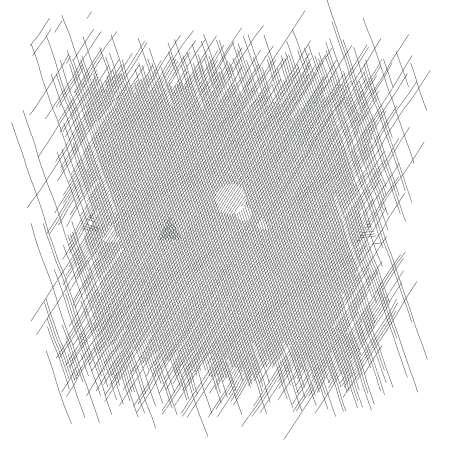

Chapter 5. Control Operations
=============================

This chapter introduces the syntactic forms and procedures that serve as
control structures for Scheme programs, The first section covers the
most basic control structure, procedure application, and the remaining
sections cover sequencing, conditional evaluation, recursion, mapping,
continuations, delayed evaluation, multiple values, and evaluation of
programs constructed at run time.

### Section 5.1. Procedure Application

**syntax**: `(expr0 expr1 ...)` \
 **returns:**values of applying the value of `expr0` to the values of
`expr1 ...`

Procedure application is the most basic Scheme control structure. Any
structured form without a syntax keyword in the first position is a
procedure application. The expressions `expr0` and `expr1 ...` are
evaluated; each should evaluate to a single value. After each of these
expressions has been evaluated, the value of `expr0` is applied to the
values of `expr1 ...`. If `expr0` does not evaluate to a procedure, or
if the procedure does not accept the number of arguments provided, an
exception with condition type `&assertion` is raised.

The order in which the procedure and argument expressions are evaluated
is unspecified. It may be left to right, right to left, or any other
order. The evaluation is guaranteed to be sequential, however: whatever
order is chosen, each expression is fully evaluated before evaluation of
the next is started.

`(+ 3 4) `$\Rightarrow$` 7 ` 
`((if (odd? 3) + -) 6 2) `$\Rightarrow$` 8 ` 
`((lambda (x) x) 5) `$\Rightarrow$` 5 ` 
`(let ([f (lambda (x) (+ x x))])` 
`  (f 8)) `$\Rightarrow$` 16`

**procedure**: `(apply procedure obj ... list)` \
 **returns:**the values of applying `procedure` to `obj ...` and the
elements of `list` \
 **libraries:**`(rnrs base)`, `(rnrs)`

`apply` invokes `procedure`, passing the first `obj` as the first
argument, the second `obj` as the second argument, and so on for each
object in `obj ...`, and passing the elements of `list` in order as the
remaining arguments. Thus, `procedure` is called with as many arguments
as there are `objs` plus elements of `list`.

`apply` is useful when some or all of the arguments to be passed to a
procedure are in a list, since it frees the programmer from explicitly
destructuring the list.

`(apply + '(4 5)) `$\Rightarrow$` 9 ` 
`(apply min '(6 8 3 2 5)) `$\Rightarrow$` 2 ` 
`(apply min  5 1 3 '(6 8 3 2 5)) `$\Rightarrow$` 1 ` 
`(apply vector 'a 'b '(c d e)) `$\Rightarrow$` #(a b c d e) ` 
`(define first` 
`  (lambda (ls)` 
`    (apply (lambda (x . y) x) ls)))` 
`(define rest` 
`  (lambda (ls)` 
`    (apply (lambda (x . y) y) ls)))` 
`(first '(a b c d)) `$\Rightarrow$` a` 
`(rest '(a b c d)) `$\Rightarrow$` (b c d) ` 
`(apply append` 
`  '(1 2 3)` 
`  '((a b) (c d e) (f))) `$\Rightarrow$` (1 2 3 a b c d e f)`

### Section 5.2. Sequencing

**syntax**: `(begin expr1 expr2 ...)` \
 **returns:**the values of the last subexpression \
 **libraries:**`(rnrs base)`, `(rnrs)`

The expressions `expr1 expr2 ...` are evaluated in sequence from left to
right. `begin` is used to sequence assignments, input/output, or other
operations that cause side effects.

`(define x 3)` 
`(begin` 
`  (set! x (+ x 1))` 
`  (+ x x)) `$\Rightarrow$` 8`

A `begin` form may contain zero or more definitions in place of the
expressions `expr1 expr2 ...`, in which case it is considered to be a
definition and may appear only where definitions are valid.

`(let ()` 
`  (begin (define x 3) (define y 4))` 
`  (+ x y)) `$\Rightarrow$` 7`

This form of `begin` is primarily used by syntactic extensions that must
expand into multiple definitions. (See
page [101](binding.html#multi-define-syntax).)

The bodies of many syntactic forms, including `lambda`, `case-lambda`,
`let`, `let*`, `letrec`, and `letrec*`, as well as the result clauses of
`cond`, `case`, and `do`, are treated as if they were inside an implicit
`begin`; i.e., the expressions making up the body or result clause are
executed in sequence, with the values of the last expression being
returned.

`(define swap-pair!` 
`  (lambda (x)` 
`    (let ([temp (car x)])` 
`      (set-car! x (cdr x))` 
`      (set-cdr! x temp)` 
`      x)))` 
`(swap-pair! (cons 'a 'b)) `$\Rightarrow$` (b . a)`

### Section 5.3. Conditionals

**syntax**: `(if test consequent alternative)` \
 **syntax**: `(if test consequent)` \
 **returns:**the values of `consequent` or `alternative` depending on
the value of `test` \
 **libraries:**`(rnrs base)`, `(rnrs)`

The `test`, `consequent`, and `alternative` subforms must be
expressions. If `test` evaluates to a true value (anything other than
`#f`), `consequent` is evaluated and its values are returned. Otherwise,
`alternative` is evaluated and its values are returned. With the second,
"one-armed," form, which has no `alternative`, the result is unspecified
if `test` evaluates to false.

`(let ([ls '(a b c)])` 
`  (if (null? ls)` 
`      '()` 
`      (cdr ls))) `$\Rightarrow$` (b c) ` 
`(let ([ls '()])` 
`  (if (null? ls)` 
`      '()` 
`      (cdr ls))) `$\Rightarrow$` () ` 
`(let ([abs` 
`       (lambda (x)` 
`         (if (< x 0)` 
`             (- 0 x)` 
`             x))])` 
`  (abs -4)) `$\Rightarrow$` 4 ` 
`(let ([x -4])` 
`  (if (< x 0)` 
`      (list 'minus (- 0 x))` 
`      (list 'plus 4))) `$\Rightarrow$` (minus 4)`

**procedure**: `(not obj)` \
 **returns:**`#t` if `obj` is false, `#f` otherwise \
 **libraries:**`(rnrs base)`, `(rnrs)`

`not` is equivalent to `(lambda (x) (if x #f #t))`.

`(not #f) `$\Rightarrow$` #t` 
`(not #t) `$\Rightarrow$` #f` 
`(not '()) `$\Rightarrow$` #f` 
`(not (< 4 5)) `$\Rightarrow$` #f`

**syntax**: `(and expr ...)` \
 **returns:**see below \
 **libraries:**`(rnrs base)`, `(rnrs)`

If no subexpressions are present, the `and` form evaluates to `#t`.
Otherwise, `and` evaluates each subexpression in sequence from left to
right until only one subexpression remains or a subexpression returns
`#f`. If one subexpression remains, it is evaluated and its values are
returned. If a subexpression returns `#f`, `and` returns `#f` without
evaluating the remaining subexpressions. A syntax definition of `and`
appears on page [62](further.html#defn:and).

`(let ([x 3])` 
`  (and (> x 2) (< x 4))) `$\Rightarrow$` #t ` 
`(let ([x 5])` 
`  (and (> x 2) (< x 4))) `$\Rightarrow$` #f ` 
`(and #f '(a b) '(c d)) `$\Rightarrow$` #f` 
`(and '(a b) '(c d) '(e f)) `$\Rightarrow$` (e f)`

**syntax**: `(or expr ...)` \
 **returns:**see below \
 **libraries:**`(rnrs base)`, `(rnrs)`

If no subexpressions are present, the `or` form evaluates to `#f`.
Otherwise, `or` evaluates each subexpression in sequence from left to
right until only one subexpression remains or a subexpression returns a
value other than `#f`. If one subexpression remains, it is evaluated and
its values are returned. If a subexpression returns a value other than
`#f`, `or` returns that value without evaluating the remaining
subexpressions. A syntax definition of `or` appears on
page [63](further.html#defn:or).

`(let ([x 3])` 
`  (or (< x 2) (> x 4))) `$\Rightarrow$` #f ` 
`(let ([x 5])` 
`  (or (< x 2) (> x 4))) `$\Rightarrow$` #t ` 
`(or #f '(a b) '(c d)) `$\Rightarrow$` (a b)`

**syntax**: `(cond clause1 clause2 ...)` \
 **returns:**see below \
 **libraries:**`(rnrs base)`, `(rnrs)`

Each `clause` but the last must take one of the forms below.

`(test)` 
`(test expr1 expr2 ...)` 
`(test => expr)`

The last clause may be in any of the above forms, or it may be an
"`else` clause" of the form

`(else expr1 expr2 ...)`

Each `test` is evaluated in order until one evaluates to a true value or
until all of the tests have been evaluated. If the first clause whose
`test` evaluates to a true value is in the first form given above, the
value of `test` is returned.

If the first clause whose `test` evaluates to a true value is in the
second form given above, the expressions `expr1 expr2...` are evaluated
in sequence and the values of the last expression are returned.

If the first clause whose `test` evaluates to a true value is in the
third form given above, the expression `expr` is evaluated. The value
should be a procedure of one argument, which is applied to the value of
`test`. The values of this application are returned.

If none of the tests evaluates to a true value and an `else` clause is
present, the expressions `expr1 expr2 ...` of the `else` clause are
evaluated in sequence and the values of the last expression are
returned.

If none of the tests evaluates to a true value and no `else` clause is
present, the value or values are unspecified.

See page [305](syntax.html#defn:cond) for a syntax definition of `cond`.

`(let ([x 0])` 
`  (cond` 
`    [(< x 0) (list 'minus (abs x))]` 
`    [(> x 0) (list 'plus x)]` 
`    [else (list 'zero x)])) `$\Rightarrow$` (zero 0) ` 
`(define select` 
`  (lambda (x)` 
`    (cond` 
`      [(not (symbol? x))]` 
`      [(assq x '((a . 1) (b . 2) (c . 3))) => cdr]` 
`      [else 0]))) ` 
`(select 3) `$\Rightarrow$` #t` 
`(select 'b) `$\Rightarrow$` 2` 
`(select 'e) `$\Rightarrow$` 0`

**syntax**: `else` \
 **syntax**: `=>` \
 **libraries:**`(rnrs base)`, `(rnrs exceptions)`, `(rnrs)`

These identifiers are auxiliary keywords for `cond`. Both also serve as
auxiliary keywords for `guard`, and `else` also serves as an auxiliary
keyword for `case`. It is a syntax violation to reference these
identifiers except in contexts where they are recognized as auxiliary
keywords.

**syntax**: `(when test-expr expr1 expr2 ...)` \
 **syntax**: `(unless test-expr expr1 expr2 ...)` \
 **returns:**see below \
 **libraries:**`(rnrs control)`, `(rnrs)`

For `when`, if `test-expr` evaluates to a true value, the expressions
`expr1 expr2 ...` are evaluated in sequence, and the values of the last
expression are returned. If `test-expr` evaluates to false, none of the
other expressions are evaluated, and the value or values of `when` are
unspecified.

For `unless`, if `test-expr` evaluates to false, the expressions
`expr1 expr2 ...` are evaluated in sequence, and the values of the last
expression are returned. If `test-expr` evaluates to a true value, none
of the other expressions are evaluated, and the value or values of
`unless` are unspecified.

A `when` or `unless` expression is usually clearer than the
corresponding "one-armed" `if` expression.

`(let ([x -4] [sign 'plus])` 
`  (when (< x 0)` 
`    (set! x (- 0 x))` 
`    (set! sign 'minus))` 
`  (list sign x)) `$\Rightarrow$` (minus 4) ` 
`(define check-pair` 
`  (lambda (x)` 
`    (unless (pair? x)` 
`      (syntax-violation 'check-pair "invalid argument" x))` 
`    x)) ` 
`(check-pair '(a b c)) `$\Rightarrow$` (a b c)`

`when` may be defined as follows:

`(define-syntax when` 
`  (syntax-rules ()` 
`    [(_ e0 e1 e2 ...)` 
`     (if e0 (begin e1 e2 ...))]))`

`unless` may be defined as follows:

`(define-syntax unless` 
`  (syntax-rules ()` 
`    [(_ e0 e1 e2 ...)` 
`     (if (not e0) (begin e1 e2 ...))]))`

or in terms of `when` as follows:

`(define-syntax unless` 
`  (syntax-rules ()` 
`    [(_ e0 e1 e2 ...)` 
`     (when (not e0) e1 e2 ...)]))`

**syntax**: `(case expr0 clause1 clause2 ...)` \
 **returns:**see below \
 **libraries:**`(rnrs base)`, `(rnrs)`

Each clause but the last must take the form

`((key ...) expr1 expr2 ...)`

where each `key` is a datum distinct from the other keys. The last
clause may be in the above form or it may be an `else` clause of the
form

`(else expr1 expr2 ...)`

`expr0` is evaluated and the result is compared (using `eqv?`) against
the keys of each clause in order. If a clause containing a matching key
is found, the expressions `expr1 expr2 ...` are evaluated in sequence
and the values of the last expression are returned.

If none of the clauses contains a matching key and an `else` clause is
present, the expressions `expr1 expr2 ...` of the `else` clause are
evaluated in sequence and the values of the last expression are
returned.

If none of the clauses contains a matching key and no `else` clause is
present, the value or values are unspecified.

See page [306](syntax.html#defn:case) for a syntax definition of `case`.

`(let ([x 4] [y 5])` 
`  (case (+ x y)` 
`    [(1 3 5 7 9) 'odd]` 
`    [(0 2 4 6 8) 'even]` 
`    [else 'out-of-range])) `$\Rightarrow$` odd`

### Section 5.4. Recursion and Iteration

**syntax**: `(let name ((var expr) ...) body1 body2 ...)` \
 **returns:**values of the final body expression \
 **libraries:**`(rnrs base)`, `(rnrs)`

This form of `let`, called `named` `let`, is a general-purpose iteration
and recursion construct. It is similar to the more common form of `let`
(see Section [4.4](binding.html#g92)) in the binding of the variables
`var ...` to the values of `expr ...` within the body `body1 body2 ...`,
which is processed and evaluated like a `lambda` body. In addition, the
variable `name` is bound within the body to a procedure that may be
called to recur or iterate; the arguments to the procedure become the
new values of the variables `var ...`.

A named `let` expression of the form

`(let name ((var expr) ...)` 
`  body1 body2 ...)`

can be rewritten with `letrec` as follows.

`((letrec ((name (lambda (var ...) body1 body2 ...)))` 
`   name)` 
` expr ...)`

A syntax definition of `let` that implements this transformation and
handles unnamed `let` as well can be found on
page [312](syntax.html#defn:let).

The procedure `divisors` defined below uses named `let` to compute the
nontrivial divisors of a nonnegative integer.

`(define divisors` 
`  (lambda (n)` 
`    (let f ([i 2])` 
`      (cond` 
`        [(>= i n) '()]` 
`        [(integer? (/ n i)) (cons i (f (+ i 1)))]` 
`        [else (f (+ i 1))])))) ` 
`(divisors 5) `$\Rightarrow$` ()` 
`(divisors 32) `$\Rightarrow$` (2 4 8 16)`

The version above is non-tail-recursive when a divisor is found and
tail-recursive when a divisor is not found. The version below is fully
tail-recursive. It builds up the list in reverse order, but this is easy
to remedy, if desired, by reversing the list on exit.

`(define divisors` 
`  (lambda (n)` 
`    (let f ([i 2] [ls '()])` 
`      (cond` 
`        [(>= i n) ls]` 
`        [(integer? (/ n i)) (f (+ i 1) (cons i ls))]` 
`        [else (f (+ i 1) ls)]))))`

**syntax**: `(do ((var init update) ...) (test result ...) expr ...)` \
 **returns:**the values of the last `result` expression \
 **libraries:**`(rnrs control)`, `(rnrs)`

`do` allows a common restricted form of iteration to be expressed
succinctly. The variables `var ...` are bound initially to the values of
`init ...` and are rebound on each subsequent iteration to the values of
`update ...`. The expressions `test`, `update ...`, `expr ...`, and
`result ...` are all within the scope of the bindings established for
`var ...`.

On each step, the test expression `test` is evaluated. If the value of
`test` is true, iteration ceases, the expressions `result ...` are
evaluated in sequence, and the values of the last expression are
returned. If no result expressions are present, the value or values of
the `do` expression are unspecified.

If the value of `test` is false, the expressions `expr ...` are
evaluated in sequence, the expressions `update ...` are evaluated, new
bindings for `var ...` to the values of `update ...` are created, and
iteration continues.

The expressions `expr ...` are evaluated only for effect and are often
omitted entirely. Any `update` expression may be omitted, in which case
the effect is the same as if the `update` were simply the corresponding
`var`.

Although looping constructs in most languages require that the loop
iterands be updated via assignment, `do` requires the loop iterands
`var ...` to be updated via rebinding. In fact, no side effects are
involved in the evaluation of a `do` expression unless they are
performed explicitly by its subexpressions.

See page [313](syntax.html#defn:do) for a syntax definition of `do`.

The definitions of `factorial` and `fibonacci` below are straightforward
translations of the tail-recursive named-`let` versions given in
Section [3.2](further.html#g55).

`(define factorial` 
`  (lambda (n)` 
`    (do ([i n (- i 1)] [a 1 (* a i)])` 
`        ((zero? i) a)))) ` 
`(factorial 10) `$\Rightarrow$` 3628800 ` 
`(define fibonacci` 
`  (lambda (n)` 
`    (if (= n 0)` 
`        0` 
`        (do ([i n (- i 1)] [a1 1 (+ a1 a2)] [a2 0 a1])` 
`            ((= i 1) a1))))) ` 
`(fibonacci 6) `$\Rightarrow$` 8`

The definition of `divisors` below is similar to the tail-recursive
definition of `divisors` given with the description of named `let`
above.

`(define divisors` 
`  (lambda (n)` 
`    (do ([i 2 (+ i 1)]` 
`         [ls '()` 
`             (if (integer? (/ n i))` 
`                 (cons i ls)` 
`                 ls)])` 
`        ((>= i n) ls))))`

The definition of `scale-vector!` below, which scales each element of a
vector *v* by a constant *k*, demonstrates a nonempty `do` body.

`(define scale-vector!` 
`  (lambda (v k)` 
`    (let ([n (vector-length v)])` 
`      (do ([i 0 (+ i 1)])` 
`          ((= i n))` 
`        (vector-set! v i (* (vector-ref v i) k)))))) ` 
`(define vec (vector 1 2 3 4 5))` 
`(scale-vector! vec 2)` 
`vec `$\Rightarrow$` #(2 4 6 8 10)`

### Section 5.5. Mapping and Folding

When a program must recur or iterate over the elements of a list, a
mapping or folding operator is often more convenient. These operators
abstract away from null checks and explicit recursion by applying a
procedure to the elements of the list one by one. A few mapping
operators are also available for vectors and strings.

**procedure**: `(map procedure list1 list2 ...)` \
 **returns:**list of results \
 **libraries:**`(rnrs base)`, `(rnrs)`

`map` applies `procedure` to corresponding elements of the lists
`list1 list2 ...` and returns a list of the resulting values. The lists
`list1 list2 ...` must be of the same length. `procedure` should accept
as many arguments as there are lists, should return a single value, and
should not mutate the `list` arguments.

`(map abs '(1 -2 3 -4 5 -6)) `$\Rightarrow$` (1 2 3 4 5 6) ` 
`(map (lambda (x y) (* x y))` 
`     '(1 2 3 4)` 
`     '(8 7 6 5)) `$\Rightarrow$` (8 14 18 20)`

While the order in which the applications themselves occur is not
specified, the order of the values in the output list is the same as
that of the corresponding values in the input lists.

`map` might be defined as follows.

`(define map` 
`  (lambda (f ls . more)` 
`    (if (null? more)` 
`        (let map1 ([ls ls])` 
`          (if (null? ls)` 
`              '()` 
`              (cons (f (car ls))` 
`                    (map1 (cdr ls)))))` 
`        (let map-more ([ls ls] [more more])` 
`          (if (null? ls)` 
`              '()` 
`              (cons` 
`                (apply f (car ls) (map car more))` 
`                (map-more (cdr ls) (map cdr more))))))))`

No error checking is done by this version of `map`; `f` is assumed to be
a procedure and the other arguments are assumed to be proper lists of
the same length. An interesting feature of this definition is that `map`
uses itself to pull out the cars and cdrs of the list of input lists;
this works because of the special treatment of the single-list case.

**procedure**: `(for-each procedure list1 list2 ...)` \
 **returns:**unspecified \
 **libraries:**`(rnrs base)`, `(rnrs)`

`for-each` is similar to `map` except that `for-each` does not create
and return a list of the resulting values, and `for-each` guarantees to
perform the applications in sequence over the elements from left to
right. `procedure` should accept as many arguments as there are lists
and should not mutate the `list` arguments. `for-each` may be defined
without error checks as follows.

`(define for-each` 
`  (lambda (f ls . more)` 
`    (do ([ls ls (cdr ls)] [more more (map cdr more)])` 
`        ((null? ls))` 
`      (apply f (car ls) (map car more))))) ` 
`(let ([same-count 0])` 
`  (for-each` 
`    (lambda (x y)` 
`      (when (= x y)` 
`        (set! same-count (+ same-count 1))))` 
`    '(1 2 3 4 5 6)` 
`    '(2 3 3 4 7 6))` 
`  same-count) `$\Rightarrow$` 3`

**procedure**: `(exists procedure list1 list2 ...)` \
 **returns:**see below \
 **libraries:**`(rnrs lists)`, `(rnrs)`

The lists `list1 list2 ...` must be of the same length. `procedure`
should accept as many arguments as there are lists and should not mutate
the `list` arguments. If the lists are empty, `exists` returns `#f`.
Otherwise, `exists` applies `procedure` to corresponding elements of the
lists `list1 list2 ...` in sequence until either the lists each have
only one element or `procedure` returns a true value `t`. In the former
case, `exists` tail-calls `procedure`, applying it to the remaining
element of each list. In the latter case, `exists` returns `t`.

`(exists symbol? '(1.0 #\a "hi" '())) `$\Rightarrow$` #f ` 
`(exists member` 
`        '(a b c)` 
`        '((c b) (b a) (a c))) `$\Rightarrow$` (b a) ` 
`(exists (lambda (x y z) (= (+ x y) z))` 
`        '(1 2 3 4)` 
`        '(1.2 2.3 3.4 4.5)` 
`        '(2.3 4.4 6.4 8.6)) `$\Rightarrow$` #t`

`exists` may be defined (somewhat inefficiently and without error
checks) as follows:

`(define exists` 
`  (lambda (f ls . more)` 
`    (and (not (null? ls))` 
`      (let exists ([x (car ls)] [ls (cdr ls)] [more more])` 
`        (if (null? ls)` 
`            (apply f x (map car more))` 
`            (or (apply f x (map car more))` 
`                (exists (car ls) (cdr ls) (map cdr more))))))))`

**procedure**: `(for-all procedure list1 list2 ...)` \
 **returns:**see below \
 **libraries:**`(rnrs lists)`, `(rnrs)`

The lists `list1 list2 ...` must be of the same length. `procedure`
should accept as many arguments as there are lists and should not mutate
the `list` arguments. If the lists are empty, `for-all` returns `#t`.
Otherwise, `for-all` applies `procedure` to corresponding elements of
the lists `list1 list2 ...` in sequence until either the lists each have
only one element left or `procedure` returns `#f`. In the former case,
`for-all` tail-calls `procedure`, applying it to the remaining element
of each list. In the latter case, `for-all` returns `#f`.

`(for-all symbol? '(a b c d)) `$\Rightarrow$` #t ` 
`(for-all =` 
`         '(1 2 3 4)` 
`         '(1.0 2.0 3.0 4.0)) `$\Rightarrow$` #t ` 
`(for-all (lambda (x y z) (= (+ x y) z))` 
`         '(1 2 3 4)` 
`         '(1.2 2.3 3.4 4.5)` 
`         '(2.2 4.3 6.5 8.5)) `$\Rightarrow$` #f`

`for-all` may be defined (somewhat inefficiently and without error
checks) as follows:

`(define for-all` 
`  (lambda (f ls . more)` 
`    (or (null? ls)` 
`      (let for-all ([x (car ls)] [ls (cdr ls)] [more more])` 
`        (if (null? ls)` 
`            (apply f x (map car more))` 
`            (and (apply f x (map car more))` 
`                 (for-all (car ls) (cdr ls) (map cdr more))))))))`

**procedure**: `(fold-left procedure obj list1 list2 ...)` \
 **returns:**see below \
 **libraries:**`(rnrs lists)`, `(rnrs)`

The `list` arguments should all have the same length. `procedure` should
accept one more argument than the number of `list` arguments and return
a single value. It should not mutate the `list` arguments.

`fold-left` returns `obj` if the `list` arguments are empty. If they are
not empty, `fold-left` applies `procedure` to `obj` and the cars of
`list1 list2 ...`, then recurs with the value returned by `procedure` in
place of `obj` and the cdr of each `list` in place of the `list`.

`(fold-left cons '() '(1 2 3 4)) `$\Rightarrow$` ((((() . 1) . 2) . 3) . 4) ` 
`(fold-left` 
`  (lambda (a x) (+ a (* x x)))` 
`  0 '(1 2 3 4 5)) `$\Rightarrow$` 55 ` 
`(fold-left` 
`  (lambda (a . args) (append args a))` 
`  '(question)` 
`  '(that not to)` 
`  '(is to be)` 
`  '(the be: or)) `$\Rightarrow$` (to be or not to be: that is the question)`

**procedure**: `(fold-right procedure obj list1 list2 ...)` \
 **returns:**see below \
 **libraries:**`(rnrs lists)`, `(rnrs)`

The `list` arguments should all have the same length. `procedure` should
accept one more argument than the number of `list` arguments and return
a single value. It should not mutate the `list` arguments.

`fold-right` returns `obj` if the `list` arguments are empty. If they
are not empty, `fold-right` recurs with the cdr of each `list` replacing
the `list`, then applies `procedure` to the cars of `list1 list2 ...`
and the result returned by the recursion.

`(fold-right cons '() '(1 2 3 4)) `$\Rightarrow$` (1 2 3 4) ` 
`(fold-right` 
`  (lambda (x a) (+ a (* x x)))` 
`  0 '(1 2 3 4 5)) `$\Rightarrow$` 55 ` 
`(fold-right` 
`  (lambda (x y a) (cons* x y a))    (parting is such sweet sorrow` 
`  '((with apologies))                gotta go see ya tomorrow` 
`  '(parting such sorrow go ya)       (with apologies))` 
`  '(is sweet gotta see tomorrow))`

**procedure**: `(vector-map procedure vector1 vector1 ...)` \
 **returns:**vector of results \
 **libraries:**`(rnrs base)`, `(rnrs)`

`vector-map` applies `procedure` to corresponding elements of
`vector1 vector2 ...` and returns a vector of the resulting values. The
vectors `vector1 vector2 ...` must be of the same length, and
`procedure` should accept as many arguments as there are vectors and
return a single value.

`(vector-map abs '#(1 -2 3 -4 5 -6)) `$\Rightarrow$` #(1 2 3 4 5 6)` 
`(vector-map (lambda (x y) (* x y))` 
`  '#(1 2 3 4)` 
`  '#(8 7 6 5)) `$\Rightarrow$` #(8 14 18 20)`

While the order in which the applications themselves occur is not
specified, the order of the values in the output vector is the same as
that of the corresponding values in the input vectors.

**procedure**: `(vector-for-each procedure vector1 vector2 ...)` \
 **returns:**unspecified \
 **libraries:**`(rnrs base)`, `(rnrs)`

`vector-for-each` is similar to `vector-map` except that
`vector-for-each` does not create and return a vector of the resulting
values, and `vector-for-each` guarantees to perform the applications in
sequence over the elements from left to right.

`(let ([same-count 0])` 
`  (vector-for-each` 
`    (lambda (x y)` 
`      (when (= x y)` 
`        (set! same-count (+ same-count 1))))` 
`    '#(1 2 3 4 5 6)` 
`    '#(2 3 3 4 7 6))` 
`  same-count) `$\Rightarrow$` 3`

**procedure**: `(string-for-each procedure string1 string2 ...)` \
 **returns:**unspecified \
 **libraries:**`(rnrs base)`, `(rnrs)`

`string-for-each` is similar to `for-each` and `vector-for-each` except
that the inputs are strings rather than lists or vectors.

`(let ([ls '()])` 
`  (string-for-each` 
`    (lambda r (set! ls (cons r ls)))` 
`    "abcd"` 
`    "===="` 
`    "1234")` 
`  (map list->string (reverse ls))) `$\Rightarrow$` ("a=1" "b=2" "c=3" "d=4")`

### Section 5.6. Continuations

Continuations in Scheme are procedures that represent the remainder of a
computation from a given point in the computation. They may be obtained
with `call-with-current-continuation`, which can be abbreviated to
`call/cc`.

**procedure**: `(call/cc procedure)` \
 **procedure**: `(call-with-current-continuation procedure)` \
 **returns:**see below \
 **libraries:**`(rnrs base)`, `(rnrs)`

These procedures are the same. The shorter name is often used for the
obvious reason that it requires fewer keystrokes to type.

`call/cc` obtains its continuation and passes it to `procedure`, which
should accept one argument. The continuation itself is represented by a
procedure. Each time this procedure is applied to zero or more values,
it returns the values to the continuation of the `call/cc` application.
That is, when the continuation procedure is called, it returns its
arguments as the values of the application of `call/cc`.

If `procedure` returns normally when passed the continuation procedure,
the values returned by `call/cc` are the values returned by `procedure`.

Continuations allow the implementation of nonlocal exits,
backtracking [[14](bibliography.html#g232),[29](bibliography.html#g247)],
coroutines [[16](bibliography.html#g234)], and
multitasking [[10](bibliography.html#g228),[32](bibliography.html#g250)].

The example below illustrates the use of a continuation to perform a
nonlocal exit from a loop.

`(define member` 
`  (lambda (x ls)` 
`    (call/cc` 
`      (lambda (break)` 
`        (do ([ls ls (cdr ls)])` 
`            ((null? ls) #f)` 
`          (when (equal? x (car ls))` 
`            (break ls))))))) ` 
`(member 'd '(a b c)) `$\Rightarrow$` #f` 
`(member 'b '(a b c)) `$\Rightarrow$` (b c)`

Additional examples are given in Sections [3.3](further.html#g63)
and [12.11](examples.html#g208).

The current continuation is typically represented internally as a stack
of procedure activation records, and obtaining the continuation involves
encapsulating the stack within a procedural object. Since an
encapsulated stack has indefinite extent, some mechanism must be used to
preserve the stack contents indefinitely. This can be done with
surprising ease and efficiency and with no impact on programs that do
not use continuations [[17](bibliography.html#g235)].

**procedure**: `(dynamic-wind in body out)` \
 **returns:**values resulting from the application of `body` \
 **libraries:**`(rnrs base)`, `(rnrs)`

`dynamic-wind` offers "protection" from continuation invocation. It is
useful for performing tasks that must be performed whenever control
enters or leaves `body`, either normally or by continuation application.

The three arguments `in`, `body`, and `out` must be procedures and
should accept zero arguments, i.e., they should be `thunks`. Before
applying `body`, and each time `body` is entered subsequently by the
application of a continuation created within `body`, the `in` thunk is
applied. Upon normal exit from `body` and each time `body` is exited by
the application of a continuation created outside `body`, the `out`
thunk is applied.

Thus, it is guaranteed that `in` is invoked at least once. In addition,
if `body` ever returns, `out` is invoked at least once.

The following example demonstrates the use of `dynamic-wind` to be sure
that an input port is closed after processing, regardless of whether the
processing completes normally.

`(let ([p (open-input-file "input-file")])    (dynamic-wind      (lambda () #f)      (lambda () (process p))      (lambda () (close-port p))))`

Common Lisp provides a similar facility (`unwind-protect`) for
protection from nonlocal exits. This is often sufficient.
`unwind-protect` provides only the equivalent to `out`, however, since
Common Lisp does not support fully general continuations. Here is how
`unwind-protect` might be specified with `dynamic-wind`.

`(define-syntax unwind-protect` 
`  (syntax-rules ()` 
`    [(_ body cleanup ...)` 
`     (dynamic-wind` 
`       (lambda () #f)` 
`       (lambda () body)` 
`       (lambda () cleanup ...))])) ` 
`((call/cc` 
`   (let ([x 'a])` 
`     (lambda (k)` 
`       (unwind-protect` 
`         (k (lambda () x))` 
`         (set! x 'b)))))) `$\Rightarrow$` b`

Some Scheme implementations support a controlled form of assignment
known as *fluid binding*, in which a variable takes on a temporary value
during a given computation and reverts to the old value after the
computation has completed. The syntactic form `fluid-let` defined below
in terms of `dynamic-wind` permits the fluid binding of a single
variable `x` to the value of an expression `e` within a the body
`b1 b2 ...`.

`(define-syntax fluid-let` 
`  (syntax-rules ()` 
`    [(_ ((x e)) b1 b2 ...)` 
`     (let ([y e])` 
`       (let ([swap (lambda () (let ([t x]) (set! x y) (set! y t)))])` 
`         (dynamic-wind swap (lambda () b1 b2 ...) swap)))]))`

Implementations that support `fluid-let` typically extend it to allow an
indefinite number of `(x e)` pairs, as with `let`.

If no continuations are invoked within the body of a `fluid-let`, the
behavior is the same as if the variable were simply assigned the new
value on entry and assigned the old value on return.

`(let ([x 3])` 
`  (+ (fluid-let ([x 5])` 
`       x)` 
`     x)) `$\Rightarrow$` 8`

A fluid-bound variable also reverts to the old value if a continuation
created outside of the `fluid-let` is invoked.

`(let ([x 'a])` 
`  (let ([f (lambda () x)])` 
`    (cons (call/cc` 
`            (lambda (k)` 
`              (fluid-let ([x 'b])` 
`                (k (f)))))` 
`          (f)))) `$\Rightarrow$` (b . a)`

If control has left a `fluid-let` body, either normally or by the
invocation of a continuation, and control reenters the body by the
invocation of a continuation, the temporary value of the fluid-bound
variable is reinstated. Furthermore, any changes to the temporary value
are maintained and reflected upon reentry.

`(define reenter #f)` 
`(define x 0)` 
`(fluid-let ([x 1])` 
`  (call/cc (lambda (k) (set! reenter k)))` 
`  (set! x (+ x 1))` 
`  x)  2` 
`x `$\Rightarrow$` 0` 
`(reenter '*) `$\Rightarrow$` 3` 
`(reenter '*) `$\Rightarrow$` 4` 
`x `$\Rightarrow$` 0`

A library showing how `dynamic-wind` might be implemented were it not
already built in is given below. In addition to defining `dynamic-wind`,
the code defines a version of `call/cc` that does its part to support
`dynamic-wind`.

`(library (dynamic-wind)` 
`  (export dynamic-wind call/cc` 
`    (rename (call/cc call-with-current-continuation)))` 
`  (import (rename (except (rnrs) dynamic-wind) (call/cc rnrs:call/cc))) ` 
`  (define winders '()) ` 
`  (define common-tail` 
`    (lambda (x y)` 
`      (let ([lx (length x)] [ly (length y)])` 
`        (do ([x (if (> lx ly) (list-tail x (- lx ly)) x) (cdr x)]` 
`             [y (if (> ly lx) (list-tail y (- ly lx)) y) (cdr y)])` 
`            ((eq? x y) x))))) ` 
`  (define do-wind` 
`    (lambda (new)` 
`      (let ([tail (common-tail new winders)])` 
`        (let f ([ls winders])` 
`          (if (not (eq? ls tail))` 
`              (begin` 
`                (set! winders (cdr ls))` 
`                ((cdar ls))` 
`                (f (cdr ls)))))` 
`        (let f ([ls new])` 
`          (if (not (eq? ls tail))` 
`              (begin` 
`                (f (cdr ls))` 
`                ((caar ls))` 
`                (set! winders ls)))))))`

`  (define call/cc` 
`    (lambda (f)` 
`      (rnrs:call/cc` 
`        (lambda (k)` 
`          (f (let ([save winders])` 
`               (lambda (x)` 
`                 (unless (eq? save winders) (do-wind save))` 
`                 (k x)))))))) ` 
`  (define dynamic-wind` 
`    (lambda (in body out)` 
`      (in)` 
`      (set! winders (cons (cons in out) winders))` 
`      (let-values ([ans* (body)])` 
`        (set! winders (cdr winders))` 
`        (out)` 
`        (apply values ans*)))))`

Together, `dynamic-wind` and `call/cc` manage a list of *winders*. A
winder is a pair of *in* and *out* thunks established by a call to
`dynamic-wind`. Whenever `dynamic-wind` is invoked, the *in* thunk is
invoked, a new winder containing the *in* and *out* thunks is placed on
the winders list, the *body* thunk is invoked, the winder is removed
from the winders list, and the *out* thunk is invoked. This ordering
ensures that the winder is on the winders list only when control has
passed through *in* and not yet entered *out*. Whenever a continuation
is obtained, the winders list is saved, and whenever the continuation is
invoked, the saved winders list is reinstated. During reinstatement, the
*out* thunk of each winder on the current winders list that is not also
on the saved winders list is invoked, followed by the *in* thunk of each
winder on the saved winders list that is not also on the current winders
list. The winders list is updated incrementally, again to ensure that a
winder is on the current winders list only if control has passed through
its *in* thunk and not entered its *out* thunk.

The test `(not (eq? save winders))` performed in `call/cc` is not
strictly necessary but makes invoking a continuation less costly
whenever the saved winders list is the same as the current winders list.

### Section 5.7. Delayed Evaluation

The syntactic form `delay` and the procedure `force` may be used in
combination to implement *lazy evaluation*. An expression subject to
lazy evaluation is not evaluated until its value is required and, once
evaluated, is never reevaluated.

**syntax**: `(delay expr)` \
 **returns:**a promise \
 **procedure**: `(force promise)` \
 **returns:**result of forcing `promise` \
 **libraries:**`(rnrs r5rs)`

The first time a promise created by `delay` is *forced* (with `force`),
it evaluates `expr`, "remembering" the resulting value. Thereafter, each
time the promise is forced, it returns the remembered value instead of
reevaluating `expr`.

`delay` and `force` are typically used only in the absence of side
effects, e.g., assignments, so that the order of evaluation is
unimportant.

The benefit of using `delay` and `force` is that some amount of
computation might be avoided altogether if it is delayed until
absolutely required. Delayed evaluation may be used to construct
conceptually infinite lists, or *streams*. The example below shows how a
stream abstraction may be built with `delay` and `force`. A stream is a
promise that, when forced, returns a pair whose cdr is a stream.

`(define stream-car` 
`  (lambda (s)` 
`    (car (force s)))) ` 
`(define stream-cdr` 
`  (lambda (s)` 
`    (cdr (force s)))) ` 
`(define counters` 
`  (let next ([n 1])` 
`    (delay (cons n (next (+ n 1)))))) ` 
`(stream-car counters) `$\Rightarrow$` 1 ` 
`(stream-car (stream-cdr counters)) `$\Rightarrow$` 2 ` 
`(define stream-add` 
`  (lambda (s1 s2)` 
`    (delay (cons` 
`             (+ (stream-car s1) (stream-car s2))` 
`             (stream-add (stream-cdr s1) (stream-cdr s2)))))) ` 
`(define even-counters` 
`  (stream-add counters counters)) ` 
`(stream-car even-counters) `$\Rightarrow$` 2 ` 
`(stream-car (stream-cdr even-counters)) `$\Rightarrow$` 4`

`delay` may be defined by

`(define-syntax delay` 
`  (syntax-rules ()` 
`    [(_ expr) (make-promise (lambda () expr))]))`

where `make-promise` might be defined as follows.

`(define make-promise` 
`  (lambda (p)` 
`    (let ([val #f] [set? #f])` 
`      (lambda ()` 
`        (unless set?` 
`          (let ([x (p)])` 
`            (unless set?` 
`              (set! val x)` 
`              (set! set? #t))))` 
`        val))))`

With this definition of `delay`, `force` simply invokes the promise to
force evaluation or to retrieve the saved value.

`(define force` 
`  (lambda (promise)` 
`    (promise)))`

The second test of the variable `set?` in `make-promise` is necessary in
the event that, as a result of applying `p`, the promise is recursively
forced. Since a promise must always return the same value, the result of
the first application of `p` to complete is returned.

Whether `delay` and `force` handle multiple return values is
unspecified; the implementation given above does not, but the following
version does, with the help of `call-with-values` and `apply`.

`(define make-promise` 
`  (lambda (p)` 
`    (let ([vals #f] [set? #f])` 
`      (lambda ()` 
`        (unless set?` 
`          (call-with-values p` 
`            (lambda x` 
`              (unless set?` 
`                (set! vals x)` 
`                (set! set? #t)))))` 
`        (apply values vals))))) ` 
`(define p (delay (values 1 2 3)))` 
`(force p) `$\Rightarrow$` 1` 
`           2` 
`           3` 
`(call-with-values (lambda () (force p)) +) `$\Rightarrow$` 6`

Neither implementation is quite right, since `force` must raise an
exception with condition type `&assertion` if its argument is not a
promise. Since distinguishing procedures created by `make-promise` from
other procedures is impossible, `force` cannot do so reliably. The
following reimplementation of `make-promise` and `force` represents
promises as records of the type `promise` to allow `force` to make the
required check.

`(define-record-type promise` 
`  (fields (immutable p) (mutable vals) (mutable set?))` 
`  (protocol (lambda (new) (lambda (p) (new p #f #f))))) ` 
`(define force` 
`  (lambda (promise)` 
`    (unless (promise? promise)` 
`      (assertion-violation 'promise "invalid argument" promise))` 
`    (unless (promise-set? promise)` 
`      (call-with-values (promise-p promise)` 
`        (lambda x` 
`          (unless (promise-set? promise)` 
`            (promise-vals-set! promise x)` 
`            (promise-set?-set! promise #t)))))` 
`    (apply values (promise-vals promise))))`

### Section 5.8. Multiple Values

While all Scheme primitives and most user-defined procedures return
exactly one value, some programming problems are best solved by
returning zero values, more than one value, or even a variable number of
values. For example, a procedure that partitions a list of values into
two sublists needs to return two values. While it is possible for the
producer of multiple values to package them into a data structure and
for the consumer to extract them, it is often cleaner to use the
built-in multiple-values interface. This interface consists of two
procedures: `values` and `call-with-values`. The former produces
multiple values and the latter links procedures that produce
multiple-value values with procedures that consume them.

**procedure**: `(values obj ...)` \
 **returns:**`obj ...` \
 **libraries:**`(rnrs base)`, `(rnrs)`

The procedure `values` accepts any number of arguments and simply passes
(returns) the arguments to its continuation.

`(values) ` 
`(values 1) `$\Rightarrow$` 1 ` 
`(values 1 2 3) `$\Rightarrow$` 1` 
`                2` 
`                3 ` 
`(define head&tail` 
`  (lambda (ls)` 
`    (values (car ls) (cdr ls)))) ` 
`(head&tail '(a b c)) `$\Rightarrow$` a` 
`                      (b c)`

**procedure**: `(call-with-values producer consumer)` \
 **returns:**see below \
 **libraries:**`(rnrs base)`, `(rnrs)`

`producer` and `consumer` must be procedures. `call-with-values` applies
`consumer` to the values returned by invoking `producer` without
arguments.

`(call-with-values` 
`  (lambda () (values 'bond 'james))` 
`  (lambda (x y) (cons y x))) `$\Rightarrow$` (james . bond) ` 
`(call-with-values values list) `$\Rightarrow$` '()`

In the second example, `values` itself serves as the producer. It
receives no arguments and thus returns no values. `list` is thus applied
to no arguments and so returns the empty list.

The procedure `dxdy` defined below computes the change in `x` and `y`
coordinates for a pair of points whose coordinates are represented by
`(x . y)` pairs.

`(define dxdy` 
`  (lambda (p1 p2)` 
`    (values (- (car p2) (car p1))` 
`            (- (cdr p2) (cdr p1))))) ` 
`(dxdy '(0 . 0) '(0 . 5)) `$\Rightarrow$` 0` 
`                          5`

`dxdy` can be used to compute the length and slope of a segment
represented by two endpoints.

`(define segment-length` 
`  (lambda (p1 p2)` 
`    (call-with-values` 
`      (lambda () (dxdy p1 p2))` 
`      (lambda (dx dy) (sqrt (+ (* dx dx) (* dy dy))))))) ` 
`(define segment-slope` 
`  (lambda (p1 p2)` 
`    (call-with-values` 
`      (lambda () (dxdy p1 p2))` 
`      (lambda (dx dy) (/ dy dx))))) ` 
`(segment-length '(1 . 4) '(4 . 8)) `$\Rightarrow$` 5` 
`(segment-slope '(1 . 4) '(4 . 8)) `$\Rightarrow$` 4/3`

We can of course combine these to form one procedure that returns two
values.

`(define describe-segment` 
`  (lambda (p1 p2)` 
`    (call-with-values` 
`      (lambda () (dxdy p1 p2))` 
`      (lambda (dx dy)` 
`        (values` 
`          (sqrt (+ (* dx dx) (* dy dy)))` 
`          (/ dy dx)))))) ` 
`(describe-segment '(1 . 4) '(4 . 8)) `$\Rightarrow$` 5` 
`                                      4/3`

The example below employs multiple values to divide a list
nondestructively into two sublists of alternating elements.

`(define split` 
`  (lambda (ls)` 
`    (if (or (null? ls) (null? (cdr ls)))` 
`        (values ls '())` 
`        (call-with-values` 
`          (lambda () (split (cddr ls)))` 
`          (lambda (odds evens)` 
`            (values (cons (car ls) odds)` 
`                    (cons (cadr ls) evens))))))) ` 
`(split '(a b c d e f)) `$\Rightarrow$` (a c e)` 
`                        (b d f)`

At each level of recursion, the procedure `split` returns two values: a
list of the odd-numbered elements from the argument list and a list of
the even-numbered elements.

The continuation of a call to `values` need not be one established by a
call to `call-with-values`, nor must only `values` be used to return to
a continuation established by `call-with-values`. In particular,
`(values e)` and `e` are equivalent expressions. For example:

`(+ (values 2) 4)  6 ` 
`(if (values #t) 1 2)  1 ` 
`(call-with-values` 
`  (lambda () 4)` 
`  (lambda (x) x)) `$\Rightarrow$` 4`

Similarly, `values` may be used to pass any number of values to a
continuation that ignores the values, as in the following.

`(begin (values 1 2 3) 4) `$\Rightarrow$` 4`

Because a continuation may accept zero or more than one value,
continuations obtained via `call/cc` may accept zero or more than one
argument.

`(call-with-values` 
`  (lambda ()` 
`    (call/cc (lambda (k) (k 2 3))))` 
`  (lambda (x y) (list x y))) `$\Rightarrow$` (2 3)`

The behavior is unspecified when a continuation expecting exactly one
value receives zero values or more than one value. For example, the
behavior of each of the following expressions is unspecified. Some
implementations raise an exception, while others silently suppress
additional values or supply defaults for missing values.

`(if (values 1 2) 'x 'y) ` 
`(+ (values) 5)`

Programs that wish to force extra values to be ignored in particular
contexts can do so easily by calling `call-with-values` explicitly. A
syntactic form, which we might call `first`, can be defined to abstract
the discarding of more than one value when only one is desired.

`(define-syntax first` 
`  (syntax-rules ()` 
`    [(_ expr)` 
`     (call-with-values` 
`       (lambda () expr)` 
`       (lambda (x . y) x))])) ` 
`(if (first (values #t #f)) 'a 'b) `$\Rightarrow$` a`

Since implementations are required to raise an exception with condition
type `&assertion` if a procedure does not accept the number of arguments
passed to it, each of the following raises an exception.

`(call-with-values` 
`  (lambda () (values 2 3 4))` 
`  (lambda (x y) x)) ` 
`(call-with-values` 
`  (lambda () (call/cc (lambda (k) (k 0))))` 
`  (lambda (x y) x))`

Since `producer` is most often a `lambda` expression, it is often
convenient to use a syntactic extension that suppresses the lambda
expression in the interest of readability.

`(define-syntax with-values` 
`  (syntax-rules ()` 
`    [(_ expr consumer)` 
`     (call-with-values (lambda () expr) consumer)])) ` 
`(with-values (values 1 2) list) `$\Rightarrow$` (1 2)` 
`(with-values (split '(1 2 3 4))` 
`  (lambda (odds evens)` 
`    evens)) `$\Rightarrow$` (2 4)`

If the `consumer` is also a `lambda` expression, the multiple-value
variants of `let` and `let*` described in
Section [4.5](binding.html#g93) are usually even more convenient.

`(let-values ([(odds evens) (split '(1 2 3 4))])` 
`  evens) `$\Rightarrow$` (2 4) ` 
`(let-values ([ls (values 'a 'b 'c)])` 
`  ls) `$\Rightarrow$` (a b c)`

Many standard syntactic forms and procedures pass along multiple values.
Most of these are "automatic," in the sense that nothing special must be
done by the implementation to make this happen. The usual expansion of
`let` into a direct `lambda` call automatically propagates multiple
values produced by the body of the `let`. Other operators must be coded
specially to pass along multiple values. The `call-with-port` procedure
(page [7.6](io.html#g127)), for example, calls its procedure argument,
then closes the port argument before returning the procedure's values,
so it must save the values temporarily. This is easily accomplished via
`let-values`, `apply`, and `values`:

`(define call-with-port` 
`  (lambda (port proc)` 
`    (let-values ([val* (proc port)])` 
`      (close-port port)` 
`      (apply values val*))))`

If this seems like too much overhead when a single value is returned,
the code can use `call-with-values` and `case-lambda` to handle the
single-value case more efficiently:

`(define call-with-port` 
`  (lambda (port proc)` 
`    (call-with-values (lambda () (proc port))` 
`      (case-lambda` 
`        [(val) (close-port port) val]` 
`        [val* (close-port port) (apply values val*)]))))`

The definitions of `values` and `call-with-values` (and concomitant
redefinition of `call/cc`) in the library below demonstrate that the
multiple-return-values interface could be implemented in Scheme if it
were not already built in. No error checking can be done, however, for
the case in which more than one value is returned to a single-value
context, such as the test part of an `if` expression.

`(library (mrvs)` 
`  (export call-with-values values call/cc` 
`    (rename (call/cc call-with-current-continuation)))` 
`  (import` 
`    (rename` 
`      (except (rnrs) values call-with-values)` 
`      (call/cc rnrs:call/cc))) ` 
`  (define magic (cons 'multiple 'values)) ` 
`  (define magic?` 
`    (lambda (x)` 
`      (and (pair? x) (eq? (car x) magic))))`

`  (define call/cc` 
`    (lambda (p)` 
`      (rnrs:call/cc` 
`        (lambda (k)` 
`          (p (lambda args` 
`               (k (apply values args)))))))) ` 
`  (define values` 
`    (lambda args` 
`      (if (and (not (null? args)) (null? (cdr args)))` 
`          (car args)` 
`          (cons magic args)))) ` 
`  (define call-with-values` 
`    (lambda (producer consumer)` 
`      (let ([x (producer)])` 
`        (if (magic? x)` 
`            (apply consumer (cdr x))` 
`            (consumer x))))))`

Multiple values can be implemented more
efficiently [[2](bibliography.html#g220)], but this code serves to
illustrate the meanings of the operators and may be used to provide
multiple values in older, nonstandard implementations that do not
support them.

### Section 5.9. Eval

Scheme's `eval` procedure allows programmers to write programs that
construct and evaluate other programs. This ability to do run-time *meta
programming* should not be overused but is handy when needed.

**procedure**: `(eval obj environment)` \
 **returns:**values of the Scheme expression represented by `obj` in
`environment` \
 **libraries:**`(rnrs eval)`

If `obj` does not represent a syntactically valid expression, `eval`
raises an exception with condition type `&syntax`. The environments
returned by `environment`, `scheme-report-environment`, and
`null-environment` are immutable. Thus, `eval` also raises an exception
with condition type `&syntax` if an assignment to any of the variables
in the environment appears within the expression.

`(define cons 'not-cons)` 
`(eval '(let ([x 3]) (cons x 4)) (environment '(rnrs))) `$\Rightarrow$` (3 . 4) ` 
`(define lambda 'not-lambda)` 
`(eval '(lambda (x) x) (environment '(rnrs))) `$\Rightarrow$` #<procedure> ` 
`(eval '(cons 3 4) (environment)) `$\Rightarrow$` exception`

**procedure**: `(environment import-spec ...)` \
 **returns:**an environment \
 **libraries:**`(rnrs eval)`

`environment` returns an environment formed from the combined bindings
of the given import specifiers. Each `import-spec` must be an
s-expression representing a valid import specifier (see
Chapter [10](libraries.html#g142)).

`(define env (environment '(rnrs) '(prefix (rnrs lists) $)))` 
`(eval '($cons* 3 4 (* 5 8)) env) `$\Rightarrow$` (3 4 . 40)`

**procedure**: `(null-environment version)` \
 **procedure**: `(scheme-report-environment version)` \
 **returns:**an R5RS compatibility environment \
 **libraries:**`(rnrs r5rs)`

`version` must be the exact integer `5`.

`null-environment` returns an environment containing bindings for the
keywords whose meanings are defined by the Revised^5^ Report on Scheme,
along with bindings for the auxiliary keywords `else`, `=>`, `...`, and
`_`.

`scheme-report-environment` returns an environment containing the same
keyword bindings as the environment returned by `null-environment` along
with bindings for the variables whose meanings are defined by the
Revised^5^ Report on Scheme, except those not defined by the Revised^6^
Report: `load`, `interaction-environment`, `transcript-on`,
`transcript-off`, and `char-ready?`.

The bindings for each of the identifiers in the environments returned by
these procedures are those of the corresponding Revised^6^ Report
library, so this does not provide full backward compatibility, even if
the excepted identifier bindings are not used.
