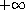
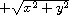
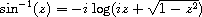

Chapter 6. Operations on Objects
================================

This chapter describes the operations on objects, including lists,
numbers, characters, strings, vectors, bytevectors, symbols, booleans,
hashtables, and enumerations. The first section covers constant objects
and quotation. The second section describes generic equivalence
predicates for comparing two objects and predicates for determining the
type of an object. Later sections describe procedures that deal
primarily with one of the object types mentioned above. There is no
section treating operations on procedures, since the only operation
defined specifically for procedures is application, and this is
described in Chapter [5](control.html#g96). Operations on ports are
covered in the more general discussion of input and output in
Chapter [7](io.html#g121). A mechanism for defining new data types is
described in Chapter [9](records.html#g138).

### Section 6.1. Constants and Quotation

**syntax**: `constant` \
 **returns:**`constant`

`constant` is any self-evaluating constant, i.e., a number, boolean,
character, string, or bytevector. Constants are immutable; see the note
in the description of `quote` below.

`3.2  3.2  #f  #f  #\c  #\c  "hi"  "hi"  #vu8(3 4 5)  #vu8(3 4 5)`

**syntax**: `(quote obj)` \
 **syntax**: `'obj` \
 **returns:**`obj` \
 **libraries:**`(rnrs base)`, `(rnrs)`

`'obj` is equivalent to `(quote obj)`. The abbreviated form is converted
into the longer form by the Scheme reader (see `read`).

`quote` inhibits the normal evaluation rule for `obj`, allowing `obj` to
be employed as data. Although any Scheme object may be quoted, quotation
is not necessary for self-evaluating constants, i.e., numbers, booleans,
characters, strings, and bytevectors.

Quoted and self-evaluating constants are immutable. That is, programs
should not alter a constant via `set-car!`, `string-set!`, etc., and
implementations are permitted to raise an exception with condition type
`&assertion` if such an alteration is attempted. If an attempt to alter
an immutable object is undetected, the behavior of the program is
unspecified. An implementation may choose to share storage among
different constants to save space.

`(+ 2 3)  5  '(+ 2 3)  (+ 2 3)  (quote (+ 2 3))  (+ 2 3)  'a  a  'cons  cons  '()  ()  '7  7`

**syntax**: `(quasiquote obj ...)` \
 **syntax**: `` `obj `` \
 **syntax**: `(unquote obj ...)` \
 **syntax**: `,obj` \
 **syntax**: `(unquote-splicing obj ...)` \
 **syntax**: `,@obj` \
 **returns:**see below \
 **libraries:**`(rnrs base)`, `(rnrs)`

`` `obj `` is equivalent to `(quasiquote obj)`, `,obj` is equivalent to
`(unquote obj)`, and `,@obj` is equivalent to `(unquote-splicing obj)`.
The abbreviated forms are converted into the longer forms by the Scheme
reader (see `read`).

`quasiquote` is similar to `quote`, but it allows parts of the quoted
text to be "unquoted." Within a `quasiquote` expression, `unquote` and
`unquote-splicing` subforms are evaluated, and everything else is
quoted, i.e., left unevaluated. The value of each `unquote` subform is
inserted into the output in place of the `unquote` form, while the value
of each `unquote-splicing` subform is spliced into the surrounding list
or vector structure. `unquote` and `unquote-splicing` are valid only
within `quasiquote` expressions.

`quasiquote` expressions may be nested, with each `quasiquote`
introducing a new level of quotation and each `unquote` or
`unquote-splicing` taking away a level of quotation. An expression
nested within *n* `quasiquote` expressions must be within *n* `unquote`
or `unquote-splicing` expressions to be evaluated.

`` `(+ 2 3)  (+ 2 3)   `(+ 2 ,(* 3 4))  (+ 2 12)  `(a b (,(+ 2 3) c) d)  (a b (5 c) d)  `(a b ,(reverse '(c d e)) f g)  (a b (e d c) f g)  (let ([a 1] [b 2])    `(,a . ,b))  (1 . 2)   `(+ ,@(cdr '(* 2 3)))  (+ 2 3)  `(a b ,@(reverse '(c d e)) f g)  (a b e d c f g)  (let ([a 1] [b 2])    `(,a ,@b))  (1 . 2)  `#(,@(list 1 2 3))  #(1 2 3)   '`,(cons 'a 'b)  `,(cons 'a 'b)  `',(cons 'a 'b)  '(a . b) ``

`unquote` and `unquote-splicing` forms with zero or more than one
subform are valid only in splicing (list or vector) contexts.
`(unquote obj ...)` is equivalent to `(unquote obj) ...`, and
`(unquote-splicing obj ...)` is equivalent to
`(unquote-splicing obj) ...`. These forms are primarily useful as
intermediate forms in the output of the `quasiquote` expander. They
support certain useful nested quasiquotation
idioms [[3](bibliography.html#g221)], such as `,@,@`, which has the
effect of a doubly indirect splicing when used within a doubly nested
and doubly evaluated `quasiquote` expression.

``` `(a (unquote) b)  (a b)  `(a (unquote (+ 3 3)) b)  (a 6 b)  `(a (unquote (+ 3 3) (* 3 3)) b)  (a 6 9 b)   (let ([x '(m n)]) ``(a ,@,@x f))  `(a (unquote-splicing m n) f)  (let ([x '(m n)])    (eval `(let ([m '(b c)] [n '(d e)]) `(a ,@,@x f))          (environment '(rnrs))))  (a b c d e f) ```

`unquote` and `unquote-splicing` are auxiliary keywords for
`quasiquote`. It is a syntax violation to reference these identifiers
except in contexts where they are recognized as auxiliary keywords.

### Section 6.2. Generic Equivalence and Type Predicates

This section describes the basic Scheme predicates (procedures returning
one of the boolean values `#t` or `#f`) for determining the type of an
object or the equivalence of two objects. The equivalence predicates
`eq?`, `eqv?`, and `equal?` are discussed first, followed by the type
predicates.

**procedure**: `(eq? obj1 obj2)` \
 **returns:**`#t` if `obj1` and `obj2` are identical, `#f` otherwise \
 **libraries:**`(rnrs base)`, `(rnrs)`

In most Scheme systems, two objects are considered identical if they are
represented internally by the same pointer value and distinct (not
identical) if they are represented internally by different pointer
values, although other criteria, such as time-stamping, are possible.

Although the particular rules for object identity vary somewhat from
system to system, the following rules always hold.

-   Two objects of different types (booleans, the empty list, pairs,
    numbers, characters, strings, vectors, symbols, and procedures) are
    distinct.
-   Two objects of the same type with different contents or values are
    distinct.
-   The boolean object `#t` is identical to itself wherever it appears,
    and `#f` is identical to itself wherever it appears, but `#t` and
    `#f` are distinct.
-   The empty list `()` is identical to itself wherever it appears.
-   Two symbols are identical if and only if they have the same name (by
    `string=?`).
-   A constant pair, vector, string, or bytevector is identical to
    itself, as is a pair, vector, string, or bytevector created by an
    application of `cons`, `vector`, `string`, `make-bytevector`, etc.
    Two pairs, vectors, strings, or bytevectors created by different
    applications of `cons`, `vector`, `string`, `make-bytevector`, etc.,
    are distinct. One consequence is that `cons`, for example, may be
    used to create a unique object distinct from all other objects.
-   Two procedures that may behave differently are distinct. A procedure
    created by an evaluation of a `lambda` expression is identical to
    itself. Two procedures created by the same `lambda` expression at
    different times, or by similar `lambda` expressions, may or may not
    be distinct.

`eq?` cannot be used to compare numbers and characters reliably.
Although every inexact number is distinct from every exact number, two
exact numbers, two inexact numbers, or two characters with the same
value may or may not be identical.

Since constant objects are immutable, i.e., programs should not modify
them via `vector-set!`, `set-car!`, or any other structure mutation
operation, all or portions of different quoted constants or
self-evaluating literals may be represented internally by the same
object. Thus, `eq?` may return `#t` when applied to equal parts of
different immutable constants.

`eq?` is most often used to compare symbols or to check for pointer
equivalence of allocated objects, e.g., pairs, vectors, or record
instances.

`(eq? 'a 3)  #f  (eq? #t 't)  #f  (eq? "abc" 'abc)  #f  (eq? "hi" '(hi))  #f  (eq? #f '())  #f   (eq? 9/2 7/2)  #f  (eq? 3.4 53344)  #f  (eq? 3 3.0)  #f  (eq? 1/3 #i1/3)  #f   (eq? 9/2 9/2)  unspecified  (eq? 3.4 (+ 3.0 .4))  unspecified  (let ([x (* 12345678987654321 2)])    (eq? x x))  unspecified   (eq? #\a #\b)  #f  (eq? #\a #\a)  unspecified  (let ([x (string-ref "hi" 0)])    (eq? x x))  unspecified   (eq? #t #t)  #t  (eq? #f #f)  #t  (eq? #t #f)  #f  (eq? (null? '()) #t)  #t  (eq? (null? '(a)) #f)  #t   (eq? (cdr '(a)) '())  #t   (eq? 'a 'a)  #t  (eq? 'a 'b)  #f  (eq? 'a (string->symbol "a"))  #t   (eq? '(a) '(b))  #f  (eq? '(a) '(a))  unspecified  (let ([x '(a . b)]) (eq? x x))  #t  (let ([x (cons 'a 'b)])    (eq? x x))  #t  (eq? (cons 'a 'b) (cons 'a 'b))  #f   (eq? "abc" "cba")  #f  (eq? "abc" "abc")  unspecified  (let ([x "hi"]) (eq? x x))  #t  (let ([x (string #\h #\i)]) (eq? x x))  #t  (eq? (string #\h #\i)       (string #\h #\i))  #f   (eq? '#vu8(1) '#vu8(1))  unspecified  (eq? '#vu8(1) '#vu8(2))  #f  (let ([x (make-bytevector 10 0)])    (eq? x x))  #t  (let ([x (make-bytevector 10 0)])    (eq? x (make-bytevector 10 0)))  #f   (eq? '#(a) '#(b))  #f  (eq? '#(a) '#(a))  unspecified  (let ([x '#(a)]) (eq? x x))  #t  (let ([x (vector 'a)])    (eq? x x))  #t  (eq? (vector 'a) (vector 'a))  #f   (eq? car car)  #t  (eq? car cdr)  #f  (let ([f (lambda (x) x)])    (eq? f f))  #t  (let ([f (lambda () (lambda (x) x))])    (eq? (f) (f)))  unspecified  (eq? (lambda (x) x) (lambda (y) y))  unspecified   (let ([f (lambda (x)             (lambda ()               (set! x (+ x 1))               x))])    (eq? (f 0) (f 0)))  #f`

**procedure**: `(eqv? obj1 obj2)` \
 **returns:**`#t` if `obj1` and `obj2` are equivalent, `#f` otherwise \
 **libraries:**`(rnrs base)`, `(rnrs)`

`eqv?` is similar to `eq?` except `eqv?` is guaranteed to return `#t`
for two characters that are considered equal by `char=?` and two numbers
that are (a) considered equal by `=` and (b) cannot be distinguished by
any other operation besides `eq?` and `eqv?`. A consequence of (b) is
that `(eqv? -0.0 +0.0)` is `#f` even though `(= -0.0 +0.0)` is `#t` in
systems that distinguish `-0.0` and `+0.0`, such as those based on IEEE
floating-point arithmetic. This is because operations such as `/` can
expose the difference:

`(/ 1.0 -0.0)  -inf.0  (/ 1.0 +0.0)  +inf.0`

Similarly, although 3.0 and 3.0+0.0i are considered numerically equal,
they are not considered equivalent by `eqv?` if -0.0 and 0.0 have
different representations.

`(= 3.0+0.0i 3.0)  #t  (eqv? 3.0+0.0i 3.0)  #f`

The boolean value returned by `eqv?` is not specified when the arguments
are NaNs.

`(eqv? +nan.0 (/ 0.0 0.0))  unspecified`

`eqv?` is less implementation-dependent but generally more expensive
than `eq?`.

`(eqv? 'a 3)  #f  (eqv? #t 't)  #f  (eqv? "abc" 'abc)  #f  (eqv? "hi" '(hi))  #f  (eqv? #f '())  #f   (eqv? 9/2 7/2)  #f  (eqv? 3.4 53344)  #f  (eqv? 3 3.0)  #f  (eqv? 1/3 #i1/3)  #f   (eqv? 9/2 9/2)  #t  (eqv? 3.4 (+ 3.0 .4))  #t  (let ([x (* 12345678987654321 2)])    (eqv? x x))  #t   (eqv? #\a #\b)  #f  (eqv? #\a #\a)  #t  (let ([x (string-ref "hi" 0)])    (eqv? x x))  #t   (eqv? #t #t)  #t  (eqv? #f #f)  #t  (eqv? #t #f)  #f  (eqv? (null? '()) #t)  #t  (eqv? (null? '(a)) #f)  #t   (eqv? (cdr '(a)) '())  #t   (eqv? 'a 'a)  #t  (eqv? 'a 'b)  #f  (eqv? 'a (string->symbol "a"))  #t   (eqv? '(a) '(b))  #f  (eqv? '(a) '(a))  unspecified  (let ([x '(a . b)]) (eqv? x x))  #t  (let ([x (cons 'a 'b)])    (eqv? x x))  #t  (eqv? (cons 'a 'b) (cons 'a 'b))  #f   (eqv? "abc" "cba")  #f  (eqv? "abc" "abc")  unspecified  (let ([x "hi"]) (eqv? x x))  #t  (let ([x (string #\h #\i)]) (eqv? x x))  #t  (eqv? (string #\h #\i)        (string #\h #\i))  #f   (eqv? '#vu8(1) '#vu8(1))  unspecified  (eqv? '#vu8(1) '#vu8(2))  #f  (let ([x (make-bytevector 10 0)])    (eqv? x x))  #t  (let ([x (make-bytevector 10 0)])    (eqv? x (make-bytevector 10 0)))  #f   (eqv? '#(a) '#(b))  #f  (eqv? '#(a) '#(a))  unspecified  (let ([x '#(a)]) (eqv? x x))  #t  (let ([x (vector 'a)])    (eqv? x x))  #t  (eqv? (vector 'a) (vector 'a))  #f   (eqv? car car)  #t  (eqv? car cdr)  #f  (let ([f (lambda (x) x)])    (eqv? f f))  #t  (let ([f (lambda () (lambda (x) x))])    (eqv? (f) (f)))  unspecified  (eqv? (lambda (x) x) (lambda (y) y))  unspecified   (let ([f (lambda (x)             (lambda ()               (set! x (+ x 1))               x))])    (eqv? (f 0) (f 0)))  #f`

**procedure**: `(equal? obj1 obj2)` \
 **returns:**`#t` if `obj1` and `obj2` have the same structure and
contents, `#f` otherwise \
 **libraries:**`(rnrs base)`, `(rnrs)`

Two objects are equal if they are equivalent according to `eqv?`,
strings that are `string=?`, bytevectors that are `bytevector=?`, pairs
whose cars and cdrs are equal, or vectors of the same length whose
corresponding elements are equal.

`equal?` is required to terminate even for cyclic arguments and return
`#t` "if and only if the (possibly infinite) unfoldings of its arguments
into regular trees are equal as ordered
trees" [[24](bibliography.html#g242)]. In essence, two values are
equivalent, in the sense of `equal?`, if the structure of the two
objects cannot be distinguished by any composition of pair and vector
accessors along with the `eqv?`, `string=?`, and `bytevector=?`
procedures for comparing data at the leaves.

Implementing `equal?` efficiently is
tricky [[1](bibliography.html#g219)], and even with a good
implementation, it is likely to be more expensive than either `eqv?` or
`eq?`.

`(equal? 'a 3)  #f  (equal? #t 't)  #f  (equal? "abc" 'abc)  #f  (equal? "hi" '(hi))  #f  (equal? #f '())  #f   (equal? 9/2 7/2)  #f  (equal? 3.4 53344)  #f  (equal? 3 3.0)  #f  (equal? 1/3 #i1/3)  #f   (equal? 9/2 9/2)  #t  (equal? 3.4 (+ 3.0 .4))  #t  (let ([x (* 12345678987654321 2)])    (equal? x x))  #t   (equal? #\a #\b)  #f  (equal? #\a #\a)  #t  (let ([x (string-ref "hi" 0)])    (equal? x x))  #t   (equal? #t #t)  #t  (equal? #f #f)  #t  (equal? #t #f)  #f  (equal? (null? '()) #t)  #t  (equal? (null? '(a)) #f)  #t   (equal? (cdr '(a)) '())  #t   (equal? 'a 'a)  #t  (equal? 'a 'b)  #f  (equal? 'a (string->symbol "a"))  #t   (equal? '(a) '(b))  #f  (equal? '(a) '(a))  #t  (let ([x '(a . b)]) (equal? x x))  #t  (let ([x (cons 'a 'b)])    (equal? x x))  #t  (equal? (cons 'a 'b) (cons 'a 'b))  #t   (equal? "abc" "cba")  #f  (equal? "abc" "abc")  #t  (let ([x "hi"]) (equal? x x))  #t  (let ([x (string #\h #\i)]) (equal? x x))  #t  (equal? (string #\h #\i)          (string #\h #\i))  #t   (equal? '#vu8(1) '#vu8(1))  #t  (equal? '#vu8(1) '#vu8(2))  #f  (let ([x (make-bytevector 10 0)])    (equal? x x))  #t  (let ([x (make-bytevector 10 0)])    (equal? x (make-bytevector 10 0)))  #t   (equal? '#(a) '#(b))  #f  (equal? '#(a) '#(a))  #t  (let ([x '#(a)]) (equal? x x))  #t  (let ([x (vector 'a)])    (equal? x x))  #t  (equal? (vector 'a) (vector 'a))  #t   (equal? car car)  #t  (equal? car cdr)  #f  (let ([f (lambda (x) x)])    (equal? f f))  #t  (let ([f (lambda () (lambda (x) x))])    (equal? (f) (f)))  unspecified  (equal? (lambda (x) x) (lambda (y) y))  unspecified   (let ([f (lambda (x)             (lambda ()               (set! x (+ x 1))               x))])    (equal? (f 0) (f 0)))  #f   (equal?    (let ([x (cons 'x 'x)])      (set-car! x x)      (set-cdr! x x)      x)    (let ([x (cons 'x 'x)])      (set-car! x x)      (set-cdr! x x)      (cons x x)))  #t`

**procedure**: `(boolean? obj)` \
 **returns:**`#t` if `obj` is either `#t` or `#f`, `#f` otherwise \
 **libraries:**`(rnrs base)`, `(rnrs)`

`boolean?` is equivalent to `(lambda (x) (or (eq? x #t) (eq? x #f)))`.

`(boolean? #t)  #t  (boolean? #f)  #t  (or (boolean? 't) (boolean? '()))  #f`

**procedure**: `(null? obj)` \
 **returns:**`#t` if `obj` is the empty list, `#f` otherwise \
 **libraries:**`(rnrs base)`, `(rnrs)`

`null?` is equivalent to `(lambda (x) (eq? x '()))`.

`(null? '())  #t  (null? '(a))  #f  (null? (cdr '(a)))  #t  (null? 3)  #f  (null? #f)  #f`

**procedure**: `(pair? obj)` \
 **returns:**`#t` if `obj` is a pair, `#f` otherwise \
 **libraries:**`(rnrs base)`, `(rnrs)`

` (pair? '(a b c))  #t  (pair? '(3 . 4))  #t  (pair? '())  #f  (pair? '#(a b))  #f  (pair? 3)  #f`

**procedure**: `(number? obj)` \
 **returns:**`#t` if `obj` is a number object, `#f` otherwise \
 **procedure**: `(complex? obj)` \
 **returns:**`#t` if `obj` is a complex number object, `#f` otherwise \
 **procedure**: `(real? obj)` \
 **returns:**`#t` if `obj` is a real number object, `#f` otherwise \
 **procedure**: `(rational? obj)` \
 **returns:**`#t` if `obj` is a rational number object, `#f` otherwise \
 **procedure**: `(integer? obj)` \
 **returns:**`#t` if `obj` is an integer object, `#f` otherwise \
 **libraries:**`(rnrs base)`, `(rnrs)`

These predicates form a hierarchy: any integer is rational, any rational
is real, any real is complex, and any complex is numeric. Most
implementations do not provide internal representations for irrational
numbers, so all real numbers are typically rational as well.

The `real?`, `rational?`, and `integer?` predicates do not recognize as
real, rational, or integer complex numbers with inexact zero imaginary
parts.

`(integer? 1901)  #t  (rational? 1901)  #t  (real? 1901)  #t  (complex? 1901)  #t  (number? 1901)  #t   (integer? -3.0)  #t  (rational? -3.0)  #t  (real? -3.0)  #t  (complex? -3.0)  #t  (number? -3.0)  #t   (integer? 7+0i)  #t  (rational? 7+0i)  #t  (real? 7+0i)  #t  (complex? 7+0i)  #t  (number? 7+0i)  #t   (integer? -2/3)  #f  (rational? -2/3)  #t  (real? -2/3)  #t  (complex? -2/3)  #t  (number? -2/3)  #t   (integer? -2.345)  #f  (rational? -2.345)  #t  (real? -2.345)  #t  (complex? -2.345)  #t  (number? -2.345)  #t   (integer? 7.0+0.0i)  #f  (rational? 7.0+0.0i)  #f  (real? 7.0+0.0i)  #f  (complex? 7.0+0.0i)  #t  (number? 7.0+0.0i)  #t   (integer? 3.2-2.01i)  #f  (rational? 3.2-2.01i)  #f  (real? 3.2-2.01i)  #f  (complex? 3.2-2.01i)  #t  (number? 3.2-2.01i)  #t   (integer? 'a)  #f  (rational? '(a b c))  #f  (real? "3")  #f  (complex? '#(1 2))  #f  (number? #\a)  #f`

**procedure**: `(real-valued? obj)` \
 **returns:**`#t` if `obj` is a real number, `#f` otherwise \
 **procedure**: `(rational-valued? obj)` \
 **returns:**`#t` if `obj` is a rational number, `#f` otherwise \
 **procedure**: `(integer-valued? obj)` \
 **returns:**`#t` if `obj` is an integer, `#f` otherwise \
 **libraries:**`(rnrs base)`, `(rnrs)`

These predicates are similar to `real?`, `rational?`, and `integer?`,
but treat as real, rational, or integral complex numbers with inexact
zero imaginary parts.

`(integer-valued? 1901)  #t  (rational-valued? 1901)  #t  (real-valued? 1901)  #t   (integer-valued? -3.0)  #t  (rational-valued? -3.0)  #t  (real-valued? -3.0)  #t   (integer-valued? 7+0i)  #t  (rational-valued? 7+0i)  #t  (real-valued? 7+0i)  #t   (integer-valued? -2/3)  #f  (rational-valued? -2/3)  #t  (real-valued? -2/3)  #t   (integer-valued? -2.345)  #f  (rational-valued? -2.345)  #t  (real-valued? -2.345)  #t   (integer-valued? 7.0+0.0i)  #t  (rational-valued? 7.0+0.0i)  #t  (real-valued? 7.0+0.0i)  #t   (integer-valued? 3.2-2.01i)  #f  (rational-valued? 3.2-2.01i)  #f  (real-valued? 3.2-2.01i)  #f`

As with `real?`, `rational?`, and `integer?`, these predicates return
`#f` for all non-numeric values.

`(integer-valued? 'a)  #f  (rational-valued? '(a b c))  #f  (real-valued? "3")  #f`

**procedure**: `(char? obj)` \
 **returns:**`#t` if `obj` is a character, `#f` otherwise \
 **libraries:**`(rnrs base)`, `(rnrs)`

` (char? 'a)  #f  (char? 97)  #f  (char? #\a)  #t  (char? "a")  #f  (char? (string-ref (make-string 1) 0))  #t`

**procedure**: `(string? obj)` \
 **returns:**`#t` if `obj` is a string, `#f` otherwise \
 **libraries:**`(rnrs base)`, `(rnrs)`

` (string? "hi")  #t  (string? 'hi)  #f  (string? #\h)  #f`

**procedure**: `(vector? obj)` \
 **returns:**`#t` if `obj` is a vector, `#f` otherwise \
 **libraries:**`(rnrs base)`, `(rnrs)`

` (vector? '#())  #t  (vector? '#(a b c))  #t  (vector? (vector 'a 'b 'c))  #t  (vector? '())  #f  (vector? '(a b c))  #f  (vector? "abc")  #f`

**procedure**: `(symbol? obj)` \
 **returns:**`#t` if `obj` is a symbol, `#f` otherwise \
 **libraries:**`(rnrs base)`, `(rnrs)`

` (symbol? 't)  #t  (symbol? "t")  #f  (symbol? '(t))  #f  (symbol? #\t)  #f  (symbol? 3)  #f  (symbol? #t)  #f`

**procedure**: `(procedure? obj)` \
 **returns:**`#t` if `obj` is a procedure, `#f` otherwise \
 **libraries:**`(rnrs base)`, `(rnrs)`

` (procedure? car)  #t  (procedure? 'car)  #f  (procedure? (lambda (x) x))  #t  (procedure? '(lambda (x) x))  #f  (call/cc procedure?)  #t`

**procedure**: `(bytevector? obj)` \
 **returns:**`#t` if `obj` is a bytevector, `#f` otherwise \
 **libraries:**`(rnrs bytevectors)`, `(rnrs)`

` (bytevector? #vu8())  #t  (bytevector? '#())  #f  (bytevector? "abc")  #f`

**procedure**: `(hashtable? obj)` \
 **returns:**`#t` if `obj` is a hashtable, `#f` otherwise \
 **libraries:**`(rnrs hashtables)`, `(rnrs)`

`(hashtable? (make-eq-hashtable))  #t  (hashtable? '(not a hash table))  #f`

### Section 6.3. Lists and Pairs

The pair, or *cons cell*, is the most fundamental of Scheme's structured
object types. The most common use for pairs is to build lists, which are
ordered sequences of pairs linked one to the next by the *cdr* field.
The elements of the list occupy the *car* fields of the pairs. The cdr
of the last pair in a *proper list* is the empty list, `()`; the cdr of
the last pair in an *improper list* can be anything other than `()`.

Pairs may be used to construct binary trees. Each pair in the tree
structure is an internal node of the binary tree; its car and cdr are
the children of the node.

Proper lists are printed as sequences of objects separated by whitespace
and enclosed in parentheses. Matching pairs of brackets ( `[` `]` ) may
be used in place of parentheses. For example, `(1 2 3)` and
`(a [nested list])` are proper lists. The empty list is written as `()`.

Improper lists and trees require a slightly more complex syntax. A
single pair is written as two objects separated by whitespace and a dot,
e.g., `(a . b)`. This is referred to as *dotted-pair notation*. Improper
lists and trees are also written in dotted-pair notation; the dot
appears wherever necessary, e.g., `(1 2 3 . 4)` or `((1 . 2) . 3)`.
Proper lists may be written in dotted-pair notation as well. For
example, `(1 2 3)` may be written as `(1 . (2 . (3 . ())))`.

It is possible to create a circular list or a cyclic graph by
destructively altering the car or cdr field of a pair, using `set-car!`
or `set-cdr!`. Such lists are not considered proper lists.

Procedures that accept a `list` argument are required to detect that the
list is improper only to the extent that they actually traverse the list
far enough either (a) to attempt to operate on a non-list tail or (b) to
loop indefinitely due to a circularity. For example, `member` need not
detect that a list is improper if it actually finds the element being
sought, and `list-ref` need never detect circularities, because its
recursion is bounded by the index argument.

**procedure**: `(cons obj1 obj2)` \
 **returns:**a new pair whose car and cdr are `obj1` and `obj2` \
 **libraries:**`(rnrs base)`, `(rnrs)`

`cons` is the pair constructor procedure. `obj1` becomes the car and
`obj2` becomes the cdr of the new pair.

`(cons 'a '())  (a)  (cons 'a '(b c))  (a b c)  (cons 3 4)  (3 . 4)`

**procedure**: `(car pair)` \
 **returns:**the car of `pair` \
 **libraries:**`(rnrs base)`, `(rnrs)`

The empty list is not a pair, so the argument must not be the empty
list.

`(car '(a))  a  (car '(a b c))  a  (car (cons 3 4))  3`

**procedure**: `(cdr pair)` \
 **returns:**the cdr of `pair` \
 **libraries:**`(rnrs base)`, `(rnrs)`

The empty list is not a pair, so the argument must not be the empty
list.

`(cdr '(a))  ()  (cdr '(a b c))  (b c)  (cdr (cons 3 4))  4`

**procedure**: `(set-car! pair obj)` \
 **returns:**unspecified \
 **libraries:**`(rnrs mutable-pairs)`

`set-car!` changes the car of `pair` to `obj`.

`(let ([x (list 'a 'b 'c)])    (set-car! x 1)    x)  (1 b c)`

**procedure**: `(set-cdr! pair obj)` \
 **returns:**unspecified \
 **libraries:**`(rnrs mutable-pairs)`

`set-cdr!` changes the cdr of `pair` to `obj`.

`(let ([x (list 'a 'b 'c)])    (set-cdr! x 1)    x)  (a . 1)`

**procedure**: `(caar pair)` \
 **procedure**: `(cadr pair)`  \
 **procedure**: `(cddddr pair)` \
 **returns:**the caar, cadr, ..., or cddddr of `pair` \
 **libraries:**`(rnrs base)`, `(rnrs)`

These procedures are defined as the composition of up to four `car`s and
`cdr`s. The `a`'s and `d`'s between the `c` and `r` represent the
application of `car` or `cdr` in order from right to left. For example,
the procedure `cadr` applied to a pair yields the `car` of the `cdr` of
the pair and is equivalent to `(lambda (x) (car (cdr x)))`.

`(caar '((a)))  a  (cadr '(a b c))  b  (cdddr '(a b c d))  (d)  (cadadr '(a (b c)))  c`

**procedure**: `(list obj ...)` \
 **returns:**a list of `obj ...` \
 **libraries:**`(rnrs base)`, `(rnrs)`

`list` is equivalent to `(lambda x x)`.

`(list)  ()  (list 1 2 3)  (1 2 3)  (list 3 2 1)  (3 2 1)`

**procedure**: `(cons* obj ... final-obj)` \
 **returns:**a list of `obj ...` terminated by `final-obj` \
 **libraries:**`(rnrs lists)`, `(rnrs)`

If the objects `obj ...` are omitted, the result is simply `final-obj`.
Otherwise, a list of `obj ...` is constructed, as with `list`, except
that the final cdr field is `final-obj` instead of `()`. If `final-obj`
is not a list, the result is an improper list.

`(cons* '())  ()  (cons* '(a b))  (a b)  (cons* 'a 'b 'c)  (a b . c)  (cons* 'a 'b '(c d))  (a b c d)`

**procedure**: `(list? obj)` \
 **returns:**`#t` if `obj` is a proper list, `#f` otherwise \
 **libraries:**`(rnrs base)`, `(rnrs)`

`list?` must return `#f` for all improper lists, including cyclic lists.
A definition of `list?` is shown on page [67](further.html#defn:list?).

`(list? '())  #t  (list? '(a b c))  #t  (list? 'a)  #f  (list? '(3 . 4))  #f  (list? 3)  #f  (let ([x (list 'a 'b 'c)])    (set-cdr! (cddr x) x)    (list? x))  #f`

**procedure**: `(length list)` \
 **returns:**the number of elements in `list` \
 **libraries:**`(rnrs base)`, `(rnrs)`

`length` may be defined as follows, using an adaptation of the hare and
tortoise algorithm used for the definition of `list?` on
page [67](further.html#defn:list?).

`(define length    (lambda (x)      (define improper-list        (lambda ()          (assertion-violation 'length "not a proper list" x)))       (let f ([h x] [t x] [n 0])        (if (pair? h)            (let ([h (cdr h)])              (if (pair? h)                  (if (eq? h t)                      (improper-list)                      (f (cdr h) (cdr t) (+ n 2)))                  (if (null? h)                      (+ n 1)                      (improper-list))))            (if (null? h)                n                (improper-list))))))   (length '())  0  (length '(a b c))  3  (length '(a b . c))  exception  (length    (let ([ls (list 'a 'b)])      (set-cdr! (cdr ls) ls)  exception      ls))  (length    (let ([ls (list 'a 'b)])      (set-car! (cdr ls) ls)  2      ls))`

**procedure**: `(list-ref list n)` \
 **returns:**the `n`th element (zero-based) of `list` \
 **libraries:**`(rnrs base)`, `(rnrs)`

`n` must be an exact nonnegative integer less than the length of `list`.
`list-ref` may be defined without error checks as follows.

`(define list-ref    (lambda (ls n)      (if (= n 0)          (car ls)          (list-ref (cdr ls) (- n 1)))))   (list-ref '(a b c) 0)  a  (list-ref '(a b c) 1)  b  (list-ref '(a b c) 2)  c`

**procedure**: `(list-tail list n)` \
 **returns:**the `n`th tail (zero-based) of `list` \
 **libraries:**`(rnrs base)`, `(rnrs)`

`n` must be an exact nonnegative integer less than or equal to the
length of `list`. The result is not a copy; the tail is `eq?` to the
`n`th cdr of `list` (or to `list` itself, if `n` is zero).

`list-tail` may be defined without error checks as follows.

`(define list-tail    (lambda (ls n)      (if (= n 0)          ls          (list-tail (cdr ls) (- n 1)))))   (list-tail '(a b c) 0)  (a b c)  (list-tail '(a b c) 2)  (c)  (list-tail '(a b c) 3)  ()  (list-tail '(a b c . d) 2)  (c . d)  (list-tail '(a b c . d) 3)  d  (let ([x (list 1 2 3)])    (eq? (list-tail x 2)         (cddr x)))  #t`

**procedure**: `(append)` \
 **procedure**: `(append list ... obj)` \
 **returns:**the concatenation of the input lists \
 **libraries:**`(rnrs base)`, `(rnrs)`

`append` returns a new list consisting of the elements of the first list
followed by the elements of the second list, the elements of the third
list, and so on. The new list is made from new pairs for all arguments
but the last; the last (which need not be a list) is merely placed at
the end of the new structure. `append` may be defined without error
checks as follows.

`(define append    (lambda args      (let f ([ls '()] [args args])        (if (null? args)            ls            (let g ([ls ls])              (if (null? ls)                  (f (car args) (cdr args))                  (cons (car ls) (g (cdr ls)))))))))   (append '(a b c) '())  (a b c)  (append '() '(a b c))  (a b c)  (append '(a b) '(c d))  (a b c d)  (append '(a b) 'c)  (a b . c)  (let ([x (list 'b)])    (eq? x (cdr (append '(a) x))))  #t`

**procedure**: `(reverse list)` \
 **returns:**a new list containing the elements of `list` in reverse
order \
 **libraries:**`(rnrs base)`, `(rnrs)`

`reverse` may be defined without error checks as follows.

`(define reverse    (lambda (ls)      (let rev ([ls ls] [new '()])        (if (null? ls)            new            (rev (cdr ls) (cons (car ls) new))))))   (reverse '())  ()  (reverse '(a b c))  (c b a)`

**procedure**: `(memq obj list)` \
 **procedure**: `(memv obj list)` \
 **procedure**: `(member obj list)` \
 **returns:**the first tail of `list` whose car is equivalent to `obj`,
or `#f` \
 **libraries:**`(rnrs lists)`, `(rnrs)`

These procedures traverse the argument `list` in order, comparing the
elements of `list` against `obj`. If an object equivalent to `obj` is
found, the tail of the list whose first element is that object is
returned. If the list contains more than one object equivalent to `obj`,
the first tail whose first element is equivalent to `obj` is returned.
If no object equivalent to `obj` is found, `#f` is returned. The
equivalence test for `memq` is `eq?`, for `memv` is `eqv?`, and for
`member` is `equal?`.

These procedures are most often used as predicates, but their names do
not end with a question mark because they return a useful true value in
place of `#t`. `memq` may be defined without error checks as follows.

`(define memq    (lambda (x ls)      (cond        [(null? ls) #f]        [(eq? (car ls) x) ls]        [else (memq x (cdr ls))])))`

`memv` and `member` may be defined similarly, with `eqv?` and `equal?`
in place of `eq?`.

`(memq 'a '(b c a d e))  (a d e)  (memq 'a '(b c d e g))  #f  (memq 'a '(b a c a d a))  (a c a d a)   (memv 3.4 '(1.2 2.3 3.4 4.5))  (3.4 4.5)  (memv 3.4 '(1.3 2.5 3.7 4.9))  #f  (let ([ls (list 'a 'b 'c)])    (set-car! (memv 'b ls) 'z)    ls)  (a z c)   (member '(b) '((a) (b) (c)))  ((b) (c))  (member '(d) '((a) (b) (c)))  #f  (member "b" '("a" "b" "c"))  ("b" "c")   (let ()    (define member?      (lambda (x ls)        (and (member x ls) #t)))    (member? '(b) '((a) (b) (c))))  #t   (define count-occurrences    (lambda (x ls)      (cond        [(memq x ls) =>         (lambda (ls)           (+ (count-occurrences x (cdr ls)) 1))]        [else 0])))   (count-occurrences 'a '(a b c d a))  2`

**procedure**: `(memp procedure list)` \
 **returns:**the first tail of `list` for whose car `procedure` returns
true, or `#f` \
 **libraries:**`(rnrs lists)`, `(rnrs)`

`procedure` should accept one argument and return a single value. It
should not modify `list`.

`(memp odd? '(1 2 3 4))  (1 2 3 4)  (memp even? '(1 2 3 4))  (2 3 4)  (let ([ls (list 1 2 3 4)])    (eq? (memp odd? ls) ls))  #t  (let ([ls (list 1 2 3 4)])    (eq? (memp even? ls) (cdr ls)))  #t  (memp odd? '(2 4 6 8))  #f`

**procedure**: `(remq obj list)` \
 **procedure**: `(remv obj list)` \
 **procedure**: `(remove obj list)` \
 **returns:**a list containing the elements of `list` with all
occurrences of `obj` removed \
 **libraries:**`(rnrs lists)`, `(rnrs)`

These procedures traverse the argument `list`, removing any objects that
are equivalent to `obj`. The elements remaining in the output list are
in the same order as they appear in the input list. If a tail of `list`
(including `list` itself) contains no occurrences of `obj`, the
corresponding tail of the result list may be the same (by `eq?`) as the
tail of the input list.

The equivalence test for `remq` is `eq?`, for `remv` is `eqv?`, and for
`remove` is `equal?`.

`(remq 'a '(a b a c a d))  (b c d)  (remq 'a '(b c d))  (b c d)   (remv 1/2 '(1.2 1/2 0.5 3/2 4))  (1.2 0.5 3/2 4)   (remove '(b) '((a) (b) (c)))  ((a) (c))`

**procedure**: `(remp procedure list)` \
 **returns:**a list of the elements of `list` for which `procedure`
returns `#f` \
 **libraries:**`(rnrs lists)`, `(rnrs)`

`procedure` should accept one argument and return a single value. It
should not modify `list`.

`remp` applies `procedure` to each element of `list` and returns a list
containing only the elements for which `procedure` returns `#f`. The
elements of the returned list appear in the same order as they appeared
in the original list.

`(remp odd? '(1 2 3 4))  (2 4)  (remp    (lambda (x) (and (> x 0) (< x 10)))    '(-5 15 3 14 -20 6 0 -9))  (-5 15 14 -20 0 -9)`

**procedure**: `(filter procedure list)` \
 **returns:**a list of the elements of `list` for which `procedure`
returns true \
 **libraries:**`(rnrs lists)`, `(rnrs)`

`procedure` should accept one argument and return a single value. It
should not modify `list`.

`filter` applies `procedure` to each element of `list` and returns a new
list containing only the elements for which `procedure` returns true.
The elements of the returned list appear in the same order as they
appeared in the original list.

`(filter odd? '(1 2 3 4))  (1 3)  (filter    (lambda (x) (and (> x 0) (< x 10)))    '(-5 15 3 14 -20 6 0 -9))  (3 6)`

**procedure**: `(partition procedure list)` \
 **returns:**see below \
 **libraries:**`(rnrs lists)`, `(rnrs)`

`procedure` should accept one argument and return a single value. It
should not modify `list`.

`partition` applies `procedure` to each element of `list` and returns
two values: a new list containing only the elements for which
`procedure` returns true, and a new list containing only the elements
for which `procedure` returns `#f`. The elements of the returned lists
appear in the same order as they appeared in the original list.

`(partition odd? '(1 2 3 4))  (1 3)                               (2 4)  (partition    (lambda (x) (and (> x 0) (< x 10)))    '(-5 15 3 14 -20 6 0 -9))  (3 6)                               (-5 15 14 -20 0 -9)`

The values returned by `partition` can be obtained by calling `filter`
and `remp` separately, but this would require two calls to `procedure`
for each element of `list`.

**procedure**: `(find procedure list)` \
 **returns:**the first element of `list` for which `procedure` returns
true, or `#f` \
 **libraries:**`(rnrs lists)`, `(rnrs)`

`procedure` should accept one argument and return a single value. It
should not modify `list`.

`find` traverses the argument `list` in order, applying `procedure` to
each element in turn. If `procedure` returns a true value for a given
element, `find` returns that element without applying `procedure` to the
remaining elements. If `procedure` returns `#f` for each element of
`list`, `find` returns `#f`.

If a program must distinguish between finding `#f` in the list and
finding no element at all, `memp` should be used instead.

`(find odd? '(1 2 3 4))  1  (find even? '(1 2 3 4))  2  (find odd? '(2 4 6 8))  #f  (find not '(1 a #f 55))  #f`

**procedure**: `(assq obj alist)` \
 **procedure**: `(assv obj alist)` \
 **procedure**: `(assoc obj alist)` \
 **returns:**first element of `alist` whose car is equivalent to `obj`,
or `#f` \
 **libraries:**`(rnrs lists)`, `(rnrs)`

The argument `alist` must be an *association list*. An association list
is a proper list whose elements are key-value pairs of the form
`(key . value)`. Associations are useful for storing information
(values) associated with certain objects (keys).

These procedures traverse the association list, testing each key for
equivalence with `obj`. If an equivalent key is found, the key-value
pair is returned. Otherwise, `#f` is returned.

The equivalence test for `assq` is `eq?`, for `assv` is `eqv?`, and for
`assoc` is `equal?`. `assq` may be defined without error checks as
follows.

`(define assq    (lambda (x ls)      (cond        [(null? ls) #f]        [(eq? (caar ls) x) (car ls)]        [else (assq x (cdr ls))])))`

`assv` and `assoc` may be defined similarly, with `eqv?` and `equal?` in
place of `eq?`.

`(assq 'b '((a . 1) (b . 2)))  (b . 2)  (cdr (assq 'b '((a . 1) (b . 2))))  2  (assq 'c '((a . 1) (b . 2)))  #f   (assv 2/3 '((1/3 . 1) (2/3 . 2)))  (2/3 . 2)  (assv 2/3 '((1/3 . a) (3/4 . b)))  #f   (assoc '(a) '(((a) . a) (-1 . b)))  ((a) . a)  (assoc '(a) '(((b) . b) (a . c)))  #f   (let ([alist (list (cons 2 'a) (cons 3 'b))])    (set-cdr! (assv 3 alist) 'c)    alist)  ((2 . a) (3 . c))`

The interpreter given in Section [12.7](examples.html#g187) represents
environments as association lists and uses `assq` for both variable
lookup and assignment.

**procedure**: `(assp procedure alist)` \
 **returns:**first element of `alist` for whose car `procedure` returns
true, or `#f` \
 **libraries:**`(rnrs lists)`, `(rnrs)`

`alist` must be an *association list*. An association list is a proper
list whose elements are key-value pairs of the form `(key . value)`.
`procedure` should accept one argument and return a single value. It
should not modify `list`.

`(assp odd? '((1 . a) (2 . b)))  (1 . a)  (assp even? '((1 . a) (2 . b)))  (2 . b)  (let ([ls (list (cons 1 'a) (cons 2 'b))])    (eq? (assp odd? ls) (car ls)))  #t  (let ([ls (list (cons 1 'a) (cons 2 'b))])    (eq? (assp even? ls) (cadr ls)))  #t  (assp odd? '((2 . b)))  #f`

**procedure**: `(list-sort predicate list)` \
 **returns:**a list containing the elements of `list` sorted according
to `predicate` \
 **libraries:**`(rnrs sorting)`, `(rnrs)`

`predicate` should be a procedure that expects two arguments and returns
`#t` if its first argument must precede its second in the sorted list.
That is, if `predicate` is applied to two elements `x` and `y`, where
`x` appears after `y` in the input list, it should return true only if
`x` should appear before `y` in the output list. If this constraint is
met, `list-sort` performs a stable sort, i.e., two elements are
reordered only when necessary according to `predicate`. Duplicate
elements are not removed. This procedure may call predicate up to
*n*log*n* times, where *n* is the length of `list`.

`(list-sort < '(3 4 2 1 2 5))  (1 2 2 3 4 5)  (list-sort > '(0.5 1/2))  (0.5 1/2)  (list-sort > '(1/2 0.5))  (1/2 0.5)  (list->string    (list-sort char>?      (string->list "hello")))  "ollhe"`

### Section 6.4. Numbers

Scheme numbers may be classified as integers, rational numbers, real
numbers, or complex numbers. This classification is hierarchical, in
that all integers are rational, all rational numbers are real, and all
real numbers are complex. The predicates `integer?`, `rational?`,
`real?`, and `complex?` described in Section [6.2](objects.html#g108)
are used to determine into which of these classes a number falls.

A Scheme number may also be classified as *exact* or *inexact*,
depending upon the quality of operations used to derive the number and
the inputs to these operations. The predicates `exact?` and `inexact?`
may be used to determine the exactness of a number. Most operations on
numbers in Scheme are *exactness preserving*: if given exact operands
they return exact values, and if given inexact operands or a combination
of exact and inexact operands they return inexact values.

Exact integer and rational arithmetic is typically supported to
arbitrary precision; the size of an integer or of the denominator or
numerator of a ratio is limited only by system storage constraints.
Although other representations are possible, inexact numbers are
typically represented by *floating-point* numbers supported by the host
computer's hardware or by system software. Complex numbers are typically
represented as ordered pairs (`real-part`, `imag-part`), where
`real-part` and `imag-part` are exact integers, exact rationals, or
floating-point numbers.

Scheme numbers are written in a straightforward manner not much
different from ordinary conventions for writing numbers. An exact
integer is normally written as a sequence of numerals preceded by an
optional sign. For example, `3`, `+19`, `-100000`, and
`208423089237489374` all represent exact integers.

An exact rational number is normally written as two sequences of
numerals separated by a slash (`/`) and preceded by an optional sign.
For example, `3/4`, `-6/5`, and `1/1208203823` are all exact rational
numbers. A ratio is reduced immediately to lowest terms when it is read
and may in fact reduce to an exact integer.

Inexact real numbers are normally written in either floating-point or
scientific notation. Floating-point notation consists of a sequence of
numerals followed by a decimal point and another sequence of numerals,
all preceded by an optional sign. Scientific notation consists of an
optional sign, a sequence of numerals, an optional decimal point
followed by a second string of numerals, and an exponent; an exponent is
written as the letter `e` followed by an optional sign and a sequence of
numerals. For example, `1.0` and `-200.0` are valid inexact integers,
and `1.5`, `0.034`, `-10e-10` and `1.5e-5` are valid inexact rational
numbers. The exponent is the power of ten by which the number preceding
the exponent should be scaled, so that `2e3` is equivalent to `2000.0`.

A mantissa width `|w` may appear as the suffix of a real number or the
real components of a complex number written in floating-point or
scientific notation. The mantissa width `m` represents the number of
significant bits in the representation of the number. The mantissa width
defaults to 53, the number of significant bits in a normalized IEEE
double floating-point number, or more. For denormalized IEEE double
floating-point numbers, the mantissa width is less than 53. If an
implementation cannot represent a number with the mantissa width
specified, it uses a representation with at least as many significant
bits as requested if possible, otherwise it uses its representation with
the largest mantissa width.

Exact and inexact real numbers are written as exact or inexact integers
or rational numbers; no provision is made in the syntax of Scheme
numbers for nonrational real numbers, i.e., irrational numbers.

Complex numbers may be written in either rectangular or polar form. In
rectangular form, a complex number is written as `x+yi` or `x-yi`, where
`x` is an integer, rational, or real number and `y` is an unsigned
integer, rational, or real number. The real part, *x*, may be omitted,
in which case it is assumed to be zero. For example, `3+4i`, `3.2-3/4i`,
`+i`, and `-3e-5i` are complex numbers written in rectangular form. In
polar form, a complex number is written as `x@y`, where `x` and `y` are
integer, rational, or real numbers. For example, `1.1@1.764` and
`-1@-1/2` are complex numbers written in polar form.

The syntaxes `+inf.0` and `-inf.0` represent inexact real numbers that
represent positive and negative infinity. The syntaxes `+nan.0` and
`-nan.0` represent an inexact "not-a-number" (NaN) value. Infinities may
be produced by dividing inexact positive and negative values by inexact
zero, and NaNs may also be produced by dividing inexact zero by inexact
zero, among other ways.

The exactness of a numeric representation may be overridden by preceding
the representation by either `#e` or `#i`. `#e` forces the number to be
exact, and `#i` forces it to be inexact. For example, `1`, `#e1`, 1/1,
`#e1/1`, `#e1.0`, and `#e1e0` all represent the exact integer 1, and
`#i3/10`, `0.3`, `#i0.3`, and `3e-1` all represent the inexact rational
0.3.

Numbers are written by default in base 10, although the special prefixes
`#b` (binary), `#o` (octal), `#d` (decimal), and `#x` (hexadecimal) can
be used to specify base 2, base 8, base 10, or base 16. For radix 16,
the letters `a` through `f` or `A` through `F` serve as the additional
numerals required to express digit values 10 through 15. For example,
`#b10101` is the binary equivalent of 21~10~, `#o72` is the octal
equivalent of 58~10~, and `#xC7` is the hexadecimal equivalent of
199~10~. Numbers written in floating-point and scientific notations are
always written in base 10.

If both are present, radix and exactness prefixes may appear in either
order.

A Scheme implementation may support more than one size of internal
representation for inexact quantities. The exponent markers `s`
(*short*), `f` (*single*), `d` (*double*), and `l` (*long*) may appear
in place of the default exponent marker `e` to override the default size
for numbers written in scientific notation. In implementations that
support multiple representations, the default size has at least as much
precision as *double*.

A precise grammar for Scheme numbers is given on
page [459](grammar.html#grammar:numbers).

Any number can be written in a variety of different ways, but the system
printer (invoked by `put-datum`, `write`, and `display`) and
`number->string` express numbers in a compact form, using the fewest
number of digits necessary to retain the property that, when read, the
printed number is identical to the original number.

The remainder of this section describes "generic arithmetic" procedures
that operate on numbers. The two sections that follow this section
describe operations specific to *fixnums* and *flonums*, which are
representations of exact, fixed-precision integer values and inexact
real values.

The types of numeric arguments accepted by the procedures in this
section are implied by the names given to the arguments: `num` for
complex numbers (that is, all numbers), `real` for real numbers, `rat`
for rational numbers, and `int` for integers. If a `real`, `rat`, or
`int` is required, the argument must be considered real, rational, or
integral by `real?`, `rational?`, or `integer?`, i.e., the imaginary
part of the number must be exactly zero. Where exact integers are
required, the name `exint` is used. In each case, a suffix may appear on
the name, e.g., `int2`.

**procedure**: `(exact? num)` \
 **returns:**`#t` if `num` is exact, `#f` otherwise \
 **libraries:**`(rnrs base)`, `(rnrs)`

` (exact? 1)  #t  (exact? -15/16)  #t  (exact? 2.01)  #f  (exact? #i77)  #f  (exact? #i2/3)  #f  (exact? 1.0-2i)  #f`

**procedure**: `(inexact? num)` \
 **returns:**`#t` if `num` is inexact, `#f` otherwise \
 **libraries:**`(rnrs base)`, `(rnrs)`

` (inexact? -123)  #f  (inexact? #i123)  #t  (inexact? 1e23)  #t  (inexact? +i)  #f`

**procedure**: `(= num1 num2 num3 ...)` \
 **procedure**: `(< real1 real2 real3 ...)` \
 **procedure**: `(> real1 real2 real3 ...)` \
 **procedure**: `(<= real1 real2 real3 ...)` \
 **procedure**: `(>= real1 real2 real3 ...)` \
 **returns:**`#t` if the relation holds, `#f` otherwise \
 **libraries:**`(rnrs base)`, `(rnrs)`

The predicate `=` returns `#t` if its arguments are equal. The predicate
`<` returns `#t` if its arguments are monotonically increasing, i.e.,
each argument is greater than the preceding ones, while `>` returns `#t`
if its arguments are monotonically decreasing. The predicate `<=`
returns `#t` if its arguments are monotonically nondecreasing, i.e.,
each argument is not less than the preceding ones, while `>=` returns
`#t` if its arguments are monotonically nonincreasing.

As implied by the names of the arguments, `=` is defined for complex
arguments while the other relational predicates are defined only for
real arguments. Two complex numbers are considered equal if their real
and imaginary parts are equal. Comparisons involving NaNs always return
`#f`.

`(= 7 7)  #t  (= 7 9)  #f   (< 2e3 3e2)  #f  (<= 1 2 3 3 4 5)  #t  (<= 1 2 3 4 5)  #t   (> 1 2 2 3 3 4)  #f  (>= 1 2 2 3 3 4)  #f   (= -1/2 -0.5)  #t  (= 2/3 .667)  #f  (= 7.2+0i 7.2)  #t  (= 7.2-3i 7)  #f   (< 1/2 2/3 3/4)  #t  (> 8 4.102 2/3 -5)  #t   (let ([x 0.218723452])    (< 0.210 x 0.220))  #t   (let ([i 1] [v (vector 'a 'b 'c)])    (< -1 i (vector-length v)))  #t   (apply < '(1 2 3 4))  #t  (apply > '(4 3 3 2))  #f   (= +nan.0 +nan.0)  #f  (< +nan.0 +nan.0)  #f  (> +nan.0 +nan.0)  #f  (>= +inf.0 +nan.0)  #f  (>= +nan.0 -inf.0)  #f  (> +nan.0 0.0)  #f`

**procedure**: `(+ num ...)` \
 **returns:**the sum of the arguments `num ...` \
 **libraries:**`(rnrs base)`, `(rnrs)`

When called with no arguments, `+` returns 0.

`(+)  0  (+ 1 2)  3  (+ 1/2 2/3)  7/6  (+ 3 4 5)  12  (+ 3.0 4)  7.0  (+ 3+4i 4+3i)  7+7i  (apply + '(1 2 3 4 5))  15`

**procedure**: `(- num)` \
 **returns:**the additive inverse of `num` \
 **procedure**: `(- num1 num2 num3 ...)` \
 **returns:**the difference between `num1` and the sum of
`num2 num3 ...` \
 **libraries:**`(rnrs base)`, `(rnrs)`

`(- 3)  -3  (- -2/3)  2/3  (- 4 3.0)  1.0  (- 3.25+4.25i 1/4+1/4i)  3.0+4.0i  (- 4 3 2 1)  -2`

**procedure**: `(* num ...)` \
 **returns:**the product of the arguments `num ...` \
 **libraries:**`(rnrs base)`, `(rnrs)`

When called with no arguments, `*` returns 1.

`(*)  1  (* 3.4)  3.4  (* 1 1/2)  1/2  (* 3 4 5.5)  66.0  (* 1+2i 3+4i)  -5+10i  (apply * '(1 2 3 4 5))  120`

**procedure**: `(/ num)` \
 **returns:**the multiplicative inverse of `num` \
 **procedure**: `(/ num1 num2 num3 ...)` \
 **returns:**the result of dividing `num1` by the product of
`num2 num3 ...` \
 **libraries:**`(rnrs base)`, `(rnrs)`

` (/ -17)  -1/17  (/ 1/2)  2  (/ .5)  2.0  (/ 3 4)  3/4  (/ 3.0 4)  .75  (/ -5+10i 3+4i)  1+2i  (/ 60 5 4 3 2)  1/2`

**procedure**: `(zero? num)` \
 **returns:**`#t` if `num` is zero, `#f` otherwise \
 **libraries:**`(rnrs base)`, `(rnrs)`

`zero?` is equivalent to `(lambda (x) (= x 0))`.

`(zero? 0)  #t  (zero? 1)  #f  (zero? (- 3.0 3.0))  #t  (zero? (+ 1/2 1/2))  #f  (zero? 0+0i)  #t  (zero? 0.0-0.0i)  #t`

**procedure**: `(positive? real)` \
 **returns:**`#t` if `real` is greater than zero, `#f` otherwise \
 **libraries:**`(rnrs base)`, `(rnrs)`

`positive?` is equivalent to `(lambda (x) (> x 0))`.

`(positive? 128)  #t  (positive? 0.0)  #f  (positive? 1.8e-15)  #t  (positive? -2/3)  #f  (positive? .001-0.0i)  exception: not a real number`

**procedure**: `(negative? real)` \
 **returns:**`#t` if `real` is less than zero, `#f` otherwise \
 **libraries:**`(rnrs base)`, `(rnrs)`

`negative?` is equivalent to `(lambda (x) (< x 0))`.

`(negative? -65)  #t  (negative? 0)  #f  (negative? -0.0121)  #t  (negative? 15/16)  #f  (negative? -7.0+0.0i)  exception: not a real number`

**procedure**: `(even? int)` \
 **returns:**`#t` if `int` is even, `#f` otherwise \
 **procedure**: `(odd? int)` \
 **returns:**`#t` if `int` is odd, `#f` otherwise \
 **libraries:**`(rnrs base)`, `(rnrs)`

` (even? 0)  #t  (even? 1)  #f  (even? 2.0)  #t  (even? -120762398465)  #f  (even? 2.0+0.0i)  exception: not an integer   (odd? 0)  #f  (odd? 1)  #t  (odd? 2.0)  #f  (odd? -120762398465)  #t  (odd? 2.0+0.0i)  exception: not an integer`

**procedure**: `(finite? real)` \
 **returns:**`#t` if `real` is finite, `#f` otherwise \
 **procedure**: `(infinite? real)` \
 **returns:**`#t` if `real` is infinite, `#f` otherwise \
 **procedure**: `(nan? real)` \
 **returns:**`#t` if `real` is a NaN, `#f` otherwise \
 **libraries:**`(rnrs base)`, `(rnrs)`

` (finite? 2/3)  #t  (infinite? 2/3)  #f  (nan? 2/3)  #f   (finite? 3.1415)  #t  (infinite? 3.1415)  #f  (nan? 3.1415)  #f   (finite? +inf.0)  #f  (infinite? -inf.0)  #t  (nan? -inf.0)  #f   (finite? +nan.0)  #f  (infinite? +nan.0)  #f  (nan? +nan.0)  #t`

**procedure**: `(quotient int1 int2)` \
 **returns:**the integer quotient of `int1` and `int2` \
 **procedure**: `(remainder int1 int2)` \
 **returns:**the integer remainder of `int1` and `int2` \
 **procedure**: `(modulo int1 int2)` \
 **returns:**the integer modulus of `int1` and `int2` \
 **libraries:**`(rnrs r5rs)`

The result of `remainder` has the same sign as `int1`, while the result
of `modulo` has the same sign as `int2`.

`(quotient 45 6)  7  (quotient 6.0 2.0)  3.0  (quotient 3.0 -2)  -1.0   (remainder 16 4)  0  (remainder 5 2)  1  (remainder -45.0 7)  -3.0  (remainder 10.0 -3.0)  1.0  (remainder -17 -9)  -8   (modulo 16 4)  0  (modulo 5 2)  1  (modulo -45.0 7)  4.0  (modulo 10.0 -3.0)  -2.0  (modulo -17 -9)  -8`

**procedure**: `(div x1 x2)` \
 **procedure**: `(mod x1 x2)` \
 **procedure**: `(div-and-mod x1 x2)` \
 **returns:**see below \
 **libraries:**`(rnrs base)`, `(rnrs)`

If `x1` and `x2` are exact, `x2` must not be zero. These procedures
implement number-theoretic integer division, with the `div` operation
being related to `quotient` and the `mod` operation being related to
`remainder` or `modulo`, but in both cases extended to handle real
numbers.

The value `nd` of `(div x1 x2)` is an integer, and the value `xm` of
`(mod x1 x2)` is a real number such that *x*~1~ = *n*~d~ · *x*~2~ +
*x*~m~ and 0 ≤ *x*~m~ \< |*x*~2~|. In situations where the
implementation cannot represent the mathematical results prescribed by
these equations as a number object, `div` and `mod` return an
unspecified number or raise an exception with condition type
`&implementation-restriction`.

The `div-and-mod` procedure behaves as if defined as follows.

`(define (div-and-mod x1 x2) (values (div x1 x2) (mod x1 x2)))`

That is, unless it raises an exception in the circumstance described
above, it returns two values: the result of calling `div` on the two
arguments and the result of calling `mod` on the two arguments.

`(div 17 3)  5  (mod 17 3)  2  (div -17 3)  -6  (mod -17 3)  1  (div 17 -3)  -5  (mod 17 -3)  2  (div -17 -3)  6  (mod -17 -3)  1   (div-and-mod 17.5 3)  5.0                        2.5`

**procedure**: `(div0 x1 x2)` \
 **procedure**: `(mod0 x1 x2)` \
 **procedure**: `(div0-and-mod0 x1 x2)` \
 **returns:**see below \
 **libraries:**`(rnrs base)`, `(rnrs)`

If `x1` and `x2` are exact, `x2` must not be zero. These procedures are
similar to `div`, `mod`, and `div-and-mod`, but constrain the "mod"
value differently, which also affects the "div" value. The value `nd` of
`(div0 x1 x2)` is an integer, and the value `xm` of `(mod0 x1 x2)` is a
real number such that *x*~1~ = *n*~d~ · *x*~2~ + *x*~m~ and -|*x*~2~/2|
≤ *x*~m~ \< |*x*~2~/2|. In situations where the implementation cannot
represent the mathematical results prescribed by these equations as a
number object, `div0` and `mod0` return an unspecified number or raise
an exception with condition type `&implementation-restriction`.

The `div0-and-mod0` procedure behaves as if defined as follows.

`(define (div0-and-mod0 x1 x2) (values (div0 x1 x2) (mod0 x1 x2)))`

That is, unless it raises an exception in the circumstance described
above, it returns two values: the result of calling `div0` on the two
arguments and the result of calling `mod0` on the two arguments.

`(div0 17 3)  6  (mod0 17 3)  -1  (div0 -17 3)  -6  (mod0 -17 3)  1  (div0 17 -3)  -6  (mod0 17 -3)  -1  (div0 -17 -3)  6  (mod0 -17 -3)  1   (div0-and-mod0 17.5 3)  6.0                          -0.5`

**procedure**: `(truncate real)` \
 **returns:**the integer closest to `real` toward zero \
 **libraries:**`(rnrs base)`, `(rnrs)`

If `real` is an infinity or NaN, `truncate` returns `real`.

`(truncate 19)  19  (truncate 2/3)  0  (truncate -2/3)  0  (truncate 17.3)  17.0  (truncate -17/2)  -8`

**procedure**: `(floor real)` \
 **returns:**the integer closest to `real` toward
 \
 **libraries:**`(rnrs base)`, `(rnrs)`

If `real` is an infinity or NaN, `floor` returns `real`.

`(floor 19)  19  (floor 2/3)  0  (floor -2/3)  -1  (floor 17.3)  17.0  (floor -17/2)  -9`

**procedure**: `(ceiling real)` \
 **returns:**the integer closest to `real` toward
 \
 **libraries:**`(rnrs base)`, `(rnrs)`

If `real` is an infinity or NaN, `ceiling` returns `real`.

`(ceiling 19)  19  (ceiling 2/3)  1  (ceiling -2/3)  0  (ceiling 17.3)  18.0  (ceiling -17/2)  -8`

**procedure**: `(round real)` \
 **returns:**the integer closest to `real` \
 **libraries:**`(rnrs base)`, `(rnrs)`

If `real` is exactly between two integers, the closest even integer is
returned. If `real` is an infinity or NaN, `round` returns `real`.

`(round 19)  19  (round 2/3)  1  (round -2/3)  -1  (round 17.3)  17.0  (round -17/2)  -8  (round 2.5)  2.0  (round 3.5)  4.0`

**procedure**: `(abs real)` \
 **returns:**the absolute value of `real` \
 **libraries:**`(rnrs base)`, `(rnrs)`

`abs` is equivalent to `(lambda (x) (if (< x 0) (- x) x))`. `abs` and
`magnitude` (see page [183](objects.html#page:magnitude)) are identical
for real inputs.

`(abs 1)  1  (abs -3/4)  3/4  (abs 1.83)  1.83  (abs -0.093)  0.093`

**procedure**: `(max real1 real2 ...)` \
 **returns:**the maximum of `real1 real2 ...` \
 **libraries:**`(rnrs base)`, `(rnrs)`

` (max 4 -7 2 0 -6)  4  (max 1/2 3/4 4/5 5/6 6/7)  6/7  (max 1.5 1.3 -0.3 0.4 2.0 1.8)  2.0  (max 5 2.0)  5.0  (max -5 -2.0)  -2.0  (let ([ls '(7 3 5 2 9 8)])    (apply max ls))  9`

**procedure**: `(min real1 real2 ...)` \
 **returns:**the minimum of `real1 real2 ...` \
 **libraries:**`(rnrs base)`, `(rnrs)`

` (min 4 -7 2 0 -6)  -7  (min 1/2 3/4 4/5 5/6 6/7)  1/2  (min 1.5 1.3 -0.3 0.4 2.0 1.8)  -0.3  (min 5 2.0)  2.0  (min -5 -2.0)  -5.0  (let ([ls '(7 3 5 2 9 8)])    (apply min ls))  2`

**procedure**: `(gcd int ...)` \
 **returns:**the greatest common divisor of its arguments `int ...` \
 **libraries:**`(rnrs base)`, `(rnrs)`

The result is always nonnegative, i.e., factors of -1 are ignored. When
called with no arguments, `gcd` returns 0.

`(gcd)  0  (gcd 34)  34  (gcd 33.0 15.0)  3.0  (gcd 70 -42 28)  14`

**procedure**: `(lcm int ...)` \
 **returns:**the least common multiple of its arguments `int ...` \
 **libraries:**`(rnrs base)`, `(rnrs)`

The result is always nonnegative, i.e., common multiples of -1 are
ignored. Although `lcm` should probably return
 when called with no arguments, it is
defined to return 1. If one or more of the arguments is 0, `lcm` returns
0.

`(lcm)  1  (lcm 34)  34  (lcm 33.0 15.0)  165.0  (lcm 70 -42 28)  420  (lcm 17.0 0)  0.0`

**procedure**: `(expt num1 num2)` \
 **returns:**`num1` raised to the `num2` power \
 **libraries:**`(rnrs base)`, `(rnrs)`

If both arguments are 0, `expt` returns 1.

`(expt 2 10)  1024  (expt 2 -10)  1/1024  (expt 2 -10.0)  9.765625e-4  (expt -1/2 5)  -1/32  (expt 3.0 3)  27.0  (expt +i 2)  -1`

**procedure**: `(inexact num)` \
 **returns:**an inexact representation of `num` \
 **libraries:**`(rnrs base)`, `(rnrs)`

If `num` is already inexact, it is returned unchanged. If no inexact
representation for `num` is supported by the implementation, an
exception with condition type `&implementation-violation` may be raised.
`inexact` may also return `+inf.0` or `-inf.0` for inputs whose
magnitude exceeds the range of the implementation's inexact number
representations.

`(inexact 3)  3.0  (inexact 3.0)  3.0  (inexact -1/4)  -.25  (inexact 3+4i)  3.0+4.0i  (inexact (expt 10 20))  1e20`

**procedure**: `(exact num)` \
 **returns:**an exact representation of `num` \
 **libraries:**`(rnrs base)`, `(rnrs)`

If `num` is already exact, it is returned unchanged. If no exact
representation for `num` is supported by the implementation, an
exception with condition type `&implementation-violation` may be raised.

`(exact 3.0)  3  (exact 3)  3  (exact -.25)  -1/4  (exact 3.0+4.0i)  3+4i  (exact 1e20)  100000000000000000000`

**procedure**: `(exact->inexact num)` \
 **returns:**an inexact representation of `num` \
 **procedure**: `(inexact->exact num)` \
 **returns:**an exact representation of `num` \
 **libraries:**`(rnrs r5rs)`

These are alternative names for `inexact` and `exact`, supported for
compatibility with the Revised^5^ Report.

**procedure**: `(rationalize real1 real2)` \
 **returns:**see below \
 **libraries:**`(rnrs base)`, `(rnrs)`

`rationalize` returns the simplest rational number that differs from
`real1` by no more than `real2`. A rational number *q*~1~ =
*n*~1~/*m*~1~ is simpler than another rational number *q*~2~ =
*n*~2~/*m*~2~ if |*n*~1~| ≤ |*n*~2~| and |*m*~1~| ≤ |*m*~2~| and either
|*n*~1~| \< |*n*~2~| or |*m*~1~| \< |*m*~2~|.

`(rationalize 3/10 1/10)  1/3  (rationalize .3 1/10)  0.3333333333333333  (eqv? (rationalize .3 1/10) #i1/3)  #t`

**procedure**: `(numerator rat)` \
 **returns:**the numerator of `rat` \
 **libraries:**`(rnrs base)`, `(rnrs)`

If `rat` is an integer, the numerator is `rat`.

`(numerator 9)  9  (numerator 9.0)  9.0  (numerator 0.0)  0.0  (numerator 2/3)  2  (numerator -9/4)  -9  (numerator -2.25)  -9.0`

**procedure**: `(denominator rat)` \
 **returns:**the denominator of `rat` \
 **libraries:**`(rnrs base)`, `(rnrs)`

If `rat` is an integer, including zero, the denominator is one.

`(denominator 9)  1  (denominator 9.0)  1.0  (denominator 0)  1  (denominator 0.0)  1.0  (denominator 2/3)  3  (denominator -9/4)  4  (denominator -2.25)  4.0`

**procedure**: `(real-part num)` \
 **returns:**the real component of `num` \
 **libraries:**`(rnrs base)`, `(rnrs)`

If `num` is real, `real-part` returns `num`.

`(real-part 3+4i)  3  (real-part -2.3+0.7i)  -2.3  (real-part -i)  0  (real-part 17.2)  17.2  (real-part -17/100)  -17/100`

**procedure**: `(imag-part num)` \
 **returns:**the imaginary component of `num` \
 **libraries:**`(rnrs base)`, `(rnrs)`

If `num` is real, `imag-part` returns exact zero.

`(imag-part 3+4i)  4  (imag-part -2.3+0.7i)  0.7  (imag-part -i)  -1  (imag-part -2.5)  0  (imag-part -17/100)  0`

**procedure**: `(make-rectangular real1 real2)` \
 **returns:**a complex number with real component `real1` and imaginary
component `real2` \
 **libraries:**`(rnrs base)`, `(rnrs)`

` (make-rectangular -2 7)  -2+7i  (make-rectangular 2/3 -1/2)  2/3-1/2i  (make-rectangular 3.2 5.3)  3.2+5.3i`

**procedure**: `(make-polar real1 real2)` \
 **returns:**a complex number with magnitude `real1` and angle `real2` \
 **libraries:**`(rnrs base)`, `(rnrs)`

` (make-polar 2 0)  2  (make-polar 2.0 0.0)  2.0+0.0i  (make-polar 1.0 (asin -1.0))  0.0-1.0i  (eqv? (make-polar 7.2 -0.588) 7.2@-0.588)  #t`

**procedure**: `(angle num)` \
 **returns:**the angle part of the polar representation of `num` \
 **libraries:**`(rnrs base)`, `(rnrs)`

The range of the result is  (exclusive)
to  (inclusive).

`(angle 7.3@1.5708)  1.5708  (angle 5.2)  0.0`

**procedure**: `(magnitude num)` \
 **returns:**the magnitude of `num` \
 **libraries:**`(rnrs base)`, `(rnrs)`

`magnitude` and `abs` (see page [178](objects.html#page:abs)) are
identical for real arguments. The magnitude of a complex number *x* +
*yi* is .

`(magnitude 1)  1  (magnitude -3/4)  3/4  (magnitude 1.83)  1.83  (magnitude -0.093)  0.093  (magnitude 3+4i)  5  (magnitude 7.25@1.5708)  7.25`

**procedure**: `(sqrt num)` \
 **returns:**the principal square root of `num` \
 **libraries:**`(rnrs base)`, `(rnrs)`

Implementations are encouraged, but not required, to return exact
results for exact inputs to `sqrt` whenever feasible.

`(sqrt 16)  4  (sqrt 1/4)  1/2  (sqrt 4.84)  2.2  (sqrt -4.84)  0.0+2.2i  (sqrt 3+4i)  2+1i  (sqrt -3.0-4.0i)  1.0-2.0i`

**procedure**: `(exact-integer-sqrt n)` \
 **returns:**see below \
 **libraries:**`(rnrs base)`, `(rnrs)`

This procedure returns two nonnegative exact integers *s* and *r* where
*n* = *s*^2^ + *r* and *n* \< (*s* + 1)^2^.

`(exact-integer-sqrt 0)  0                          0  (exact-integer-sqrt 9)  3                          0  (exact-integer-sqrt 19)  4                           3`

**procedure**: `(exp num)` \
 **returns:***e* to the `num` power \
 **libraries:**`(rnrs base)`, `(rnrs)`

` (exp 0.0)  1.0  (exp 1.0)  2.7182818284590455  (exp -.5)  0.6065306597126334`

**procedure**: `(log num)` \
 **returns:**the natural logarithm of `num` \
 **procedure**: `(log num1 num2)` \
 **returns:**the base-`num2` logarithm of `num1` \
 **libraries:**`(rnrs base)`, `(rnrs)`

` (log 1.0)  0.0  (log (exp 1.0))  1.0  (/ (log 100) (log 10))  2.0  (log (make-polar (exp 2.0) 1.0))  2.0+1.0i   (log 100.0 10.0)  2.0  (log .125 2.0)  -3.0`

**procedure**: `(sin num)` \
 **procedure**: `(cos num)` \
 **procedure**: `(tan num)` \
 **returns:**the sine, cosine, or tangent of `num` \
 **libraries:**`(rnrs base)`, `(rnrs)`

The argument is specified in radians.

`(sin 0.0)  0.0  (cos 0.0)  1.0  (tan 0.0)  0.0`

**procedure**: `(asin num)` \
 **procedure**: `(acos num)` \
 **returns:**the arc sine or the arc cosine of `num` \
 **libraries:**`(rnrs base)`, `(rnrs)`

The result is in radians. The arc sine and arc cosine of a complex
number *z* are defined as follows.




`(define pi (* (asin 1) 2))  (= (* (acos 0) 2) pi)  #t`

**procedure**: `(atan num)` \
 **procedure**: `(atan real1 real2)` \
 **returns:**see below \
 **libraries:**`(rnrs base)`, `(rnrs)`

When passed a single complex argument `num` (the first form), `atan`
returns the arc tangent of `num`. The arc tangent of a complex number
*z* is defined as follows.


When passed two real arguments (the second form), `atan` is equivalent
to `(lambda (y x) (angle (make-rectangular x y)))`.

`(define pi (* (atan 1) 4))  (= (* (atan 1.0 0.0) 2) pi)  #t`

**procedure**: `(bitwise-not exint)` \
 **returns:**the bitwise not of `exint` \
 **procedure**: `(bitwise-and exint ...)` \
 **returns:**the bitwise and of `exint ...` \
 **procedure**: `(bitwise-ior exint ...)` \
 **returns:**the bitwise inclusive or of `exint ...` \
 **procedure**: `(bitwise-xor exint ...)` \
 **returns:**the bitwise exclusive or of `exint ...` \
 **libraries:**`(rnrs arithmetic bitwise)`, `(rnrs)`

The inputs are treated as if represented in two's complement, even if
they are not represented that way internally.

`(bitwise-not 0)  -1  (bitwise-not 3)  -4   (bitwise-and #b01101 #b00111)  #b00101  (bitwise-ior #b01101 #b00111)  #b01111  (bitwise-xor #b01101 #b00111)  #b01010`

**procedure**: `(bitwise-if exint1 exint2 exint3)` \
 **returns:**the bitwise "if" of its arguments \
 **libraries:**`(rnrs arithmetic bitwise)`, `(rnrs)`

The inputs are treated as if represented in two's complement, even if
they are not represented that way internally.

For each bit set in `exint1`, the corresponding bit of the result is
taken from `exint2`, and for each bit not set in `exint1`, the
corresponding bit of the result is taken from `x3`.

`(bitwise-if #b101010 #b111000 #b001100)  #b101100`

`bitwise-if` might be defined as follows:

`(define bitwise-if    (lambda (exint1 exint2 exint3)      (bitwise-ior        (bitwise-and exint1 exint2)        (bitwise-and (bitwise-not exint1) exint3))))`

**procedure**: `(bitwise-bit-count exint)` \
 **returns:**see below \
 **libraries:**`(rnrs arithmetic bitwise)`, `(rnrs)`

For nonnegative inputs, `bitwise-bit-count` returns the number of bits
set in the two's complement representation of `exint`. For negative
inputs, it returns a negative number whose magnitude is one greater than
the number of bits not set in the two's complement representation of
`exint`, which is equivalent to
`(bitwise-not (bitwise-bit-count (bitwise-not exint)))`.

`(bitwise-bit-count #b00000)  0  (bitwise-bit-count #b00001)  1  (bitwise-bit-count #b00100)  1  (bitwise-bit-count #b10101)  3   (bitwise-bit-count -1)  -1  (bitwise-bit-count -2)  -2  (bitwise-bit-count -4)  -3`

**procedure**: `(bitwise-length exint)` \
 **returns:**see below \
 **libraries:**`(rnrs arithmetic bitwise)`, `(rnrs)`

This procedure returns the number of bits of the smallest two's
complement representation of `exint`, not including the sign bit for
negative numbers. For 0 `bitwise-length` returns 0.

`(bitwise-length #b00000)  0  (bitwise-length #b00001)  1  (bitwise-length #b00100)  3  (bitwise-length #b00110)  3   (bitwise-length -1)  0  (bitwise-length -6)  3  (bitwise-length -9)  4`

**procedure**: `(bitwise-first-bit-set exint)` \
 **returns:**the index of the least significant bit set in `exint` \
 **libraries:**`(rnrs arithmetic bitwise)`, `(rnrs)`

The input is treated as if represented in two's complement, even if it
is not represented that way internally.

If `exint` is 0, `bitwise-first-bit-set` returns -1.

`(bitwise-first-bit-set #b00000)  -1  (bitwise-first-bit-set #b00001)  0  (bitwise-first-bit-set #b01100)  2   (bitwise-first-bit-set -1)  0  (bitwise-first-bit-set -2)  1  (bitwise-first-bit-set -3)  0`

**procedure**: `(bitwise-bit-set? exint1 exint2)` \
 **returns:**`#t` if bit `exint2` of `exint1` is set, `#f` otherwise \
 **libraries:**`(rnrs arithmetic bitwise)`, `(rnrs)`

`exint2` is taken as a zero-based index for the bits in the two's
complement representation of `exint1`. The two's complement
representation of a nonnegative number conceptually extends to the left
(toward more significant bits) with an infinite number of zero bits, and
the two's complement representation of a negative number conceptually
extends to the left with an infinite number of one bits. Thus, exact
integers can be used to represent arbitrarily large sets, where 0 is the
empty set, -1 is the universe, and `bitwise-bit-set?` is used to test
for membership.

`(bitwise-bit-set? #b01011 0)  #t  (bitwise-bit-set? #b01011 2)  #f   (bitwise-bit-set? -1 0)  #t  (bitwise-bit-set? -1 20)  #t  (bitwise-bit-set? -3 1)  #f   (bitwise-bit-set? 0 5000)  #f  (bitwise-bit-set? -1 5000)  #t`

**procedure**: `(bitwise-copy-bit exint1 exint2 exint3)` \
 **returns:**`exint1` with bit `exint2` replaced by `exint3` \
 **libraries:**`(rnrs arithmetic bitwise)`, `(rnrs)`

`exint2` is taken as a zero-based index for the bits in the two's
complement representation of `exint1`. `exint3` must be 0 or 1. This
procedure effectively clears or sets the specified bit depending on the
value of `exint3`. `exint1` is treated as if represented in two's
complement, even if it is not represented that way internally.

`(bitwise-copy-bit #b01110 0 1)  #b01111  (bitwise-copy-bit #b01110 2 0)  #b01010`

**procedure**: `(bitwise-bit-field exint1 exint2 exint3)` \
 **returns:**see below \
 **libraries:**`(rnrs arithmetic bitwise)`, `(rnrs)`

`exint2` and `exint3` must be nonnegative, and `exint2` must not be
greater than `exint3`. This procedure returns the number represented by
extracting from `exint1` the sequence of bits from `exint2` (inclusive)
to `exint3` (exclusive). `exint1` is treated as if represented in two's
complement, even if it is not represented that way internally.

`(bitwise-bit-field #b10110 0 3)  #b00110  (bitwise-bit-field #b10110 1 3)  #b00011  (bitwise-bit-field #b10110 2 3)  #b00001  (bitwise-bit-field #b10110 3 3)  #b00000`

**procedure**: `(bitwise-copy-bit-field exint1 exint2 exint3 exint4)` \
 **returns:**see below \
 **libraries:**`(rnrs arithmetic bitwise)`, `(rnrs)`

`exint2` and `exint3` must be nonnegative, and `exint2` must not be
greater than `exint3`. This procedure returns `exint1` with the `n` bits
from `exint2` (inclusive) to `exint3` (exclusive) replaced by the
low-order `n` bits of `exint4`. `exint1` and `exint4` are treated as if
represented in two's complement, even if they are not represented that
way internally.

`(bitwise-copy-bit-field #b10000 0 3 #b10101)  #b10101  (bitwise-copy-bit-field #b10000 1 3 #b10101)  #b10010  (bitwise-copy-bit-field #b10000 2 3 #b10101)  #b10100  (bitwise-copy-bit-field #b10000 3 3 #b10101)  #b10000`

**procedure**: `(bitwise-arithmetic-shift-right exint1 exint2)` \
 **returns:**`exint1` arithmetically shifted right by `exint2` bits \
 **procedure**: `(bitwise-arithmetic-shift-left exint1 exint2)` \
 **returns:**`exint1` shifted left by `exint2` bits \
 **libraries:**`(rnrs arithmetic bitwise)`, `(rnrs)`

`exint2` must be nonnegative. `exint1` is treated as if represented in
two's complement, even if it is not represented that way internally.

`(bitwise-arithmetic-shift-right #b10000 3)  #b00010  (bitwise-arithmetic-shift-right -1 1)  -1  (bitwise-arithmetic-shift-right -64 3)  -8   (bitwise-arithmetic-shift-left #b00010 2)  #b01000  (bitwise-arithmetic-shift-left -1 2)  -4`

**procedure**: `(bitwise-arithmetic-shift exint1 exint2)` \
 **returns:**see below \
 **libraries:**`(rnrs arithmetic bitwise)`, `(rnrs)`

If `exint2` is negative, `bitwise-arithmetic-shift` returns the result
of arithmetically shifting `exint1` right by `exint2` bits. Otherwise,
`bitwise-arithmetic-shift` returns the result of shifting `exint1` left
by `exint2` bits. `exint1` is treated as if represented in two's
complement, even if it is not represented that way internally.

`(bitwise-arithmetic-shift #b10000 -3)  #b00010  (bitwise-arithmetic-shift -1 -1)  -1  (bitwise-arithmetic-shift -64 -3)  -8  (bitwise-arithmetic-shift #b00010 2)  #b01000  (bitwise-arithmetic-shift -1 2)  -4`

Thus, `bitwise-arithmetic-shift` behaves as if defined as follows.

`(define bitwise-arithmetic-shift    (lambda (exint1 exint2)      (if (< exint2 0)          (bitwise-arithmetic-shift-right exint1 (- exint2))          (bitwise-arithmetic-shift-left exint1 exint2))))`

**procedure**: `(bitwise-rotate-bit-field exint1 exint2 exint3 exint4)`
\
 **returns:**see below \
 **libraries:**`(rnrs arithmetic bitwise)`, `(rnrs)`

`exint2`, `exint3`, and `exint4` must be nonnegative, and `exint2` must
not be greater than `exint3`. This procedure returns the result of
shifting the bits of `exint1` from bit `exint2` (inclusive) through bit
`exint3` (exclusive) left by `(mod exint4 (- exint3 exint2))` bits, with
the bits shifted out of the range inserted at the bottom end of the
range. `exint1` is treated as if represented in two's complement, even
if it is not represented that way internally.

`(bitwise-rotate-bit-field #b00011010 0 5 3)  #b00010110  (bitwise-rotate-bit-field #b01101011 2 7 3)  #b01011011`

**procedure**: `(bitwise-reverse-bit-field exint1 exint2 exint3)` \
 **returns:**see below \
 **libraries:**`(rnrs arithmetic bitwise)`, `(rnrs)`

`exint2` and `exint3` must be nonnegative, and `exint2` must not be
greater than `exint3`. This procedure returns the result of reversing
the bits of `exint1` from bit `exint2` (inclusive) through bit `exint3`
(exclusive). `exint1` is treated as if represented in two's complement,
even if it is not represented that way internally.

`(bitwise-reverse-bit-field #b00011010 0 5)  #b00001011  (bitwise-reverse-bit-field #b01101011 2 7)  #b00101111`

**procedure**: `(string->number string)` \
 **procedure**: `(string->number string radix)` \
 **returns:**the number represented by `string`, or `#f` \
 **libraries:**`(rnrs base)`, `(rnrs)`

If `string` is a valid representation of a number, that number is
returned, otherwise `#f` is returned. The number is interpreted in radix
`radix`, which must be an exact integer in the set {2,8,10,16}. If not
specified, `radix` defaults to 10. Any radix specifier within `string`,
e.g., `#x`, overrides the `radix` argument.

`(string->number "0")  0  (string->number "3.4e3")  3400.0  (string->number "#x#e-2e2")  -738  (string->number "#e-2e2" 16)  -738  (string->number "#i15/16")  0.9375  (string->number "10" 16)  16`

**procedure**: `(number->string num)` \
 **procedure**: `(number->string num radix)` \
 **procedure**: `(number->string num radix precision)` \
 **returns:**an external representation of `num` as a string \
 **libraries:**`(rnrs base)`, `(rnrs)`

The num is expressed in radix `radix`, which must be an exact integer in
the set {2,8,10,16}. If not specified, `radix` defaults to 10. In any
case, no radix specifier appears in the resulting string.

The external representation is such that, when converted back into a
number using `string->number`, the resulting numeric value is equivalent
to `num`. That is, for all inputs:

`(eqv? (string->number          (number->string num radix)          radix)        num)`

returns `#t`. An exception with condition type
`&implementation-restriction` is raised if this is not possible.

If `precision` is provided, it must be an exact positive integer, `num`
must be inexact, and `radix` must be 10. In this case, the real part
and, if present, the imaginary part of the number are each printed with
an explicit mantissa width `m`, where `m` is the least possible value
greater than or equal to `precision` that makes the expression above
true.

If `radix` is 10, inexact values of `num` are expressed using the fewest
number of significant digits possible [[5](bibliography.html#g223)]
without violating the above restriction.

`(number->string 3.4)  "3.4"  (number->string 1e2)  "100.0"  (number->string 1e-23)  "1e-23"  (number->string -7/2)  "-7/2"  (number->string 220/9 16)  "DC/9"`

### Section 6.5. Fixnums

*Fixnums* represent exact integers in the fixnum range, which is
required to be a closed range [-2^*w*-1^,2^*w*-2^ - 1], where *w* (the
*fixnum width*) is at least 24. The implementation-specific value of *w*
may be determined via the procedure `fixnum-width`, and the endpoints of
the range may be determined via the procedures `least-fixnum` and
`greatest-fixnum`.

The names of arithmetic procedures that operate only on fixnums begin
with the prefix "`fx`" to set them apart from their generic
counterparts.

Procedure arguments required to be fixnums are named `fx`, possibly with
a suffix, e.g., `fx2`.

Unless otherwise specified, the numeric values of fixnum-specific
procedures are fixnums. If the value of a fixnum operation should be a
fixnum, but the mathematical result would be outside the fixnum range,
an exception with condition type `&implementation-restriction` is
raised.

Bit and shift operations on fixnums assume that fixnums are represented
in two's complement, even if they are not represented that way
internally.

**procedure**: `(fixnum? obj)` \
 **returns:**`#t` if `obj` is a fixnum, `#f` otherwise \
 **libraries:**`(rnrs arithmetic fixnums)`, `(rnrs)`

` (fixnum? 0)  #t  (fixnum? -1)  #t  (fixnum? (- (expt 2 23)))  #t  (fixnum? (- (expt 2 23) 1))  #t`

**procedure**: `(least-fixnum)` \
 **returns:**the least (most negative) fixnum supported by the
implementation \
 **procedure**: `(greatest-fixnum)` \
 **returns:**the greatest (most positive) fixnum supported by the
implementation \
 **libraries:**`(rnrs arithmetic fixnums)`, `(rnrs)`

` (fixnum? (- (least-fixnum) 1))  #f  (fixnum? (least-fixnum))  #t  (fixnum? (greatest-fixnum))  #t  (fixnum? (+ (greatest-fixnum) 1))  #f`

**procedure**: `(fixnum-width)` \
 **returns:**the implementation-dependent *fixnum width* \
 **libraries:**`(rnrs arithmetic fixnums)`, `(rnrs)`

As described in the lead-in to this section, the fixnum width determines
the size of the fixnum range and must be at least 24.

`(define w (fixnum-width))  (= (least-fixnum) (- (expt 2 (- w 1))))  #t  (= (greatest-fixnum) (- (expt 2 (- w 1)) 1))  #t  (>= w 24)  #t`

**procedure**: `(fx=? fx1 fx2 fx3 ...)` \
 **procedure**: `(fx<? fx1 fx2 fx3 ...)` \
 **procedure**: `(fx>? fx1 fx2 fx3 ...)` \
 **procedure**: `(fx<=? fx1 fx2 fx3 ...)` \
 **procedure**: `(fx>=? fx1 fx2 fx3 ...)` \
 **returns:**`#t` if the relation holds, `#f` otherwise \
 **libraries:**`(rnrs arithmetic fixnums)`, `(rnrs)`

The predicate `fx=?` returns `#t` if its arguments are equal. The
predicate `fx<?` returns `#t` if its arguments are monotonically
increasing, i.e., each argument is greater than the preceding ones,
while `fx>?` returns `#t` if its arguments are monotonically decreasing.
The predicate `fx<=?` returns `#t` if its arguments are monotonically
nondecreasing, i.e., each argument is not less than the preceding ones,
while `fx>=?` returns `#t` if its arguments are monotonically
nonincreasing.

`(fx=? 0 0)  #t  (fx=? -1 1)  #f  (fx<? (least-fixnum) 0 (greatest-fixnum))  #t  (let ([x 3]) (fx<=? 0 x 9))  #t  (fx>? 5 4 3 2 1)  #t  (fx<=? 1 3 2)  #f  (fx>=? 0 0 (least-fixnum))  #t`

**procedure**: `(fxzero? fx)` \
 **returns:**`#t` if `fx` is zero, `#f` otherwise \
 **procedure**: `(fxpositive? fx)` \
 **returns:**`#t` if `fx` is greater than zero, `#f` otherwise \
 **procedure**: `(fxnegative? fx)` \
 **returns:**`#t` if `fx` is less than zero, `#f` otherwise \
 **libraries:**`(rnrs arithmetic fixnums)`, `(rnrs)`

`fxzero?` is equivalent to `(lambda (x) (fx=? x 0))`, `fxpositive?` is
equivalent to `(lambda (x) (fx>? x 0))`, and `fxnegative?` to
`(lambda (x) (fx<? x 0))`.

`(fxzero? 0)  #t  (fxzero? 1)  #f   (fxpositive? 128)  #t  (fxpositive? 0)  #f  (fxpositive? -1)  #f   (fxnegative? -65)  #t  (fxnegative? 0)  #f  (fxnegative? 1)  #f`

**procedure**: `(fxeven? fx)` \
 **returns:**`#t` if `fx` is even, `#f` otherwise \
 **procedure**: `(fxodd? fx)` \
 **returns:**`#t` if `fx` is odd, `#f` otherwise \
 **libraries:**`(rnrs arithmetic fixnums)`, `(rnrs)`

` (fxeven? 0)  #t  (fxeven? 1)  #f  (fxeven? -1)  #f  (fxeven? -10)  #t   (fxodd? 0)  #f  (fxodd? 1)  #t  (fxodd? -1)  #t  (fxodd? -10)  #f`

**procedure**: `(fxmin fx1 fx2 ...)` \
 **returns:**the minimum of `fx1` `fx2` ... \
 **procedure**: `(fxmax fx1 fx2 ...)` \
 **returns:**the maximum of `fx1` `fx2` ...\
 **libraries:**`(rnrs arithmetic fixnums)`, `(rnrs)`

` (fxmin 4 -7 2 0 -6)  -7   (let ([ls '(7 3 5 2 9 8)])    (apply fxmin ls))  2   (fxmax 4 -7 2 0 -6)  4   (let ([ls '(7 3 5 2 9 8)])    (apply fxmax ls))  9`

**procedure**: `(fx+ fx1 fx2)` \
 **returns:**the sum of `fx1` and `fx2` \
 **libraries:**`(rnrs arithmetic fixnums)`, `(rnrs)`

` (fx+ -3 4)  1`

**procedure**: `(fx- fx)` \
 **returns:**the additive inverse of `fx` \
 **procedure**: `(fx- fx1 fx2)` \
 **returns:**the difference between `fx1` and `fx2` \
 **libraries:**`(rnrs arithmetic fixnums)`, `(rnrs)`

` (fx- 3)  -3  (fx- -3 4)  -7`

**procedure**: `(fx* fx1 fx2)` \
 **returns:**the product of `fx1` and `fx2` \
 **libraries:**`(rnrs arithmetic fixnums)`, `(rnrs)`

` (fx* -3 4)  -12`

**procedure**: `(fxdiv fx1 fx2)` \
 **procedure**: `(fxmod fx1 fx2)` \
 **procedure**: `(fxdiv-and-mod fx1 fx2)` \
 **returns:**see below \
 **libraries:**`(rnrs arithmetic fixnums)`, `(rnrs)`

`fx2` must not be zero. These are fixnum-specific versions of the
generic `div`, `mod`, and `div-and-mod`.

`(fxdiv 17 3)  5  (fxmod 17 3)  2  (fxdiv -17 3)  -6  (fxmod -17 3)  1  (fxdiv 17 -3)  -5  (fxmod 17 -3)  2  (fxdiv -17 -3)  6  (fxmod -17 -3)  1   (fxdiv-and-mod 17 3)  5                        2`

**procedure**: `(fxdiv0 fx1 fx2)` \
 **procedure**: `(fxmod0 fx1 fx2)` \
 **procedure**: `(fxdiv0-and-mod0 fx1 fx2)` \
 **returns:**see below \
 **libraries:**`(rnrs arithmetic fixnums)`, `(rnrs)`

`fx2` must not be zero. These are fixnum-specific versions of the
generic `div0`, `mod0`, and `div0-and-mod0`.

`(fxdiv0 17 3)  6  (fxmod0 17 3)  -1  (fxdiv0 -17 3)  -6  (fxmod0 -17 3)  1  (fxdiv0 17 -3)  -6  (fxmod0 17 -3)  -1  (fxdiv0 -17 -3)  6  (fxmod0 -17 -3)  1   (fxdiv0-and-mod0 17 3)  6                          -1`

**procedure**: `(fx+/carry fx1 fx2 fx3)` \
 **procedure**: `(fx-/carry fx1 fx2 fx3)` \
 **procedure**: `(fx*/carry fx1 fx2 fx3)` \
 **returns:**see below \
 **libraries:**`(rnrs arithmetic fixnums)`, `(rnrs)`

When an ordinary fixnum addition, subtraction, or multiplication
operation overflows, an exception is raised. These alternative
procedures instead return a carry and also allow the carry to be
propagated to the next operation. They can be used to implement portable
code for multiple-precision arithmetic.

These procedures return the two fixnum values of the following
computations. For `fx+/carry`:

`(let* ([s (+ fx1 fx2 fx3)]         [s0 (mod0 s (expt 2 (fixnum-width)))]         [s1 (div0 s (expt 2 (fixnum-width)))])    (values s0 s1))`

for `fx-/carry`:

`(let* ([d (- fx1 fx2 fx3)]         [d0 (mod0 d (expt 2 (fixnum-width)))]         [d1 (div0 d (expt 2 (fixnum-width)))])    (values d0 d1))`

and for `fx*/carry`:

`(let* ([s (+ (* fx1 fx2) fx3)]         [s0 (mod0 s (expt 2 (fixnum-width)))]         [s1 (div0 s (expt 2 (fixnum-width)))])    (values s0 s1))`

**procedure**: `(fxnot fx)` \
 **returns:**the bitwise not of `fx` \
 **procedure**: `(fxand fx ...)` \
 **returns:**the bitwise and of `fx ...` \
 **procedure**: `(fxior fx ...)` \
 **returns:**the bitwise inclusive or of `fx ...` \
 **procedure**: `(fxxor fx ...)` \
 **returns:**the bitwise exclusive or of `fx ...` \
 **libraries:**`(rnrs arithmetic fixnums)`, `(rnrs)`

` (fxnot 0)  -1  (fxnot 3)  -4   (fxand #b01101 #b00111)  #b00101  (fxior #b01101 #b00111)  #b01111  (fxxor #b01101 #b00111)  #b01010`

**procedure**: `(fxif fx1 fx2 fx3)` \
 **returns:**the bitwise "if" of its arguments \
 **libraries:**`(rnrs arithmetic fixnums)`, `(rnrs)`

For each bit set in `fx1`, the corresponding bit of the result is taken
from `fx2`, and for each bit not set in `fx1`, the corresponding bit of
the result is taken from `x3`.

`(fxif #b101010 #b111000 #b001100)  #b101100`

`fxif` might be defined as follows:

`(define fxif    (lambda (fx1 fx2 fx3)      (fxior (fxand fx1 fx2)             (fxand (fxnot fx1) fx3))))`

**procedure**: `(fxbit-count fx)` \
 **returns:**see below \
 **libraries:**`(rnrs arithmetic fixnums)`, `(rnrs)`

For nonnegative inputs, `fxbit-count` returns the number of bits set in
the two's complement representation of `fx`. For negative inputs, it
returns a negative number whose magnitude is one greater than the number
of bits not set in `fx`, which is equivalent to
`(fxnot (fxbit-count (fxnot fx)))`.

`(fxbit-count #b00000)  0  (fxbit-count #b00001)  1  (fxbit-count #b00100)  1  (fxbit-count #b10101)  3   (fxbit-count -1)  -1  (fxbit-count -2)  -2  (fxbit-count -4)  -3`

**procedure**: `(fxlength fx)` \
 **returns:**see below \
 **libraries:**`(rnrs arithmetic fixnums)`, `(rnrs)`

This procedure returns the number of bits of the smallest two's
complement representation of `fx`, not including the sign bit for
negative numbers. For 0 `fxlength` returns 0.

`(fxlength #b00000)  0  (fxlength #b00001)  1  (fxlength #b00100)  3  (fxlength #b00110)  3   (fxlength -1)  0  (fxlength -6)  3  (fxlength -9)  4`

**procedure**: `(fxfirst-bit-set fx)` \
 **returns:**the index of the least significant bit set in `fx` \
 **libraries:**`(rnrs arithmetic fixnums)`, `(rnrs)`

If `fx` is 0, `fxfirst-bit-set` returns -1.

`(fxfirst-bit-set #b00000)  -1  (fxfirst-bit-set #b00001)  0  (fxfirst-bit-set #b01100)  2   (fxfirst-bit-set -1)  0  (fxfirst-bit-set -2)  1  (fxfirst-bit-set -3)  0`

**procedure**: `(fxbit-set? fx1 fx2)` \
 **returns:**`#t` if bit `fx2` of `fx1` is set, `#f` otherwise \
 **libraries:**`(rnrs arithmetic fixnums)`, `(rnrs)`

`fx2` must be nonnegative. It is taken as a zero-based index for the
bits in the two's complement representation of `fx1`, with the sign bit
virtually replicated an infinite number of positions to the left.

`(fxbit-set? #b01011 0)  #t  (fxbit-set? #b01011 2)  #f   (fxbit-set? -1 0)  #t  (fxbit-set? -1 20)  #t  (fxbit-set? -3 1)  #f  (fxbit-set? 0 (- (fixnum-width) 1))  #f  (fxbit-set? -1 (- (fixnum-width) 1))  #t`

**procedure**: `(fxcopy-bit fx1 fx2 fx3)` \
 **returns:**`fx1` with bit `fx2` replaced by `fx3` \
 **libraries:**`(rnrs arithmetic fixnums)`, `(rnrs)`

`fx2` must be nonnegative and less than the value of
`(- (fixnum-width) 1)`. `fx3` must be 0 or 1. This procedure effectively
clears or sets the specified bit depending on the value of `fx3`.

`(fxcopy-bit #b01110 0 1)  #b01111  (fxcopy-bit #b01110 2 0)  #b01010`

**procedure**: `(fxbit-field fx1 fx2 fx3)` \
 **returns:**see below \
 **libraries:**`(rnrs arithmetic fixnums)`, `(rnrs)`

`fx2` and `fx3` must be nonnegative and less than the value of
`(fixnum-width)`, and `fx2` must not be greater than `fx3`. This
procedure returns the number represented by extracting from `fx1` the
sequence of bits from `fx2` (inclusive) to `fx3` (exclusive).

`(fxbit-field #b10110 0 3)  #b00110  (fxbit-field #b10110 1 3)  #b00011  (fxbit-field #b10110 2 3)  #b00001  (fxbit-field #b10110 3 3)  #b00000`

**procedure**: `(fxcopy-bit-field fx1 fx2 fx3 fx4)` \
 **returns:**see below \
 **libraries:**`(rnrs arithmetic fixnums)`, `(rnrs)`

`fx2` and `fx3` must be nonnegative and less than the value of
`(fixnum-width)`, and `fx2` must not be greater than `fx3`. This
procedure returns `fx1` with `n` bits from `fx2` (inclusive) to `fx3`
(exclusive) replaced by the low-order `n` bits of `x4`.

`(fxcopy-bit-field #b10000 0 3 #b10101)  #b10101  (fxcopy-bit-field #b10000 1 3 #b10101)  #b10010  (fxcopy-bit-field #b10000 2 3 #b10101)  #b10100  (fxcopy-bit-field #b10000 3 3 #b10101)  #b10000`

**procedure**: `(fxarithmetic-shift-right fx1 fx2)` \
 **returns:**`fx1` arithmetically shifted right by `fx2` bits \
 **procedure**: `(fxarithmetic-shift-left fx1 fx2)` \
 **returns:**`fx1` shifted left by `fx2` bits \
 **libraries:**`(rnrs arithmetic fixnums)`, `(rnrs)`

`fx2` must be nonnegative and less than the value of `(fixnum-width)`.

`(fxarithmetic-shift-right #b10000 3)  #b00010  (fxarithmetic-shift-right -1 1)  -1  (fxarithmetic-shift-right -64 3)  -8   (fxarithmetic-shift-left #b00010 2)  #b01000  (fxarithmetic-shift-left -1 2)  -4`

**procedure**: `(fxarithmetic-shift fx1 fx2)` \
 **returns:**see below \
 **libraries:**`(rnrs arithmetic fixnums)`, `(rnrs)`

The absolute value of `fx2` must be less than the value of
`(fixnum-width)`. If `fx2` is negative, `fxarithmetic-shift` returns the
result of arithmetically shifting `fx1` right by `fx2` bits. Otherwise,
`fxarithmetic-shift` returns the result of shifting `fx1` left by `fx2`
bits.

`(fxarithmetic-shift #b10000 -3)  #b00010  (fxarithmetic-shift -1 -1)  -1  (fxarithmetic-shift -64 -3)  -8  (fxarithmetic-shift #b00010 2)  #b01000  (fxarithmetic-shift -1 2)  -4`

Thus, `fxarithmetic-shift` behaves as if defined as follows.

`(define fxarithmetic-shift    (lambda (fx1 fx2)      (if (fx<? fx2 0)          (fxarithmetic-shift-right fx1 (fx- fx2))          (fxarithmetic-shift-left fx1 fx2))))`

**procedure**: `(fxrotate-bit-field fx1 fx2 fx3 fx4)` \
 **returns:**see below \
 **libraries:**`(rnrs arithmetic fixnums)`, `(rnrs)`

`fx2`, `fx3`, and `fx4` must be nonnegative and less than the value of
`(fixnum-width)`, `fx2` must not be greater than `fx3`, and `fx4` must
not be greater than the difference between `fx3` and `fx2`.

This procedure returns the result of shifting the bits of `fx1` from bit
`fx2` (inclusive) through bit `fx3` (exclusive) left by `fx4` bits, with
the bits shifted out of the range inserted at the bottom end of the
range.

`(fxrotate-bit-field #b00011010 0 5 3)  #b00010110  (fxrotate-bit-field #b01101011 2 7 3)  #b01011011`

**procedure**: `(fxreverse-bit-field fx1 fx2 fx3)` \
 **returns:**see below \
 **libraries:**`(rnrs arithmetic fixnums)`, `(rnrs)`

`fx2` and `fx3` must be nonnegative and less than the value of
`(fixnum-width)`, and `fx2` must not be greater than `fx3`. This
procedure returns the result of reversing the bits of `fx1` from bit
`fx2` (inclusive) through bit `fx3` (exclusive).

`(fxreverse-bit-field #b00011010 0 5)  #b00001011  (fxreverse-bit-field #b01101011 2 7)  #b00101111`

### Section 6.6. Flonums

*Flonums* represent inexact real numbers. Implementations are required
to represent as a flonum any inexact real number whose lexical syntax
contains no vertical bar and no exponent marker other than `e`, but are
not required to represent any other inexact real number as a flonum.

Implementations typically use the IEEE double-precision floating-point
representation for flonums, but implementations are not required to do
so or even to use a floating-point representation of any sort, despite
the name "flonum."

This section describes operations on flonums. Flonum-specific procedure
names begin with the prefix "`fl`" to set them apart from their generic
counterparts.

Procedure arguments required to be flonums are named `fl`, possibly with
suffix, e.g., `fl2`. Unless otherwise specified, the numeric values of
flonum-specific procedures are flonums.

**procedure**: `(flonum? obj)` \
 **returns:**`#t` if `obj` is a flonum, otherwise `#f` \
 **libraries:**`(rnrs arithmetic flonums)`, `(rnrs)`

` (flonum? 0)  #f  (flonum? 3/4)  #f  (flonum? 3.5)  #t  (flonum? .02)  #t  (flonum? 1e10)  #t  (flonum? 3.0+0.0i)  #f`

**procedure**: `(fl=? fl1 fl2 fl3 ...)` \
 **procedure**: `(fl<? fl1 fl2 fl3 ...)` \
 **procedure**: `(fl>? fl1 fl2 fl3 ...)` \
 **procedure**: `(fl<=? fl1 fl2 fl3 ...)` \
 **procedure**: `(fl>=? fl1 fl2 fl3 ...)` \
 **returns:**`#t` if the relation holds, `#f` otherwise \
 **libraries:**`(rnrs arithmetic flonums)`, `(rnrs)`

The predicate `fl=?` returns `#t` if its arguments are equal. The
predicate `fl<?` returns `#t` if its arguments are monotonically
increasing, i.e., each argument is greater than the preceding ones,
while `fl>?` returns `#t` if its arguments are monotonically decreasing.
The predicate `fl<=?` returns `#t` if its arguments are monotonically
nondecreasing, i.e., each argument is not less than the preceding ones,
while `fl>=?` returns `#t` if its arguments are monotonically
nonincreasing. When passed only one argument, each of these predicates
returns `#t`.

Comparisons involving NaNs always return `#f`.

`(fl=? 0.0 0.0)  #t  (fl<? -1.0 0.0 1.0)  #t  (fl>? -1.0 0.0 1.0)  #f  (fl<=? 0.0 3.0 3.0)  #t  (fl>=? 4.0 3.0 3.0)  #t  (fl<? 7.0 +inf.0)  #t  (fl=? +nan.0 0.0)  #f  (fl=? +nan.0 +nan.0)  #f  (fl<? +nan.0 +nan.0)  #f  (fl<=? +nan.0 +inf.0)  #f  (fl>=? +nan.0 +inf.0)  #f`

**procedure**: `(flzero? fl)` \
 **returns:**`#t` if `fl` is zero, `#f` otherwise \
 **procedure**: `(flpositive? fl)` \
 **returns:**`#t` if `fl` is greater than zero, `#f` otherwise \
 **procedure**: `(flnegative? fl)` \
 **returns:**`#t` if `fl` is less than zero, `#f` otherwise \
 **libraries:**`(rnrs arithmetic flonums)`, `(rnrs)`

`flzero?` is equivalent to `(lambda (x) (fl=? x 0.0))`, `flpositive?` is
equivalent to `(lambda (x) (fl>? x 0.0))`, and `flnegative?` to
`(lambda (x) (fl<? x 0.0))`.

Even if the flonum representation distinguishes -0.0 from +0.0, -0.0 is
considered both zero and nonnegative.

`(flzero? 0.0)  #t  (flzero? 1.0)  #f   (flpositive? 128.0)  #t  (flpositive? 0.0)  #f  (flpositive? -1.0)  #f   (flnegative? -65.0)  #t  (flnegative? 0.0)  #f  (flnegative? 1.0)  #f   (flzero? -0.0)  #t  (flnegative? -0.0)  #f   (flnegative? +nan.0)  #f  (flzero? +nan.0)  #f  (flpositive? +nan.0)  #f   (flnegative? +inf.0)  #f  (flnegative? -inf.0)  #t`

**procedure**: `(flinteger? fl)` \
 **returns:**`#t` if `fl` is integer, `#f` otherwise \
 **libraries:**`(rnrs arithmetic flonums)`, `(rnrs)`

` (flinteger? 0.0)  #t  (flinteger? -17.0)  #t  (flinteger? +nan.0)  #f  (flinteger? +inf.0)  #f`

**procedure**: `(flfinite? fl)` \
 **returns:**`#t` if `fl` is finite, `#f` otherwise \
 **procedure**: `(flinfinite? fl)` \
 **returns:**`#t` if `fl` is infinite, `#f` otherwise \
 **procedure**: `(flnan? fl)` \
 **returns:**`#t` if `fl` is a NaN, `#f` otherwise \
 **libraries:**`(rnrs arithmetic flonums)`, `(rnrs)`

` (flfinite? 3.1415)  #t  (flinfinite? 3.1415)  #f  (flnan? 3.1415)  #f   (flfinite? +inf.0)  #f  (flinfinite? -inf.0)  #t  (flnan? -inf.0)  #f   (flfinite? +nan.0)  #f  (flinfinite? +nan.0)  #f  (flnan? +nan.0)  #t`

**procedure**: `(fleven? fl-int)` \
 **returns:**`#t` if `fl-int` is even, `#f` otherwise \
 **procedure**: `(flodd? fl-int)` \
 **returns:**`#t` if `fl-int` is odd, `#f` otherwise \
 **libraries:**`(rnrs arithmetic flonums)`, `(rnrs)`

`fl-int` must be an integer-valued flonum.

`(fleven? 0.0)  #t  (fleven? 1.0)  #f  (fleven? -1.0)  #f  (fleven? -10.0)  #t   (flodd? 0.0)  #f  (flodd? 1.0)  #t  (flodd? -1.0)  #t  (flodd? -10.0)  #f`

**procedure**: `(flmin fl1 fl2 ...)` \
 **returns:**the minimum of `fl1` `fl2` ... \
 **procedure**: `(flmax fl1 fl2 ...)` \
 **returns:**the maximum of `fl1` `fl2` ...\
 **libraries:**`(rnrs arithmetic flonums)`, `(rnrs)`

` (flmin 4.2 -7.5 2.0 0.0 -6.4)  -7.5   (let ([ls '(7.1 3.5 5.0 2.6 2.6 8.0)])    (apply flmin ls))  2.6   (flmax 4.2 -7.5 2.0 0.0 -6.4)  4.2   (let ([ls '(7.1 3.5 5.0 2.6 2.6 8.0)])    (apply flmax ls))  8.0`

**procedure**: `(fl+ fl ...)` \
 **returns:**the sum of the arguments `fl ...` \
 **libraries:**`(rnrs arithmetic flonums)`, `(rnrs)`

When called with no arguments, `fl+` returns `0.0`.

`(fl+)  0.0  (fl+ 1.0 2.5)  3.25  (fl+ 3.0 4.25 5.0)  12.25  (apply fl+ '(1.0 2.0 3.0 4.0 5.0))  15.0`

**procedure**: `(fl- fl)` \
 **returns:**the additive inverse of `fl` \
 **procedure**: `(fl- fl1 fl2 fl3 ...)` \
 **returns:**the difference between `fl1` and the sum of `fl2 fl3 ...` \
 **libraries:**`(rnrs arithmetic flonums)`, `(rnrs)`

With an IEEE floating-point representation of flonums, the
single-argument `fl-` is equivalent to

`(lambda (x) (fl* -1.0 x))`

or

`(lambda (x) (fl- -0.0 x))`

but not

`(lambda (x) (fl- 0.0 x))`

since the latter returns `0.0` rather than `-0.0` for `0.0`.

`(fl- 0.0)  -0.0  (fl- 3.0)  -3.0  (fl- 4.0 3.0)  1.0  (fl- 4.0 3.0 2.0 1.0)  -2.0`

**procedure**: `(fl* fl ...)` \
 **returns:**the product of the arguments `fl ...` \
 **libraries:**`(rnrs arithmetic flonums)`, `(rnrs)`

When called with no arguments, `fl*` returns `1.0`.

`(fl*)  1.0  (fl* 1.5 2.5)  3.75  (fl* 3.0 -4.0 5.0)  -60.0  (apply fl* '(1.0 -2.0 3.0 -4.0 5.0))  120.0`

**procedure**: `(fl/ fl)` \
 **returns:**the multiplicative inverse of `fl` \
 **procedure**: `(fl/ fl1 fl2 fl3 ...)` \
 **returns:**the result of dividing `fl1` by the product of
`fl2 fl3 ...` \
 **libraries:**`(rnrs arithmetic flonums)`, `(rnrs)`

` (fl/ -4.0)  -0.25  (fl/ 8.0 -2.0)  -4.0  (fl/ -9.0 2.0)  -4.5  (fl/ 60.0 5.0 3.0 2.0)  2.0`

**procedure**: `(fldiv fl1 fl2)` \
 **procedure**: `(flmod fl1 fl2)` \
 **procedure**: `(fldiv-and-mod fl1 fl2)` \
 **returns:**see below \
 **libraries:**`(rnrs arithmetic flonums)`, `(rnrs)`

These are flonum-specific versions of the generic `div`, `mod`, and
`div-and-mod`.

`(fldiv 17.0 3.0)  5.0  (flmod 17.0 3.0)  2.0  (fldiv -17.0 3.0)  -6.0  (flmod -17.0 3.0)  1.0  (fldiv 17.0 -3.0)  -5.0  (flmod 17.0 -3.0)  2.0  (fldiv -17.0 -3.0)  6.0  (flmod -17.0 -3.0)  1.0   (fldiv-and-mod 17.5 3.75)  4.0                             2.5`

**procedure**: `(fldiv0 fl1 fl2)` \
 **procedure**: `(flmod0 fl1 fl2)` \
 **procedure**: `(fldiv0-and-mod0 fl1 fl2)` \
 **returns:**see below \
 **libraries:**`(rnrs arithmetic flonums)`, `(rnrs)`

These are flonum-specific versions of the generic `div0`, `mod0`, and
`div0-and-mod0`.

`(fldiv0 17.0 3.0)  6.0  (flmod0 17.0 3.0)  -1.0  (fldiv0 -17.0 3.0)  -6.0  (flmod0 -17.0 3.0)  1.0  (fldiv0 17.0 -3.0)  -6.0  (flmod0 17.0 -3.0)  -1.0  (fldiv0 -17.0 -3.0)  6.0  (flmod0 -17.0 -3.0)  1.0   (fldiv0-and-mod0 17.5 3.75)  5.0                               -1.25`

**procedure**: `(flround fl)` \
 **returns:**the integer closest to `fl` \
 **procedure**: `(fltruncate fl)` \
 **returns:**the integer closest to `fl` toward zero \
 **procedure**: `(flfloor fl)` \
 **returns:**the integer closest to `fl` toward
 \
 **procedure**: `(flceiling fl)` \
 **returns:**the integer closest to `fl` toward
 \
 **libraries:**`(rnrs arithmetic flonums)`, `(rnrs)`

If `fl` is an integer, NaN, or infinity, each of these procedures
returns `fl`. If `fl` is exactly between two integers, `flround` returns
the closest even integer.

`(flround 17.3)  17.0  (flround -17.3)  -17.0  (flround 2.5)  2.0  (flround 3.5)  4.0   (fltruncate 17.3)  17.0  (fltruncate -17.3)  -17.0   (flfloor 17.3)  17.0  (flfloor -17.3)  -18.0   (flceiling 17.3)  18.0  (flceiling -17.3)  -17.0`

**procedure**: `(flnumerator fl)` \
 **returns:**the numerator of `fl` \
 **procedure**: `(fldenominator fl)` \
 **returns:**the denominator of `fl` \
 **libraries:**`(rnrs arithmetic flonums)`, `(rnrs)`

If `fl` is an integer, including 0.0, or infinity, the numerator is `fl`
and the denominator is 1.0.

`(flnumerator -9.0)  -9.0  (fldenominator -9.0)  1.0  (flnumerator 0.0)  0.0  (fldenominator 0.0)  1.0  (flnumerator -inf.0)  -inf.0  (fldenominator -inf.0)  1.0`

The following hold for IEEE floats, but not necessarily other flonum
representations.

`(flnumerator 3.5)  7.0  (fldenominator 3.5)  2.0`

**procedure**: `(flabs fl)` \
 **returns:**absolute value of `fl` \
 **libraries:**`(rnrs arithmetic flonums)`, `(rnrs)`

` (flabs 3.2)  3.2  (flabs -2e-20)  2e-20`

**procedure**: `(flexp fl)` \
 **returns:***e* to the `fl` power \
 **procedure**: `(fllog fl)` \
 **returns:**the natural logarithm of `fl` \
 **procedure**: `(fllog fl1 fl2)` \
 **returns:**the base-`fl2` logarithm of `fl1` \
 **libraries:**`(rnrs arithmetic flonums)`, `(rnrs)`

` (flexp 0.0)  1.0  (flexp 1.0)  2.7182818284590455   (fllog 1.0)  0.0  (fllog (exp 1.0))  1.0  (fl/ (fllog 100.0) (fllog 10.0))  2.0   (fllog 100.0 10.0)  2.0  (fllog .125 2.0)  -3.0`

**procedure**: `(flsin fl)` \
 **returns:**the sine of `fl` \
 **procedure**: `(flcos fl)` \
 **returns:**the cosine of `fl` \
 **procedure**: `(fltan fl)` \
 **returns:**the tangent of `fl` \
 **libraries:**`(rnrs arithmetic flonums)`, `(rnrs)`

**procedure**: `(flasin fl)` \
 **returns:**the arc sine of `fl` \
 **procedure**: `(flacos fl)` \
 **returns:**the arc cosine of `fl` \
 **procedure**: `(flatan fl)` \
 **returns:**the arc tangent of `fl` \
 **procedure**: `(flatan fl1 fl2)` \
 **returns:**the arc tangent of `fl1`/`fl2` \
 **libraries:**`(rnrs arithmetic flonums)`, `(rnrs)`

**procedure**: `(flsqrt fl)` \
 **returns:**the principal square root of `fl` \
 **libraries:**`(rnrs arithmetic flonums)`, `(rnrs)`

Returns the principal square root of `fl`. The square root of -0.0
should be -0.0. The result for other negative numbers may be a NaN or
some other unspecified flonum.

`(flsqrt 4.0)  2.0  (flsqrt 0.0)  0.0  (flsqrt -0.0)  -0.0`

**procedure**: `(flexpt fl1 fl2)` \
 **returns:**`fl1` raised to the `fl2` power \
 **libraries:**`(rnrs arithmetic flonums)`, `(rnrs)`

If `fl1` is negative and `fl2` is not an integer, the result may be a
NaN or some other unspecified flonum. If `fl1` and `fl2` are both zero,
the result is 1.0. If `fl1` is zero and `fl2` is positive, the result is
zero. In other cases where `fl1` is zero, the result may be a NaN or
some other unspecified flonum.

`(flexpt 3.0 2.0)  9.0  (flexpt 0.0 +inf.0)  0.0`

**procedure**: `(fixnum->flonum fx)` \
 **returns:**the flonum representation closest to `fx` \
 **procedure**: `(real->flonum real)` \
 **returns:**the flonum representation closest to `real` \
 **libraries:**`(rnrs arithmetic flonums)`, `(rnrs)`

`fixnum->flonum` is a restricted variant of `inexact`. `real->flonum` is
a restricted variant of `inexact` when the input is an exact real; when
it is an inexact non-flonum real, it coverts the inexact non-flonum real
into the closest flonum.

`(fixnum->flonum 0)  0.0  (fixnum->flonum 13)  13.0   (real->flonum -1/2)  -0.5  (real->flonum 1s3)  1000.0`

### Section 6.7. Characters

Characters are atomic objects representing letters, digits, special
symbols such as `$` or `-`, and certain nongraphic control characters
such as space and newline. Characters are written with a `#\` prefix.
For most characters, the prefix is followed by the character itself. The
written character representation of the letter `A`, for example, is
`#\A`. The characters newline, space, and tab may be written in this
manner as well, but they can be written more clearly as `#\newline`,
`#\space`, and `#\tab`. Other character names are supported as well, as
defined by the grammar for character objects on
page [457](grammar.html#grammar:characters). Any Unicode character may
be written with the syntax `#\xn`, where `n` consists of one or more
hexadecimal digits and represents a valid Unicode scalar value.

This section describes the operations that deal primarily with
characters. See also the following section on strings and
Chapter [7](io.html#g121) on input and output for other operations
relating to characters.

**procedure**: `(char=? char1 char2 char3 ...)` \
 **procedure**: `(char<? char1 char2 char3 ...)` \
 **procedure**: `(char>? char1 char2 char3 ...)` \
 **procedure**: `(char<=? char1 char2 char3 ...)` \
 **procedure**: `(char>=? char1 char2 char3 ...)` \
 **returns:**`#t` if the relation holds, `#f` otherwise \
 **libraries:**`(rnrs base)`, `(rnrs)`

These predicates behave in a similar manner to the numeric predicates
`=`, `<`, `>`, `<=`, and `>=`. For example, `char=?` returns `#t` when
its arguments are equivalent characters, and `char<?` returns `#t` when
its arguments are monotonically increasing character (Unicode scalar)
values.

`(char>? #\a #\b)  #f  (char<? #\a #\b)  #t  (char<? #\a #\b #\c)  #t  (let ([c #\r])    (char<=? #\a c #\z))  #t  (char<=? #\Z #\W)  #f  (char=? #\+ #\+)  #t`

**procedure**: `(char-ci=? char1 char2 char3 ...)` \
 **procedure**: `(char-ci<? char1 char2 char3 ...)` \
 **procedure**: `(char-ci>? char1 char2 char3 ...)` \
 **procedure**: `(char-ci<=? char1 char2 char3 ...)` \
 **procedure**: `(char-ci>=? char1 char2 char3 ...)` \
 **returns:**`#t` if the relation holds, `#f` otherwise \
 **libraries:**`(rnrs unicode)`, `(rnrs)`

These predicates are identical to the predicates `char=?`, `char<?`,
`char>?`, `char<=?`, and `char>=?` except that they are
case-insensitive, i.e., compare the case-folded versions of their
arguments. For example, `char=?` considers `#\a` and `#\A` to be
distinct values; `char-ci=?` does not.

`(char-ci<? #\a #\B)  #t  (char-ci=? #\W #\w)  #t  (char-ci=? #\= #\+)  #f  (let ([c #\R])    (list (char<=? #\a c #\z)          (char-ci<=? #\a c #\z)))  (#f #t)`

**procedure**: `(char-alphabetic? char)` \
 **returns:**`#t` if `char` is a letter, `#f` otherwise \
 **procedure**: `(char-numeric? char)` \
 **returns:**`#t` if `char` is a digit, `#f` otherwise \
 **procedure**: `(char-whitespace? char)` \
 **returns:**`#t` if `char` is whitespace, `#f` otherwise \
 **libraries:**`(rnrs unicode)`, `(rnrs)`

A character is alphabetic if it has the Unicode "Alphabetic" property,
numeric if it has the Unicode "Numeric" property, and whitespace if has
the Unicode "White\_Space" property.

`(char-alphabetic? #\a)  #t  (char-alphabetic? #\T)  #t  (char-alphabetic? #\8)  #f  (char-alphabetic? #\$)  #f   (char-numeric? #\7)  #t  (char-numeric? #\2)  #t  (char-numeric? #\X)  #f  (char-numeric? #\space)  #f   (char-whitespace? #\space)  #t  (char-whitespace? #\newline)  #t  (char-whitespace? #\Z)  #f`

**procedure**: `(char-lower-case? char)` \
 **returns:**`#t` if `char` is lower case, `#f` otherwise \
 **procedure**: `(char-upper-case? char)` \
 **returns:**`#t` if `char` is upper case, `#f` otherwise \
 **procedure**: `(char-title-case? char)` \
 **returns:**`#t` if `char` is title case, `#f` otherwise \
 **libraries:**`(rnrs unicode)`, `(rnrs)`

A character is upper-case if it has the Unicode "Uppercase" property,
lower-case if it has the "Lowercase" property, and title-case if it is
in the Lt general category.

`(char-lower-case? #\r)  #t  (char-lower-case? #\R)  #f   (char-upper-case? #\r)  #f  (char-upper-case? #\R)  #t   (char-title-case? #\I)  #f  (char-title-case? #\x01C5)  #t`

**procedure**: `(char-general-category char)` \
 **returns:**a symbol representing the Unicode general category of
`char` \
 **libraries:**`(rnrs unicode)`, `(rnrs)`

The return value is one of the symbols `Lu`, `Ll`, `Lt`, `Lm`, `Lo`,
`Mn`, `Mc`, `Me`, `Nd`, `Nl`, `No`, `Ps`, `Pe`, `Pi`, `Pf`, `Pd`, `Pc`,
`Po`, `Sc`, `Sm`, `Sk`, `So`, `Zs`, `Zp`, `Zl`, `Cc`, `Cf`, `Cs`, `Co`,
or `Cn`.

`(char-general-category #\a)  Ll  (char-general-category #\space)  Zs  (char-general-category #\x10FFFF)  Cn  `

**procedure**: `(char-upcase char)` \
 **returns:**the upper-case character counterpart of `char` \
 **libraries:**`(rnrs unicode)`, `(rnrs)`

If `char` is a lower- or title-case character and has a single
upper-case counterpart, `char-upcase` returns the upper-case
counterpart. Otherwise `char-upcase` returns `char`.

`(char-upcase #\g)  #\G  (char-upcase #\G)  #\G  (char-upcase #\7)  #\7  (char-upcase #\)  #\`

**procedure**: `(char-downcase char)` \
 **returns:**the lower-case character equivalent of `char` \
 **libraries:**`(rnrs unicode)`, `(rnrs)`

If `char` is an upper- or title-case character and has a single
lower-case counterpart, `char-downcase` returns the lower-case
counterpart. Otherwise `char-downcase` returns `char`.

`(char-downcase #\g)  #\g  (char-downcase #\G)  #\g  (char-downcase #\7)  #\7  (char-downcase #\)  #\`

**procedure**: `(char-titlecase char)` \
 **returns:**the title-case character equivalent of `char` \
 **libraries:**`(rnrs unicode)`, `(rnrs)`

If `char` is an upper- or lower-case character and has a single
title-case counterpart, `char-titlecase` returns the title-case
counterpart. Otherwise, if it is not a title-case character, has no
single title-case counterpart, but does have a single upper-case
counterpart, `char-titlecase` returns the upper-case counterpart.
Otherwise `char-titlecase` returns `char`.

`(char-titlecase #\g)  #\G  (char-titlecase #\G)  #\G  (char-titlecase #\7)  #\7  (char-titlecase #\)  #\`

**procedure**: `(char-foldcase char)` \
 **returns:**the case-folded character equivalent of `char` \
 **libraries:**`(rnrs unicode)`, `(rnrs)`

If `char` has a case-folded counterpart, `char-foldcase` returns the
case-folded counterpart. Otherwise, `char-foldcase` returns `char`. For
most characters, `(char-foldcase char)` is equivalent to
`(char-downcase (char-upcase char))`, but for Turkic İ and ı,
`char-foldcase` acts as the identity.

`(char-foldcase #\g)  #\g  (char-foldcase #\G)  #\g  (char-foldcase #\7)  #\7  (char-foldcase #\)  #\`

**procedure**: `(char->integer char)` \
 **returns:**the Unicode scalar value of `char` as an exact integer \
 **libraries:**`(rnrs base)`, `(rnrs)`

`(char->integer #\newline)  10  (char->integer #\space)  32  (- (char->integer #\Z) (char->integer #\A))  25`

**procedure**: `(integer->char n)` \
 **returns:**the character corresponding to the Unicode scalar value `n`
\
 **libraries:**`(rnrs base)`, `(rnrs)`

`n` must be an exact integer and a valid Unicode scalar value, i.e.,
 or .

`(integer->char 48)  #\0  (integer->char #x3BB)  #\`

### Section 6.8. Strings

Strings are sequences of characters and are often used as messages,
character buffers, or containers for blocks of text. Scheme provides
operations for creating strings, extracting characters from strings,
obtaining substrings, concatenating strings, and altering the contents
of strings.

A string is written as a sequence of characters enclosed in double
quotes, e.g., `"hi there"`. A double quote may be introduced into a
string by preceding it by a backward slash, e.g.,
`"two \"quotes\" within"`. A backward slash may also be included by
preceding it with a backward slash, e.g., `"a \\slash"`. Various special
characters can be inserted with other two-character sequences, e.g.,
`\n` for newline, `\r` for carriage return, and `\t` for tab. Any
Unicode character may be inserted with the syntax `#\xn;`, where `n`
consists of one or more hexadecimal digits and represents a valid
Unicode scalar value. A grammar defining the precise syntax of strings
is given on page [458](grammar.html#grammar:strings).

Strings are indexed by exact nonnegative integers, and the index of the
first element of any string is 0. The highest valid index for a given
string is one less than its length.

**procedure**: `(string=? string1 string2 string3 ...)` \
 **procedure**: `(string<? string1 string2 string3 ...)` \
 **procedure**: `(string>? string1 string2 string3 ...)` \
 **procedure**: `(string<=? string1 string2 string3 ...)` \
 **procedure**: `(string>=? string1 string2 string3 ...)` \
 **returns:**`#t` if the relation holds, `#f` otherwise \
 **libraries:**`(rnrs base)`, `(rnrs)`

As with `=`, `<`, `>`, `<=`, and `>=`, these predicates express
relationships among all of the arguments. For example, `string>?`
determines if the lexicographic ordering of its arguments is
monotonically decreasing.

The comparisons are based on the character predicates `char=?` and
`char<?`. Two strings are lexicographically equivalent if they are the
same length and consist of the same sequence of characters according to
`char=?`. If two strings differ only in length, the shorter string is
considered to be lexicographically less than the longer string.
Otherwise, the first character position at which the strings differ (by
`char=?`) determines which string is lexicographically less than the
other, according to `char<?`.

Two-argument `string=?` may be defined without error checks as follows.

`(define string=?    (lambda (s1 s2)      (let ([n (string-length s1)])        (and (= (string-length s2) n)             (let loop ([i 0])               (or (= i n)                   (and (char=? (string-ref s1 i) (string-ref s2 i))                        (loop (+ i 1)))))))))`

Two-argument `string<?` may be defined without error checks as follows.

`(define string<?    (lambda (s1 s2)      (let ([n1 (string-length s1)] [n2 (string-length s2)])        (let loop ([i 0])          (and (not (= i n2))               (or (= i n1)                   (let ([c1 (string-ref s1 i)] [c2 (string-ref s2 i)])                     (or (char<? c1 c2)                         (and (char=? c1 c2)                              (loop (+ i 1)))))))))))`

These definitions may be extended straightforwardly to support three or
more arguments. `string<=?`, `string>?`, and `string>=?` may be defined
similarly.

`(string=? "mom" "mom")  #t  (string<? "mom" "mommy")  #t  (string>? "Dad" "Dad")  #f  (string=? "Mom and Dad" "mom and dad")  #f  (string<? "a" "b" "c")  #t`

**procedure**: `(string-ci=? string1 string2 string3 ...)` \
 **procedure**: `(string-ci<? string1 string2 string3 ...)` \
 **procedure**: `(string-ci>? string1 string2 string3 ...)` \
 **procedure**: `(string-ci<=? string1 string2 string3 ...)` \
 **procedure**: `(string-ci>=? string1 string2 string3 ...)` \
 **returns:**`#t` if the relation holds, `#f` otherwise \
 **libraries:**`(rnrs unicode)`, `(rnrs)`

These predicates are identical to `string=?`, `string<?`, `string>?`,
`string<=?`, and `string>=?` except that they are case-sensitive, i.e.,
compare the case-folded versions of their arguments.

`(string-ci=? "Mom and Dad" "mom and dad")  #t  (string-ci<=? "say what" "Say What!?")  #t  (string-ci>? "N" "m" "L" "k")  #t  (string-ci=? "Stra\sse" "Strasse")  #t`

**procedure**: `(string char ...)` \
 **returns:**a string containing the characters `char ...` \
 **libraries:**`(rnrs base)`, `(rnrs)`

` (string)  ""  (string #\a #\b #\c)  "abc"  (string #\H #\E #\Y #\!)  "HEY!"`

**procedure**: `(make-string n)` \
 **procedure**: `(make-string n char)` \
 **returns:**a string of length `n` \
 **libraries:**`(rnrs base)`, `(rnrs)`

`n` must be an exact nonnegative integer. If `char` is supplied, the
string is filled with `n` occurrences of `char`, otherwise the
characters contained in the string are unspecified.

`(make-string 0)  ""  (make-string 0 #\x)  ""  (make-string 5 #\x)  "xxxxx"`

**procedure**: `(string-length string)` \
 **returns:**the number of characters in `string` \
 **libraries:**`(rnrs base)`, `(rnrs)`

The length of a string is always an exact nonnegative integer.

`(string-length "abc")  3  (string-length "")  0  (string-length "hi there")  8  (string-length (make-string 1000000))  1000000`

**procedure**: `(string-ref string n)` \
 **returns:**the `n`th character (zero-based) of `string` \
 **libraries:**`(rnrs base)`, `(rnrs)`

`n` must be an exact nonnegative integer less than the length of
`string`.

`(string-ref "hi there" 0)  #\h  (string-ref "hi there" 5)  #\e`

**procedure**: `(string-set! string n char)` \
 **returns:**unspecified \
 **libraries:**`(rnrs mutable-strings)`

`n` must be an exact nonnegative integer less than the length of
`string`. `string-set!` changes the `n`th element of `string` to `char`.

`(let ([str (string-copy "hi three")])    (string-set! str 5 #\e)    (string-set! str 6 #\r)    str)  "hi there"`

**procedure**: `(string-copy string)` \
 **returns:**a new copy of `string` \
 **libraries:**`(rnrs base)`, `(rnrs)`

This procedure creates a new string with the same length and contents as
`string`.

`(string-copy "abc")  "abc"   (let ([str "abc"])    (eq? str (string-copy str)))  #f`

**procedure**: `(string-append string ...)` \
 **returns:**a new string formed by concatenating the strings
`string ...` \
 **libraries:**`(rnrs base)`, `(rnrs)`

` (string-append)  ""  (string-append "abc" "def")  "abcdef"  (string-append "Hey " "you " "there!")  "Hey you there!"`

The following implementation of `string-append` recurs down the list of
strings to compute the total length, then allocates the new string, then
fills it up as it unwinds the recursion.

`(define string-append    (lambda args      (let f ([ls args] [n 0])        (if (null? ls)            (make-string n)            (let* ([s1 (car ls)]                   [m (string-length s1)]                   [s2 (f (cdr ls) (+ n m))])              (do ([i 0 (+ i 1)] [j n (+ j 1)])                  ((= i m) s2)                (string-set! s2 j (string-ref s1 i))))))))`

**procedure**: `(substring string start end)` \
 **returns:**a copy of `string` from `start` (inclusive) to `end`
(exclusive) \
 **libraries:**`(rnrs base)`, `(rnrs)`

`start` and `end` must be exact nonnegative integers; `start` must be
less than the length of `string`, while `end` may be less than or equal
to the length of `string`. If `end` ≤ `start`, a string of length zero
is returned. `substring` may be defined without error checks as follows.

`(define substring    (lambda (s1 m n)      (let ([s2 (make-string (- n m))])        (do ([j 0 (+ j 1)] [i m (+ i 1)])            ((= i n) s2)          (string-set! s2 j (string-ref s1 i))))))   (substring "hi there" 0 1)  "h"  (substring "hi there" 3 6)  "the"  (substring "hi there" 5 5)  ""   (let ([str "hi there"])    (let ([end (string-length str)])      (substring str 0 end)))  "hi there"`

**procedure**: `(string-fill! string char)` \
 **returns:**unspecified \
 **libraries:**`(rnrs mutable-strings)`

`string-fill!` sets every character in `string` to `char`.

`(let ([str (string-copy "sleepy")])    (string-fill! str #\Z)    str)  "ZZZZZZ"`

`string-fill!` might be defined as follows:

`(define string-fill!    (lambda (s c)      (let ([n (string-length s)])        (do ([i 0 (+ i 1)])            ((= i n))            (string-set! s i c)))))`

An alternative definition is given on
page [276](io.html#backdoor-string-fill).

**procedure**: `(string-upcase string)` \
 **returns:**the upper-case equivalent of `string` \
 **procedure**: `(string-downcase string)` \
 **returns:**the lower-case equivalent of `string` \
 **procedure**: `(string-foldcase string)` \
 **returns:**the case-folded equivalent of `string` \
 **procedure**: `(string-titlecase string)` \
 **returns:**the title-case equivalent of `string` \
 **libraries:**`(rnrs unicode)`, `(rnrs)`

These procedures implement Unicode's locale-independent case mappings
from scalar-value sequences to scalar-value sequences. These mappings do
not always map single characters to single characters, so the length of
the result string may differ from the length of `string`. If the result
string is the same as `string` (by `string=?`), `string` or a copy of
`string` may be returned. Otherwise, the result string is newly
allocated. `string-foldcase` does not use the special mappings for
Turkic languages.

`string-titlecase` converts the first cased character of each word in
`string` to its title-case counterpart and converts each other character
to its lower-case counterpart. Word breaks are recognized as specified
in Unicode Standard Annex \#29 [[8](bibliography.html#g226)].

`(string-upcase "Hi")  "HI"  (string-downcase "Hi")  "hi"  (string-foldcase "Hi")  "hi"   (string-upcase "Straße")  "STRASSE"  (string-downcase "Straße")  "straße"  (string-foldcase "Straße")  "strasse"  (string-downcase "STRASSE")   "strasse"   (string-downcase "")  ""   (string-titlecase "kNock KNoCK")  "Knock Knock"  (string-titlecase "who's there?")  "Who's There?"  (string-titlecase "r6rs")  "R6rs"  (string-titlecase "R6RS")  "R6rs"`

**procedure**: `(string-normalize-nfd string)` \
 **returns:**the Unicode normalized form D of `string` \
 **procedure**: `(string-normalize-nfkd string)` \
 **returns:**the Unicode normalized form KD of `string` \
 **procedure**: `(string-normalize-nfc string)` \
 **returns:**the Unicode normalized form C of `string` \
 **procedure**: `(string-normalize-nfkc string)` \
 **returns:**the Unicode normalized form KC of `string` \
 **libraries:**`(rnrs unicode)`, `(rnrs)`

If the result string is the same as `string` (by `string=?`), `string`
or a copy of `string` may be returned. Otherwise, the result string is
newly allocated.

`(string-normalize-nfd "\xE9;")  "e\x301;"  (string-normalize-nfc "\xE9;")  "\xE9;"  (string-normalize-nfd "\x65;\x301;")  "e\x301;"  (string-normalize-nfc "\x65;\x301;")  "\xE9;"`

**procedure**: `(string->list string)` \
 **returns:**a list of the characters in `string` \
 **libraries:**`(rnrs base)`, `(rnrs)`

`string->list` allows a string to be converted into a list, so that
Scheme's list-processing operations may be applied to the processing of
strings. `string->list` may be defined without error checks as follows.

`(define string->list    (lambda (s)      (do ([i (- (string-length s) 1) (- i 1)]           [ls '() (cons (string-ref s i) ls)])          ((< i 0) ls))))   (string->list "")  ()  (string->list "abc")  (#\a #\b #\c)  (apply char<? (string->list "abc"))  #t  (map char-upcase (string->list "abc"))  (#\A #\B #\C)`

**procedure**: `(list->string list)` \
 **returns:**a string of the characters in `list` \
 **libraries:**`(rnrs base)`, `(rnrs)`

`list` must consist entirely of characters.

`list->string` is the functional inverse of `string->list`. A program
might use both procedures together, first converting a string into a
list, then operating on this list to produce a new list, and finally
converting the new list back into a string.

`list->string` may be defined without error checks as follows.

`(define list->string    (lambda (ls)      (let ([s (make-string (length ls))])        (do ([ls ls (cdr ls)] [i 0 (+ i 1)])            ((null? ls) s)          (string-set! s i (car ls))))))   (list->string '())  ""  (list->string '(#\a #\b #\c))  "abc"  (list->string    (map char-upcase         (string->list "abc")))  "ABC"`

### Section 6.9. Vectors

Vectors are more convenient and efficient than lists for some
applications. Whereas accessing an arbitrary element in a list requires
a linear traversal of the list up to the selected element, arbitrary
vector elements are accessed in constant time. The *length* of a vector
is the number of elements it contains. Vectors are indexed by exact
nonnegative integers, and the index of the first element of any vector
is 0. The highest valid index for a given vector is one less than its
length.

As with lists, the elements of a vector can be of any type, and a single
vector can hold more than one type of object.

A vector is written as a sequence of objects separated by whitespace,
preceded by the prefix `#(` and followed by `)`. For example, a vector
consisting of the elements `a`, `b`, and `c` would be written
`#(a b c)`.

**procedure**: `(vector obj ...)` \
 **returns:**a vector of the objects `obj ...` \
 **libraries:**`(rnrs base)`, `(rnrs)`

` (vector)  #()  (vector 'a 'b 'c)  #(a b c)`

**procedure**: `(make-vector n)` \
 **procedure**: `(make-vector n obj)` \
 **returns:**a vector of length `n` \
 **libraries:**`(rnrs base)`, `(rnrs)`

`n` must be an exact nonnegative integer. If `obj` is supplied, each
element of the vector is filled with `obj`; otherwise, the elements are
unspecified.

`(make-vector 0)  #()  (make-vector 0 '#(a))  #()  (make-vector 5 '#(a))  #(#(a) #(a) #(a) #(a) #(a))`

**procedure**: `(vector-length vector)` \
 **returns:**the number of elements in `vector` \
 **libraries:**`(rnrs base)`, `(rnrs)`

The length of a vector is always an exact nonnegative integer.

`(vector-length '#())  0  (vector-length '#(a b c))  3  (vector-length (vector 1 '(2) 3 '#(4 5)))  4  (vector-length (make-vector 300))  300`

**procedure**: `(vector-ref vector n)` \
 **returns:**the `n`th element (zero-based) of `vector` \
 **libraries:**`(rnrs base)`, `(rnrs)`

`n` must be an exact nonnegative integer less than the length of
`vector`.

`(vector-ref '#(a b c) 0)  a  (vector-ref '#(a b c) 1)  b  (vector-ref '#(x y z w) 3)  w`

**procedure**: `(vector-set! vector n obj)` \
 **returns:**unspecified \
 **libraries:**`(rnrs base)`, `(rnrs)`

`n` must be an exact nonnegative integer less than the length of
`vector`. `vector-set!` changes the `n`th element of `vector` to `obj`.

`(let ([v (vector 'a 'b 'c 'd 'e)])    (vector-set! v 2 'x)    v)  #(a b x d e)`

**procedure**: `(vector-fill! vector obj)` \
 **returns:**unspecified \
 **libraries:**`(rnrs base)`, `(rnrs)`

`vector-fill!` replaces each element of `vector` with `obj`. It may be
defined without error checks as follows.

`(define vector-fill!    (lambda (v x)      (let ([n (vector-length v)])        (do ([i 0 (+ i 1)])            ((= i n))          (vector-set! v i x)))))   (let ([v (vector 1 2 3)])    (vector-fill! v 0)    v)  #(0 0 0)`

**procedure**: `(vector->list vector)` \
 **returns:**a list of the elements of `vector` \
 **libraries:**`(rnrs base)`, `(rnrs)`

`vector->list` provides a convenient method for applying list-processing
operations to vectors. It may be defined without error checks as
follows.

`(define vector->list    (lambda (s)      (do ([i (- (vector-length s) 1) (- i 1)]           [ls '() (cons (vector-ref s i) ls)])          ((< i 0) ls))))   (vector->list (vector))  ()  (vector->list '#(a b c))  (a b c)   (let ((v '#(1 2 3 4 5)))    (apply * (vector->list v)))  120`

**procedure**: `(list->vector list)` \
 **returns:**a vector of the elements of `list` \
 **libraries:**`(rnrs base)`, `(rnrs)`

`list->vector` is the functional inverse of `vector->list`. The two
procedures are often used in combination to take advantage of a
list-processing operation. A vector may be converted to a list with
`vector->list`, this list processed in some manner to produce a new
list, and the new list converted back into a vector with `list->vector`.

`list->vector` may be defined without error checks as follows.

`(define list->vector    (lambda (ls)      (let ([s (make-vector (length ls))])        (do ([ls ls (cdr ls)] [i 0 (+ i 1)])            ((null? ls) s)          (vector-set! s i (car ls))))))   (list->vector '())  #()  (list->vector '(a b c))  #(a b c)   (let ([v '#(1 2 3 4 5)])    (let ([ls (vector->list v)])      (list->vector (map * ls ls))))  #(1 4 9 16 25)`

**procedure**: `(vector-sort predicate vector)` \
 **returns:**a vector containing the elements of `vector`, sorted
according to `predicate` \
 **procedure**: `(vector-sort! predicate vector)` \
 **returns:**unspecified \
 **libraries:**`(rnrs sorting)`, `(rnrs)`

`predicate` should be a procedure that expects two arguments and returns
`#t` if its first argument must precede its second in the sorted vector.
That is, if `predicate` is applied to two elements `x` and `y`, where
`x` appears after `y` in the input vector, the predicate should return
true only if `x` should appear before `y` in the output vector. If this
constraint is met, `vector-sort` performs a stable sort, i.e., two
elements are reordered only when necessary according to `predicate`.
`vector-sort!` performs the sort destructively and does not necessarily
perform a stable sort. Duplicate elements are not removed. `predicate`
should not have any side effects.

`vector-sort` may call `predicate` up to *n*log*n* times, where *n* is
the length of `vector`, while `vector-sort!` may call the predicate up
to *n*^2^ times. The looser bound for `vector-sort!` allows an
implementation to use a quicksort algorithm, which may be faster in some
cases than algorithms that have the tighter *n*log*n* bound.

`(vector-sort < '#(3 4 2 1 2 5))  #(1 2 2 3 4 5)  (vector-sort > '#(0.5 1/2))  #(0.5 1/2)  (vector-sort > '#(1/2 0.5))  #(1/2 0.5)   (let ([v (vector 3 4 2 1 2 5)])    (vector-sort! < v)    v)  #(1 2 2 3 4 5)`

### Section 6.10. Bytevectors

Bytevectors are vectors of raw binary data. Although nominally organized
as a sequence of exact unsigned 8-bit integers, a bytevector can be
interpreted as a sequence of exact signed 8-bit integers, exact signed
or unsigned 16-bit, 32-bit, 64-bit, or arbitrary-precision integers,
IEEE single or double floating-point numbers, or arbitrary combinations
of the above.

The length of a bytevector is the number of 8-bit bytes it stores, and
indices into a bytevector are always given as byte offsets. Any data
element may be aligned at any byte offset, regardless of the underlying
hardware's alignment requirements, and may be represented using a
specified endianness (see below) that differs from that prescribed by
the hardware. Special, typically more efficient operators are provided
for 16-, 32-, and 64-bit integers and single and double floats that are
in their *native* format, i.e,. with the endianness of the underlying
hardware and stored at an index that is a multiple of the size in bytes
of the integer or float.

The endianness of a multi-byte data value determines how it is laid out
in memory. In *big-endian* format, the value is laid out with the more
significant bytes at lower indices, while in *little-endian* format, the
value is laid out with the more significant bytes at higher indices.
When a bytevector procedure accepts an endianness argument, the argument
may be the symbol `big`, representing the big-endian format, or the
symbol `little`, representing the little-endian format. Implementations
may extend these procedures to accept other endianness symbols. The
native endianness of the implementation may be obtained via the
procedure `native-endianness`.

Bytevectors are written with the `#vu8(` prefix in place of the `#(`
prefix for vectors, e.g., `#vu8(1 2 3)`. The elements of a bytevector
specified in this manner are always given as 8-bit unsigned exact
integers, i.e., integers from 0 to 255 inclusive, written using any
valid syntax for such numbers. Like strings, bytevectors are
self-evaluating, so they need not be quoted.

`'#vu8(1 2 3)  #vu8(1 2 3)  #vu8(1 2 3)  #vu8(1 2 3)  #vu8(#x3f #x7f #xbf #xff)  #vu8(63 127 191 255)`

**syntax**: `(endianness symbol)` \
 **returns:**`symbol` \
 **libraries:**`(rnrs bytevectors)`, `(rnrs)`

`symbol` must be the symbol `little`, the symbol `big`, or some other
symbol recognized by the implementation as an endianness symbol. It is a
syntax violation if `symbol` is not a symbol or if it is not recognized
by the implementation as an endianness symbol.

`(endianness little)  little  (endianness big)  big  (endianness "spam")  exception`

**procedure**: `(native-endianness)` \
 **returns:**a symbol naming the implementation's native endianness \
 **libraries:**`(rnrs bytevectors)`, `(rnrs)`

The return value is the symbol `little`, the symbol `big`, or some other
endianness symbol recognized by the implementation. It typically
reflects the endianness of the underlying hardware.

`(symbol? (native-endianness))  #t`

**procedure**: `(make-bytevector n)` \
 **procedure**: `(make-bytevector n fill)` \
 **returns:**a new bytevector of length `n` \
 **libraries:**`(rnrs bytevectors)`, `(rnrs)`

If `fill` is supplied, each element of the bytevector is initialized to
`fill`; otherwise, the elements are unspecified. The `fill` value must
be a signed or unsigned 8-bit value, i.e., a value in the range -128 to
255 inclusive. A negative fill value is treated as its two's complement
equivalent.

`(make-bytevector 0)  #vu8()  (make-bytevector 0 7)  #vu8()  (make-bytevector 5 7)  #vu8(7 7 7 7 7)  (make-bytevector 5 -7)  #vu8(249 249 249 249 249)`

**procedure**: `(bytevector-length bytevector)` \
 **returns:**the length of `bytevector` in 8-bit bytes \
 **libraries:**`(rnrs bytevectors)`, `(rnrs)`

` (bytevector-length #vu8())  0  (bytevector-length #vu8(1 2 3))  3  (bytevector-length (make-bytevector 300))  300`

**procedure**: `(bytevector=? bytevector1 bytevector2)` \
 **returns:**`#t` if the relation holds, `#f` otherwise \
 **libraries:**`(rnrs bytevectors)`, `(rnrs)`

Two bytevectors are equal by `bytevector=?` if and only if they have the
same length and same contents.

`(bytevector=? #vu8() #vu8())  #t  (bytevector=? (make-bytevector 3 0) #vu8(0 0 0))  #t  (bytevector=? (make-bytevector 5 0) #vu8(0 0 0))  #f  (bytevector=? #vu8(1 127 128 255) #vu8(255 128 127 1))  #f`

**procedure**: `(bytevector-fill! bytevector fill)` \
 **returns:**unspecified \
 **libraries:**`(rnrs bytevectors)`, `(rnrs)`

The `fill` value must be a signed or unsigned 8-bit value, i.e., a value
in the range -128 to 255 inclusive. A negative fill value is treated as
its two's complement equivalent.

`bytevector-fill!` replaces each element of `bytevector` with `fill`.

`(let ([v (make-bytevector 6)])    (bytevector-fill! v 255)    v)  #vu8(255 255 255 255 255 255)   (let ([v (make-bytevector 6)])    (bytevector-fill! v -128)    v)  #vu8(128 128 128 128 128 128)`

**procedure**: `(bytevector-copy bytevector)` \
 **returns:**a new bytevector that is a copy of `bytevector` \
 **libraries:**`(rnrs bytevectors)`, `(rnrs)`

`bytevector-copy` creates a new bytevector with the same length and
contents as `bytevector`.

`(bytevector-copy #vu8(1 127 128 255))  #vu8(1 127 128 255)   (let ([v #vu8(1 127 128 255)])    (eq? v (bytevector-copy v)))  #f`

**procedure**: `(bytevector-copy! src src-start dst dst-start n)` \
 **returns:**unspecified \
 **libraries:**`(rnrs bytevectors)`, `(rnrs)`

`src` and `dst` must be bytevectors. `src-start`, `dst-start`, and `n`
must be exact nonnegative integers. The sum of `src-start` and `n` must
not exceed the length of `src`, and the sum of `dst-start` and `n` must
not exceed the length of `dst`.

`bytevector-copy!` overwrites the `n` bytes of `dst` starting at
`dst-start` with the `n` bytes of `dst` starting at `src-start`. This
works even if `dst` is the same bytevector as `src` and the source and
destination locations overlap. That is, the destination is filled with
the bytes that appeared at the source before the operation began.

`(define v1 #vu8(31 63 95 127 159 191 223 255))  (define v2 (make-bytevector 10 0))   (bytevector-copy! v1 2 v2 1 4)  v2  #vu8(0 95 127 159 191 0 0 0 0 0)     (bytevector-copy! v1 5 v2 7 3)  v2  #vu8(0 95 127 159 191 0 0 191 223 255)     (bytevector-copy! v2 3 v2 0 6)  v2  #vu8(159 191 0 0 191 223 0 191 223 255)     (bytevector-copy! v2 0 v2 1 9)  v2  #vu8(159 159 191 0 0 191 223 0 191 223)`

**procedure**: `(bytevector-u8-ref bytevector n)` \
 **returns:**the 8-bit unsigned byte at index `n` (zero-based) of
`bytevector` \
 **libraries:**`(rnrs bytevectors)`, `(rnrs)`

`n` must be an exact nonnegative integer less than the length of
`bytevector`.

The value is returned as an exact 8-bit unsigned integer, i.e., a value
in the range 0 to 255 inclusive.

`(bytevector-u8-ref #vu8(1 127 128 255) 0)  1  (bytevector-u8-ref #vu8(1 127 128 255) 2)  128  (bytevector-u8-ref #vu8(1 127 128 255) 3)  255`

**procedure**: `(bytevector-s8-ref bytevector n)` \
 **returns:**the 8-bit signed byte at index `n` (zero-based) of
`bytevector` \
 **libraries:**`(rnrs bytevectors)`, `(rnrs)`

`n` must be an exact nonnegative integer less than the length of
`bytevector`.

The value returned is an exact 8-bit signed integer, i.e., a value in
the range -128 to 127 inclusive, and is the equivalent of the stored
value treated as a two's complement value.

`(bytevector-s8-ref #vu8(1 127 128 255) 0)  1  (bytevector-s8-ref #vu8(1 127 128 255) 1)  127  (bytevector-s8-ref #vu8(1 127 128 255) 2)  -128  (bytevector-s8-ref #vu8(1 127 128 255) 3)  -1`

**procedure**: `(bytevector-u8-set! bytevector n u8)` \
 **returns:**unspecified \
 **libraries:**`(rnrs bytevectors)`, `(rnrs)`

`n` must be an exact nonnegative integer less than the length of
`bytevector`. `u8` must be an 8-bit unsigned value, i.e., a value in the
range 0 to 255 inclusive.

`bytevector-u8-set!` changes the 8-bit value at index `n` (zero-based)
of `bytevector` to `u8`.

`(let ([v (make-bytevector 5 -1)])    (bytevector-u8-set! v 2 128)    v)  #vu8(255 255 128 255 255)`

**procedure**: `(bytevector-s8-set! bytevector n s8)` \
 **returns:**unspecified \
 **libraries:**`(rnrs bytevectors)`, `(rnrs)`

`n` must be an exact nonnegative integer less than the length of
`bytevector`. `s8` must be an 8-bit signed value, i.e., a value in the
range -128 to 127 inclusive.

`bytevector-s8-set!` changes the 8-bit value at index `n` (zero-based)
of `bytevector` to the two's complement equivalent of `s8`.

`(let ([v (make-bytevector 4 0)])    (bytevector-s8-set! v 1 100)    (bytevector-s8-set! v 2 -100)    v)  #vu8(0 100 156 0)`

**procedure**: `(bytevector->u8-list bytevector)` \
 **returns:**a list of the 8-bit unsigned elements of `bytevector` \
 **libraries:**`(rnrs bytevectors)`, `(rnrs)`

`(bytevector->u8-list (make-bytevector 0))  ()  (bytevector->u8-list #vu8(1 127 128 255))  (1 127 128 255)   (let ([v #vu8(1 2 3 255)])    (apply * (bytevector->u8-list v)))  1530`

**procedure**: `(u8-list->bytevector list)` \
 **returns:**a new bytevector of the elements of `list` \
 **libraries:**`(rnrs bytevectors)`, `(rnrs)`

`list` must consist entirely of exact 8-bit unsigned integers, i.e.,
values in the range 0 to 255 inclusive.

`(u8-list->bytevector '())  #vu8()  (u8-list->bytevector '(1 127 128 255))  #vu8(1 127 128 255)   (let ([v #vu8(1 2 3 4 5)])    (let ([ls (bytevector->u8-list v)])      (u8-list->bytevector (map * ls ls))))  #vu8(1 4 9 16 25)`

**procedure**: `(bytevector-u16-native-ref bytevector n)` \
 **returns:**the 16-bit unsigned integer at index `n` (zero-based) of
`bytevector` \
 **procedure**: `(bytevector-s16-native-ref bytevector n)` \
 **returns:**the 16-bit signed integer at index `n` (zero-based) of
`bytevector` \
 **procedure**: `(bytevector-u32-native-ref bytevector n)` \
 **returns:**the 32-bit unsigned integer at index `n` (zero-based) of
`bytevector` \
 **procedure**: `(bytevector-s32-native-ref bytevector n)` \
 **returns:**the 32-bit signed integer at index `n` (zero-based) of
`bytevector` \
 **procedure**: `(bytevector-u64-native-ref bytevector n)` \
 **returns:**the 64-bit unsigned integer at index `n` (zero-based) of
`bytevector` \
 **procedure**: `(bytevector-s64-native-ref bytevector n)` \
 **returns:**the 64-bit signed integer at index `n` (zero-based) of
`bytevector` \
 **libraries:**`(rnrs bytevectors)`, `(rnrs)`

`n` must be an exact nonnegative integer. It indexes the starting byte
of the value and must be a multiple of the number of bytes occupied by
the value: 2 for 16-bit values, 4 for 32-bit values, and 8 for 64-bit
values. The sum of `n` and the number of bytes occupied by the value
must not exceed the length of `bytevector`. The native endianness is
assumed.

The return value is an exact integer in the appropriate range for the
number of bytes occupied by the value. Signed values are the equivalent
of the stored value treated as a two's complement value.

`(define v #vu8(#x12 #x34 #xfe #x56 #xdc #xba #x78 #x98))`

If native endianness is big:

`(bytevector-u16-native-ref v 2)  #xfe56  (bytevector-s16-native-ref v 2)  #x-1aa  (bytevector-s16-native-ref v 6)  #x7898   (bytevector-u32-native-ref v 0)  #x1234fe56  (bytevector-s32-native-ref v 0)  #x1234fe56  (bytevector-s32-native-ref v 4)  #x-23458768   (bytevector-u64-native-ref v 0)  #x1234fe56dcba7898  (bytevector-s64-native-ref v 0)  #x1234fe56dcba7898`

If native endianness is little:

`(bytevector-u16-native-ref v 2)  #x56fe  (bytevector-s16-native-ref v 2)  #x56fe  (bytevector-s16-native-ref v 6)  #x-6788   (bytevector-u32-native-ref v 0)  #x56fe3412  (bytevector-s32-native-ref v 0)  #x56fe3412  (bytevector-s32-native-ref v 4)  #x-67874524   (bytevector-u64-native-ref v 0)  #x9878badc56fe3412  (bytevector-s64-native-ref v 0)  #x-67874523a901cbee`

**procedure**: `(bytevector-u16-native-set! bytevector n u16)` \
 **procedure**: `(bytevector-s16-native-set! bytevector n s16)` \
 **procedure**: `(bytevector-u32-native-set! bytevector n u32)` \
 **procedure**: `(bytevector-s32-native-set! bytevector n s32)` \
 **procedure**: `(bytevector-u64-native-set! bytevector n u64)` \
 **procedure**: `(bytevector-s64-native-set! bytevector n s64)` \
 **returns:**unspecified \
 **libraries:**`(rnrs bytevectors)`, `(rnrs)`

`n` must be an exact nonnegative integer. It indexes the starting byte
of the value and must be a multiple of the number of bytes occupied by
the value: 2 for 16-bit values, 4 for 32-bit values, and 8 for 64-bit
values. The sum of `n` and the number of bytes occupied by the value
must not exceed the length `bytevector`. `u16` must be a 16-bit unsigned
value, i.e., a value in the range 0 to 2^16^ - 1 inclusive; `s16` must
be a 16-bit signed value, i.e., a value in the range -2^15^ to 2^15^ - 1
inclusive; `u32` must be a 32-bit unsigned value, i.e., a value in the
range 0 to 2^32^ - 1 inclusive; `s32` must be a 32-bit signed value,
i.e., a value in the range -2^31^ to 2^31^ - 1 inclusive; `u64` must be
a 64-bit unsigned value, i.e., a value in the range 0 to 2^64^ - 1
inclusive; and `s64` must be a 64-bit signed value, i.e., a value in the
range -2^63^ to 2^63^ - 1 inclusive. The native endianness is assumed.

These procedures store the given value in the 2, 4, or 8 bytes starting
at index `n` (zero-based) of `bytevector`. Negative values are stored as
their two's complement equivalent.

`(define v (make-bytevector 8 0))  (bytevector-u16-native-set! v 0 #xfe56)  (bytevector-s16-native-set! v 2 #x-1aa)  (bytevector-s16-native-set! v 4 #x7898)`

If native endianness is big:

`v  #vu8(#xfe #x56 #xfe #x56 #x78 #x98 #x00 #x00)`

If native endianness is little:

`v  #vu8(#x56 #xfe #x56 #xfe #x98 #x78 #x00 #x00)`

`(define v (make-bytevector 16 0))  (bytevector-u32-native-set! v 0 #x1234fe56)  (bytevector-s32-native-set! v 4 #x1234fe56)  (bytevector-s32-native-set! v 8 #x-23458768)`

If native endianness is big:

`v  #vu8(#x12 #x34 #xfe #x56 #x12 #x34 #xfe #x56          #xdc #xba #x78 #x98 #x00 #x00 #x00 #x00)`

If native endianness is little:

`v  #vu8(#x56 #xfe #x34 #x12 #x56 #xfe #x34 #x12          #x98 #x78 #xba #xdc #x00 #x00 #x00 #x00)`

`(define v (make-bytevector 24 0))  (bytevector-u64-native-set! v 0 #x1234fe56dcba7898)  (bytevector-s64-native-set! v 8 #x1234fe56dcba7898)  (bytevector-s64-native-set! v 16 #x-67874523a901cbee)`

If native endianness is big:

`v  #vu8(#x12 #x34 #xfe #x56 #xdc #xba #x78 #x98          #x12 #x34 #xfe #x56 #xdc #xba #x78 #x98          #x98 #x78 #xba #xdc #x56 #xfe #x34 #x12)`

If native endianness is little:

`v  #vu8(#x98 #x78 #xba #xdc #x56 #xfe #x34 #x12          #x98 #x78 #xba #xdc #x56 #xfe #x34 #x12          #x12 #x34 #xfe #x56 #xdc #xba #x78 #x98)`

**procedure**: `(bytevector-u16-ref bytevector n eness)` \
 **returns:**the 16-bit unsigned integer at index `n` (zero-based) of
`bytevector` \
 **procedure**: `(bytevector-s16-ref bytevector n eness)` \
 **returns:**the 16-bit signed integer at index `n` (zero-based) of
`bytevector` \
 **procedure**: `(bytevector-u32-ref bytevector n eness)` \
 **returns:**the 32-bit unsigned integer at index `n` (zero-based) of
`bytevector` \
 **procedure**: `(bytevector-s32-ref bytevector n eness)` \
 **returns:**the 32-bit signed integer at index `n` (zero-based) of
`bytevector` \
 **procedure**: `(bytevector-u64-ref bytevector n eness)` \
 **returns:**the 64-bit unsigned integer at index `n` (zero-based) of
`bytevector` \
 **procedure**: `(bytevector-s64-ref bytevector n eness)` \
 **returns:**the 64-bit signed integer at index `n` (zero-based) of
`bytevector` \
 **libraries:**`(rnrs bytevectors)`, `(rnrs)`

`n` must be an exact nonnegative integer and indexes the starting byte
of the value. The sum of `n` and the number of bytes occupied by the
value (2 for 16-bit values, 4 for 32-bit values, and 8 for 32-bit
values) must not exceed the length of `bytevector`. `n` need *not* be a
multiple of the number of bytes occupied by the value. `eness` must be a
valid endianness symbol naming the endianness.

The return value is an exact integer in the appropriate range for the
number of bytes occupied by the value. Signed values are the equivalent
of the stored value treated as a two's complement value.

`(define v #vu8(#x12 #x34 #xfe #x56 #xdc #xba #x78 #x98 #x9a #x76))  (bytevector-u16-ref v 0 (endianness big))  #x1234  (bytevector-s16-ref v 1 (endianness big))  #x34fe  (bytevector-s16-ref v 5 (endianness big))  #x-4588   (bytevector-u32-ref v 2 'big)  #xfe56dcba  (bytevector-s32-ref v 3 'big)  #x56dcba78  (bytevector-s32-ref v 4 'big)  #x-23458768   (bytevector-u64-ref v 0 'big)  #x1234fe56dcba7898  (bytevector-s64-ref v 1 'big)  #x34fe56dcba78989a   (bytevector-u16-ref v 0 (endianness little))  #x3412  (bytevector-s16-ref v 1 (endianness little))  #x-1cc  (bytevector-s16-ref v 5 (endianness little))  #x78ba   (bytevector-u32-ref v 2 'little)  #xbadc56fe  (bytevector-s32-ref v 3 'little)  #x78badc56  (bytevector-s32-ref v 4 'little)  #x-67874524   (bytevector-u64-ref v 0 'little)  #x9878badc56fe3412  (bytevector-s64-ref v 1 'little)  #x-6567874523a901cc`

**procedure**: `(bytevector-u16-set! bytevector n u16 eness)` \
 **procedure**: `(bytevector-s16-set! bytevector n s16 eness)` \
 **procedure**: `(bytevector-u32-set! bytevector n u32 eness)` \
 **procedure**: `(bytevector-s32-set! bytevector n s32 eness)` \
 **procedure**: `(bytevector-u64-set! bytevector n u64 eness)` \
 **procedure**: `(bytevector-s64-set! bytevector n s64 eness)` \
 **returns:**unspecified \
 **libraries:**`(rnrs bytevectors)`, `(rnrs)`

`n` must be an exact nonnegative integer and indexes the starting byte
of the value. The sum of `n` and the number of bytes occupied by the
value must not exceed the length of `bytevector`. `n` need *not* be a
multiple of the number of bytes occupied by the value. `u16` must be a
16-bit unsigned value, i.e., a value in the range 0 to 2^16^ - 1
inclusive; `s16` must be a 16-bit signed value, i.e., a value in the
range -2^15^ to 2^15^ - 1 inclusive; `u32` must be a 32-bit unsigned
value, i.e., a value in the range 0 to 2^32^ - 1 inclusive; `s32` must
be a 32-bit signed value, i.e., a value in the range -2^31^ to 2^31^ - 1
inclusive; `u64` must be a 64-bit unsigned value, i.e., a value in the
range 0 to 2^64^ - 1 inclusive; and `s64` must be a 64-bit signed value,
i.e., a value in the range -2^63^ to 2^63^ - 1 inclusive. `eness` must
be a valid endianness symbol naming the endianness.

These procedures store the given value in the 2, 4, or 8 bytes starting
at index `n` (zero-based) of `bytevector`. Negative values are stored as
their two's complement equivalent.

`(define v (make-bytevector 8 0))  (bytevector-u16-set! v 0 #xfe56 (endianness big))  (bytevector-s16-set! v 3 #x-1aa (endianness little))  (bytevector-s16-set! v 5 #x7898 (endianness big))  v  #vu8(#xfe #x56 #x0 #x56 #xfe #x78 #x98 #x0)   (define v (make-bytevector 16 0))  (bytevector-u32-set! v 0 #x1234fe56 'little)  (bytevector-s32-set! v 6 #x1234fe56 'big)  (bytevector-s32-set! v 11 #x-23458768 'little)  v  #vu8(#x56 #xfe #x34 #x12 #x0 #x0          #x12 #x34 #xfe #x56 #x0          #x98 #x78 #xba #xdc #x0)   (define v (make-bytevector 28 0))  (bytevector-u64-set! v 0 #x1234fe56dcba7898 'little)  (bytevector-s64-set! v 10 #x1234fe56dcba7898 'big)  (bytevector-s64-set! v 19 #x-67874523a901cbee 'big)  v  #vu8(#x98 #x78 #xba #xdc #x56 #xfe #x34 #x12 #x0 #x0          #x12 #x34 #xfe #x56 #xdc #xba #x78 #x98 #x0          #x98 #x78 #xba #xdc #x56 #xfe #x34 #x12 #x0)`

**procedure**: `(bytevector-uint-ref bytevector n eness size)` \
 **returns:**the `size`-byte unsigned integer at index `n` (zero-based)
of `bytevector` \
 **procedure**: `(bytevector-sint-ref bytevector n eness size)` \
 **returns:**the `size`-byte signed integer at index `n` (zero-based) of
`bytevector` \
 **libraries:**`(rnrs bytevectors)`, `(rnrs)`

`n` must be an exact nonnegative integer and indexes the starting byte
of the value. `size` must be an exact positive integer and specifies the
number of bytes occupied by the value. The sum of `n` and `size` must
not exceed the length of `bytevector`. `n` need *not* be a multiple of
the number of bytes occupied by the value. `eness` must be a valid
endianness symbol naming the endianness.

The return value is an exact integer in the appropriate range for the
number of bytes occupied by the value. Signed values are the equivalent
of the stored value treated as a two's complement value.

`(define v #vu8(#x12 #x34 #xfe #x56 #xdc #xba #x78 #x98 #x9a #x76))   (bytevector-uint-ref v 0 'big 1)  #x12  (bytevector-uint-ref v 0 'little 1)  #x12  (bytevector-uint-ref v 1 'big 3)  #x34fe56  (bytevector-uint-ref v 2 'little 7)  #x9a9878badc56fe   (bytevector-sint-ref v 2 'big 1)  #x-02  (bytevector-sint-ref v 1 'little 6)  #x78badc56fe34  (bytevector-sint-ref v 2 'little 7)  #x-6567874523a902   (bytevector-sint-ref (make-bytevector 1000 -1) 0 'big 1000)  -1`

**procedure**: `(bytevector-uint-set! bytevector n uint eness size)` \
 **procedure**: `(bytevector-sint-set! bytevector n sint eness size)` \
 **returns:**unspecified \
 **libraries:**`(rnrs bytevectors)`, `(rnrs)`

`n` must be an exact nonnegative integer and indexes the starting byte
of the value. `size` must be an exact positive integer and specifies the
number of bytes occupied by the value. The sum of `n` and `size` must
not exceed the length of `bytevector`. `n` need *not* be a multiple of
the number of bytes occupied by the value. `uint` must be an exact
integer in the range 0 to 2^*size*·8^ - 1 inclusive. `sint` must be an
exact integer in the range -2^*size*·8-1^ to 2^*size*·8-1^ - 1
inclusive. `eness` must be a valid endianness symbol naming the
endianness.

These procedures store the given value in the `size` bytes starting at
index `n` (zero-based) of `bytevector`. Negative values are stored as
their two's complement equivalent.

`(define v (make-bytevector 5 0))  (bytevector-uint-set! v 1 #x123456 (endianness big) 3)  v  #vu8(0 #x12 #x34 #x56 0)   (define v (make-bytevector 7 -1))  (bytevector-sint-set! v 1 #x-8000000000 (endianness little) 5)  v  #vu8(#xff 0 0 0 0 #x80 #xff)`

**procedure**: `(bytevector->uint-list bytevector eness size)` \
 **returns:**a new list of the `size`-bit unsigned elements of
`bytevector` \
 **procedure**: `(bytevector->sint-list bytevector eness size)` \
 **returns:**a new list of the `size`-bit signed elements of
`bytevector` \
 **libraries:**`(rnrs bytevectors)`, `(rnrs)`

`eness` must be a valid endianness symbol naming the endianness. `size`
must be an exact positive integer and specifies the number of bytes
occupied by the value. It must be a value that evenly divides the length
of `bytevector`.

`(bytevector->uint-list (make-bytevector 0) 'little 3)  ()   (let ([v #vu8(1 2 3 4 5 6)])    (bytevector->uint-list v 'big 3))  (#x010203 #x040506)   (let ([v (make-bytevector 80 -1)])    (bytevector->sint-list v 'big 20))  (-1 -1 -1 -1)`

**procedure**: `(uint-list->bytevector list eness size)` \
 **procedure**: `(sint-list->bytevector list eness size)` \
 **returns:**a new bytevector of the elements of `list` \
 **libraries:**`(rnrs bytevectors)`, `(rnrs)`

`eness` must be a valid endianness symbol naming the endianness. `size`
must be an exact positive integer and specifies the number of bytes
occupied by the value. For `uint-list->bytevector`, `list` must consist
entirely of `size`-byte exact unsigned integers, i.e., values in the
range 0 to 2^*size*·8^ - 1 inclusive. For `sint-list->bytevector`,
`list` must consist entirely of `size`-byte exact signed integers, i.e.,
values in the range -2^*size*·8-1^ to 2^*size*·8-1^ - 1 inclusive. Each
value occupies `size` bytes in the resulting bytevector, whose length is
thus `size` times the length of `list`.

`(uint-list->bytevector '() 'big 25)  #vu8()  (sint-list->bytevector '(0 -1) 'big 3)  #vu8(0 0 0 #xff #xff #xff)   (define (f size)    (let ([ls (list (- (expt 2 (- (* 8 size) 1)))                    (- (expt 2 (- (* 8 size) 1)) 1))])      (sint-list->bytevector ls 'little size)))  (f 6)  #vu8(#x00 #x00 #x00 #x00 #x00 #x80              #xff #xff #xff #xff #xff #x7f)`

**procedure**: `(bytevector-ieee-single-native-ref bytevector n)` \
 **returns:**the single floating-point value at index `n` (zero-based)
of `bytevector` \
 **procedure**: `(bytevector-ieee-double-native-ref bytevector n)` \
 **returns:**the double floating-point value at index `n` (zero-based)
of `bytevector` \
 **libraries:**`(rnrs bytevectors)`, `(rnrs)`

`n` must be an exact nonnegative integer. It indexes the starting byte
of the value and must be a multiple of the number of bytes occupied by
the value: 4 for single floats, 8 for double. The sum of `n` and the
number of bytes occupied by the value must not exceed the length of
`bytevector`. The native endianness is assumed.

The return value is an inexact real number. Examples appear after the
mutation operators below.

**procedure**: `(bytevector-ieee-single-native-set! bytevector n x)` \
 **procedure**: `(bytevector-ieee-double-native-set! bytevector n x)` \
 **returns:**unspecified \
 **libraries:**`(rnrs bytevectors)`, `(rnrs)`

`n` must be an exact nonnegative integer. It indexes the starting byte
of the value and must be a multiple of the number of bytes occupied by
the value: 4 for single floats, 8 for double. The sum of `n` and the
number of bytes occupied by the value must not exceed the length of
`bytevector`. The native endianness is assumed.

These procedures store the given value as an IEEE-754 single or double
floating-point value at index `n` (zero-based) of `bytevector`.

`(define v (make-bytevector 8 0))  (bytevector-ieee-single-native-set! v 0 .125)  (bytevector-ieee-single-native-set! v 4 -3/2)  (list    (bytevector-ieee-single-native-ref v 0)    (bytevector-ieee-single-native-ref v 4))  (0.125 -1.5)   (bytevector-ieee-double-native-set! v 0 1e23)  (bytevector-ieee-double-native-ref v 0)  1e23`

**procedure**: `(bytevector-ieee-single-ref bytevector n eness)` \
 **returns:**the single floating-point value at index `n` (zero-based)
of `bytevector` \
 **procedure**: `(bytevector-ieee-double-ref bytevector n eness)` \
 **returns:**the double floating-point value at index `n` (zero-based)
of `bytevector` \
 **libraries:**`(rnrs bytevectors)`, `(rnrs)`

`n` must be an exact nonnegative integer and indexes the starting byte
of the value. The sum of `n` and the number of bytes occupied by the
value (4 for a single float, 8 for a double) must not exceed the length
of `bytevector`. `n` need *not* be a multiple of the number of bytes
occupied by the value. `eness` must be a valid endianness symbol naming
the endianness.

The return value is an inexact real number. Examples appear after the
mutation operators below.

**procedure**: `(bytevector-ieee-single-set! bytevector n x eness)` \
 **procedure**: `(bytevector-ieee-double-set! bytevector n x eness)` \
 **returns:**unspecified \
 **libraries:**`(rnrs bytevectors)`, `(rnrs)`

`n` must be an exact nonnegative integer and indexes the starting byte
of the value. The sum of `n` and the number of bytes occupied by the
value (4 for a single float, 8 for a double) must not exceed the length
of `bytevector`. `n` need *not* be a multiple of the number of bytes
occupied by the value. `eness` must be a valid endianness symbol naming
the endianness.

These procedures store the given value as an IEEE-754 single or double
floating-point value at index `n` (zero-based) of `bytevector`.

`(define v (make-bytevector 10 #xc7))  (bytevector-ieee-single-set! v 1 .125 'little)  (bytevector-ieee-single-set! v 6 -3/2 'big)  (list    (bytevector-ieee-single-ref v 1 'little)    (bytevector-ieee-single-ref v 6 'big))  (0.125 -1.5)  v  #vu8(#xc7 #x0 #x0 #x0 #x3e #xc7 #xbf #xc0 #x0 #x0)   (bytevector-ieee-double-set! v 1 1e23 'big)  (bytevector-ieee-double-ref v 1 'big)  1e23`

### Section 6.11. Symbols

Symbols are used for a variety of purposes as symbolic names in Scheme
programs. Strings could be used for most of the same purposes, but an
important characteristic of symbols makes comparisons between symbols
much more efficient. This characteristic is that two symbols with the
same name are identical in the sense of `eq?`. The reason is that the
Scheme reader (invoked by `get-datum` and `read`) and the procedure
`string->symbol` catalog symbols in an internal symbol table and always
return the same symbol whenever the same name is encountered. Thus, no
character-by-character comparison is needed, as would be needed to
compare two strings.

The property that two symbols may be compared quickly for equivalence
makes them ideally suited for use as identifiers in the representation
of programs, allowing fast comparison of identifiers. This property also
makes symbols useful for a variety of other purposes. For example,
symbols might be used as messages passed between procedures, labels for
list-structured records, or names for objects stored in an association
list (see `assq` in Section [6.3](objects.html#g109)).

Symbols are written without double quotes or other bracketing
characters. Parentheses, double quotes, spaces, and most other
characters with a special meaning to the Scheme reader are not allowed
within the printed representation of a symbol. These and any other
Unicode character may appear anywhere within the printed representation
of a symbol with the syntax `#\xn;`, where `n` consists of one or more
hexadecimal digits and represents a valid Unicode scalar value.

The grammar for symbols on page [458](grammar.html#grammar:symbols)
gives a precise definition of the syntax of symbols.

**procedure**: `(symbol=? symbol1 symbol2)` \
 **returns:**`#t` if the two symbols are the same, `#f` otherwise \
 **libraries:**`(rnrs base)`, `(rnrs)`

Symbols can also be compared with `eq?`, which is typically more
efficient than `symbol=?`.

`(symbol=? 'a 'a)  #t  (symbol=? 'a (string->symbol "a"))  #t  (symbol=? 'a 'b)  #f`

**procedure**: `(string->symbol string)` \
 **returns:**a symbol whose name is `string` \
 **libraries:**`(rnrs base)`, `(rnrs)`

`string->symbol` records all symbols it creates in an internal table
that it shares with the system reader. If a symbol whose name is
equivalent to string (according to the predicate `string=?`) already
exists in the table, this symbol is returned. Otherwise, a new symbol is
created with `string` as its name; this symbol is entered into the table
and returned.

The effect of modifying a string after it is used as an argument to
`string->symbol` is unspecified.

`(string->symbol "x")  x   (eq? (string->symbol "x") 'x)  #t  (eq? (string->symbol "X") 'x)  #f   (eq? (string->symbol "x")       (string->symbol "x"))  #t   (string->symbol "()")  \x28;\x29;`

**procedure**: `(symbol->string symbol)` \
 **returns:**a string, the name of `symbol` \
 **libraries:**`(rnrs base)`, `(rnrs)`

The string returned by `symbol->string` should be treated as immutable.
Unpredictable behavior can result if a string passed to `string->symbol`
is altered with `string-set!` or by any other means.

`(symbol->string 'xyz)  "xyz"  (symbol->string 'Hi)  "Hi"  (symbol->string (string->symbol "()"))  "()"`

### Section 6.12. Booleans

While every Scheme object has a truth value when used in a conditional
context, with every object but `#f` counting as true, Scheme provides
the dedicated true value `#t` for use when a value of an expression
should convey nothing more than that it is true.

**procedure**: `(boolean=? boolean1 boolean2)` \
 **returns:**`#t` if the two booleans are the same, `#f` otherwise \
 **libraries:**`(rnrs base)`, `(rnrs)`

The boolean values `#t` and `#f` may also be compared with `eq?`, which
is typically more efficient than `boolean=?`.

`(boolean=? #t #t)  #t  (boolean=? #t #f)  #f  (boolean=? #t (< 3 4))  #t`

### Section 6.13. Hashtables

Hashtables represent sets of associations between arbitrary Scheme
values. They serve essentially the same purpose as association lists
(see page  [165](objects.html#page:assq)) but are typically much faster
when large numbers of associations are involved.

**procedure**: `(make-eq-hashtable)` \
 **procedure**: `(make-eq-hashtable size)` \
 **returns:**a new mutable eq hashtable \
 **libraries:**`(rnrs hashtables)`, `(rnrs)`

If `size` is provided, it must be a nonnegative exact integer indicating
approximately how many elements the hashtable should initially hold.
Hashtables grow as needed, but when the hashtable grows it generally
must rehash all of the existing elements. Providing a nonzero `size` can
help limit the amount of rehashing that must be done as the table is
initially populated.

An eq hashtable compares keys using the `eq?` (pointer equality)
procedure and typically employs a hash function based on object
addresses. Its hash and equivalence functions are suitable for any
Scheme object.

`(define ht1 (make-eq-hashtable))  (define ht2 (make-eq-hashtable 32))`

**procedure**: `(make-eqv-hashtable)` \
 **procedure**: `(make-eqv-hashtable size)` \
 **returns:**a new mutable eqv hashtable \
 **libraries:**`(rnrs hashtables)`, `(rnrs)`

If `size` is provided, it must be a nonnegative exact integer indicating
approximately how many elements the hashtable should initially hold.
Hashtables grow as needed, but when the hashtable grows it generally
must rehash all of the existing elements. Providing a nonzero `size` can
help limit the amount of rehashing that must be done as the table is
initially populated.

An eqv hashtable compares keys using the `eqv?` procedure and typically
employs a hash function based on object addresses for objects that are
identifiable with `eq?`. Its hash and equivalence functions are suitable
for any Scheme object.

**procedure**: `(make-hashtable hash equiv?)` \
 **procedure**: `(make-hashtable hash equiv? size)` \
 **returns:**a new mutable hashtable \
 **libraries:**`(rnrs hashtables)`, `(rnrs)`

`hash` and `equiv?` must be procedures. If `size` is provided, it must
be a nonnegative exact integer indicating approximately how many
elements the hashtable should initially hold. Hashtables grow as needed,
but when the hashtable grows it generally must rehash all of the
existing elements. Providing a nonzero `size` can help limit the amount
of rehashing that must be done as the table is initially populated.

The new hashtable computes hash values using `hash` and compares keys
using `equiv?`, neither of which should modify the hashtable. `equiv?`
should compare two keys and return false only if the two keys should be
distinguished. `hash` should accept a key as an argument and return a
nonnegative exact integer value that is the same each time it is called
with arguments that `equiv?` does not distinguish. The `hash` and
`equiv?` procedures need not accept arbitrary inputs as long as the
hashtable is used only for keys that they do accept, and both procedures
may assume that the keys are immutable as long as the keys are not
modified while they have associations stored in the table. The hashtable
operation may call `hash` and `equiv?` once, not at all, or multiple
times for each hashtable operation.

`(define ht (make-hashtable string-hash string=?))`

**procedure**: `(hashtable-mutable? hashtable)` \
 **returns:**`#t` if `hashtable` is mutable, `#f` otherwise \
 **libraries:**`(rnrs hashtables)`, `(rnrs)`

Hashtables returned by one of the hashtable creation procedures above
are mutable, but those created by `hashtable-copy` may be immutable.
Immutable hashtables cannot be altered by any of the procedures
`hashtable-set!`, `hashtable-update!`, `hashtable-delete!`, or
`hashtable-clear!`.

`(hashtable-mutable? (make-eq-hashtable))  #t  (hashtable-mutable? (hashtable-copy (make-eq-hashtable)))  #f`

**procedure**: `(hashtable-hash-function hashtable)` \
 **returns:**the hash function associated with `hashtable` \
 **procedure**: `(hashtable-equivalence-function hashtable)` \
 **returns:**the equivalence function associated with `hashtable` \
 **libraries:**`(rnrs hashtables)`, `(rnrs)`

`hashtable-hash-function` returns `#f` for eq and eqv hashtables.

`(define ht (make-eq-hashtable))  (hashtable-hash-function ht)  #f  (eq? (hashtable-equivalence-function ht) eq?)  #t   (define ht (make-hashtable string-hash string=?))  (eq? (hashtable-hash-function ht) string-hash)  #t  (eq? (hashtable-equivalence-function ht) string=?)  #t`

**procedure**: `(equal-hash obj)` \
 **procedure**: `(string-hash string)` \
 **procedure**: `(string-ci-hash string)` \
 **procedure**: `(symbol-hash symbol)` \
 **returns:**an exact nonnegative integer hash value \
 **libraries:**`(rnrs hashtables)`, `(rnrs)`

These procedures are hash functions suitable for use with the
appropriate Scheme predicate: `equal?` for `equal-hash`, `string=?` for
`string-hash`, `string-ci=?` for `string-ci-hash`, and `symbol=?` (or
eq?) for `symbol-hash`. The hash values returned by `equal-hash`,
`string-hash`, and `string-ci-hash` are typically dependent on the
current structure and contents of the input values and are thus
unsuitable if keys are modified while they have associations in a
hashtable.

**procedure**: `(hashtable-set! hashtable key obj)` \
 **returns:**unspecified \
 **libraries:**`(rnrs hashtables)`, `(rnrs)`

`hashtable` must be a mutable hashtable. `key` should be an appropriate
key for the hashtable's hash and equivalence functions. `obj` may be any
Scheme object.

`hashtable-set!` associates `key` with `obj` in `hashtable`, replacing
the existing association, if any.

`(define ht (make-eq-hashtable))  (hashtable-set! ht 'a 73)`

**procedure**: `(hashtable-ref hashtable key default)` \
 **returns:**see below \
 **libraries:**`(rnrs hashtables)`, `(rnrs)`

`key` should be an appropriate key for the hashtable's hash and
equivalence functions. `default` may be any Scheme object.

`hashtable-ref` returns the value associated with `key` in `hashtable`.
If no value is associated with `key` in `hashtable`, `hashtable-ref`
returns `default`.

`(define p1 (cons 'a 'b))  (define p2 (cons 'a 'b))   (define eqht (make-eq-hashtable))  (hashtable-set! eqht p1 73)  (hashtable-ref eqht p1 55)  73  (hashtable-ref eqht p2 55)  55   (define equalht (make-hashtable equal-hash equal?))  (hashtable-set! equalht p1 73)  (hashtable-ref equalht p1 55)  73  (hashtable-ref equalht p2 55)  73`

**procedure**: `(hashtable-contains? hashtable key)` \
 **returns:**`#t` if an association for `key` exists in `hashtable`,
`#f` otherwise \
 **libraries:**`(rnrs hashtables)`, `(rnrs)`

`key` should be an appropriate key for the hashtable's hash and
equivalence functions.

`(define ht (make-eq-hashtable))  (define p1 (cons 'a 'b))  (define p2 (cons 'a 'b))  (hashtable-set! ht p1 73)  (hashtable-contains? ht p1)  #t  (hashtable-contains? ht p2)  #f`

**procedure**: `(hashtable-update! hashtable key procedure default)` \
 **returns:**unspecified \
 **libraries:**`(rnrs hashtables)`, `(rnrs)`

`hashtable` must be a mutable hashtable. `key` should be an appropriate
key for the hashtable's hash and equivalence functions. `default` may be
any Scheme object. `procedure` should accept one argument, should return
one value, and should not modify `hashtable`.

`hashtable-update!` applies `procedure` to the value associated with
`key` in `hashtable`, or to `default` if no value is associated with
`key` in `hashtable`. If `procedure` returns, `hashtable-update!`
associates `key` with the value returned by `procedure`, replacing the
old association, if any.

A version of `hashtable-update!` that does not verify that it receives
arguments of the proper type might be defined as follows.

`(define hashtable-update!    (lambda (ht key proc value)      (hashtable-set! ht key        (proc (hashtable-ref ht key value)))))`

An implementation may, however, be able to implement `hashtable-update!`
more efficiently by avoiding multiple hash computations and hashtable
lookups.

`(define ht (make-eq-hashtable))  (hashtable-update! ht 'a    (lambda (x) (* x 2))    55)  (hashtable-ref ht 'a 0)  110  (hashtable-update! ht 'a    (lambda (x) (* x 2))    0)  (hashtable-ref ht 'a 0)  220`

**procedure**: `(hashtable-delete! hashtable key)` \
 **returns:**unspecified \
 **libraries:**`(rnrs hashtables)`, `(rnrs)`

`hashtable` must be a mutable hashtable. `key` should be an appropriate
key for the hashtable's hash and equivalence functions.

`hashtable-delete!` drops any association for `key` from `hashtable`.

`(define ht (make-eq-hashtable))  (define p1 (cons 'a 'b))  (define p2 (cons 'a 'b))  (hashtable-set! ht p1 73)  (hashtable-contains? ht p1)  #t  (hashtable-delete! ht p1)  (hashtable-contains? ht p1)  #f  (hashtable-contains? ht p2)  #f  (hashtable-delete! ht p2)`

**procedure**: `(hashtable-size hashtable)` \
 **returns:**number of entries in `hashtable` \
 **libraries:**`(rnrs hashtables)`, `(rnrs)`

`(define ht (make-eq-hashtable))  (define p1 (cons 'a 'b))  (define p2 (cons 'a 'b))  (hashtable-size ht)  0  (hashtable-set! ht p1 73)  (hashtable-size ht)  1  (hashtable-delete! ht p1)  (hashtable-size ht)  0`

**procedure**: `(hashtable-copy hashtable)` \
 **procedure**: `(hashtable-copy hashtable mutable?)` \
 **returns:**a new hashtable containing the same entries as `hashtable`
\
 **libraries:**`(rnrs hashtables)`, `(rnrs)`

If `mutable?` is present and not false, the copy is mutable; otherwise,
the copy is immutable.

`(define ht (make-eq-hashtable))  (define p1 (cons 'a 'b))  (hashtable-set! ht p1 "c")  (define ht-copy (hashtable-copy ht))  (hashtable-mutable? ht-copy)  #f  (hashtable-delete! ht p1)  (hashtable-ref ht p1 #f)  #f  (hashtable-delete! ht-copy p1)  exception: not mutable  (hashtable-ref ht-copy p1 #f)  "c"`

**procedure**: `(hashtable-clear! hashtable)` \
 **procedure**: `(hashtable-clear! hashtable size)` \
 **returns:**unspecified \
 **libraries:**`(rnrs hashtables)`, `(rnrs)`

`hashtable` must be a mutable hashtable. If `size` is provided, it must
be a nonnegative exact integer.

`hashtable-clear!` removes all entries from `hashtable`. If size is
provided, the hashtable is reset to the given size, as if newly created
by one of the hashtable creation operations with size argument `size`.

`(define ht (make-eq-hashtable))  (define p1 (cons 'a 'b))  (define p2 (cons 'a 'b))  (hashtable-set! ht p1 "first")  (hashtable-set! ht p2 "second")  (hashtable-size ht)  2  (hashtable-clear! ht)  (hashtable-size ht)  0  (hashtable-ref ht p1 #f)  #f`

**procedure**: `(hashtable-keys hashtable)` \
 **returns:**a vector containing the keys in `hashtable` \
 **libraries:**`(rnrs hashtables)`, `(rnrs)`

The keys may appear in any order in the returned vector.

`(define ht (make-eq-hashtable))  (define p1 (cons 'a 'b))  (define p2 (cons 'a 'b))  (hashtable-set! ht p1 "one")  (hashtable-set! ht p2 "two")  (hashtable-set! ht 'q "three")  (hashtable-keys ht)  #((a . b) q (a . b))`

**procedure**: `(hashtable-entries hashtable)` \
 **returns:**two vectors: one of keys and a second of values \
 **libraries:**`(rnrs hashtables)`, `(rnrs)`

`hashtable-entries` returns two values. The first is a vector containing
the keys in `hashtable`, and the second is a vector containing the
corresponding values. The keys and values may appear in any order, but
the order is the same for the keys and for the corresponding values.

`(define ht (make-eq-hashtable))  (define p1 (cons 'a 'b))  (define p2 (cons 'a 'b))  (hashtable-set! ht p1 "one")  (hashtable-set! ht p2 "two")  (hashtable-set! ht 'q "three")  (hashtable-entries ht)  #((a . b) q (a . b))                          #("two" "three" "one")`

### Section 6.14. Enumerations

Enumerations are ordered sets of symbols, typically used to name and
manipulate options, as with the buffer modes and file options that may
be specified when files are created.

**syntax**: `(define-enumeration name (symbol ...) constructor)` \
 **libraries:**`(rnrs enums)`, `(rnrs)`

A `define-enumeration` form is a definition and can appear anywhere any
other definition can appear.

The `define-enumeration` syntax creates a new enumeration set with the
specified symbols in the specified order forming the enumeration's
universe. It defines a new syntactic form named by `name` that may be
used to verify that a symbol is in the universe. If `x` is in the
universe, `(name x)` evaluates to `x`. It is a syntax violation if `x`
is not in the universe.

`define-enumeration` also defines a new syntactic form named by
`constructor` that may be used to create subsets of the enumeration
type. If `x ...` are each in the universe, `(constructor x ...)`
evaluates to an enumeration set containing `x ...`. Otherwise, it is a
syntax violation. The same symbol may appear more than once in `x ...`,
but the resulting set contains only one occurrence of the symbol.

`(define-enumeration weather-element    (hot warm cold sunny rainy snowy windy)    weather)   (weather-element hot)  hot  (weather-element fun)  syntax violation  (weather hot sunny windy)  #<enum-set>  (enum-set->list (weather rainy cold rainy))  (cold rainy)`

**procedure**: `(make-enumeration symbol-list)` \
 **returns:**an enumeration set \
 **libraries:**`(rnrs enums)`, `(rnrs)`

This procedure creates a new enumeration type whose universe comprises
the elements of `symbol-list`, which must be a list of symbols, in the
order of their first appearance in the list. It returns the universe of
the new enumeration type as an enumeration set.

`(define positions (make-enumeration '(top bottom above top beside)))  (enum-set->list positions)  (top bottom above beside)`

**procedure**: `(enum-set-constructor enum-set)` \
 **returns:**an enumeration-set construction procedure \
 **libraries:**`(rnrs enums)`, `(rnrs)`

This procedure returns a procedure `p` that may be used to create
subsets of the universe of `enum-set`. `p` must be passed a list of
symbols, and each element of the list must be an element of the universe
of `enum-set`. The enumeration set returned by `p` contains all and only
the symbols in the list it is passed. The value returned by `p` may
contain elements not in `enum-set` if the universe of `enum-set`
contains those elements.

`(define e1 (make-enumeration '(one two three four)))  (define p1 (enum-set-constructor e1))  (define e2 (p1 '(one three)))  (enum-set->list e2)  (one three)  (define p2 (enum-set-constructor e2))  (define e3 (p2 '(one two four)))  (enum-set->list e3)  (one two four)`

**procedure**: `(enum-set-universe enum-set)` \
 **returns:**the universe of `enum-set`, as an enumeration set \
 **libraries:**`(rnrs enums)`, `(rnrs)`

` (define e1 (make-enumeration '(a b c a b c d)))  (enum-set->list (enum-set-universe e1))  (a b c d)  (define e2 ((enum-set-constructor e1) '(c)))  (enum-set->list (enum-set-universe e2))  (a b c d)`

**procedure**: `(enum-set->list enum-set)` \
 **returns:**a list of the elements of `enum-set` \
 **libraries:**`(rnrs enums)`, `(rnrs)`

The symbols in the resulting list appear in the order given to them when
the enumeration type of `enum-set` was created.

`(define e1 (make-enumeration '(a b c a b c d)))  (enum-set->list e1)  (a b c d)  (define e2 ((enum-set-constructor e1) '(d c a b)))  (enum-set->list e2)  (a b c d)`

**procedure**: `(enum-set-subset? enum-set1 enum-set2)` \
 **returns:**`#t` if `enum-set1` is a subset of `enum-set2`, `#f`
otherwise \
 **libraries:**`(rnrs enums)`, `(rnrs)`

An enumeration set `enum-set1` is a subset of an enumeration set
`enum-set2` if and only if the universe of `enum-set1` is a subset of
the universe of `enum-set2` and each element of `enum-set1` is an
element of `enum-set2`.

`(define e1 (make-enumeration '(a b c)))  (define e2 (make-enumeration '(a b c d e)))  (enum-set-subset? e1 e2)  #t  (enum-set-subset? e2 e1)  #f  (define e3 ((enum-set-constructor e2) '(a c)))  (enum-set-subset? e3 e1)  #f  (enum-set-subset? e3 e2)  #t`

**procedure**: `(enum-set=? enum-set1 enum-set2)` \
 **returns:**`#t` if `enum-set1` and `enum-set2` are equivalent, `#f`
otherwise \
 **libraries:**`(rnrs enums)`, `(rnrs)`

Two enumeration sets `enum-set1` and `enum-set2` are equivalent if each
is a subset of the other.

`(define e1 (make-enumeration '(a b c d)))  (define e2 (make-enumeration '(b d c a)))  (enum-set=? e1 e2)  #t  (define e3 ((enum-set-constructor e1) '(a c)))  (define e4 ((enum-set-constructor e2) '(a c)))  (enum-set=? e3 e4)  #t  (enum-set=? e3 e2)  #f`

`enum-set=?` could be defined in terms of `enum-set-subset?` as follows.

`(define enum-set=?    (lambda (e1 e2)      (and (enum-set-subset? e1 e2) (enum-set-subset? e2 e1))))`

**procedure**: `(enum-set-member? symbol enum-set)` \
 **returns:**`#t` if symbol is an element of `enum-set`, `#f` otherwise
\
 **libraries:**`(rnrs enums)`, `(rnrs)`

` (define e1 (make-enumeration '(a b c d e)))  (define e2 ((enum-set-constructor e1) '(d b)))  (enum-set-member? 'c e1)  #t  (enum-set-member? 'c e2)  #f`

**procedure**: `(enum-set-union enum-set1 enum-set2)` \
 **returns:**the union of `enum-set1` and `enum-set2` \
 **procedure**: `(enum-set-intersection enum-set1 enum-set2)` \
 **returns:**the intersection of `enum-set1` and `enum-set2` \
 **procedure**: `(enum-set-difference enum-set1 enum-set2)` \
 **returns:**the difference of `enum-set1` and `enum-set2` \
 **libraries:**`(rnrs enums)`, `(rnrs)`

`enum-set1` and `enum-set2` must have the same enumeration type. Each
procedure returns a new enumeration set representing the union,
intersection, or difference of the two sets.

`(define e1 (make-enumeration '(a b c d)))  (define e2 ((enum-set-constructor e1) '(a c)))  (define e3 ((enum-set-constructor e1) '(b c)))  (enum-set->list (enum-set-union e2 e3))  (a b c)  (enum-set->list (enum-set-intersection e2 e3))  (c)  (enum-set->list (enum-set-difference e2 e3))  (a)  (enum-set->list (enum-set-difference e3 e2))  (b)  (define e4 (make-enumeration '(b d c a)))  (enum-set-union e1 e4)  exception: different enumeration types`

**procedure**: `(enum-set-complement enum-set)` \
 **returns:**the complement of `enum-set` relative to its universe \
 **libraries:**`(rnrs enums)`, `(rnrs)`

` (define e1 (make-enumeration '(a b c d)))  (enum-set->list (enum-set-complement e1))  ()  (define e2 ((enum-set-constructor e1) '(a c)))  (enum-set->list (enum-set-complement e2))  (b d)`

**procedure**: `(enum-set-projection enum-set1 enum-set2)` \
 **returns:**the projection of `enum-set1` into the universe of
`enum-set2` \
 **libraries:**`(rnrs enums)`, `(rnrs)`

Any elements of `enum-set1` not in the universe of `enum-set2` are
dropped. The result is of the same enumeration type as `enum-set2`.

`(define e1 (make-enumeration '(a b c d)))  (define e2 (make-enumeration '(a b c d e f g)))  (define e3 ((enum-set-constructor e1) '(a d)))  (define e4 ((enum-set-constructor e2) '(a c e g)))  (enum-set->list (enum-set-projection e4 e3))  (a c)  (enum-set->list    (enum-set-union e3      (enum-set-projection e4 e3)))  (a c d)`

**procedure**: `(enum-set-indexer enum-set)` \
 **returns:**a procedure that returns the index of a symbol in the
universe of `enum-set` \
 **libraries:**`(rnrs enums)`, `(rnrs)`

`enum-set-indexer` returns a procedure `p` that, when applied to a
symbol in the universe of `enum-set`, returns the index of the symbol
(zero-based) in the ordered set of symbols that form the universe. If
applied to a symbol not in the universe, `p` returns `#f`.

`(define e1 (make-enumeration '(a b c d)))  (define e2 ((enum-set-constructor e1) '(a d)))  (define p (enum-set-indexer e2))  (list (p 'a) (p 'c) (p 'e))  (0 2 #f)`

* * * * *

R. Kent Dybvig / The Scheme Programming Language, Fourth Edition\
 Copyright © 2009 [The MIT
Press](http://mitpress.mit.edu/catalog/item/default.asp?ttype=2&tid=11984).
Electronically reproduced by permission.\
 Illustrations © 2009 [Jean-Pierre
Hébert](http://hebert.kitp.ucsb.edu/)\
 ISBN 978-0-262-51298-5 / LOC QA76.73.S34D93\
 [to order this
book](http://mitpress.mit.edu/catalog/item/default.asp?ttype=2&tid=11984)
/ [about this book](canned/about.html)

[http://www.scheme.com](http://www.scheme.com)
