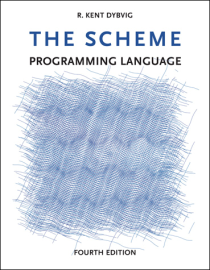

   

The Scheme\
 Programming Language

Fourth Edition

R. Kent Dybvig

Illustrations by Jean-Pierre Hébert

Table of Contents
=================

-   **[Preface](preface.html#./preface:h0)**
-   **[Chapter 1. Introduction](intro.html#./intro:h0)**
    -   **[Section 1.1. Scheme Syntax](intro.html#./intro:h1)**
    -   **[Section 1.2. Scheme Naming
        Conventions](intro.html#./intro:h2)**
    -   **[Section 1.3. Typographical and Notational
        Conventions](intro.html#./intro:h3)**

-   **[Chapter 2. Getting Started](start.html#./start:h0)**
    -   **[Section 2.1. Interacting with
        Scheme](start.html#./start:h1)**
    -   **[Section 2.2. Simple Expressions](start.html#./start:h2)**
    -   **[Section 2.3. Evaluating Scheme
        Expressions](start.html#./start:h3)**
    -   **[Section 2.4. Variables and Let
        Expressions](start.html#./start:h4)**
    -   **[Section 2.5. Lambda Expressions](start.html#./start:h5)**
    -   **[Section 2.6. Top-Level Definitions](start.html#./start:h6)**
    -   **[Section 2.7. Conditional
        Expressions](start.html#./start:h7)**
    -   **[Section 2.8. Simple Recursion](start.html#./start:h8)**
    -   **[Section 2.9. Assignment](start.html#./start:h9)**

-   **[Chapter 3. Going Further](further.html#./further:h0)**
    -   **[Section 3.1. Syntactic
        Extension](further.html#./further:h1)**
    -   **[Section 3.2. More Recursion](further.html#./further:h2)**
    -   **[Section 3.3. Continuations](further.html#./further:h3)**
    -   **[Section 3.4. Continuation Passing
        Style](further.html#./further:h4)**
    -   **[Section 3.5. Internal
        Definitions](further.html#./further:h5)**
    -   **[Section 3.6. Libraries](further.html#./further:h6)**

-   **[Chapter 4. Procedures and Variable
    Bindings](binding.html#./binding:h0)**
    -   **[Section 4.1. Variable
        References](binding.html#./binding:h1)**
    -   **[Section 4.2. Lambda](binding.html#./binding:h2)**
    -   **[Section 4.3. Case-Lambda](binding.html#./binding:h3)**
    -   **[Section 4.4. Local Binding](binding.html#./binding:h4)**
    -   **[Section 4.5. Multiple Values](binding.html#./binding:h5)**
    -   **[Section 4.6. Variable
        Definitions](binding.html#./binding:h6)**
    -   **[Section 4.7. Assignment](binding.html#./binding:h7)**

-   **[Chapter 5. Control Operations](control.html#./control:h0)**
    -   **[Section 5.1. Procedure
        Application](control.html#./control:h1)**
    -   **[Section 5.2. Sequencing](control.html#./control:h2)**
    -   **[Section 5.3. Conditionals](control.html#./control:h3)**
    -   **[Section 5.4. Recursion and
        Iteration](control.html#./control:h4)**
    -   **[Section 5.5. Mapping and
        Folding](control.html#./control:h5)**
    -   **[Section 5.6. Continuations](control.html#./control:h6)**
    -   **[Section 5.7. Delayed Evaluation](control.html#./control:h7)**
    -   **[Section 5.8. Multiple Values](control.html#./control:h8)**
    -   **[Section 5.9. Eval](control.html#./control:h9)**

-   **[Chapter 6. Operations on Objects](objects.html#./objects:h0)**
    -   **[Section 6.1. Constants and
        Quotation](objects.html#./objects:h1)**
    -   **[Section 6.2. Generic Equivalence and Type
        Predicates](objects.html#./objects:h2)**
    -   **[Section 6.3. Lists and Pairs](objects.html#./objects:h3)**
    -   **[Section 6.4. Numbers](objects.html#./objects:h4)**
    -   **[Section 6.5. Fixnums](objects.html#./objects:h5)**
    -   **[Section 6.6. Flonums](objects.html#./objects:h6)**
    -   **[Section 6.7. Characters](objects.html#./objects:h7)**
    -   **[Section 6.8. Strings](objects.html#./objects:h8)**
    -   **[Section 6.9. Vectors](objects.html#./objects:h9)**
    -   **[Section 6.10. Bytevectors](objects.html#./objects:h10)**
    -   **[Section 6.11. Symbols](objects.html#./objects:h11)**
    -   **[Section 6.12. Booleans](objects.html#./objects:h12)**
    -   **[Section 6.13. Hashtables](objects.html#./objects:h13)**
    -   **[Section 6.14. Enumerations](objects.html#./objects:h14)**

-   **[Chapter 7. Input and Output](io.html#./io:h0)**
    -   **[Section 7.1. Transcoders](io.html#./io:h1)**
    -   **[Section 7.2. Opening Files](io.html#./io:h2)**
    -   **[Section 7.3. Standard Ports](io.html#./io:h3)**
    -   **[Section 7.4. String and Bytevector Ports](io.html#./io:h4)**
    -   **[Section 7.5. Opening Custom Ports](io.html#./io:h5)**
    -   **[Section 7.6. Port Operations](io.html#./io:h6)**
    -   **[Section 7.7. Input Operations](io.html#./io:h7)**
    -   **[Section 7.8. Output Operations](io.html#./io:h8)**
    -   **[Section 7.9. Convenience I/O](io.html#./io:h9)**
    -   **[Section 7.10. Filesystem Operations](io.html#./io:h10)**
    -   **[Section 7.11. Bytevector/String
        Conversions](io.html#./io:h11)**

-   **[Chapter 8. Syntactic Extension](syntax.html#./syntax:h0)**
    -   **[Section 8.1. Keyword Bindings](syntax.html#./syntax:h1)**
    -   **[Section 8.2. Syntax-Rules
        Transformers](syntax.html#./syntax:h2)**
    -   **[Section 8.3. Syntax-Case
        Transformers](syntax.html#./syntax:h3)**
    -   **[Section 8.4. Examples](syntax.html#./syntax:h4)**

-   **[Chapter 9. Records](records.html#./records:h0)**
    -   **[Section 9.1. Defining Records](records.html#./records:h1)**
    -   **[Section 9.2. Procedural
        Interface](records.html#./records:h2)**
    -   **[Section 9.3. Inspection](records.html#./records:h3)**

-   **[Chapter 10. Libraries and Top-Level
    Programs](libraries.html#./libraries:h0)**
    -   **[Section 10.1. Standard
        Libraries](libraries.html#./libraries:h1)**
    -   **[Section 10.2. Defining New
        Libraries](libraries.html#./libraries:h2)**
    -   **[Section 10.3. Top-Level
        Programs](libraries.html#./libraries:h3)**
    -   **[Section 10.4. Examples](libraries.html#./libraries:h4)**

-   **[Chapter 11. Exceptions and
    Conditions](exceptions.html#./exceptions:h0)**
    -   **[Section 11.1. Raising and Handling
        Exceptions](exceptions.html#./exceptions:h1)**
    -   **[Section 11.2. Defining Condition
        Types](exceptions.html#./exceptions:h2)**
    -   **[Section 11.3. Standard Condition
        Types](exceptions.html#./exceptions:h3)**

-   **[Chapter 12. Extended Examples](examples.html#./examples:h0)**
    -   **[Section 12.1. Matrix and Vector
        Multiplication](examples.html#./examples:h1)**
    -   **[Section 12.2. Sorting](examples.html#./examples:h2)**
    -   **[Section 12.3. A Set
        Constructor](examples.html#./examples:h3)**
    -   **[Section 12.4. Word Frequency
        Counting](examples.html#./examples:h4)**
    -   **[Section 12.5. Scheme Printer](examples.html#./examples:h5)**
    -   **[Section 12.6. Formatted
        Output](examples.html#./examples:h6)**
    -   **[Section 12.7. A Meta-Circular Interpreter for
        Scheme](examples.html#./examples:h7)**
    -   **[Section 12.8. Defining Abstract
        Objects](examples.html#./examples:h8)**
    -   **[Section 12.9. Fast Fourier
        Transform](examples.html#./examples:h9)**
    -   **[Section 12.10. A Unification
        Algorithm](examples.html#./examples:h10)**
    -   **[Section 12.11. Multitasking with
        Engines](examples.html#./examples:h11)**

-   **[References](bibliography.html#./bibliography:h0)**
-   **[Answers to Selected Exercises](answers.html#./answers:h0)**
-   **[Formal Syntax](grammar.html#./grammar:h0)**
-   **[Summary of Forms](summary.html#./summary:h0)**
-   **[Index](tspl_1.html#./tspl:h0)**

* * * * *

R. Kent Dybvig / The Scheme Programming Language, Fourth Edition\
 Copyright © 2009 [The MIT
Press](http://mitpress.mit.edu/catalog/item/default.asp?ttype=2&tid=11984).
Electronically reproduced by permission.\
 Illustrations © 2009 [Jean-Pierre
Hébert](http://hebert.kitp.ucsb.edu/)\
 ISBN 978-0-262-51298-5 / LOC QA76.73.S34D93\
 [to order this
book](http://mitpress.mit.edu/catalog/item/default.asp?ttype=2&tid=11984)
/ [about this book](canned/about.html)

[http://www.scheme.com](http://www.scheme.com)
